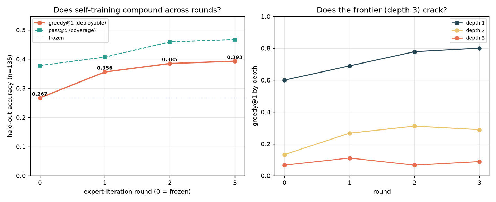

# Small Model Experimentation

[](https://github.com/ericflo/small-model-experimentation/actions/workflows/validate.yml)
[](https://github.com/ericflo/small-model-experimentation/blob/main/LICENSE)
[](https://ericflo.github.io/small-model-experimentation/)

### How far one Qwen3.5-4B goes without a bigger teacher

**How much more can a small model do when it not only uses the capability already in its weights but *extends* them by training on its own verified solutions — without ever borrowing from a larger model?**

This repository is a research log built around that single question: take *one* [Qwen3.5-4B](https://qwen.ai) and see how far its capability can be pushed — and extended — **without ever importing capability from a larger model**: no scaling to something bigger, no distillation from a stronger teacher, no bigger model anywhere in the loop. Training the 4B on its *own* verified or tool-found solutions — even self-distillation from its own outputs — is fair game; borrowing intelligence from a bigger model is not. The bar every method has to beat is the cheapest baseline there is: **just sample more.**



*Headline result (C11): a Qwen3.5-4B trained only on its own verified solutions banks capability into single-shot deployment — and it compounds across rounds, though the depth-3 frontier it can't yet sample stays uncracked.*

**→ Explore it all on the [research site](https://ericflo.github.io/small-model-experimentation/)**, where every experiment renders in full with native interactive charts, latest findings first, each claim linked to its evidence.

---

## Why this exists

The field's default answer to "make the model better" is *make the model bigger* — more parameters, more data, a stronger teacher to distill from. Those levers work, but they say nothing about a question that matters just as much for anyone deploying a small model on real hardware: **how much more can this exact model do — both by using its weights better and by training it on its own work — before you reach for a bigger one?**

So the constraint here is about the *source* of capability, and it is absolute:

- **One model, always Qwen3.5-4B.** Never a larger or different model — no scaling, no distillation, no stronger teacher anywhere in the loop, not even to generate training data. The weights may change, but only by training the 4B on its own verified or tool-found solutions.
- **Provenance, not a weight freeze.** The rule is not "don't change the weights" — it's "don't import intelligence from a bigger model." Both levers are in scope: *eliciting* latent capability at test time (structured intermediates, verification, tool-augmented search, thinking budgets, context orchestration, activation probes) **and** *extending* the 4B by training it on its own verified or tool-found outputs (self-training / banking). Only a larger/other model and plain scaling are off-limits.
- **A real bar to beat.** "Sample more" is free and strong. A method only counts if it beats matched-compute sampling on held-out, contamination-controlled tasks.

The result is a corpus of experiments across a dozen research programs, condensed into a **machine-checkable claim ledger** where every claim points at the experiments that support or challenge it, with charts rendered directly from each experiment's own result files.

## What we found

The corpus tells a connected story. A curated path through it:

**A calibration note first.** The opening thread — structured intermediates and the coverage-vs-selection wall (**C1/C2**) — is **Confirmed** in the ledger. The deeper findings below — the thinking lever, self-teaching, and the compositional-wall mechanism (**C9–C26**) — are the corpus's live, mostly single-substrate, small-n (n≈40–100) results, marked **Promising** rather than settled law (C11 and C12 were replicated on a second seed; most others are single- or two-seed); the newest, **C27**, is still **Open**. The [live ledger](https://ericflo.github.io/small-model-experimentation/claims/) and [synthesis](https://ericflo.github.io/small-model-experimentation/notebook/synthesis/) carry each claim's status, confidence, and limits.

**Terms in plain English.** *Single-try accuracy* (pass@1 / greedy@1) is how often one attempt is correct; *best-of-8* picks one answer out of 8 samples; the *oracle gap* is the headroom left if the model always picked a correct answer from among its samples; *held-out* means problems it wasn't trained on; *QLoRA-SFT* is lightweight fine-tuning; *MBPP* is a standard Python coding benchmark; *no-think verifier* is a checker run with the model's reasoning channel off; *+15pp* means 15 percentage points.

- **Structured intermediates are a real lever, but selection is often the wall.** Executable or structured intermediate representations reliably improve small-model reliability (**[C1](https://ericflo.github.io/small-model-experimentation/claims/#c1)**). But candidate *generation* is usually easier than deployable *selection* — a model's sample pool often contains a correct answer it can't reliably pick out (**[C2](https://ericflo.github.io/small-model-experimentation/claims/#c2)**).

- **That selection wall is plumbing, not a capability limit.** When a cheap visible test exists, that test plus a *free no-think verifier* (a checker run with the model's reasoning channel off) selects best-of-8 well enough to close **83%** of the single-try→oracle gap — the cheap, deployable answer. Where no cheap execution signal exists, the model's own zero-training *thinking-verifier* still closes **~75%** of the gap, but at roughly 5× the token cost, so reserve it for verifier-only settings. Either way the bottleneck was tooling, not intelligence (**[C10](https://ericflo.github.io/small-model-experimentation/claims/#c10)**).

- **Native "thinking" is an unused deployable lever.** Turning on the model's reasoning channel is worth **+15pp** (15 percentage points) on MBPP greedy decoding — and controls *indicate* it's *coherent reasoning content*, not just extra compute: irrelevant thinking collapses accuracy, contentless filler ≈ no-think, and coherent content is the entire gain (**[C9](https://ericflo.github.io/small-model-experimentation/claims/#c9)**). (This is a within-MBPP think-vs-no-think delta — largely robust to contamination since both arms share it, but not itself a contamination-controlled elicitation result; that tier is the fresh-substrate arc, C11 onward.)

- **A small model can teach itself — no teacher required.** On a fresh, contamination-free program-synthesis substrate, test-time execution feedback does *not* beat sampling — but QLoRA-SFT (lightweight fine-tuning) on the model's **own** verified solutions banks capability into single-shot deployment (**+42% relative, 0.224→0.319 held-out** single-try accuracy), and iterating it compounds into a flywheel (**[C11](https://ericflo.github.io/small-model-experimentation/claims/#c11)**). Tool-augmented search then extends the frontier *modestly* past the sampling ceiling and banks that gain too (**[C12](https://ericflo.github.io/small-model-experimentation/claims/#c12)**) — real, but a behavioral min-depth audit later showed the true-depth-3 extension is small (decompose solves ~17% of genuine depth-3, up from 0 for monolithic sampling), and the crack comes from the interpreter + composition structure, not the model's planning.

- **The compositional "wall" has a precise mechanism.** Where the fixed model fails at multi-step composition, the failure is **broken multi-step mental simulation / hypothesis identification** — *not* execution. Given the plan, the model **transcribes it to code at 0.90–1.00 through depth 4** (the interpreter executes); left to identify the plan itself, it runs barely above chance. It stays a reliable compiler starved of search (**[C13](https://ericflo.github.io/small-model-experimentation/claims/#c13)**).

- **So capability is format-local, not built from shared primitives.** Repairing a broken primitive doesn't propagate — capability is organized by input→output *format* rather than shared internal primitives (**[C14](https://ericflo.github.io/small-model-experimentation/claims/#c14)**) — and what's deployable factors as **module × interface × procedure** (**[C15](https://ericflo.github.io/small-model-experimentation/claims/#c15)**).

- **Several intuitive levers provably fail — and we headline the negatives.** Selection is already free, so no cleverer test-time *selector* beats sample-more (**[C17](https://ericflo.github.io/small-model-experimentation/claims/#c17)**); the latent composition signal is readable but **not steerable** — activation steering does not move behavior (**[C20](https://ericflo.github.io/small-model-experimentation/claims/#c20)**); and self-banking only shallow depths **cannot climb** to the next rung (**[C21](https://ericflo.github.io/small-model-experimentation/claims/#c21)**). These are clean, ruled-out negatives — because controls are the difference between a result and a story (**[C6](https://ericflo.github.io/small-model-experimentation/claims/#c6)**).

- **The payoff: extending capability without a bigger model.** Tool-augmented harvest plus banking crosses the depth-3 wall self-training alone could not, one rung at a time — and the install is **dose-responsive and non-saturating** through 1,280 tool-found solutions, driven by data *diversity* rather than extra compute (**[C22](https://ericflo.github.io/small-model-experimentation/claims/#c22)**–**[C24](https://ericflo.github.io/small-model-experimentation/claims/#c24)**). What banks is **reusable compositional planning, not lookup**: self-training measurably improves the model's step-wise lookahead ranking (**[C25](https://ericflo.github.io/small-model-experimentation/claims/#c25)**). The honest limit — test-time serial compute (thinking) alone amplifies recognition but does *not* cross the planning gap; for that, training on the model's own verified solutions is required (**[C26](https://ericflo.github.io/small-model-experimentation/claims/#c26)**).

The recipe that emerges from all of it: **tools generate and simulate, context orchestrates, the model recognizes and transcribes** — and where the forward pass falls short, self-training on the model's own verified solutions banks the missing capability into the weights.

> The full arc runs through **[C27](https://ericflo.github.io/small-model-experimentation/claims/#c27)** and is still growing. The [live claim ledger](https://ericflo.github.io/small-model-experimentation/claims/) and [cross-program synthesis](https://ericflo.github.io/small-model-experimentation/notebook/synthesis/) carry every claim with its evidence, status, and limits.

**Standout experiments** — jump straight to a self-contained protocol and its data:

- Thinking-budget scaling (C9) — [`experiments/qwen35_4b_thinking_budget_scaling/reports/report.md`](experiments/qwen35_4b_thinking_budget_scaling/reports/report.md)
- Depth-wall anatomy (C13) — [`experiments/qwen35_4b_depth_wall_anatomy/reports/report.md`](experiments/qwen35_4b_depth_wall_anatomy/reports/report.md)
- Neurosymbolic REPL substrate (C11) — [`experiments/qwen35_4b_neurosymbolic_repl_substrate/reports/report.md`](experiments/qwen35_4b_neurosymbolic_repl_substrate/reports/report.md)

## Explore the corpus

> **179** experiments · **12** research programs · **27** evidence-linked claims · **792** result charts.

The site is the best way in; the source files are one click deeper. Start anywhere:

| Destination | Live site | In the repo |
|---|---|---|
| **Latest findings** — what the corpus discovered most recently | [browse](https://ericflo.github.io/small-model-experimentation/) | — |
| **All experiments** — searchable, filterable, charted | [browse](https://ericflo.github.io/small-model-experimentation/experiments/) | [`experiment_catalog.md`](knowledge/experiment_catalog.md) |
| **Claim ledger** — each claim pointing at its experiments | [browse](https://ericflo.github.io/small-model-experimentation/claims/) | [`claims/index.md`](knowledge/claims/index.md) |
| **Research programs** — the durable lines of inquiry | [browse](https://ericflo.github.io/small-model-experimentation/programs/) | [`research_programs/README.md`](research_programs/README.md) |
| **Synthesis** — the living cross-program read | [browse](https://ericflo.github.io/small-model-experimentation/notebook/synthesis/) | [`synthesis.md`](knowledge/synthesis.md) |
| **What's next** — scored, protocol-ready future experiments | [browse](https://ericflo.github.io/small-model-experimentation/queue/) | [`future_experiment_queue.md`](knowledge/future_experiment_queue.md) |

## What's in here

Each of the **179** experiments is self-contained (README, code, data, runs, analysis, report); each of the **12** programs has a charter, backlog, and evidence file; the **27** claims form a shared belief ledger where every claim cites its experiments; and every one of the **792** charts is rendered natively from an experiment's own data files.

```text
research_programs/<program-id>/   durable research lines
  charter.md · backlog.md · evidence.md

experiments/<experiment-id>/      one self-contained experiment
  README.md  metadata.yaml
  src/ scripts/ configs/          code and run scaffolding
  data/ runs/ analysis/ reports/  inputs, logs, and written-up results

knowledge/    the claim ledger, synthesis, catalogs, and future queue
docs/         operating guidance and lifecycle
scripts/      indexing, validation, and static-site generation
templates/    starting points for new experiments and programs
```

**One model throughout — Qwen3.5-4B.** Its own weights may be self-trained on its own verified or tool-found solutions, but a larger or different model is never in the loop — that constraint is the entire point.

**The twelve programs:**

- Structured execution & compilers
- Evidence-conditioned selection
- Active evidence acquisition
- Algorithmic memory & retrieval
- Operator & skill inventories
- Posttraining & adaptation
- Process control & tool use
- Benchmark generalization
- Interpretability & diagnostics
- Reliability & safety
- Test-time reasoning budget
- Collective experimentation infrastructure *(meta)* — the repository treats itself as a research instrument

## Reproducing an experiment

Each experiment folder is self-contained. Its `README.md` states the question and result; `reports/` holds the write-up; `data/` and `runs/` hold the inputs and logs. Large regenerable artifacts (adapters, checkpoints) are excluded by design — see each experiment's `reports/artifact_manifest.yaml` for how to regenerate them.

**Environment at a glance:** every experiment runs on a single **RTX 4090 (24 GB)** in a `uv`-managed `.venv` (PyTorch + Transformers), always against **Qwen3.5-4B**. Full environment and GPU setup are in [`docs/compute_environment.md`](docs/compute_environment.md).

## Building the site locally

The research site is generated from the repository by stdlib-only Python (no dependencies to install):

```bash
python3 scripts/build_site.py --out site   # writes the static site
python3 scripts/check_site.py site          # verifies every internal link
python3 -m http.server 8000 --directory site
```

## Contributing

This is a largely agent-driven research loop rather than an open PR queue, but the conventions that keep results compounding are documented: [`CONTRIBUTING.md`](CONTRIBUTING.md), the [`docs/agent_handbook.md`](docs/agent_handbook.md), the [`docs/experiment_lifecycle.md`](docs/experiment_lifecycle.md), and the [`docs/quality_gates.md`](docs/quality_gates.md). Every new experiment either advances an existing research program or justifies a new one, and its results connect upward into shared program evidence and the claim ledger.

## A note on provenance

This corpus was produced through an intensive, largely agent-driven experimentation loop — the experiments, reports, and evidence-linked claims were generated by an AI agent workflow, not hand-authored by a human researcher. That orchestration agent drives the loop; the fixed Qwen3.5-4B remains the object of study, never the author. Individual experiments are working research artifacts, not polished libraries — the value is in the *aggregate*: the reusable patterns, the controlled comparisons, and the evidence-linked claims that make each next experiment less likely to repeat an old mistake. The repository is built to keep growing, with every result connecting upward into shared program evidence and the claim ledger.

## How to cite

```bibtex
@misc{florenzano2026smallmodel,
  author       = {Florenzano, Eric},
  title        = {Small Model Experimentation: Extending Capability in a Fixed Qwen3.5-4B Without a Larger Teacher},
  year         = {2026},
  howpublished = {\url{https://ericflo.github.io/small-model-experimentation/}},
  note         = {Research log}
}
```

A [`CITATION.cff`](CITATION.cff) at the repo root backs GitHub's "Cite this repository" button with identical metadata.

## License

Licensed under the [Apache License 2.0](LICENSE). You're free to use, modify, and build on this work, including commercially, provided you retain the license and attribution.
