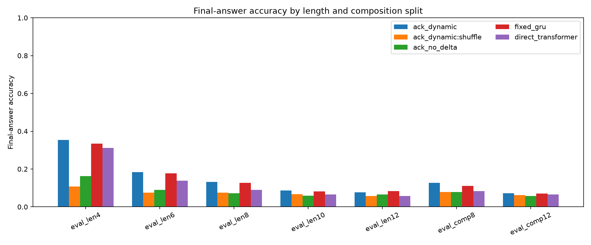
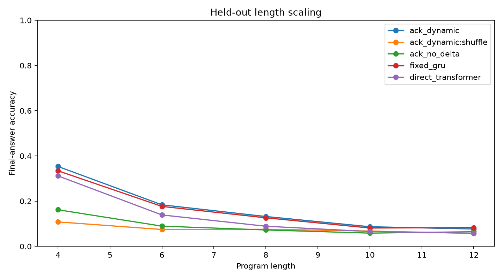
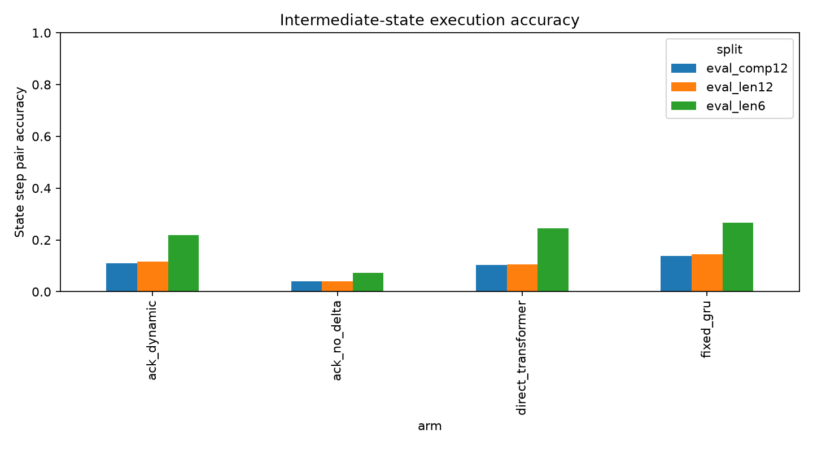
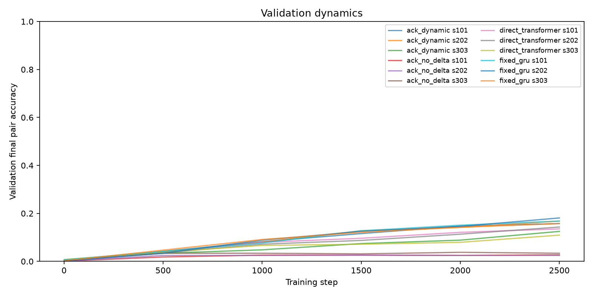

# Adaptive Cognitive Kernel Report

## Summary

This standalone experiment tests whether a task-conditioned recurrent runtime can use temporary adapter-style weight edits as a useful computation substrate. The runtime receives an initial two-register state and a sequence of symbolic operations. It must execute the program and predict both the final register pair and intermediate states.

The result is **mixed but not a breakthrough: the dynamic ACK runtime learns an ordered conditioning signal and its intermediate-state accuracy is far above no-delta and shuffled-code controls, but it does not beat the ordinary fixed recurrent controller on the longest split.**

Key longest-length metrics:

- ACK ordered length-12 final-answer accuracy: **7.7%**.
- ACK shuffled-code length-12 final-answer accuracy: **5.7%**.
- ACK no-delta length-12 final-answer accuracy: **6.5%**.
- Fixed recurrent controller length-12 final-answer accuracy: **8.3%**.
- Direct transformer length-12 final-answer accuracy: **5.8%**.

Strict final-pair accuracy on length 12:

- ACK ordered: **0.7%**.
- ACK shuffled-code: **0.5%**.
- ACK no-delta: **0.5%**.
- Fixed recurrent controller: **0.7%**.
- Direct transformer: **0.3%**.

Intermediate-state step accuracy on length 12:

- ACK ordered: **11.6%**.
- ACK shuffled-code: **2.0%**.
- ACK no-delta: **4.0%**.
- Fixed recurrent controller: **14.4%**.

Held-out-composition metrics:

- ACK ordered composition-12 final-answer accuracy: **7.1%**.
- Fixed recurrent controller composition-12 final-answer accuracy: **7.0%**.

## Mechanism Under Test

The ACK arm maps each operation token to coefficients over a bank of learned low-rank transition atoms. At each recurrent step, those coefficients temporarily edit the transition applied to the runtime state. The same learned atom bank is reused across tasks and steps.

The no-delta ACK arm keeps the same recurrent shell and operation-conditioned drive but disables the low-rank weight edits. The shuffled-code control keeps the trained ACK runtime and candidate operation codes but permutes the operation-conditioning sequence at evaluation time. A mechanism-level positive requires ACK ordered to outperform fixed controls and to degrade when codes are shuffled.

## Dataset

- Register values: integers modulo `17`.
- Operation set: `12` symbolic register operations.
- Training lengths: `2..6`.
- Held-out lengths: `8, 10, 12`.
- Held-out adjacent operation pairs: `swap -> add_y_to_x, double_x -> add_x_to_y, branch_x -> mix_y, diff_y_x -> double_y`.
- Evaluation examples per split: `768`.
- Online training examples: `True`.
- Training seeds: `101,202,303`.

## Aggregate Results

| arm                | control   | split       | final_pair_mean   | final_pair_std   | final_x_mean   | state_step_mean   | state_all_mean   | code_entropy_mean   |
|:-------------------|:----------|:------------|:------------------|:-----------------|:---------------|:------------------|:-----------------|:--------------------|
| ack_dynamic        | ordered   | eval_comp12 | 0.4%              | 0.2%             | 7.1%           | 11.1%             | 0.0%             | 0.332               |
| ack_dynamic        | random    | eval_comp12 | 0.6%              | 0.1%             | 6.0%           | 1.6%              | 0.0%             | 0.341               |
| ack_dynamic        | shuffle   | eval_comp12 | 0.3%              | 0.1%             | 6.2%           | 2.0%              | 0.0%             | 0.332               |
| ack_no_delta       | ordered   | eval_comp12 | 0.3%              | 0.2%             | 5.7%           | 4.1%              | 0.0%             | 0.002               |
| direct_transformer | ordered   | eval_comp12 | 0.5%              | 0.3%             | 6.6%           | 10.3%             | 0.0%             | n/a                 |
| fixed_gru          | ordered   | eval_comp12 | 0.4%              | 0.2%             | 7.0%           | 13.7%             | 0.0%             | n/a                 |
| ack_dynamic        | ordered   | eval_comp8  | 1.4%              | 0.4%             | 12.6%          | 16.5%             | 0.0%             | 0.328               |
| ack_dynamic        | random    | eval_comp8  | 0.3%              | 0.3%             | 5.6%           | 2.0%              | 0.0%             | 0.338               |
| ack_dynamic        | shuffle   | eval_comp8  | 0.6%              | 0.3%             | 7.8%           | 2.7%              | 0.0%             | 1.134               |
| ack_no_delta       | ordered   | eval_comp8  | 0.4%              | 0.2%             | 7.9%           | 5.2%              | 0.0%             | 0.002               |
| direct_transformer | ordered   | eval_comp8  | 0.6%              | 0.2%             | 8.3%           | 16.3%             | 0.0%             | n/a                 |
| fixed_gru          | ordered   | eval_comp8  | 0.8%              | 0.1%             | 11.2%          | 20.2%             | 0.0%             | n/a                 |
| ack_dynamic        | ordered   | eval_len10  | 0.9%              | 0.2%             | 8.7%           | 13.9%             | 0.0%             | 0.345               |
| ack_dynamic        | random    | eval_len10  | 0.2%              | 0.1%             | 6.1%           | 1.7%              | 0.0%             | 0.343               |
| ack_dynamic        | shuffle   | eval_len10  | 0.5%              | 0.4%             | 6.8%           | 2.4%              | 0.0%             | 0.750               |
| ack_no_delta       | ordered   | eval_len10  | 0.6%              | 0.3%             | 5.9%           | 4.5%              | 0.0%             | 0.002               |
| direct_transformer | ordered   | eval_len10  | 0.5%              | 0.3%             | 6.6%           | 12.6%             | 0.0%             | n/a                 |
| fixed_gru          | ordered   | eval_len10  | 0.7%              | 0.3%             | 8.1%           | 16.6%             | 0.0%             | n/a                 |
| ack_dynamic        | ordered   | eval_len12  | 0.7%              | 0.2%             | 7.7%           | 11.6%             | 0.0%             | 0.344               |
| ack_dynamic        | random    | eval_len12  | 0.4%              | 0.1%             | 6.0%           | 1.5%              | 0.0%             | 0.338               |
| ack_dynamic        | shuffle   | eval_len12  | 0.5%              | 0.2%             | 5.7%           | 2.0%              | 0.0%             | 0.344               |
| ack_no_delta       | ordered   | eval_len12  | 0.5%              | 0.1%             | 6.5%           | 4.0%              | 0.0%             | 0.002               |
| direct_transformer | ordered   | eval_len12  | 0.3%              | 0.1%             | 5.8%           | 10.5%             | 0.0%             | n/a                 |
| fixed_gru          | ordered   | eval_len12  | 0.7%              | 0.3%             | 8.3%           | 14.4%             | 0.0%             | n/a                 |
| ack_dynamic        | ordered   | eval_len4   | 10.5%             | 1.9%             | 35.3%          | 31.2%             | 5.6%             | 0.343               |
| ack_dynamic        | random    | eval_len4   | 0.4%              | 0.2%             | 7.3%           | 3.7%              | 0.0%             | 0.341               |
| ack_dynamic        | shuffle   | eval_len4   | 0.9%              | 0.3%             | 10.8%          | 4.5%              | 0.0%             | 1.934               |
| ack_no_delta       | ordered   | eval_len4   | 2.3%              | 0.3%             | 16.2%          | 10.2%             | 0.1%             | 0.002               |
| direct_transformer | ordered   | eval_len4   | 6.4%              | 0.3%             | 31.2%          | 35.0%             | 3.6%             | n/a                 |
| fixed_gru          | ordered   | eval_len4   | 9.3%              | 0.4%             | 33.4%          | 39.2%             | 4.8%             | n/a                 |
| ack_dynamic        | ordered   | eval_len6   | 3.5%              | 0.9%             | 18.4%          | 21.9%             | 0.3%             | 0.350               |
| ack_dynamic        | random    | eval_len6   | 0.3%              | 0.1%             | 6.7%           | 3.0%              | 0.0%             | 0.343               |
| ack_dynamic        | shuffle   | eval_len6   | 0.5%              | 0.3%             | 7.5%           | 3.2%              | 0.0%             | 1.550               |
| ack_no_delta       | ordered   | eval_len6   | 0.9%              | 0.2%             | 8.9%           | 7.2%              | 0.0%             | 0.002               |
| direct_transformer | ordered   | eval_len6   | 1.6%              | 0.3%             | 13.9%          | 24.5%             | 0.1%             | n/a                 |
| fixed_gru          | ordered   | eval_len6   | 2.8%              | 0.3%             | 17.7%          | 26.6%             | 0.6%             | n/a                 |
| ack_dynamic        | ordered   | eval_len8   | 2.0%              | 0.5%             | 13.2%          | 17.8%             | 0.0%             | 0.347               |
| ack_dynamic        | random    | eval_len8   | 0.3%              | 0.1%             | 5.9%           | 2.2%              | 0.0%             | 0.343               |
| ack_dynamic        | shuffle   | eval_len8   | 0.6%              | 0.3%             | 7.6%           | 2.8%              | 0.0%             | 1.148               |
| ack_no_delta       | ordered   | eval_len8   | 0.5%              | 0.3%             | 7.2%           | 5.6%              | 0.0%             | 0.002               |
| direct_transformer | ordered   | eval_len8   | 0.7%              | 0.3%             | 8.9%           | 16.7%             | 0.0%             | n/a                 |
| fixed_gru          | ordered   | eval_len8   | 1.5%              | 0.2%             | 12.6%          | 20.9%             | 0.0%             | n/a                 |
| ack_dynamic        | ordered   | val         | 15.0%             | 2.2%             | 36.2%          | 30.8%             | 10.9%            | 0.344               |
| ack_no_delta       | ordered   | val         | 2.9%              | 0.5%             | 17.1%          | 10.6%             | 1.0%             | 0.002               |
| direct_transformer | ordered   | val         | 12.9%             | 1.8%             | 32.6%          | 33.9%             | 11.2%            | n/a                 |
| fixed_gru          | ordered   | val         | 16.9%             | 1.2%             | 38.7%          | 38.1%             | 14.3%            | n/a                 |

## Figures

## Interpretation

The central question is not whether a recurrent neural network can fit short programs. It is whether task-conditioned temporary weight edits create a reusable computation substrate that generalizes better than ordinary fixed-weight controllers. The shuffled-code evaluation is the load-bearing control: if it matches ordered ACK, then extra runtime capacity is not evidence of ordered computation.

The held-out-length and held-out-composition splits are the primary readouts. Trained-length accuracy alone is insufficient, because a prompt transducer can memorize short input-output mappings without learning a reusable executor.

The evidence separates two claims. First, task-conditioned ACK computation is not inert: randomizing or shuffling the conditioning stream collapses state accuracy, and disabling dynamic deltas substantially weakens the ACK runtime. Second, this is not enough to justify the stronger claim that temporary weight edits are a superior computation substrate. A conventional fixed recurrent controller remains as good or better on the longest held-out splits, and all arms show steep degradation as length grows beyond the training range.

## Artifacts

- Run directory: `/workspace/experiments/adaptive_cognitive_kernel/runs/main_ack_v1`
- Metrics CSV: `/workspace/experiments/adaptive_cognitive_kernel/runs/main_ack_v1/metrics.csv`
- Training log: `/workspace/experiments/adaptive_cognitive_kernel/runs/main_ack_v1/training_log.csv`
- Analysis directory: `/workspace/experiments/adaptive_cognitive_kernel/analysis`
- Large checkpoints: `/workspace/large_artifacts/adaptive_cognitive_kernel/checkpoints/main_ack_v1`
