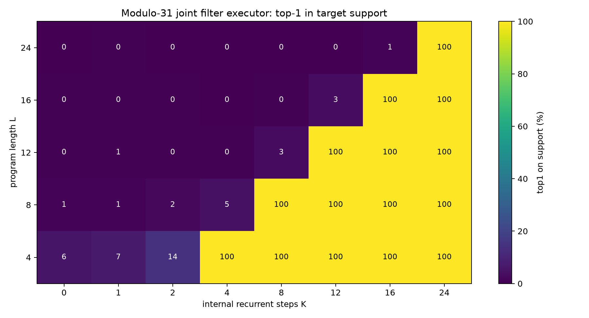
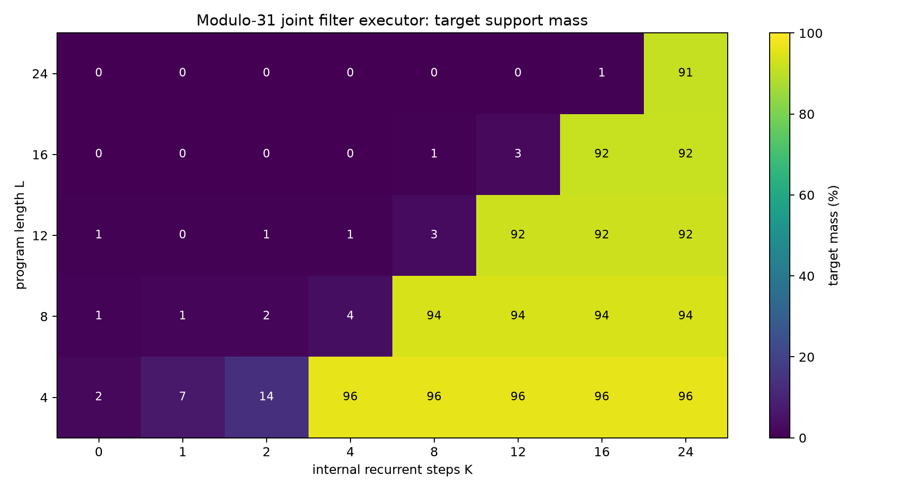
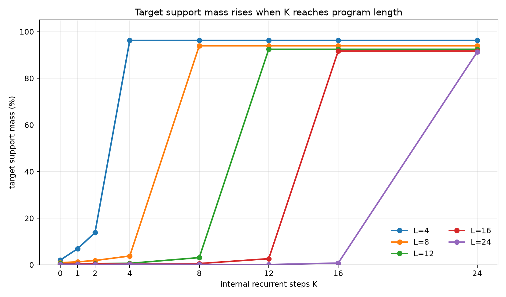
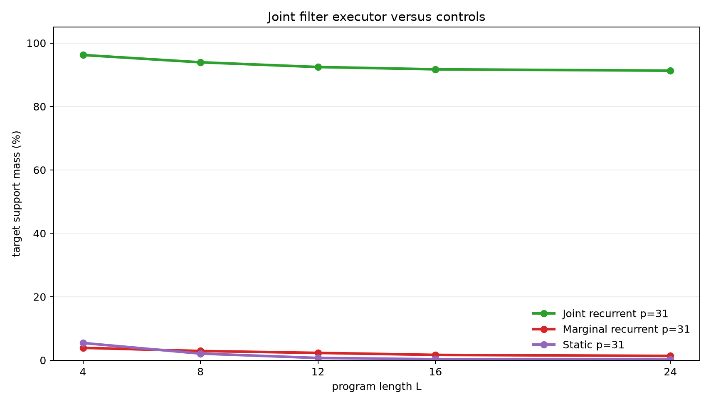

# Latent Recurrent Filtering for Correlated Modular Beliefs

**A controlled experiment on hidden-state execution with arithmetic updates and observations**

## Abstract

This experiment tests whether a latent recurrent runtime can maintain and update a correlated belief state. Each example starts with an unknown pair of modular registers constrained by `B=A+d (mod p)`. A program then applies arithmetic updates and observation filters such as `A % m = r` or `B % m = r`. The target is the exact final probability distribution over all `(A,B)` pairs.

The primary model stores a joint categorical belief over all register pairs and applies one learned update per internal recurrent step. On the scaled modulus-31 task, it was trained on program lengths 1-8 and evaluated on lengths 4, 8, 12, 16, and 24. Target-support mass stayed low when the internal step budget `K` was below program length `L`, then rose above 91% once `K>=L`. Top-1-on-support reached 100% at the same threshold for every evaluated length. A marginal recurrent control and a static one-shot compiler failed on the scaled task, showing that both joint state and recurrent execution are doing useful work.

## Lay Summary

The model begins with partial knowledge:

```text
B = A + d (mod p)
```

This relation describes many possible starting worlds. The program then changes the registers and sometimes adds observations:

```text
A = A + 7
B = B - A
observe A % 5 = 2
A = A + B
```

The correct answer is not one value. It is the set of all `(A,B)` pairs still possible after executing the program and filtering by the observations. The joint recurrent model learns to update that whole belief state one instruction at a time. If a program has 16 instructions, it needs 16 internal steps; with fewer steps it has not executed the whole program.

## 1. Question

The experiment asks whether a learned recurrent runtime can execute belief-state programs when the hidden state must preserve correlations between variables.

The desired evidence has four parts:

1. Accuracy should depend on the internal recurrent step budget `K`.
2. The threshold should align with program length `L`: weak when `K<L`, strong when `K>=L`.
3. Lengths beyond the training range should work when enough recurrent steps are available.
4. Controls without joint state or without recurrent execution should fail.

The setting is intentionally controlled. The point is not to test open-ended language reasoning; it is to isolate whether recurrent latent execution can implement exact filtering over a known state space.

## 2. Task

Programs operate over two registers modulo `p`.

Initial belief:

```text
{(A, B): B = A + d mod p}
```

For `p=31`, the full state space has `31 * 31 = 961` register pairs, and the initial support contains 31 of them.

Operations:

| Operation | Meaning |
|---|---|
| `A=A+c` | add a constant to `A` |
| `A=A-c` | subtract a constant from `A` |
| `B=B+c` | add a constant to `B` |
| `B=B-c` | subtract a constant from `B` |
| `A=A+B` | add `B` into `A` |
| `B=B+A` | add `A` into `B` |
| `A=A-B` | subtract `B` from `A` |
| `B=B-A` | subtract `A` from `B` |
| `OBS_A_BUCKET` | filter to states where `A % m = r` |
| `OBS_B_BUCKET` | filter to states where `B % m = r` |

Observation residues are sampled from the live support, so every target support is non-empty. For the scaled run, `p=31`, `m=5`, and each instruction is an observation with probability 0.3.

Each example has:

- a random relation parameter `d`
- a random program of length `L`
- exact belief targets after each program prefix
- an exact final target distribution

Training used lengths 1-8. Evaluation used lengths 4, 8, 12, 16, and 24. Lengths 12, 16, and 24 test length generalization.

## 3. Models

### Joint Recurrent Filter

The primary model stores a categorical distribution over all `(A,B)` pairs. Each recurrent step reads the next instruction and applies the corresponding learned update:

- arithmetic instructions use learned transition distributions
- observation instructions use learned likelihoods over register values
- the belief state is renormalized after each update

For arithmetic operations, the model learns transition logits with shape `8 x p x p x p`. For observations, it learns likelihood logits for each observed register and residue bucket. The model is not handed a symbolic arithmetic table or a hard-coded modulo filter; those operations are learned from dense belief supervision.

### Marginal Recurrent Control

The marginal control follows the same recurrent schedule, but it stores separate distributions over `A` and `B`. This representation cannot exactly preserve the line-shaped correlation `B=A+d`. It can learn local filtering signals, but it cannot represent the joint support.

### Static Compiler Control

The static control receives the relation parameter and the whole program, then predicts the final distribution in one pass with a small Transformer encoder. It has no recurrent execution axis and cannot trade more internal steps for better final accuracy.

## 4. Metrics

The target is a distribution over a support set.

- `target_mass`: total model probability assigned to the exact target support.
- `top1_on_support`: whether the highest-probability pair is inside the exact target support.
- `target_nll`: cross-entropy against the exact target distribution.
- `mean_support_size`: average number of valid final states.

`target_mass` is the main distribution-quality metric. `top1_on_support` is useful as a coarse correctness check, but it does not measure whether probability is well distributed across all valid states.

## 5. Main Result

The scaled modulus-31 joint recurrent filter shows a clean execution threshold. When `K` is too small to consume the whole program, target mass stays low. When `K` reaches `L`, target mass jumps above 91% and top-1-on-support reaches 100%.





The same threshold is visible in the line curves.



Numerically:

| Program length | Mean support size | Best target mass when `K<L` | First `K>=L` | Target mass at first `K>=L` | Top-1 at first `K>=L` | Target NLL |
|---:|---:|---:|---:|---:|---:|---:|
| 4 | 13.1 | 13.8% | 4 | 96.2% | 100.0% | 2.195 |
| 8 | 6.5 | 3.8% | 8 | 93.9% | 100.0% | 1.500 |
| 12 | 4.2 | 3.1% | 12 | 92.4% | 100.0% | 1.081 |
| 16 | 2.7 | 2.6% | 16 | 91.7% | 100.0% | 0.785 |
| 24 | 1.7 | 0.8% | 24 | 91.3% | 100.0% | 0.441 |

The held-out lengths are the key part of the result. The model was trained only up to length 8, but it executes lengths 12, 16, and 24 when given enough recurrent steps.

## 6. Controls

The scaled controls show that the result is not explained by weak filtering cues or one-shot compilation.



At modulus 31:

| Model | L=4 | L=8 | L=12 | L=16 | L=24 |
|---|---:|---:|---:|---:|---:|
| Joint recurrent filter | 96.2% | 93.9% | 92.4% | 91.7% | 91.3% |
| Marginal recurrent control | 3.9% | 2.9% | 2.3% | 1.7% | 1.4% |
| Static compiler control | 5.4% | 2.1% | 0.7% | 0.3% | 0.2% |

The marginal control has recurrent steps and learned filters, but it cannot represent the pairwise correlation. The static compiler sees the whole program but lacks an execution axis. Both controls remain far below the joint recurrent filter on every scaled length.

## 7. Small-Modulus Check

A smaller modulus-11 run used the same task structure with `m=4`, training lengths 1-6, and evaluation lengths 3, 6, 9, and 12. The joint recurrent filter reached 92.2-96.2% target mass at the matching `K=L` thresholds. The matched marginal and static controls stayed below 17.5% target mass. This check established that the filtering task and controls behave consistently at a smaller state size before the modulus-31 run.

## 8. Interpretation

The result supports a narrow mechanism claim:

> A recurrent latent runtime with a joint belief state can execute arithmetic and observation-filter programs, and additional internal steps improve performance when those steps correspond to consuming more program instructions.

The threshold shape is important:

```text
K < L: the runtime has not executed the whole program -> low target mass
K >= L: the runtime has executed the program -> high target mass
```

The observations make the task stricter than pure arithmetic support transport. The model must both move probability through register updates and renormalize after filtering. The marginal control confirms that this is not solvable by tracking independent register distributions.

## 9. Limits

This is a structured experiment.

- The joint model stores an explicit categorical distribution over `(A,B)`.
- Training uses dense belief supervision at program prefixes.
- The recurrent runtime uses a direct program counter.
- The operations are modular arithmetic updates and bucket observations.
- The largest completed state space has 961 pairs.

These limits define the scope of the result. The experiment shows that the mechanism works when the hidden representation is aligned with the required state. It does not show that an unstructured hidden vector will discover the same representation without additional pressure.

## 10. Next Iterations

Useful next tests:

1. Replace the explicit program counter with attention over instruction tokens.
2. Add a learned halt or no-op policy so the runtime can choose its compute budget.
3. Distill the categorical belief into a dense hidden state and measure how much accuracy survives.
4. Increase modulus and observation variety while tracking memory and runtime cost.
5. Train on final-query supervision instead of full prefix distributions.

## 11. Reproducibility

Primary files:

- Experiment script: `../src/belief_filter_executor_experiment.py`
- Analysis script: `../src/analyze_belief_filter_executor.py`
- Experiment log: `belief_filter_executor_experiment_log.md`
- Results directory: `../runs/`
- Analysis directory: `../analysis/`
- Checkpoint manifest: `../checkpoint_manifest.csv`

Key run directories:

- `../runs/main_joint_mod31`
- `../runs/control_marginal_mod31`
- `../runs/control_static_mod31`
- `../runs/pilot_joint_mod11`
- `../runs/control_marginal_mod11`
- `../runs/control_static_mod11`

Large checkpoint files are stored outside the experiment bundle under:

```text
../../../large_artifacts/belief_filter_executor/checkpoints/
```

Environment:

- Python 3.12.3
- PyTorch 2.8.0+cu128
- GPU: NVIDIA RTX 6000 Ada Generation

## 12. Bottom Line

The joint recurrent filter learned to execute correlated belief-state programs with arithmetic updates and observations. It generalized from training lengths 1-8 to evaluation lengths 12, 16, and 24, and it showed a sharp improvement when the recurrent step budget reached program length. The controls failed on the same scaled task. The main lesson is that recurrent latent execution can scale cleanly with internal compute when the hidden state can represent the correlations required by the task.
