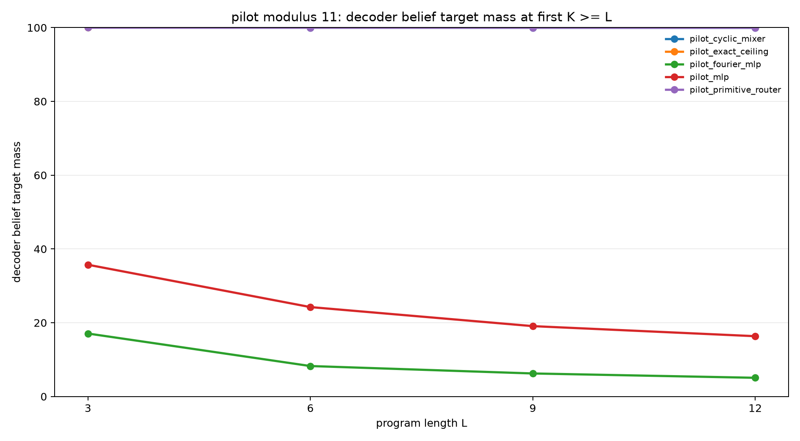
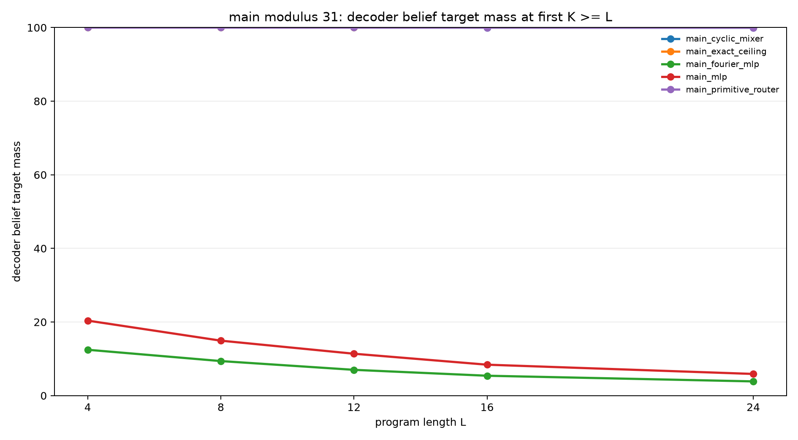
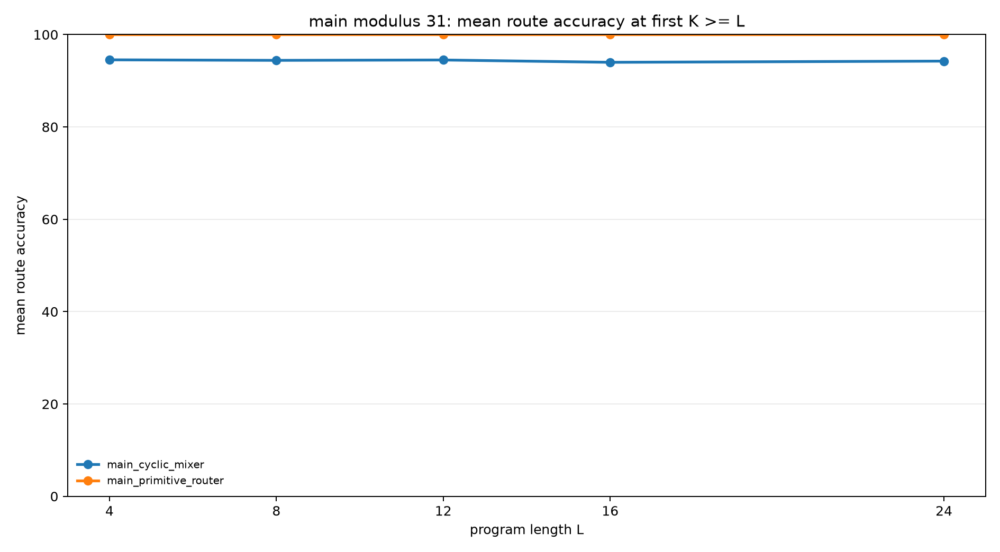
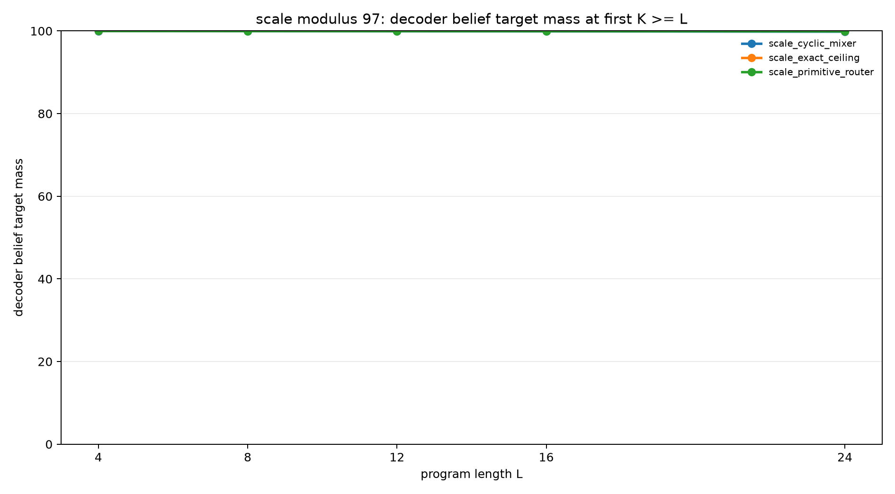

# Cyclic Transition Structure Solves Modular Slot Execution

## Abstract

This experiment tests whether modular arithmetic structure is sufficient for a
recurrent slot model to learn exact latent belief-state transitions. Each task
starts with a hidden relation `B = A + d (mod p)`, then applies arithmetic
updates and observation filters to hidden registers `A` and `B`. The model is
given the initial support in oracle slots, so the experiment isolates the
transition learner.

The result is sharp. At modulus 31, a generic MLP transition reaches only
22.6% query mass and 5.9% strict belief mass at held-out length 24. A
Fourier-feature MLP is weaker, reaching 18.4% query mass and 3.9% belief mass.
In contrast, a cyclic candidate mixer reaches 100.0% query mass and 100.0%
belief mass through length 24. A learned primitive router also reaches 100.0%.
A modulus-97 scale check keeps the structured variants essentially exact:
99.8% belief mass for the cyclic mixer and 99.9% for the primitive router at
length 24.

## Task

Each example begins with:

```text
B = A + d (mod p), with A unknown
```

The initial belief contains `p` possible `(A,B)` states. Programs contain
arithmetic updates and observation filters:

- `A=A+c`, `A=A-c`, `B=B+c`, `B=B-c`
- `A=A+B`, `B=B+A`, `A=A-B`, `B=B-A`
- `A % m = r`, `B % m = r`

Observation residues are sampled from the live support, so target beliefs are
never empty. The final query asks for the distribution of `A`, `B`, `A+B mod
p`, or `A-B mod p`.

## Model

The recurrent state is a fixed set of weighted slots. Each slot contains:

- logits over `A`,
- logits over `B`,
- one slot-weight logit.

The decoded belief is:

```text
P(A,B) = sum_s softmax(w)_s * P_s(A) * P_s(B)
```

All reported runs use oracle initialization: slot `a` starts at `(A=a,
B=a+d)`. This makes the transition rule the only learned component.

## Transition Ladder

Five transition modes are compared:

| Mode | Description |
|---|---|
| Exact ceiling | Applies the known transition rule directly. |
| MLP | Uses expected slot embeddings, operation embeddings, and argument embeddings to predict new slot logits. |
| Fourier MLP | Replaces value embeddings with cyclic Fourier residue features before the MLP. |
| Cyclic mixer | Learns gates over equivariant candidate updates such as circular shifts, circular sums/differences, and observation conditioning. |
| Primitive router | Learns a soft route over exact equivariant transition primitives. |

The cyclic mixer is less direct than the primitive router. It does not choose a
single full operation primitive. Instead, it separately gates candidate updates
for `A`, `B`, and the slot weights. This tests whether reusable cyclic update
features are enough to recover exact behavior.

## Protocol

| Phase | Modulus | Training lengths | Evaluation lengths | Examples per length |
|---|---:|---|---|---:|
| Smoke | 7 | 1-3 | 2, 3 | 128 |
| Pilot | 11 | 1-6 | 3, 6, 9, 12 | 512 |
| Main | 31 | 1-8 | 4, 8, 12, 16, 24 | 512 |
| Scale | 97 | 1-8 | 4, 8, 12, 16, 24 | 128 |

For each length `L`, headline rows report the first recurrent budget `K` such
that `K >= L`.

Metrics:

- `decoder_query_target_mass`: probability assigned to the exact final query
  support.
- `decoder_belief_target_mass`: probability assigned to the exact final
  `(A,B)` support.
- `mean_slot_purity`: average product of the strongest `A` probability and
  strongest `B` probability per slot.
- `mean_route_accuracy`: route match for transition modes with explicit learned
  routing.

## Smoke Results

| Variant | Transition | L=2 query | L=2 belief | L=3 query | L=3 belief | L=3 route acc |
|---|---|---:|---:|---:|---:|---:|
| Exact ceiling | exact | 100.0% | 100.0% | 100.0% | 100.0% | n/a |
| MLP | MLP | 83.9% | 57.0% | 70.3% | 45.3% | n/a |
| Fourier MLP | Fourier MLP | 73.0% | 36.5% | 56.8% | 24.5% | n/a |
| Cyclic mixer | cyclic mixer | 100.0% | 100.0% | 100.0% | 100.0% | 89.6% |
| Primitive router | primitive router | 100.0% | 100.0% | 100.0% | 100.0% | 100.0% |

The smoke phase validates all code paths. The two structured transition modes
recover exact held-out behavior on the small task.

## Pilot Results

| Variant | Transition | L=3 query | L=6 query | L=9 query | L=12 query | L=12 belief | L=12 route acc |
|---|---|---:|---:|---:|---:|---:|---:|
| Exact ceiling | exact | 100.0% | 100.0% | 100.0% | 100.0% | 100.0% | n/a |
| MLP | MLP | 73.7% | 55.1% | 44.8% | 38.2% | 16.4% | n/a |
| Fourier MLP | Fourier MLP | 60.6% | 38.4% | 28.4% | 23.1% | 5.1% | n/a |
| Cyclic mixer | cyclic mixer | 100.0% | 100.0% | 100.0% | 100.0% | 100.0% | 91.2% |
| Primitive router | primitive router | 100.0% | 100.0% | 100.0% | 100.0% | 100.0% | 100.0% |

The pilot shows a clean separation. Dense MLP transitions learn useful partial
signal but do not learn the exact belief transition. The structured transition
modes generalize exactly to lengths twice the training horizon.



## Main Results

| Variant | Transition | L=4 query | L=8 query | L=12 query | L=16 query | L=24 query | L=24 belief | L=24 route acc |
|---|---|---:|---:|---:|---:|---:|---:|---:|
| Exact ceiling | exact | 100.0% | 100.0% | 100.0% | 100.0% | 100.0% | 100.0% | n/a |
| MLP | MLP | 66.4% | 50.3% | 39.1% | 31.4% | 22.6% | 5.9% | n/a |
| Fourier MLP | Fourier MLP | 60.2% | 43.9% | 33.1% | 26.1% | 18.4% | 3.9% | n/a |
| Cyclic mixer | cyclic mixer | 100.0% | 100.0% | 100.0% | 100.0% | 100.0% | 100.0% | 94.3% |
| Primitive router | primitive router | 100.0% | 100.0% | 100.0% | 100.0% | 100.0% | 100.0% | 100.0% |





The main sweep identifies the bottleneck. Adding Fourier residue features to a
generic MLP does not solve transition learning. Giving the model cyclic
candidate updates does solve it.

## Modulus-97 Scale Check

The scale check evaluates only the exact ceiling and the two structured learned
transition modes.

| Variant | Transition | L=4 query | L=8 query | L=12 query | L=16 query | L=24 query | L=24 belief | L=24 route acc |
|---|---|---:|---:|---:|---:|---:|---:|---:|
| Exact ceiling | exact | 100.0% | 100.0% | 100.0% | 100.0% | 100.0% | 100.0% | n/a |
| Cyclic mixer | cyclic mixer | 100.0% | 100.0% | 100.0% | 99.9% | 99.9% | 99.8% | 100.0% |
| Primitive router | primitive router | 100.0% | 100.0% | 100.0% | 100.0% | 99.9% | 99.9% | 100.0% |



The structured transition modes remain essentially exact at a much larger
residue space. The small deviations from 100% are probability-mass deviations,
while route accuracy is 100%.

## Interpretation

The experiment supports a narrow claim:

> The transition learner needs cyclic modular structure, not merely more dense
> parameters or residue features.

The oracle slot state already contains the correct initial support. The hard
part is applying the same update rule repeatedly. A generic MLP can learn some
task-level query signal, but its decoded belief remains far from exact at
modulus 31. Fourier features expose cyclic coordinates, but do not enforce
cyclic transition algebra. The cyclic mixer changes the learning problem: it
offers the correct equivariant update families and trains a small controller to
compose them.

The primitive router is the clean learned-dispatch ceiling. Its exact route
accuracy confirms that a small controller can learn to select the right modular
operation when the primitive library is available. The cyclic mixer is more
interesting because its gates are factored by target component; exact decoded
belief does not require every gate family to choose the canonical label.

## Limitations

The experiment uses oracle slot initialization. It does not test whether a
model can populate the slot memory from raw text or from a learned encoder.

The cyclic mixer contains hand-designed equivariant candidate updates. The
result should be read as evidence for the required transition structure, not as
evidence that a generic neural model will discover that structure unaided.

The task is symbolic and exactly generated. It is useful for isolating the
transition mechanism, but it is not a natural-language reasoning benchmark.

## Reproducibility

Run outputs are in:

```text
experiments/cyclic_transition_ladder/runs/
```

Checkpoints are stored externally:

```text
large_artifacts/cyclic_transition_ladder/checkpoints/
```

Regenerate analysis:

```bash
PYTHONDONTWRITEBYTECODE=1 python experiments/cyclic_transition_ladder/src/analyze_cyclic_transition_ladder.py
```

Example main run:

```bash
PYTHONDONTWRITEBYTECODE=1 python experiments/cyclic_transition_ladder/src/cyclic_transition_ladder_experiment.py \
  --variant_name main_cyclic_mixer \
  --modulus 31 \
  --observe_mod 5 \
  --observe_prob 0.3 \
  --slot_capacity 31 \
  --init_mode oracle \
  --transition_mode cyclic_mixer \
  --supervision full_belief \
  --slot_dim 96 \
  --hidden_dim 192 \
  --train_min_len 1 \
  --train_max_len 8 \
  --train_steps 800 \
  --batch_size 512 \
  --eval_lengths 4,8,12,16,24 \
  --eval_k 0,1,2,4,8,12,16,24 \
  --output_dir experiments/cyclic_transition_ladder/runs/main_cyclic_mixer \
  --checkpoint_dir large_artifacts/cyclic_transition_ladder/checkpoints/main_cyclic_mixer
```
