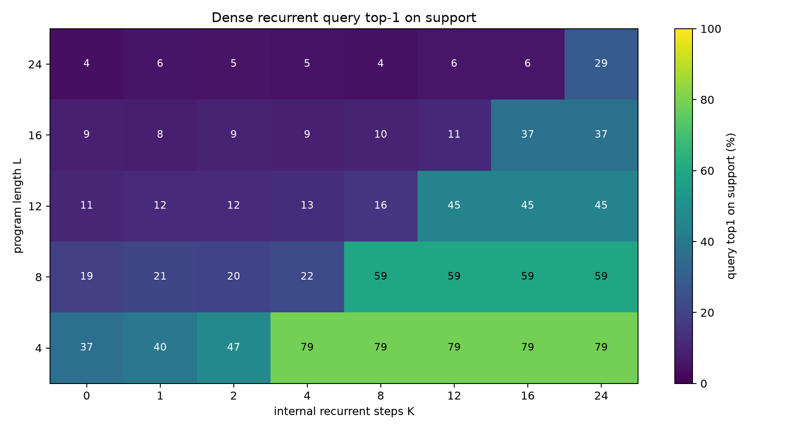
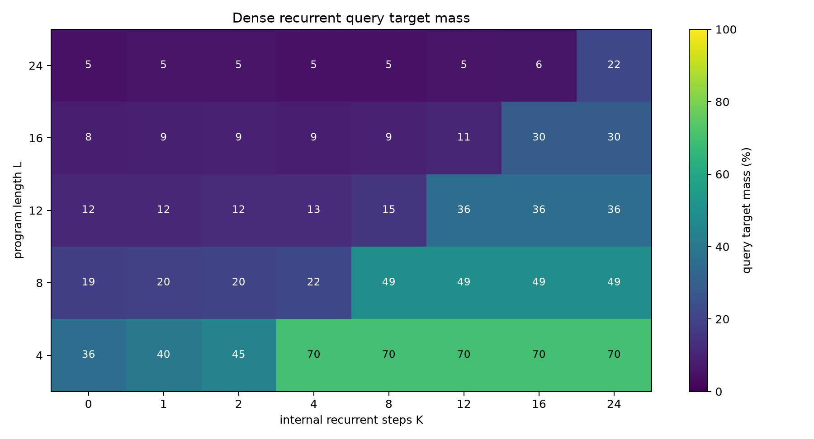
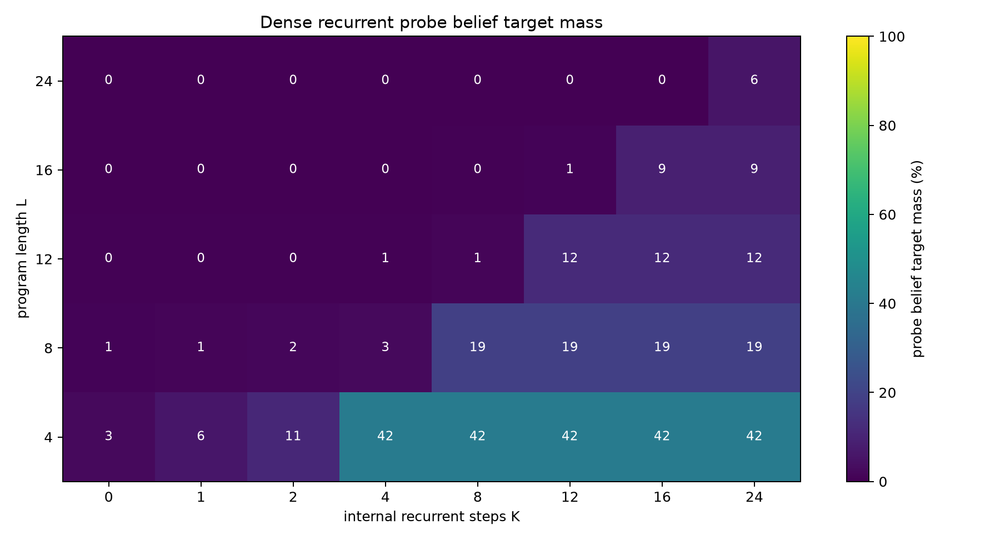
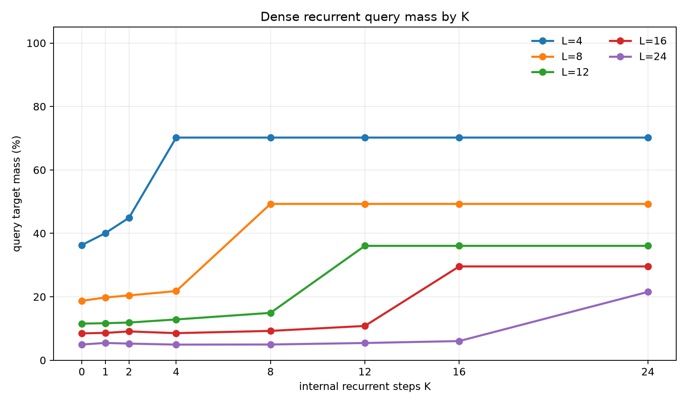
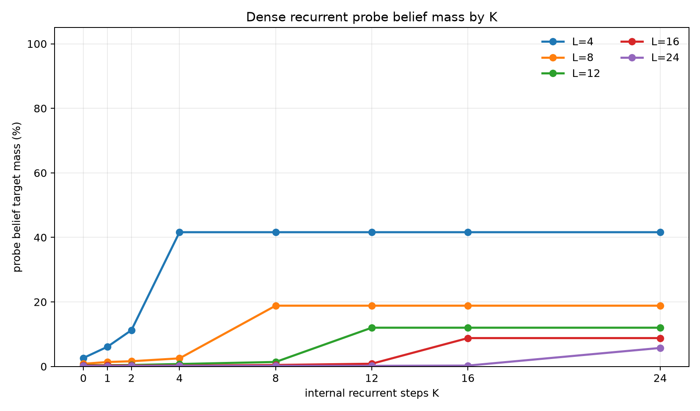
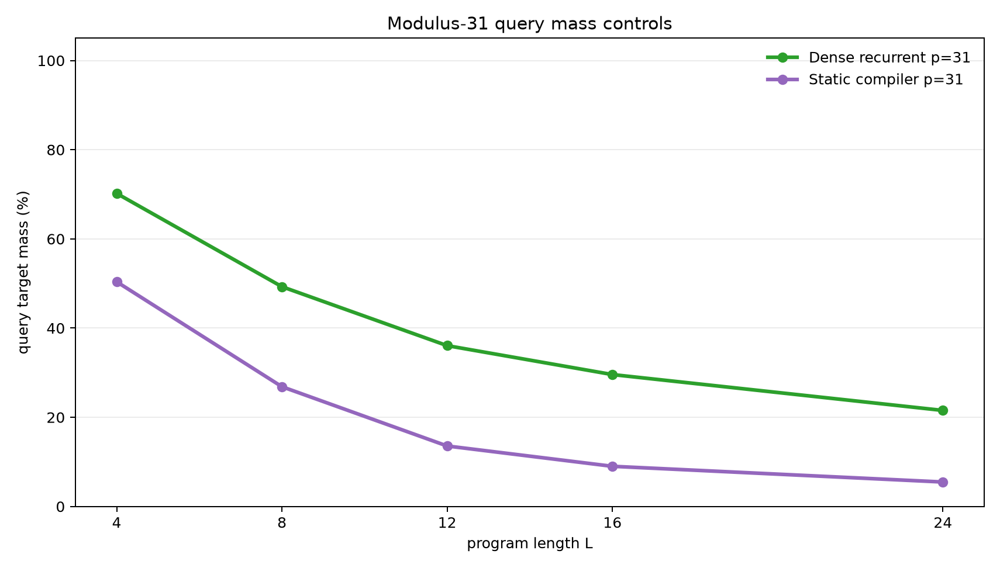
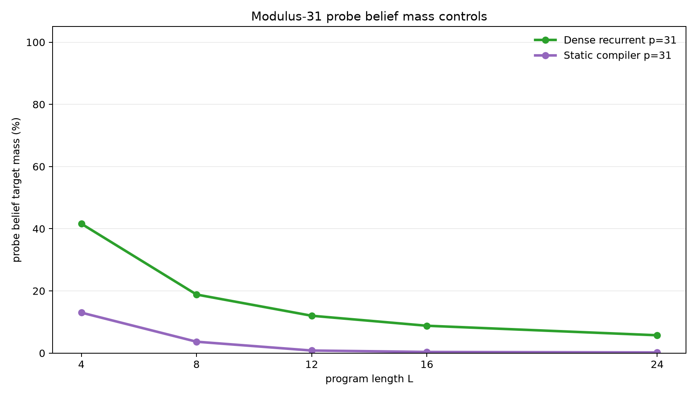

# Dense Latent Recurrent Execution from Sampled Query Labels

**A controlled experiment on whether a fixed-width hidden state can learn sequential belief execution from one sampled final answer**

## Abstract

This experiment tests whether a recurrent runtime with an ordinary dense hidden vector can learn to execute modular arithmetic and observation-filter programs when the loss supplies only one sampled final query value per example. Each example starts with an unknown pair of registers constrained by `B=A+d (mod p)`. A program applies arithmetic updates and bucket observations. The model receives one query type such as `A`, `B`, `A+B`, or `A-B`, and the training label is one value sampled from the exact final query distribution.

The full final query distribution and full final belief distribution over `(A,B)` pairs are withheld from the loss and used only for evaluation. A separate frozen post-hoc probe is trained after executor training to test whether the dense hidden state contains recoverable belief-state information.

On the scaled modulus-31 task, trained on lengths 1-8 and evaluated on lengths 4, 8, 12, 16, and 24, the dense recurrent executor shows a real compute threshold: performance rises when internal recurrent steps `K` reach program length `L`. At the first `K>=L`, exact query target mass is 70.2%, 49.3%, 36.1%, 29.6%, and 21.5% for lengths 4, 8, 12, 16, and 24. A matched static compiler reaches 50.4%, 26.9%, 13.6%, 9.0%, and 5.5%. The dense recurrent state is therefore doing useful sequential work, but the result is not near-exact: sampled query supervision plus a generic dense state is insufficient to learn a high-fidelity belief executor at this scale.

## Lay Summary

The model starts with partial knowledge:

```text
B = A + d (mod p)
```

That relation describes many possible `(A,B)` worlds. A program then changes the registers and sometimes filters the possible worlds:

```text
A = A + 7
observe B % 5 = 3
B = B - A
query A + B
```

Training gives only one sampled final answer value. It does not give the whole answer distribution, and it does not give the set of possible `(A,B)` worlds. The question is whether a dense recurrent hidden state learns a reusable internal executor anyway.

The answer is mixed. The dense recurrent model does learn something sequential: it improves sharply once it has enough internal steps to read the whole program, and it beats a static one-pass compiler on held-out lengths. But the learned dense state is approximate. It is much better than the static control, not a solved belief machine.

## 1. Question

The experiment asks whether sampled-answer supervision can induce a latent recurrent executor in a generic dense hidden state.

The target evidence has five parts:

1. Query quality should depend on internal step budget `K`.
2. The threshold should align with program length `L`: weak when `K<L`, stronger when `K>=L`.
3. The threshold should hold beyond the training length range.
4. A post-hoc probe should recover nontrivial belief information from the dense state.
5. Static and order-destroying controls should be weaker.

This is a controlled mechanism test. It is not an open-ended language benchmark. The goal is to isolate whether recurrent latent computation emerges from low-bandwidth final-answer supervision.

## 2. Task

Programs operate over two registers modulo `p`.

Initial belief:

```text
{(A, B): B = A + d mod p}
```

For `p=31`, the full state space has `31 * 31 = 961` register pairs, and the initial support contains 31 pairs.

Operations:

| Operation | Meaning |
|---|---|
| `A=A+c` | add a constant to `A` |
| `A=A-c` | subtract a constant from `A` |
| `B=B+c` | add a constant to `B` |
| `B=B-c` | subtract a constant from `B` |
| `A=A+B` | add `B` into `A` |
| `B=B+A` | add `A` into `B` |
| `A=A-B` | subtract `B` from `A` |
| `B=B-A` | subtract `A` from `B` |
| `OBS_A_BUCKET` | filter to states where `A % m = r` |
| `OBS_B_BUCKET` | filter to states where `B % m = r` |

Observation residues are sampled from the live support, so every target support is non-empty. For the scaled run, `p=31`, observation modulus is 5, and each instruction is an observation with probability 0.3.

Each example samples one final query type:

| Query | Distribution being sampled |
|---|---|
| `A` | final distribution of `A` |
| `B` | final distribution of `B` |
| `A_PLUS_B` | final distribution of `A+B mod p` |
| `A_MINUS_B` | final distribution of `A-B mod p` |

The training label is one value sampled from the exact query distribution. Evaluation computes the exact final query distribution and exact final pair belief.

Training used lengths 1-8. Evaluation used lengths 4, 8, 12, 16, and 24. Lengths 12, 16, and 24 test length generalization.

## 3. Models

### Dense Recurrent Executor

The primary model stores only a dense hidden vector. It embeds the initial relation parameter `d`, then updates the hidden vector with a GRU-style cell, one program instruction per internal recurrent step. A query head maps the hidden state to logits over all query values for all query types.

The dense state is not a categorical belief table and receives no direct belief supervision.

### Static Compiler Control

The static control receives the whole program and initial relation, processes the instruction sequence with a small Transformer encoder, pools the sequence, and predicts query logits in one pass. It has no recurrent execution axis and no variable internal step budget.

### Shuffled Recurrent Control

The shuffled recurrent control uses the same dense recurrent architecture as the primary model, but it sorts each program's active instructions before execution. This preserves instruction content while destroying the original order.

### Frozen Belief Probe

After executor training, the executor is frozen. A separate MLP probe maps hidden states to distributions over `(A,B)` pairs. For the recurrent model, the probe is trained on hidden states from training-length prefixes. For the static model, it is trained on the final pooled state. Probe metrics audit hidden-state information; they are not executor training losses.

## 4. Metrics

The primary metrics evaluate the exact final query distribution:

- `query_target_mass`: total probability assigned to the exact query support.
- `query_top1_on_support`: whether the most likely queried value is inside the exact query support.
- `query_target_nll`: cross-entropy against the exact query distribution.

The audit metrics evaluate recoverable belief information:

- `probe_belief_target_mass`: total probe probability assigned to the exact final `(A,B)` support.
- `probe_belief_top1_on_support`: whether the most likely probed pair is inside the exact support.
- `probe_belief_target_nll`: cross-entropy against the exact final pair distribution.

The belief metrics are post-hoc probe measurements, not executor objectives.

## 5. Main Result

The dense recurrent executor shows a clear execution-threshold shape at modulus 31. Query mass is weak when `K<L`, then rises when `K` reaches program length.





The probe-belief audit shows the same qualitative threshold, but the recovered belief mass is much lower than an exact belief state would require.



The K curves show the threshold by length.





Numerically, averaged across query types:

| Program length | Best query mass when `K<L` | Best probe belief mass when `K<L` | First `K>=L` | Query mass at first `K>=L` | Probe belief mass at first `K>=L` | Query top-1 |
|---:|---:|---:|---:|---:|---:|---:|
| 4 | 44.9% | 11.3% | 4 | 70.2% | 41.6% | 79.1% |
| 8 | 21.8% | 2.5% | 8 | 49.3% | 18.8% | 59.3% |
| 12 | 14.9% | 1.4% | 12 | 36.1% | 12.0% | 44.6% |
| 16 | 10.8% | 0.8% | 16 | 29.6% | 8.8% | 37.1% |
| 24 | 6.0% | 0.3% | 24 | 21.5% | 5.7% | 28.8% |

The threshold is real, but the scale is limited. Length 24 improves from 6.0% query mass before the execution threshold to 21.5% at `K=24`. That is a meaningful gain, not a strong solution.

## 6. Query Types

All four query types show the same broad pattern: direct register queries are easiest, relational queries are harder, and all degrade with length.

At length 24:

| Query | Query mass at `K=24` | Probe belief mass at `K=24` | Query top-1 |
|---|---:|---:|---:|
| `A` | 24.0% | 5.5% | 31.4% |
| `A_MINUS_B` | 19.2% | 5.7% | 23.2% |
| `A_PLUS_B` | 17.5% | 6.0% | 26.2% |
| `B` | 25.4% | 5.7% | 34.2% |

Relational queries are important because they are harder to answer from shallow marginal cues. The dense recurrent executor improves them, but does not solve them.

## 7. Controls

The scaled static compiler control shows that the dense recurrent result is not merely one-pass sequence fitting.





At modulus 31, averaged across query types:

| Model | L=4 query | L=8 query | L=12 query | L=16 query | L=24 query |
|---|---:|---:|---:|---:|---:|
| Dense recurrent | 70.2% | 49.3% | 36.1% | 29.6% | 21.5% |
| Static compiler | 50.4% | 26.9% | 13.6% | 9.0% | 5.5% |

Probe belief target mass separates the models more sharply:

| Model | L=4 probe belief | L=8 probe belief | L=12 probe belief | L=16 probe belief | L=24 probe belief |
|---|---:|---:|---:|---:|---:|
| Dense recurrent | 41.6% | 18.8% | 12.0% | 8.8% | 5.7% |
| Static compiler | 13.0% | 3.7% | 0.8% | 0.4% | 0.2% |

The small-modulus order control also matters. At modulus 11, the dense recurrent model reached 89.3%, 72.0%, 55.7%, and 47.7% query mass at lengths 3, 6, 9, and 12. The shuffled recurrent control reached 75.8%, 43.1%, 26.3%, and 19.8%. Preserving instruction content while destroying order removes much of the length-generalizing behavior.

## 8. Small-Modulus Diagnostic

A modulus-11 diagnostic used training lengths 1-6 and evaluation lengths 3, 6, 9, and 12. It shows the same phenomenon in an easier state space.

| Model | L=3 query | L=6 query | L=9 query | L=12 query |
|---|---:|---:|---:|---:|
| Dense recurrent | 89.3% | 72.0% | 55.7% | 47.7% |
| Static compiler | 74.0% | 46.2% | 25.1% | 18.7% |
| Shuffled recurrent | 75.8% | 43.1% | 26.3% | 19.8% |

The dense recurrent model is consistently best, but it still degrades with length. The scaled modulus-31 result is therefore not a surprise failure; it is the harder version of the same approximate dense execution behavior.

## 9. Interpretation

The result supports a narrow mechanism claim:

> A generic dense recurrent hidden state can learn a partial sequential executor from one sampled final query label per example, and additional internal steps help when those steps correspond to consuming more program instructions.

The result does not support the stronger claim that sampled final-answer supervision reliably induces an exact hidden belief machine in a generic dense vector.

The evidence for useful sequential execution is:

1. the `K=L` threshold in query metrics,
2. the same threshold in post-hoc belief-probe metrics,
3. length-generalized improvement beyond the training range,
4. a clear gap over the scaled static compiler,
5. weaker behavior from the order-destroying recurrent control at small modulus.

The evidence against a strong dense executor is just as important:

1. query target mass is only 49.3% at the maximum training length of 8,
2. query target mass drops to 21.5% at length 24,
3. probe belief target mass drops to 5.7% at length 24,
4. relational queries remain notably weaker than direct register queries,
5. the dense state does not preserve enough information for the post-hoc probe to reconstruct the final belief well.

This is a useful boundary result. Dense recurrence alone creates a measurable serial-compute axis, but the architecture or objective needs more pressure if the target is robust hidden-state execution.

## 10. Limits

This is a structured experiment.

- The recurrent model uses a direct program counter.
- The instruction vocabulary is small and fixed.
- The operation family is modular arithmetic plus bucket observations.
- The largest completed state space has 961 pairs.
- Supervision is an exact sample from an exact query distribution.
- The belief probe is post-hoc and only measures recoverable information, not necessarily all information in the state.

The dense model has no explicit categorical belief table, but the task itself is still synthetic and tightly controlled. The result should be read as a mechanistic signal, not as a claim about open-ended reasoning.

## 11. Next Tests

Useful next tests:

1. Add auxiliary prefix-query losses or occasional belief distillation and measure whether the dense state becomes stable without fully supervising every example.
2. Increase state dimension and compare whether the probe-belief bottleneck is capacity-limited or optimization-limited.
3. Replace the GRU cell with a recurrent block that attends over the instruction sequence at each step rather than using a direct program counter.
4. Train with randomized `K` and a monotonic refinement loss so later recurrent states are explicitly pressured to improve.
5. Add a learned halt/no-op policy and test whether the model can choose compute budget.

## 12. Reproducibility

Primary files:

- Experiment script: `../src/dense_latent_query_executor_experiment.py`
- Analysis script: `../src/analyze_dense_latent_query_executor.py`
- Experiment log: `dense_latent_query_executor_experiment_log.md`
- Results directory: `../runs/`
- Analysis directory: `../analysis/`
- Checkpoint manifest: `../checkpoint_manifest.csv`

Key run directories:

- `../runs/main_dense_mod31`
- `../runs/control_static_mod31`
- `../runs/pilot_dense_mod11`
- `../runs/control_static_mod11`
- `../runs/control_shuffled_mod11`
- `../runs/smoke_dense_mod7`

Large checkpoint files are stored outside the experiment bundle under:

```text
../../../large_artifacts/dense_latent_query_executor/checkpoints/
```

Environment:

- Python 3.12.3
- PyTorch 2.8.0+cu128
- GPU: NVIDIA RTX 6000 Ada Generation

## 13. Bottom Line

The dense recurrent executor learned a real but weak latent execution strategy from sampled final query labels. The K-threshold is visible, it generalizes beyond the training length range, and it beats a full-budget static compiler. But the dense state does not become a high-fidelity belief state at modulus 31. The most defensible conclusion is that recurrent dense latent execution is learnable in this setup, but not strong enough without additional architectural or training pressure.
