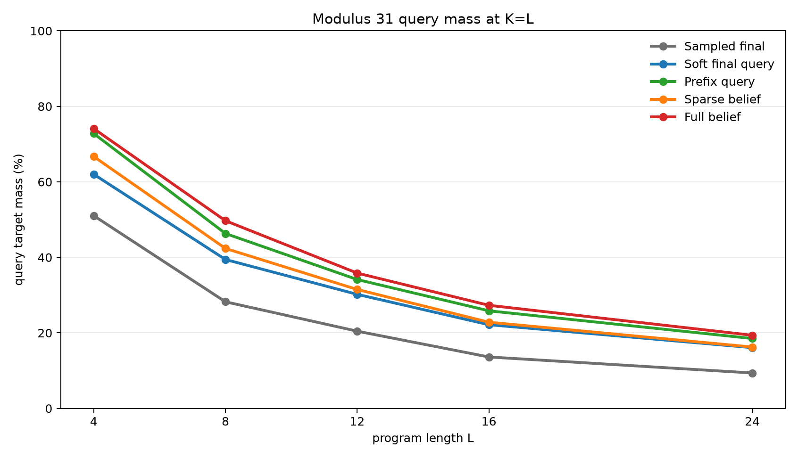
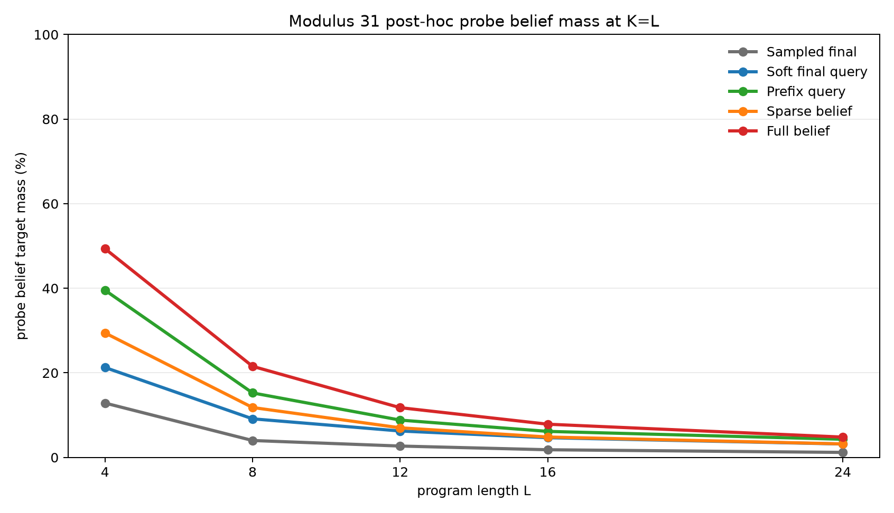
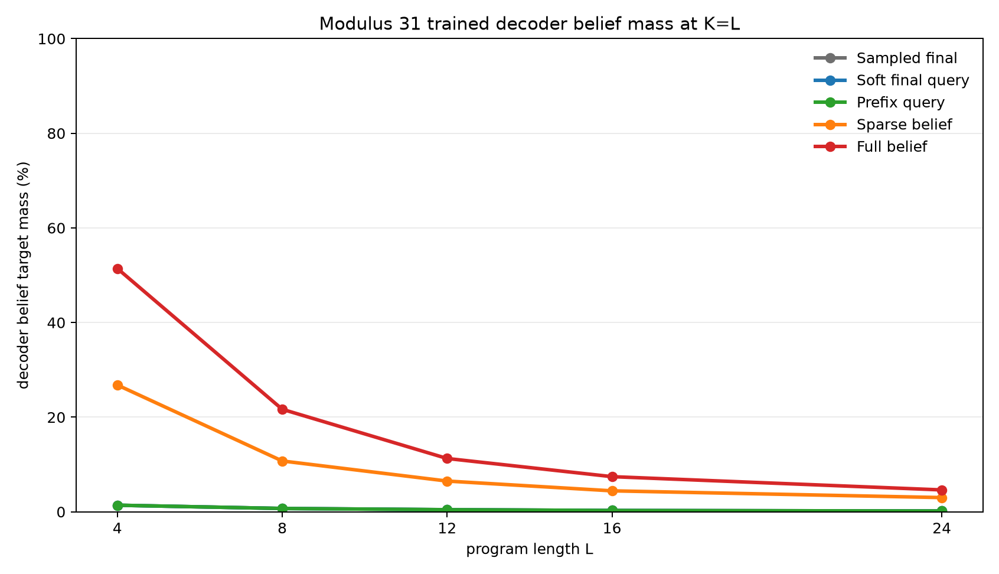
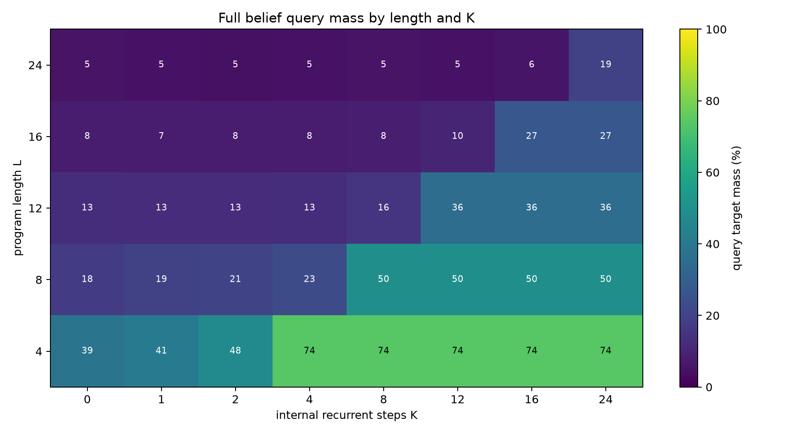
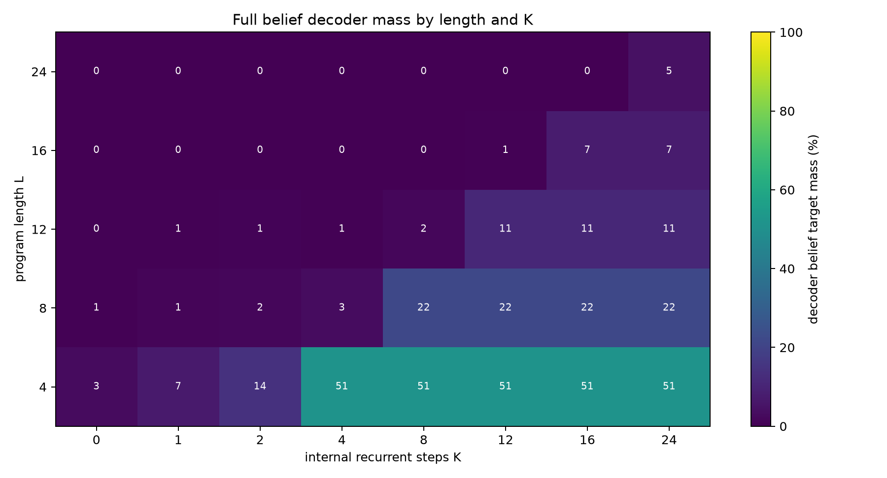

# Dense Supervision Ladder for Recurrent Belief Execution

**A controlled experiment on how much supervision a dense recurrent state needs to learn modular belief execution**

## Abstract

This experiment tests whether a fixed-width dense recurrent hidden state can learn to execute modular belief programs, and which training signal is strong enough to make that happen. Each example begins with an uncertain pair of registers constrained by `B=A+d (mod p)`. A program then applies modular arithmetic updates and bucket observations. The exact belief state is a distribution over `(A,B)` pairs, but the executor itself stores only a dense vector.

Five training objectives are compared under the same architecture: one sampled final query label, the exact final query distribution, exact query distributions at every prefix, sparse belief-state distillation, and full belief-state distillation. Evaluation always uses exact final query distributions and exact final pair beliefs. A frozen post-hoc belief probe is also trained after each executor run.

On the scaled modulus-31 task, trained on lengths 1-8 and evaluated on lengths 4, 8, 12, 16, and 24, supervision strength is the dominant bottleneck. At `K=L`, query target mass at length 24 rises from 9.4% with sampled final labels to 16.1% with exact final query distributions, 18.5% with prefix query supervision, and 19.4% with full belief distillation. Full belief supervision is best at every evaluated length and is the only condition that trains a useful belief decoder at scale.

## Lay Summary

The model starts with partial knowledge:

```text
B = A + d (mod p)
```

That relation leaves many possible `(A,B)` worlds. A program changes the registers and sometimes filters possible worlds:

```text
A = A + 7
observe B % 5 = 3
B = B - A
query A + B
```

The experiment asks how much training signal is required before a dense recurrent state learns to act like a belief executor. A single sampled answer is weak. Giving the whole final answer distribution is better. Giving targets at every prefix is much better. Giving the full belief state at every prefix is best and also makes the internal state directly decodable.

## 1. Question

The central question is:

> Is the dense recurrent substrate the bottleneck, or is weak supervision the bottleneck?

The ladder is designed to answer that by holding the architecture fixed and increasing only the target information supplied during training.

The five objectives are:

| Objective | Training target |
|---|---|
| `sampled_final` | One sampled final query value |
| `soft_final_query` | Exact final query distribution |
| `prefix_query` | Exact query distribution at every executed prefix |
| `sparse_belief` | Prefix query targets plus belief distillation on sampled prefix states |
| `full_belief` | Prefix query targets plus belief distillation on every prefix state |

If `full_belief` fails, the dense recurrent state is likely too weak for the task. If `full_belief` succeeds while weaker objectives fail, the main bottleneck is training signal.

## 2. Task

Programs operate over two registers modulo `p`. The initial belief is:

```text
{(A, B): B = A + d mod p}
```

For `p=31`, the full state space has `31 * 31 = 961` register pairs, and the initial support contains 31 pairs.

Operations:

| Operation | Meaning |
|---|---|
| `A=A+c` | add a constant to `A` |
| `A=A-c` | subtract a constant from `A` |
| `B=B+c` | add a constant to `B` |
| `B=B-c` | subtract a constant from `B` |
| `A=A+B` | add `B` into `A` |
| `B=B+A` | add `A` into `B` |
| `A=A-B` | subtract `B` from `A` |
| `B=B-A` | subtract `A` from `B` |
| `OBS_A_BUCKET` | filter to states where `A % m = r` |
| `OBS_B_BUCKET` | filter to states where `B % m = r` |

Observation residues are sampled from the current support, so the target support is never empty. The scaled run uses `p=31`, observation modulus 5, and observation probability 0.3.

Each example samples one query type:

| Query | Distribution |
|---|---|
| `A` | final distribution of `A` |
| `B` | final distribution of `B` |
| `A_PLUS_B` | final distribution of `A+B mod p` |
| `A_MINUS_B` | final distribution of `A-B mod p` |

Training lengths are 1-8 for the scaled run. Evaluation lengths are 4, 8, 12, 16, and 24. Lengths 12, 16, and 24 test beyond the training range.

## 3. Model

All ladder levels use the same dense recurrent executor. The model embeds the initial relation parameter `d`, embeds program instructions, then updates a dense hidden state with a recurrent cell. The recurrent budget `K` controls how many program instructions can be consumed. The final hidden state feeds a query head. Belief-supervised variants also train a belief decoder from the recurrent hidden state to a distribution over `(A,B)` pairs.

The recurrent state is not an explicit categorical table. Exact pair beliefs are used to generate labels and evaluation metrics, but the executor state remains a fixed-width dense vector.

After executor training, a separate post-hoc MLP probe is trained with the executor frozen. This tests whether exact pair-belief information is recoverable from the hidden state even when it was not part of the executor loss.

## 4. Metrics

Primary query metrics:

| Metric | Meaning |
|---|---|
| `query_target_mass` | Total probability assigned to exact final query support |
| `query_top1_on_support` | Whether the most likely query value is in the exact support |
| `query_target_nll` | Cross-entropy against the exact final query distribution |

Belief audit metrics:

| Metric | Meaning |
|---|---|
| `probe_belief_target_mass` | Post-hoc probe probability assigned to exact final `(A,B)` support |
| `decoder_belief_target_mass` | Trained decoder probability assigned to exact final `(A,B)` support |
| `*_top1_on_support` | Whether the most likely pair is in the exact support |

The headline summaries report the first evaluated `K` satisfying `K>=L`, which is `K=L` for all evaluated lengths here.

## 5. Main Result

The scaled modulus-31 ladder separates cleanly.







At `K=L`, averaged across query types:

| Supervision | L=4 query | L=8 query | L=12 query | L=16 query | L=24 query | L=24 probe belief | L=24 decoder belief |
|---|---:|---:|---:|---:|---:|---:|---:|
| Sampled final | 51.0% | 28.2% | 20.5% | 13.6% | 9.4% | 1.2% | 0.2% |
| Soft final query | 62.0% | 39.4% | 30.2% | 22.2% | 16.1% | 3.2% | 0.2% |
| Prefix query | 72.8% | 46.3% | 34.1% | 25.8% | 18.5% | 4.3% | 0.2% |
| Sparse belief | 66.7% | 42.4% | 31.5% | 22.8% | 16.2% | 3.2% | 3.0% |
| Full belief | 74.1% | 49.7% | 35.8% | 27.3% | 19.4% | 4.8% | 4.6% |

The order is informative:

1. `sampled_final` is weakest. It learns some recurrent behavior but little long-chain belief structure.
2. `soft_final_query` is a large improvement, so exact final distributions are much better labels than sampled values.
3. `prefix_query` is the largest query-performance jump, showing that per-step targets strongly help recurrent execution.
4. `sparse_belief` trains a decoder above chance but costs query performance under this budget.
5. `full_belief` is best at every evaluated length and trains the strongest decoder.

## 6. K-Scaling

The K curves show that the recurrent budget matters: performance is weak for small `K` and rises when `K` reaches the program length.





Full-belief query mass by length:

| Length | Best query mass for `K<L` | Query mass at `K=L` | Probe belief at `K=L` | Decoder belief at `K=L` |
|---:|---:|---:|---:|---:|
| 4 | 52.6% | 74.1% | 49.4% | 51.4% |
| 8 | 28.7% | 49.7% | 21.5% | 21.7% |
| 12 | 18.8% | 35.8% | 11.8% | 11.3% |
| 16 | 12.7% | 27.3% | 7.9% | 7.4% |
| 24 | 6.4% | 19.4% | 4.8% | 4.6% |

The absolute scores still degrade with length. Full supervision does not solve length generalization, but it makes the dense state much more useful than weak final labels.

## 7. Pilot Diagnostic

A smaller modulus-11 diagnostic used the same ladder with training lengths 1-6 and evaluation lengths 3, 6, 9, and 12. It served as a fast check before scaling the full ladder.

At `K=L`, averaged across query types:

| Supervision | L=3 query | L=6 query | L=9 query | L=12 query | L=12 probe belief | L=12 decoder belief |
|---|---:|---:|---:|---:|---:|---:|
| Sampled final | 69.1% | 48.1% | 35.8% | 28.9% | 9.9% | 1.7% |
| Soft final query | 81.7% | 60.5% | 46.8% | 39.2% | 20.1% | 1.7% |
| Prefix query | 90.2% | 70.9% | 56.9% | 45.3% | 26.4% | 1.7% |
| Sparse belief | 86.8% | 62.8% | 47.8% | 38.8% | 20.6% | 17.5% |
| Full belief | 90.9% | 71.3% | 57.7% | 45.7% | 30.2% | 28.9% |

The diagnostic matches the scaled result: prefix query supervision is a large jump, and full belief supervision is the best overall condition.

## 8. Interpretation

The experiment supports a specific mechanism claim:

> The dense recurrent executor can host useful belief-state computation, but weak sampled final-answer supervision is not enough to train it well.

The strongest evidence is that `full_belief` succeeds more than `sampled_final` under the same architecture. That rules out the simple explanation that the dense recurrent substrate alone is too weak. The substrate can carry useful belief information when the target exposes it.

The result also shows that exact belief supervision is not a magic solution. At length 24 and modulus 31, full-belief query mass is 19.4%, not near exact execution. The architecture and optimizer still struggle with long-chain generalization. The practical lesson is that dense recurrent execution needs both a better objective and likely stronger architecture or curriculum to become high fidelity.

## 9. Reproducibility

Main scaled command pattern:

```bash
python experiments/dense_supervision_ladder/src/dense_supervision_ladder_experiment.py \
  --mode dense --supervision <level> \
  --modulus 31 --observe_mod 5 --observe_prob 0.3 \
  --train_max_len 8 --eval_lengths 4,8,12,16,24 --eval_k 0,1,2,4,8,12,16,24 \
  --train_steps 2000 --batch_size 256 --eval_batch_size 256 --eval_examples 256 \
  --probe_steps 800 --probe_batch_size 256 \
  --state_dim 256 --instr_dim 128 \
  --log_every 250 --probe_log_every 200 \
  --lr 0.001 --probe_lr 0.001 \
  --output_dir experiments/dense_supervision_ladder/runs/main_<level>_mod31 \
  --checkpoint_dir large_artifacts/dense_supervision_ladder/checkpoints/main_<level>_mod31
```

Analysis command:

```bash
python experiments/dense_supervision_ladder/src/analyze_dense_supervision_ladder.py
```

Key artifacts:

| Artifact | Path |
|---|---|
| Experiment log | `reports/dense_supervision_ladder_experiment_log.md` |
| Analysis summary | `analysis/summary.md` |
| Main threshold table | `analysis/mod31_ladder_threshold_summary.csv` |
| Per-query threshold table | `analysis/mod31_ladder_per_query_threshold_summary.csv` |
| Full metrics table | `analysis/all_metrics_long.csv` |
| Checkpoint manifest | `checkpoint_manifest.csv` |

Large checkpoint files are stored outside the experiment directory under `../../large_artifacts/dense_supervision_ladder/checkpoints/`.
