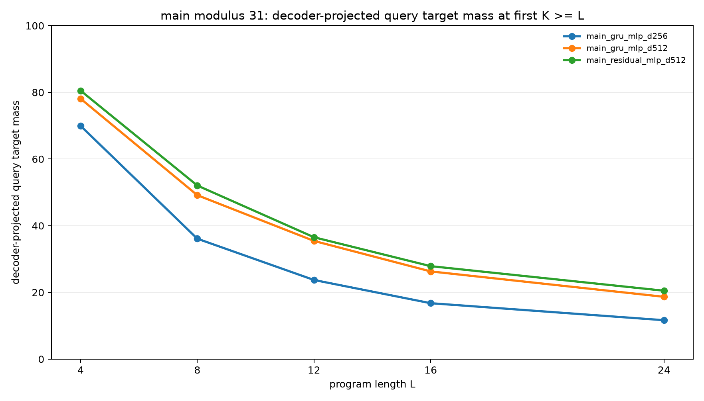
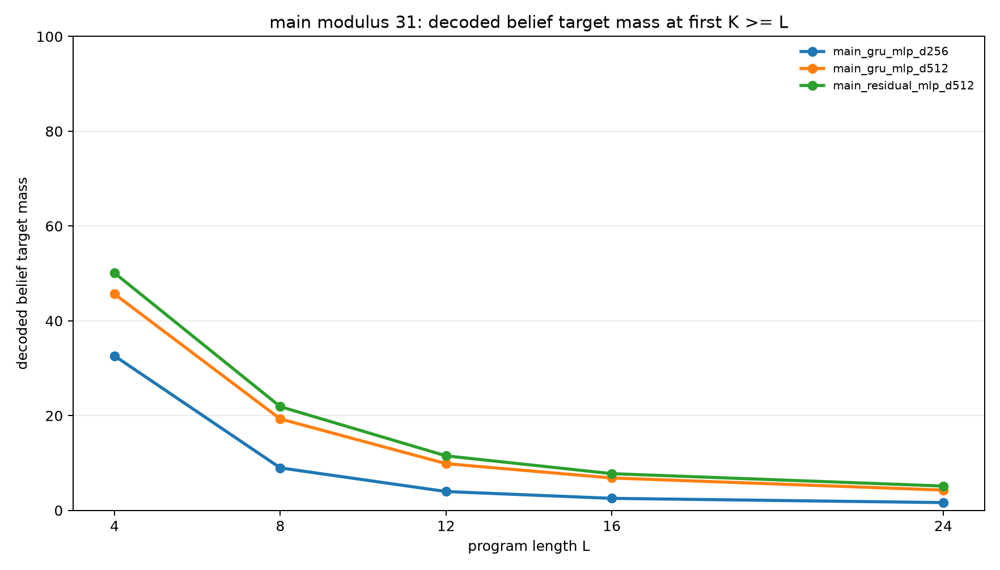

# Dense Teacher Distillation for Recurrent Belief Execution

## Abstract

This experiment tests whether a fixed-width dense recurrent state can learn exact belief-state execution when supervision is not the limiting factor. Programs operate on two modular registers `(A,B)` using arithmetic updates and observation filters. A teacher computes the exact belief distribution over all `(A,B)` pairs after every prefix. A student recurrent executor receives the same program and initial relation, stores only a dense hidden vector, and is trained to decode the exact teacher belief at each recurrent step.

The result is clear but mixed. Full prefix-belief distillation greatly improves dense recurrent execution, and increasing state width from 256 to 512 substantially improves both query accuracy and strict belief accuracy. A residual transition cell is consistently better than a GRU at width 512. However, even the best dense student does not learn exact belief execution on modulus 31. At train-length 8, the best model assigns 52.1% mass to the correct query support but only 21.9% mass to the exact pair-belief support. At held-out length 24, those fall to 20.5% and 5.1%.

## Task

Each example starts with a correlated support over two registers:

```text
B = A + delta (mod p)
```

The program then applies a sequence of operations:

- constant arithmetic updates to `A` or `B`
- cross-register arithmetic updates such as `A = A + B`
- observation filters such as `A mod m = r` or `B mod m = r`

The teacher maintains the exact belief distribution over all `p^2` possible `(A,B)` pairs after each prefix. The query asks for one of four values:

- `A`
- `B`
- `A + B`
- `A - B`

All query values are computed modulo `p`.

## Student Model

The recurrent student has three parts:

1. An instruction embedding for the current operation and argument.
2. A recurrent transition over a fixed-width dense hidden state.
3. A belief decoder that maps the hidden state to a distribution over all `(A,B)` pairs.

Two transition types were tested:

- `gru`: a GRUCell followed by a residual MLP update.
- `residual`: a gated residual MLP transition.

Two decoder families were tested in the pilot:

- `mlp`: unconstrained MLP logits over all pairs.
- `low_rank`: a mixture of rank-1 distributions over `A` and `B`.

The low-rank decoder was dropped from the main sweep because it was consistently worse.

## Training

The student is trained with full prefix-belief distillation. At each recurrent step `t`, the decoder produces logits over all `(A,B)` pairs, and the training loss is cross-entropy against the teacher belief after prefix `t`.

The direct query head is left unsupervised in the main runs. It remains in the harness as a diagnostic, but the headline query metric is computed by projecting the decoded pair distribution onto the requested query.

## Metrics

The primary metrics are:

- `decoder_query_target_mass`: mass assigned to the correct query support after projecting the decoded pair distribution.
- `decoder_belief_target_mass`: mass assigned to the exact teacher pair-belief support.
- `probe_belief_target_mass`: mass assigned by a separately trained frozen-state probe to the exact pair-belief support.
- `query_target_mass`: direct query-head mass, included only as a diagnostic because the query head is not trained.

The headline row for each program length uses the first evaluation step `K` such that `K >= L`, where `L` is the program length.

## Pilot Results

The pilot used modulus 11, train lengths up to 6, and evaluation lengths 3, 6, 9, and 12.

| Variant | L=3 Query | L=6 Query | L=9 Query | L=12 Query | L=3 Belief | L=6 Belief | L=9 Belief | L=12 Belief |
|---|---:|---:|---:|---:|---:|---:|---:|---:|
| GRU MLP d128 | 90.5% | 61.9% | 44.8% | 35.2% | 70.6% | 37.8% | 21.6% | 15.0% |
| GRU MLP d256 | 94.7% | 71.3% | 53.1% | 41.4% | 81.9% | 52.9% | 32.7% | 22.0% |
| Residual MLP d256 | 94.8% | 71.6% | 54.7% | 42.6% | 81.0% | 52.8% | 33.8% | 22.5% |
| GRU low-rank d256 | 78.8% | 50.3% | 36.4% | 28.5% | 49.4% | 21.2% | 12.0% | 8.9% |

The pilot established three facts:

- Increasing state width improved both projected query mass and strict belief mass.
- The residual transition was slightly stronger than the GRU on longer lengths.
- The low-rank decoder was a poor fit for correlated pair beliefs.

## Main Results

The main sweep used modulus 31, train lengths up to 8, and evaluation lengths 4, 8, 12, 16, and 24.

### Decoder-Projected Query Mass

| Variant | L=4 | L=8 | L=12 | L=16 | L=24 |
|---|---:|---:|---:|---:|---:|
| GRU MLP d256 | 69.9% | 36.1% | 23.7% | 16.8% | 11.7% |
| GRU MLP d512 | 78.1% | 49.2% | 35.4% | 26.3% | 18.7% |
| Residual MLP d512 | 80.5% | 52.1% | 36.5% | 27.9% | 20.5% |



### Strict Decoded-Belief Mass

| Variant | L=4 | L=8 | L=12 | L=16 | L=24 |
|---|---:|---:|---:|---:|---:|
| GRU MLP d256 | 32.6% | 9.0% | 4.0% | 2.5% | 1.6% |
| GRU MLP d512 | 45.7% | 19.3% | 9.9% | 6.8% | 4.3% |
| Residual MLP d512 | 50.1% | 21.9% | 11.5% | 7.8% | 5.1% |



## Interpretation

Full prefix-belief supervision is not enough to make a fixed-width dense recurrent state behave like an exact symbolic belief executor at modulus 31. The student learns useful approximate state updates, and the approximation improves with more width, but exact pair-belief mass remains low.

The gap between query mass and belief mass is important. A model can assign useful probability to the correct projected query support while still failing to represent the full pair belief. The best main model reaches 52.1% projected query mass at train-length 8, but only 21.9% exact pair-belief mass. That means it learned a partially useful compressed computation, not exact latent belief execution.

The frozen probes do not reveal a hidden exact state. Probe belief mass is close to decoder belief mass on the main fixed-length evaluation rows. This suggests the primary bottleneck is the learned recurrent state and transition, not merely the trained belief decoder.

The residual transition is the best tested transition, but its advantage is modest. Its larger effect is not qualitative: it improves the curve without changing the conclusion.

## Conclusion

Dense teacher distillation improves recurrent belief execution, and state capacity matters. The strongest tested model is the residual MLP decoder with 512 hidden dimensions. It is better than the GRU at the same width and much better than the 256-dimensional model.

The experiment does not support the claim that full teacher supervision alone makes a dense recurrent student learn exact modular belief-state execution. On the hard modulus-31 setting, the dense state remains an approximation whose accuracy decays quickly with program length.

The most direct next test is to add structure back into the state or transition: factorized register beliefs, explicit pair-state tables, sparse support tracking, or a differentiable update rule constrained to preserve and transform belief mass. The dense-state route is viable as an approximation, but the results show a clear exact-execution bottleneck.

## Reproducibility

Code and lightweight artifacts are in:

```text
experiments/dense_teacher_distillation/
```

Checkpoints are stored separately in:

```text
large_artifacts/dense_teacher_distillation/checkpoints/
```

The normal research bundle is the experiment directory. The checkpoint directory is only needed when loading saved model weights.

Key files:

- `src/dense_teacher_distillation_experiment.py`
- `src/analyze_dense_teacher_distillation.py`
- `analysis/summary.md`
- `analysis/threshold_summary.csv`
- `analysis/final_metrics_query_mean.csv`
- `checkpoint_manifest.csv`
