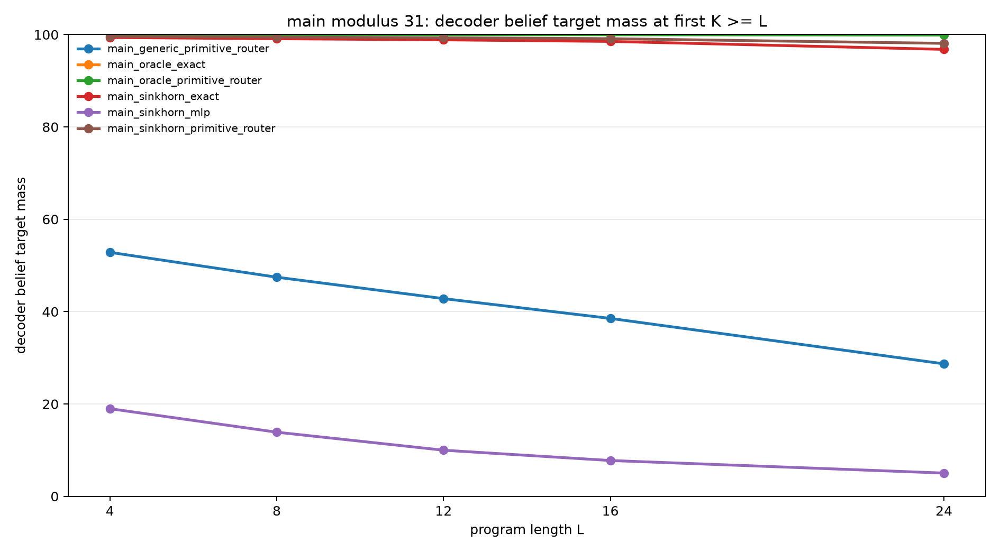
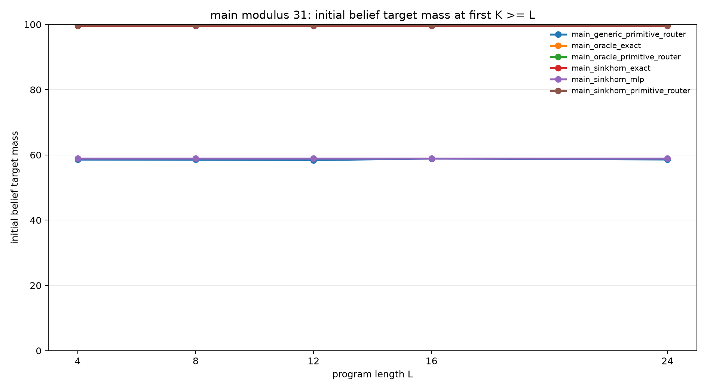
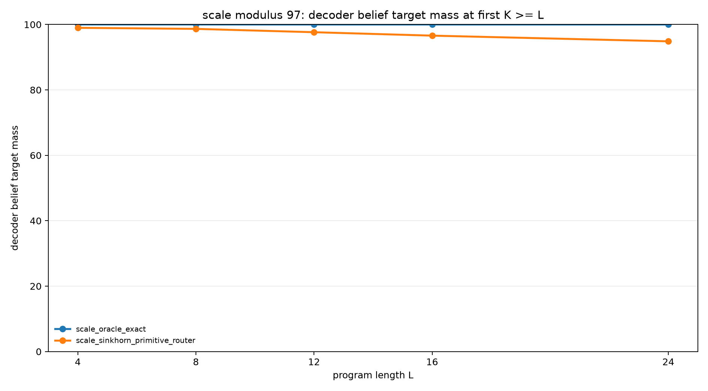

# End-to-End Structured Slot Executor

## Abstract

This experiment tests whether a single learned model can form a modular belief
state and execute recurrent symbolic updates without being given either the
initial state or the transition rule. The task family uses hidden residues
`A` and `B` with `B = A + d (mod p)`. A program applies arithmetic updates and
observations, and the model must recover the final support over `(A, B)`.

The best learned executor combines a Sinkhorn-normalized cyclic initializer
with a learned primitive router over modular update candidates. On modulus 31,
it reaches 98.1% strict belief mass at held-out length 24. On a modulus-97
scale check, the same design reaches 94.9% strict belief mass at held-out
length 24. The ablations fail in different ways: a generic initializer with a
perfect learned router reaches 28.7% at modulus 31, while a structured
initializer with an unstructured MLP transition reaches 5.0%.

## Problem

Each example begins with a relation:

```text
B = A + d (mod p)
```

The value of `A` is hidden, so the initial support contains one valid `(A, B)`
pair for each residue. The program then applies operations such as modular
increments, decrements, swaps, and observations. The target is not one scalar
answer; it is the final belief support induced by the whole program.

The strict metric is the probability mass assigned to the exact final support
after evaluating at the first recurrent step budget `K` that is at least the
program length `L`.

## Model

The executor represents belief states with weighted slots. Each slot carries a
distribution over `A`, a distribution over `B`, and a slot weight. Decoding
forms a dense belief over `(A, B)` from the slot mixture.

The primary learned executor has two structured components:

- A Sinkhorn-normalized cyclic initializer that maps the relation offset `d`
  into one slot per residue.
- A primitive router that selects among equivariant modular update candidates
  for each program operation.

The key controls are:

- `oracle_exact`: exact initializer and exact transition.
- `oracle_primitive_router`: exact initializer and learned primitive router.
- `sinkhorn_exact`: learned initializer and exact transition.
- `sinkhorn_primitive_router`: learned initializer and learned primitive
  router.
- `generic_primitive_router`: generic initializer and learned primitive router.
- `sinkhorn_mlp`: learned initializer and unstructured MLP transition.

## Results

### Main Modulus 31

Training used program lengths 1-8. Evaluation used held-out lengths 4, 8, 12,
16, and 24.

| Variant | Init | Transition | L=24 query | L=24 belief | Initial belief | Route acc |
|---|---|---|---:|---:|---:|---:|
| `oracle_exact` | oracle | exact | 100.0% | 100.0% | 100.0% | n/a |
| `oracle_primitive_router` | oracle | primitive router | 99.9% | 99.9% | 100.0% | 100.0% |
| `sinkhorn_exact` | sinkhorn cyclic | exact | 97.7% | 96.8% | 99.6% | n/a |
| `sinkhorn_primitive_router` | sinkhorn cyclic | primitive router | 98.7% | 98.1% | 99.7% | 100.0% |
| `generic_primitive_router` | generic MLP | primitive router | 43.0% | 28.7% | 58.6% | 100.0% |
| `sinkhorn_mlp` | sinkhorn cyclic | MLP | 19.9% | 5.0% | 58.9% | n/a |





### Scale Modulus 97

The modulus-97 scale check used the same held-out maximum length of 24 with a
smaller evaluation batch.

| Variant | Init | Transition | L=24 query | L=24 belief | Initial belief | Route acc |
|---|---|---|---:|---:|---:|---:|
| `oracle_exact` | oracle | exact | 100.0% | 100.0% | 100.0% | n/a |
| `sinkhorn_primitive_router` | sinkhorn cyclic | primitive router | 96.2% | 94.9% | 99.4% | 100.0% |



## Interpretation

The full learned structured executor solves the task end-to-end at modulus 31
and remains strong at modulus 97. The control rows isolate why: the learned
router is exact when the state is supplied, and the Sinkhorn initializer forms
nearly exact support when the transition is supplied. When both are trained
together, the model retains both properties.

The failures are also informative. The generic initializer does not cover the
initial modular support, so even a perfect router cannot recover the full
belief state. The unstructured MLP transition fails despite a structured
initializer, showing that transition equivariance is doing real work.

At modulus 97, the residual error is not caused by wrong route selection or
missing residue coverage. It appears as slow diffusion of belief mass through
long recurrent execution. That points to sharper recurrent state maintenance as
the next technical bottleneck.

## Limitations

The model uses strong structure: the slot capacity equals the modulus, the
initializer is cyclic, and the transition router chooses among modular
primitive candidates. The task is synthetic and arithmetic. The result shows
that a learned structured executor can compose these mechanisms reliably, not
that an unconstrained neural model would discover the same representation.

## Artifact Layout

Lightweight code, metrics, figures, and reports live in:

```text
experiments/end_to_end_structured_slot_executor/
```

Saved model weights live separately in:

```text
large_artifacts/end_to_end_structured_slot_executor/checkpoints/
```

The checkpoint manifest is:

```text
experiments/end_to_end_structured_slot_executor/checkpoint_manifest.csv
```
