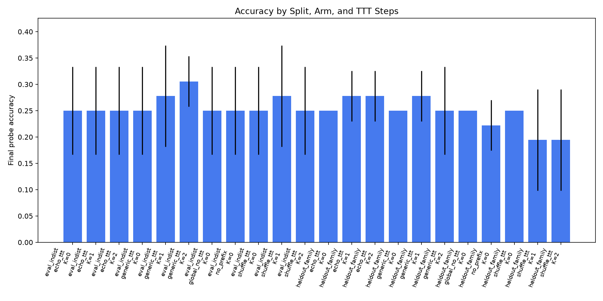
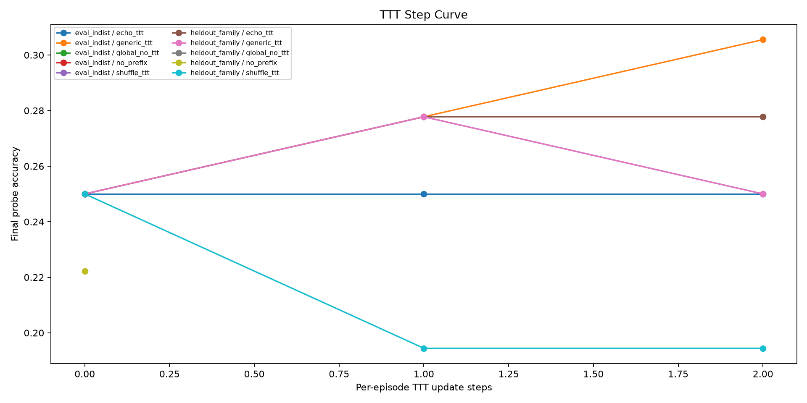
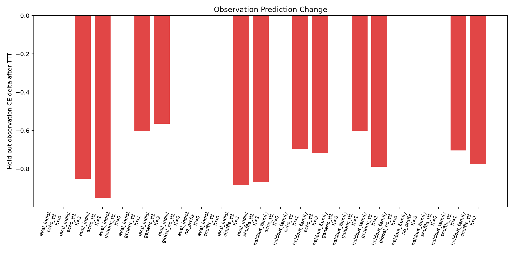
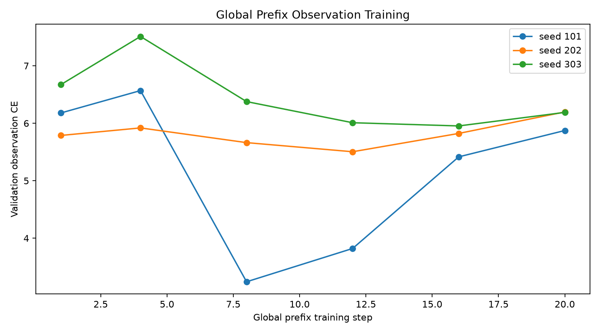

# Episodic ECHO-TTT Report

## Summary

This standalone experiment tests whether a frozen local language model can use
temporary per-episode gradient updates on environment-observation prediction to
make better later decisions.

Verdict: **negative mechanism signal**.

Best mean accuracy was 30.6% for `generic_ttt` on `eval_indist` at 2 TTT steps.

The primary comparison is `global_no_ttt` versus `echo_ttt` and the corrupted
controls `shuffle_ttt` and `generic_ttt`. A real mechanism signal requires
true-observation TTT to improve final-probe accuracy and held-out observation
prediction more than corrupted-observation TTT.

Gate readout at the largest tested TTT step:

- `eval_indist` at 2 TTT steps: echo 25.0%, no-TTT 25.0%, best corrupted control 30.6%.
- `heldout_family` at 2 TTT steps: echo 27.8%, no-TTT 25.0%, best corrupted control 25.0%.

## Setup

- Base model: `Qwen/Qwen3-4B`.
- Frozen model weights: yes.
- Per-episode trainable state: `4` virtual prefix tokens.
- Observation update target: only text spans containing diagnostic-box observations.
- Candidate decision: likelihood over four randomized option-letter continuations.
- Four-choice chance accuracy: `25.0%`.
- Support observations per episode: `5`.
- Held-out observation probes per episode: `2`.
- Seeds: `101,202,303`.
- Large artifacts: `/workspace/large_artifacts/episodic_echo_ttt`.

## Main Results

| split          | arm           |   ttt_steps |   n | mean_accuracy   | std_accuracy   |   mean_obs_ce_before |   mean_obs_ce_after |   mean_obs_ce_delta |
|:---------------|:--------------|------------:|----:|:----------------|:---------------|---------------------:|--------------------:|--------------------:|
| eval_indist    | echo_ttt      |           0 |  36 | 25.0%           | 8.3%           |                6.312 |               6.312 |               0     |
| eval_indist    | echo_ttt      |           1 |  36 | 25.0%           | 8.3%           |                6.312 |               5.46  |              -0.852 |
| eval_indist    | echo_ttt      |           2 |  36 | 25.0%           | 8.3%           |                6.312 |               5.361 |              -0.951 |
| eval_indist    | generic_ttt   |           0 |  36 | 25.0%           | 8.3%           |                6.312 |               6.312 |               0     |
| eval_indist    | generic_ttt   |           1 |  36 | 27.8%           | 9.6%           |                6.312 |               5.71  |              -0.602 |
| eval_indist    | generic_ttt   |           2 |  36 | 30.6%           | 4.8%           |                6.312 |               5.747 |              -0.565 |
| eval_indist    | global_no_ttt |           0 |  36 | 25.0%           | 8.3%           |                6.312 |               6.312 |               0     |
| eval_indist    | no_prefix     |           0 |  36 | 25.0%           | 8.3%           |                6.398 |               6.398 |               0     |
| eval_indist    | shuffle_ttt   |           0 |  36 | 25.0%           | 8.3%           |                6.312 |               6.312 |               0     |
| eval_indist    | shuffle_ttt   |           1 |  36 | 27.8%           | 9.6%           |                6.312 |               5.428 |              -0.884 |
| eval_indist    | shuffle_ttt   |           2 |  36 | 25.0%           | 8.3%           |                6.312 |               5.442 |              -0.87  |
| heldout_family | echo_ttt      |           0 |  36 | 25.0%           | 0.0%           |                6.174 |               6.174 |               0     |
| heldout_family | echo_ttt      |           1 |  36 | 27.8%           | 4.8%           |                6.174 |               5.477 |              -0.696 |
| heldout_family | echo_ttt      |           2 |  36 | 27.8%           | 4.8%           |                6.174 |               5.457 |              -0.717 |
| heldout_family | generic_ttt   |           0 |  36 | 25.0%           | 0.0%           |                6.174 |               6.174 |               0     |
| heldout_family | generic_ttt   |           1 |  36 | 27.8%           | 4.8%           |                6.174 |               5.573 |              -0.6   |
| heldout_family | generic_ttt   |           2 |  36 | 25.0%           | 8.3%           |                6.174 |               5.385 |              -0.789 |
| heldout_family | global_no_ttt |           0 |  36 | 25.0%           | 0.0%           |                6.174 |               6.174 |               0     |
| heldout_family | no_prefix     |           0 |  36 | 22.2%           | 4.8%           |                6.409 |               6.409 |               0     |
| heldout_family | shuffle_ttt   |           0 |  36 | 25.0%           | 0.0%           |                6.174 |               6.174 |               0     |
| heldout_family | shuffle_ttt   |           1 |  36 | 19.4%           | 9.6%           |                6.174 |               5.47  |              -0.704 |
| heldout_family | shuffle_ttt   |           2 |  36 | 19.4%           | 9.6%           |                6.174 |               5.398 |              -0.776 |

## Global Prefix Training

|   seed |   step |   train_loss |   val_obs_ce |
|-------:|-------:|-------------:|-------------:|
|    101 |      1 |        1.107 |        6.18  |
|    101 |      4 |        1.276 |        6.569 |
|    101 |      8 |        0.988 |        3.242 |
|    101 |     12 |        0.965 |        3.821 |
|    101 |     16 |        0.969 |        5.416 |
|    101 |     20 |        0.928 |        5.874 |
|    202 |      1 |        1.649 |        5.788 |
|    202 |      4 |        0.809 |        5.919 |
|    202 |      8 |        1.137 |        5.663 |
|    202 |     12 |        0.931 |        5.504 |
|    202 |     16 |        0.3   |        5.823 |
|    202 |     20 |        0.764 |        6.197 |
|    303 |      1 |        1.173 |        6.673 |
|    303 |      4 |        1.148 |        7.511 |
|    303 |      8 |        1.188 |        6.377 |
|    303 |     12 |        0.876 |        6.009 |
|    303 |     16 |        0.91  |        5.954 |
|    303 |     20 |        0.925 |        6.189 |

## Interpretation

The load-bearing control is corrupted-observation TTT. The result does not pass
that control. True-observation TTT reduces held-out observation CE, but shuffled
and generic-observation updates also reduce CE on the same held-out probes.
Final-probe accuracy remains near the four-choice chance level and does not
separate reliably from the corrupted controls.

The experiment therefore supports a narrow negative conclusion for this tested
recipe: a tiny virtual-prefix test-time update can move Qwen's likelihoods, but
the movement is not specifically grounded in the true episode dynamics strongly
enough to improve decisions.

## Artifacts

- Run directory: `/workspace/experiments/episodic_echo_ttt/runs/main_episodic_echo_ttt_v1`.
- Metrics CSV: `/workspace/experiments/episodic_echo_ttt/analysis/metrics.csv`.
- Summary CSV: `/workspace/experiments/episodic_echo_ttt/analysis/summary_by_arm.csv`.
- Detail CSV: `/workspace/experiments/episodic_echo_ttt/analysis/detail_rows.csv`.
- Checkpoints: `/workspace/large_artifacts/episodic_echo_ttt/checkpoints/main_episodic_echo_ttt_v1`.
