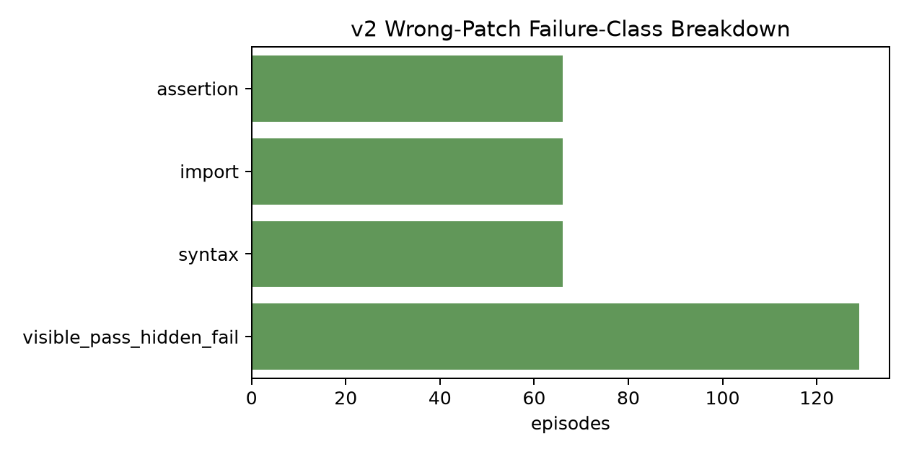
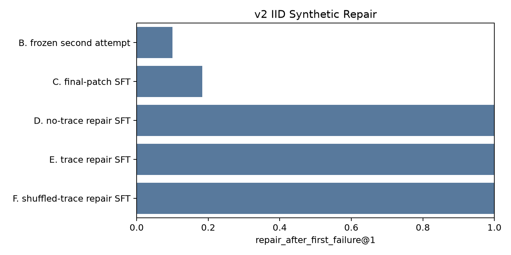
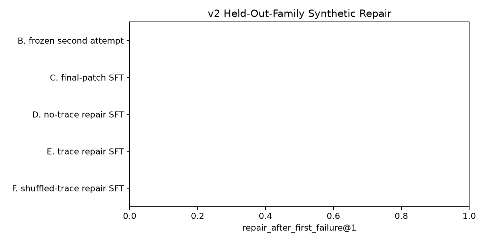
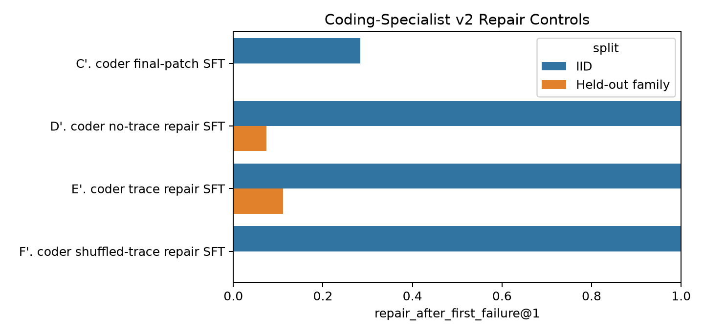
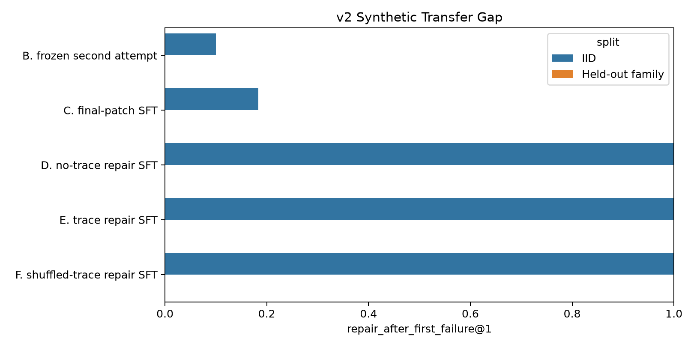

# Execution-Conditioned Repair LoRA: Negative Transfer Result

## Abstract

We tested whether a single QLoRA adapter trained to repair after a failed patch outperforms a single final-patch SFT adapter. On an expanded synthetic IID split, failure-conditioned adapters solved all examples while the final-patch SFT repaired 11/60 and the frozen second-attempt baseline repaired 6/60. However, this success did not transfer to held-out synthetic bug families: every condition repaired 0/27 examples. A secondary coding-specialist ablation with Qwen2.5-Coder-3B reproduced the IID result and found a small held-out-family trace result, 3/27, compared with 2/27 for no-trace, 0/27 for shuffled-trace, and 0/27 for final-patch. Three non-official direct pytest probes on SWE-bench Verified Flask/Requests tasks had base-fails/gold-passes behavior; the trace repair condition scored 0/3, and no Qwen3 repair condition solved any probe. Trace controls did not establish a causal benefit from execution traces. Official SWE-bench-style Docker execution is unavailable in this runner because Docker cannot register container layers (`unshare: operation not permitted`), so no valid real-task transfer ratio is claimed.

## Main Claim

The experiment does not support the hypothesis that failure-conditioned trace SFT learns transferable execution-conditioned repair. The stronger observed effect is template-family memorization: the repair adapters master same-family synthetic validation but the primary Qwen3 adapters fail completely on unseen synthetic families. The coding-specialist ablation weakens the broadest version of that negative claim, but its 3/27 held-out-family result is small and only one success above the no-trace control.

## Model and Training

- Base model: `Qwen/Qwen3-4B-Instruct-2507`.
- Revision: `cdbee75f17c01a7cc42f958dc650907174af0554`.
- Quantization/training: 4-bit NF4 QLoRA, frozen base, BF16, rank 32, alpha 64.
- Loss: assistant diff tokens only.
- Compared adapters: final-patch SFT, no-trace repair SFT, trace repair SFT, shuffled-trace repair SFT.
- Secondary model ablation: `Qwen/Qwen2.5-Coder-3B-Instruct` at revision `488639f1ff808d1d3d0ba301aef8c11461451ec5` for C/D/E/F.
- Evaluation applies generated diffs to the wrong-patched tree and then runs visible and hidden tests.

v2 adapter metadata:

| adapter                                          | model                          | mode        | shuffle_traces   |   rank |   alpha |   dropout |   epochs |      lr |   max_length |   train_records |
|:-------------------------------------------------|:-------------------------------|:------------|:-----------------|-------:|--------:|----------:|---------:|--------:|-------------:|----------------:|
| coder_v2_failure_conditioned_no_trace_lora       | Qwen/Qwen2.5-Coder-3B-Instruct | no_trace    | False            |     32 |      64 |      0.05 |        3 | 0.00015 |         4096 |             240 |
| coder_v2_failure_conditioned_shuffled_trace_lora | Qwen/Qwen2.5-Coder-3B-Instruct | trace       | True             |     32 |      64 |      0.05 |        3 | 0.00015 |         4096 |             240 |
| coder_v2_failure_conditioned_trace_lora          | Qwen/Qwen2.5-Coder-3B-Instruct | trace       | False            |     32 |      64 |      0.05 |        3 | 0.00015 |         4096 |             240 |
| coder_v2_final_patch_sft_lora                    | Qwen/Qwen2.5-Coder-3B-Instruct | final_patch | False            |     32 |      64 |      0.05 |        3 | 0.00015 |         4096 |             240 |
| v2_failure_conditioned_no_trace_lora             | Qwen/Qwen3-4B-Instruct-2507    | no_trace    | False            |     32 |      64 |      0.05 |        3 | 0.00015 |         4096 |             240 |
| v2_failure_conditioned_shuffled_trace_lora       | Qwen/Qwen3-4B-Instruct-2507    | trace       | True             |     32 |      64 |      0.05 |        3 | 0.00015 |         4096 |             240 |
| v2_failure_conditioned_trace_lora                | Qwen/Qwen3-4B-Instruct-2507    | trace       | False            |     32 |      64 |      0.05 |        3 | 0.00015 |         4096 |             240 |
| v2_final_patch_sft_lora                          | Qwen/Qwen3-4B-Instruct-2507    | final_patch | False            |     32 |      64 |      0.05 |        3 | 0.00015 |         4096 |             240 |

## Prompt

System prompt:

```text
You are a coding agent repairing a repository. Output only a unified diff.
Do not explain. Do not include markdown fences.
```

User prompt template:

```text
<ISSUE>
{issue_text}
</ISSUE>

<REPO_CONTEXT>
{opened_files_or_current_files}
</REPO_CONTEXT>

<CURRENT_DIFF>
{wrong_patch}
</CURRENT_DIFF>

<TEST_OUTPUT_AFTER_CURRENT_DIFF>
{traceback_stdout_stderr_or_apply_error}
</TEST_OUTPUT_AFTER_CURRENT_DIFF>

Task:
Produce the minimal corrective unified diff to make the repository pass the tests.
```

Prompt modes: final-patch SFT uses the original buggy files and targets `base_buggy_diff`; repair SFT uses the wrong-patched files and targets `target_next_diff`; no-trace blanks test output; shuffled-trace replaces test output with another training trace; wrong-patch-only removes repository file context and blanks test output; trace-only removes the current diff; gold-file-removed replaces file contents with a withholding marker.

## Dataset

### v1 Pilot

- Dataset: `local_synthetic_python_v1`.
- Tasks: `13`.
- Episodes: `64`.
- Splits: `{'train': 50, 'val_synth': 14}`.
- Failure classes: `{'assertion': 13, 'import': 13, 'syntax': 13, 'visible_pass_hidden_fail': 25}`.
- Bug families: `{'algorithmic_edge': 5, 'boundary_condition': 5, 'case_normalization': 5, 'comparison_flip': 5, 'edge_case': 5, 'exception_case': 5, 'normalization': 5, 'off_by_one': 10, 'ordering': 9, 'parser_partial': 5, 'path_norm': 5}`.

### v2 Expanded Synthetic

- Dataset: `local_synthetic_python_v2`.
- Tasks: `66`.
- Episodes: `327`.
- Splits: `{'train': 240, 'val_synth_family_holdout': 27, 'val_synth_iid': 60}`.
- Failure classes: `{'assertion': 66, 'import': 66, 'syntax': 66, 'visible_pass_hidden_fail': 129}`.
- Bug families: `{'case_normalization': 50, 'comparison_flip': 50, 'exception_case': 50, 'normalization': 50, 'off_by_one': 50, 'ordering': 50, 'path_norm': 15, 'tie_breaking': 12}`.

v2 includes an IID validation split from trained bug families and a held-out-family split using `path_norm` and `tie_breaking`, which are absent from training.



Exact v2 train task IDs:

```text
train_clamp_0, train_clamp_1, train_clamp_2, train_clamp_3, train_clamp_4, train_clamp_5, train_clamp_6, train_clamp_7, train_dedupe_0, train_dedupe_1, train_dedupe_2, train_dedupe_3, train_dedupe_4, train_dedupe_5, train_dedupe_6, train_dedupe_7, train_moving_average_0, train_moving_average_1, train_moving_average_2, train_moving_average_3, train_moving_average_4, train_moving_average_5, train_moving_average_6, train_moving_average_7, train_parse_bool_0, train_parse_bool_1, train_parse_bool_2, train_parse_bool_3, train_parse_bool_4, train_parse_bool_5, train_parse_bool_6, train_parse_bool_7, train_safe_get_0, train_safe_get_1, train_safe_get_2, train_safe_get_3, train_safe_get_4, train_safe_get_5, train_safe_get_6, train_safe_get_7, train_slugify_0, train_slugify_1, train_slugify_2, train_slugify_3, train_slugify_4, train_slugify_5, train_slugify_6, train_slugify_7
```

Exact v2 IID validation task IDs:

```text
val_synth_iid_clamp_8, val_synth_iid_clamp_9, val_synth_iid_dedupe_8, val_synth_iid_dedupe_9, val_synth_iid_moving_average_8, val_synth_iid_moving_average_9, val_synth_iid_parse_bool_8, val_synth_iid_parse_bool_9, val_synth_iid_safe_get_8, val_synth_iid_safe_get_9, val_synth_iid_slugify_8, val_synth_iid_slugify_9
```

Exact v2 held-out-family validation task IDs:

```text
val_synth_family_holdout_normalize_path_0, val_synth_family_holdout_normalize_path_1, val_synth_family_holdout_normalize_path_2, val_synth_family_holdout_top_k_0, val_synth_family_holdout_top_k_1, val_synth_family_holdout_top_k_2
```

## Results

### v1 Pilot Held-Out Synthetic

| condition                    | status   |   repair_after_first_failure@1 |   patch_apply_rate |   syntax_valid_rate |   visible_pass_hidden_fail_rate |   records |   successes |
|:-----------------------------|:---------|-------------------------------:|-------------------:|--------------------:|--------------------------------:|----------:|------------:|
| B. frozen second attempt     | ok       |                              0 |          0.0714286 |           0.0714286 |                       0.0714286 |        14 |           0 |
| C. final-patch SFT           | ok       |                              0 |          0.428571  |           0.285714  |                       0.0714286 |        14 |           0 |
| D. no-trace repair SFT       | ok       |                              0 |          0.571429  |           0.571429  |                       0.142857  |        14 |           0 |
| E. trace repair SFT          | ok       |                              0 |          0.714286  |           0.642857  |                       0.142857  |        14 |           0 |
| F. shuffled-trace repair SFT | ok       |                              0 |          0.642857  |           0.642857  |                       0.214286  |        14 |           0 |

### v2 IID Synthetic

| condition                    | status   |   repair_after_first_failure@1 |   patch_apply_rate |   syntax_valid_rate |   visible_pass_hidden_fail_rate |   records |   successes |
|:-----------------------------|:---------|-------------------------------:|-------------------:|--------------------:|--------------------------------:|----------:|------------:|
| B. frozen second attempt     | ok       |                       0.1      |           0.183333 |            0.166667 |                       0         |        60 |           6 |
| C. final-patch SFT           | ok       |                       0.183333 |           0.383333 |            0.383333 |                       0.0333333 |        60 |          11 |
| D. no-trace repair SFT       | ok       |                       1        |           1        |            1        |                       0         |        60 |          60 |
| E. trace repair SFT          | ok       |                       1        |           1        |            1        |                       0         |        60 |          60 |
| F. shuffled-trace repair SFT | ok       |                       1        |           1        |            1        |                       0         |        60 |          60 |



### v2 Held-Out-Family Synthetic

| condition                    | status   |   repair_after_first_failure@1 |   patch_apply_rate |   syntax_valid_rate |   visible_pass_hidden_fail_rate |   records |   successes |
|:-----------------------------|:---------|-------------------------------:|-------------------:|--------------------:|--------------------------------:|----------:|------------:|
| B. frozen second attempt     | ok       |                              0 |           0.185185 |            0.148148 |                        0.148148 |        27 |           0 |
| C. final-patch SFT           | ok       |                              0 |           0.37037  |            0.185185 |                        0        |        27 |           0 |
| D. no-trace repair SFT       | ok       |                              0 |           0.444444 |            0.444444 |                        0.37037  |        27 |           0 |
| E. trace repair SFT          | ok       |                              0 |           0.444444 |            0.444444 |                        0.444444 |        27 |           0 |
| F. shuffled-trace repair SFT | ok       |                              0 |           0.444444 |            0.444444 |                        0.259259 |        27 |           0 |



### v2 Held-Out-Family Synthetic, Best-of-3 Sampling

Sampling used `temperature=0.2`, `top_p=0.95`, and three candidate diffs per episode. The `@1` column is the first sampled candidate; `@3` is best-of-three by hidden-test pass.

| condition                    | status   |   repair_after_first_failure@1 |   repair_after_first_failure@3 |   patch_apply_rate |   syntax_valid_rate |   visible_pass_hidden_fail_rate |   records |   successes |
|:-----------------------------|:---------|-------------------------------:|-------------------------------:|-------------------:|--------------------:|--------------------------------:|----------:|------------:|
| B. frozen second attempt     | ok       |                              0 |                              0 |           0.185185 |            0.185185 |                        0.185185 |        27 |           0 |
| C. final-patch SFT           | ok       |                              0 |                              0 |           0.407407 |            0.185185 |                        0        |        27 |           0 |
| D. no-trace repair SFT       | ok       |                              0 |                              0 |           0.444444 |            0.444444 |                        0.37037  |        27 |           0 |
| E. trace repair SFT          | ok       |                              0 |                              0 |           0.444444 |            0.444444 |                        0.444444 |        27 |           0 |
| F. shuffled-trace repair SFT | ok       |                              0 |                              0 |           0.444444 |            0.444444 |                        0.259259 |        27 |           0 |

### Coding-Specialist Repair-Control Ablation

To test whether the primary held-out-family collapse was specific to Qwen3-4B, I trained the same v2 final-patch, no-trace repair, trace repair, and shuffled-trace repair adapters on `Qwen/Qwen2.5-Coder-3B-Instruct`. This is still a secondary ablation because the frozen B baseline was not rerun for the coder model, but it includes the trace-specific D/E/F controls needed to interpret the small held-out-family trace result.

| split           | condition                           | status   |   repair_after_first_failure@1 |   patch_apply_rate |   syntax_valid_rate |   visible_pass_hidden_fail_rate |   records |   successes |
|:----------------|:------------------------------------|:---------|-------------------------------:|-------------------:|--------------------:|--------------------------------:|----------:|------------:|
| IID             | C'. coder final-patch SFT           | ok       |                      0.283333  |           0.6      |            0.533333 |                        0        |        60 |          17 |
| IID             | D'. coder no-trace repair SFT       | ok       |                      1         |           1        |            1        |                        0        |        60 |          60 |
| IID             | E'. coder trace repair SFT          | ok       |                      1         |           1        |            1        |                        0        |        60 |          60 |
| IID             | F'. coder shuffled-trace repair SFT | ok       |                      1         |           1        |            1        |                        0        |        60 |          60 |
| Held-out family | C'. coder final-patch SFT           | ok       |                      0         |           0        |            0        |                        0        |        27 |           0 |
| Held-out family | D'. coder no-trace repair SFT       | ok       |                      0.0740741 |           0.666667 |            0.666667 |                        0.296296 |        27 |           2 |
| Held-out family | E'. coder trace repair SFT          | ok       |                      0.111111  |           0.666667 |            0.666667 |                        0.222222 |        27 |           3 |
| Held-out family | F'. coder shuffled-trace repair SFT | ok       |                      0         |           0.37037  |            0.37037  |                        0.111111 |        27 |           0 |



### v2 Transfer Gap View



## Trace Controls

### v1 Trace Adapter on v1 Held-Out Synthetic

| prompt_mode       |   repair_after_first_failure@1 |   patch_apply_rate |   syntax_valid_rate |   visible_pass_hidden_fail_rate |   successes |   records |
|:------------------|-------------------------------:|-------------------:|--------------------:|--------------------------------:|------------:|----------:|
| trace             |                      0         |           0.714286 |            0.642857 |                       0.142857  |           0 |        14 |
| no_trace          |                      0         |           0.857143 |            0.642857 |                       0.0714286 |           0 |        14 |
| wrong_patch_only  |                      0         |           0.285714 |            0.285714 |                       0         |           0 |        14 |
| trace_only        |                      0.0714286 |           0.571429 |            0.571429 |                       0.142857  |           1 |        14 |
| gold_file_removed |                      0         |           0.142857 |            0.142857 |                       0         |           0 |        14 |

### v2 Trace Adapter on v2 Held-Out Families

| prompt_mode       |   repair_after_first_failure@1 |   patch_apply_rate |   syntax_valid_rate |   visible_pass_hidden_fail_rate |   successes |   records |
|:------------------|-------------------------------:|-------------------:|--------------------:|--------------------------------:|------------:|----------:|
| trace             |                              0 |           0.444444 |            0.444444 |                        0.444444 |           0 |        27 |
| no_trace          |                              0 |           0.555556 |            0.555556 |                        0.37037  |           0 |        27 |
| wrong_patch_only  |                              0 |           0.185185 |            0.185185 |                        0.148148 |           0 |        27 |
| trace_only        |                              0 |           0.925926 |            0.925926 |                        0.777778 |           0 |        27 |
| gold_file_removed |                              0 |           0.185185 |            0.185185 |                        0        |           0 |        27 |

The requested evidence pattern `normal trace > no trace`, `normal trace > shuffled trace`, and `normal trace > wrong-patch-only` is not present. On v2 IID, no-trace, trace, and shuffled-trace adapters all repair 60/60. On v2 held-out families, all five ablation prompt modes repair 0/27.

## Representative Cases

### Same-Family Success

- Episode: `val_synth_iid_clamp_8::near_miss`.
- Task: `val_synth_iid_clamp_8`.
- Bug family: `comparison_flip`.
- Failure class: `visible_pass_hidden_fail`.
- Outcome: patch_applied=`True`, visible_passed=`True`, hidden_passed=`True`.

Issue:

```text
`clamp_value_8` should clamp a value into an inclusive range and reject inverted bounds.
```

Target corrective diff:

```diff
--- a/src/repair_target.py
+++ b/src/repair_target.py
@@ -4,5 +4,5 @@
     if value < lower:
         return lower
     if value > upper:
-        return value
+        return upper
     return value
```

Generated diff:

```diff
--- a/src/repair_target.py
+++ b/src/repair_target.py
@@ -4,5 +4,5 @@
     if value < lower:
         return lower
     if value > upper:
-        return value
+        return upper
     return value
```

### Held-Out-Family Failure

- Episode: `val_synth_family_holdout_normalize_path_0::near_miss`.
- Task: `val_synth_family_holdout_normalize_path_0`.
- Bug family: `path_norm`.
- Failure class: `visible_pass_hidden_fail`.
- Outcome: patch_applied=`False`, visible_passed=`False`, hidden_passed=`False`.

Issue:

```text
`normalize_path_0` should collapse duplicate slashes, ignore '.', and resolve '..' without escaping above root.
```

Target corrective diff:

```diff
--- a/src/repair_target.py
+++ b/src/repair_target.py
@@ -3,8 +3,9 @@
     for part in path.split("/"):
         if part in {"", "."}:
             continue
-        if part == ".." and parts:
-            parts.pop()
+        if part == "..":
+            if parts:
+                parts.pop()
             continue
         parts.append(part)
     return "/" + "/".join(parts)
```

Generated diff:

```diff
--- a/src/repair_target.py
+++ b/src/repair_target.py
@@ -1,7 +1,7 @@
 def normalize_path_0(path):
-    parts = [part for part in path.split("/") if part]
+    parts = []
+    for part in path.split("/"):
+        if part in {"", "."}:
+            continue
+        if part == ".." and parts:
+            parts.pop()
+            continue
+        parts.append(part)
     return "/" + "/".join(parts)
```

### Direct Real-Task Probe Failures

#### `pallets__flask-5014`

- Instance: `pallets__flask-5014` from `pallets/flask`.
- Harness: `direct_pytest_not_official_docker`.
- Base failed official FAIL_TO_PASS test: `True`.
- Gold patch passed the same direct test: `True`.
- Frozen first patch resolved: `False`.
- Trace repair resolved after first failure: `0.0`.

Frozen first patch:

```diff
diff --git a/src/flask/blueprints.py b/src/flask/blueprints.py
index 9d0a3d0..3d8d8f5 100644
--- a/src/flask/blueprints.py
+++ b/src/flask/blueprints.py
@@ -1,6 +1,6 @@
 import os
 import typing as t
-from collections import defaultdict
 from functools import update_wrapper
 
 from . import typing as ft
@@ -100,6 +100,10 @@ class Blueprint(Scaffold):
         if url_defaults is None:
             url_defaults = {}

+        if not name:
+            raise ValueError("Blueprint name must be non-empty.")
+
         self.name = name
         self.url_prefix = url_prefix
         self.subdomain = subdomain
@@ -108,6 +112,7 @@ class Blueprint(Scaffold):
         self.url_values_defaults = url_defaults
         self.cli_group = cli_group
...
```

Trace repair generated diff:

```diff
--- a/src/flask/blueprints.py
+++ b/src/flask/blueprints.py
@@ -99,7 +99,7 @@ class Blueprint(Scaffold):
         if url_defaults is None:
             url_defaults = {}

-        if not name:
+        if not name or not name.strip():
             raise ValueError("Blueprint name must be non-empty.")
 
         self.name = name
```

Observed failure:

```text
error: patch failed: src/flask/blueprints.py:99
error: src/flask/blueprints.py: patch does not apply
```

#### `psf__requests-5414`

- Instance: `psf__requests-5414` from `psf/requests`.
- Harness: `direct_pytest_not_official_docker`.
- Base failed official FAIL_TO_PASS test: `True`.
- Gold patch passed the same direct test: `True`.
- Frozen first patch resolved: `False`.
- Trace repair resolved after first failure: `0.0`.

Frozen first patch:

```diff
--- a/requests/models.py
+++ b/requests/models.py
@@ -308,7 +308,7 @@ class PreparedRequest(RequestEncodingMixin, RequestHooksMixin):
         if not host:
             raise InvalidURL("Invalid URL %r: No host supplied" % url)

-        # In general, we want to try IDNA encoding the hostname if the string contains
-        # non-ASCII characters. This allows users to automatically get the correct IDNA
-        # behaviour. For strings containing only ASCII characters, we need to also verify
-        # it doesn't start with a wildcard (*), before allowing the unencoded hostname.
-        if not unicode_is_ascii(host):
-            try:
-                host = self._get_idna_encoded_host(host)
-            except UnicodeError:
-                raise InvalidURL('URL has an invalid label.')
+        # In general, we want to try IDNA encoding the hostname if the string contains
+        # non-ASCII characters. This allows users to automatically get the correct IDNA
+        # behaviour. For strings containing only ASCII characters, we need to also verify
+        # it doesn't start with a wildcard (*), before allowing the unencoded hostname.
+        if not unicode_is_ascii(host):
+            try:
+                host = self._get_idna_encoded_host(host)
+            except idna.IDNAError:
+                raise InvalidURL('URL has an invalid label.')
...
```

Trace repair generated diff:

```diff
--- a/requests/models.py
+++ b/requests/models.py
@@ -308,7 +308,7 @@ class PreparedRequest(RequestEncodingMixin, RequestHooksMixin):
         if not host:
             raise InvalidURL("Invalid URL %r: No host supplied" % url)

-        # In general, we want to try IDNA encoding the hostname if the string contains
-        # non-ASCII characters. This allows users to automatically get the correct IDNA
-        # behaviour. For strings containing only ASCII characters, we need to also verify
-        # it doesn't start with a wildcard (*), before allowing the unencoded hostname.
-        if not unicode_is_ascii(host):
-            try:
-                host = self._get_idna_encoded_host(host)
-            except UnicodeError:
-                raise InvalidURL('URL has an invalid label.')
+        # In general, we want to try IDNA encoding the hostname if the string contains
+        # non-ASCII characters. This allows users to automatically get the correct IDNA
+        # behaviour. For strings containing only ASCII characters, we need to also verify
+        # it doesn't start with a wildcard (*), before allowing the unencoded hostname.
+        if not unicode_is_ascii(host):
+            try:
+                host = self._get_idna_encoded_host(host)
+            except idna.IDNAError:
+                raise InvalidURL('URL has an invalid label.')
...
```

Observed failure:

```text
error: patch failed: requests/models.py:308
error: requests/models.py: patch does not apply
```

#### `psf__requests-6028`

- Instance: `psf__requests-6028` from `psf/requests`.
- Harness: `direct_pytest_not_official_docker`.
- Base failed official FAIL_TO_PASS test: `True`.
- Gold patch passed the same direct test: `True`.
- Frozen first patch resolved: `False`.
- Trace repair resolved after first failure: `0.0`.

Frozen first patch:

```diff
@@ -100,7 +100,7 @@ def resolve_proxies(request, proxies, trust_env=True):
     proxies = proxies if proxies is not None else {}
     url = request.url
     scheme = urlparse(url).scheme
-    no_proxy = proxies.get('no_proxy')
+    no_proxy = proxies.get('no_proxy') or getproxies_environment()
     new_proxies = proxies.copy()
 
     if trust_env and not should_bypass_proxies(url, no_proxy=no_proxy):
@@ -108,7 +108,7 @@ def resolve_proxies(request, proxies, trust_env=True):
         environ_proxies = get_environ_proxies(url, no_proxy=no_proxy)
 
         proxy = environ_proxies.get(scheme, environ_proxies.get('all'))
-        if proxy:
+        if proxy and proxy != 'http://':  # Skip empty or invalid proxy
             new_proxies.setdefault(scheme, proxy)
     return new_proxies
```

Trace repair generated diff:

```diff
--- a/requests/utils.py
+++ b/requests/utils.py
@@ -100,7 +100,7 @@ def resolve_proxies(request, proxies, trust_env=True):
     proxies = proxies if proxies is not None else {}
     url = request.url
     scheme = urlparse(url).scheme
-    no_proxy = proxies.get('no_proxy')
+    no_proxy = proxies.get('no_proxy') or getproxies_environment()
     new_proxies = proxies.copy()
 
     if trust_env and not should_bypass_proxies(url, no_proxy=no_proxy):
@@ -108,7 +108,7 @@ def resolve_proxies(request, proxies, trust_env=True):
         environ_proxies = get_environ_proxies(url, no_proxy=no_proxy)
 
         proxy = environ_proxies.get(scheme, environ_proxies.get('all'))
-        if proxy:
+        if proxy and proxy != 'http://':  # Skip empty or invalid proxy
             new_proxies.setdefault(scheme, proxy)
     return new_proxies
```

Observed failure:

```text
error: patch failed: requests/utils.py:108
error: requests/utils.py: patch does not apply
```


## Synthetic-to-Real Transfer Status

- v2 IID trace gain over frozen second attempt: `0.9`.
- v2 held-out-family trace gain over frozen second attempt: `0.0`.
- Direct non-Docker SWE-bench Verified probe count: `3`.
- Direct non-Docker frozen second-attempt repair rate: `0.0`.
- Direct non-Docker trace repair rate: `0.0`.
- Direct non-Docker real-task gain: `0.0`.
- Direct non-Docker transfer ratio: `0.0`.
- Official Docker SWE-bench real-task gain: `not measured`.
- Official Docker SWE-bench transfer ratio: `not defined`.

Direct non-Docker SWE-bench Verified probes:

| instance            | repo          | condition                   |   initial_resolved@1 | repair_after_first_failure@1   |   end_to_end_resolved@2 |
|:--------------------|:--------------|:----------------------------|---------------------:|:-------------------------------|------------------------:|
| pallets__flask-5014 | pallets/flask | A. frozen first patch       |                    0 | n/a                            |                       0 |
| pallets__flask-5014 | pallets/flask | B_frozen_second_attempt     |                    0 | 0.0                            |                       0 |
| pallets__flask-5014 | pallets/flask | C_final_patch_sft           |                    0 | 0.0                            |                       0 |
| pallets__flask-5014 | pallets/flask | D_no_trace_repair_sft       |                    0 | 0.0                            |                       0 |
| pallets__flask-5014 | pallets/flask | E_trace_repair_sft          |                    0 | 0.0                            |                       0 |
| pallets__flask-5014 | pallets/flask | F_shuffled_trace_repair_sft |                    0 | 0.0                            |                       0 |
| psf__requests-5414  | psf/requests  | A. frozen first patch       |                    0 | n/a                            |                       0 |
| psf__requests-5414  | psf/requests  | B_frozen_second_attempt     |                    0 | 0.0                            |                       0 |
| psf__requests-5414  | psf/requests  | C_final_patch_sft           |                    0 | 0.0                            |                       0 |
| psf__requests-5414  | psf/requests  | D_no_trace_repair_sft       |                    0 | 0.0                            |                       0 |
| psf__requests-5414  | psf/requests  | E_trace_repair_sft          |                    0 | 0.0                            |                       0 |
| psf__requests-5414  | psf/requests  | F_shuffled_trace_repair_sft |                    0 | 0.0                            |                       0 |
| psf__requests-6028  | psf/requests  | A. frozen first patch       |                    0 | n/a                            |                       0 |
| psf__requests-6028  | psf/requests  | B_frozen_second_attempt     |                    0 | 0.0                            |                       0 |
| psf__requests-6028  | psf/requests  | C_final_patch_sft           |                    0 | 0.0                            |                       0 |
| psf__requests-6028  | psf/requests  | D_no_trace_repair_sft       |                    0 | 0.0                            |                       0 |
| psf__requests-6028  | psf/requests  | E_trace_repair_sft          |                    0 | 0.0                            |                       0 |
| psf__requests-6028  | psf/requests  | F_shuffled_trace_repair_sft |                    0 | 0.0                            |                       0 |

Direct-probe selection note: I preflighted every SWE-bench Verified task in the currently supported `pallets/flask` and `psf/requests` profiles. The validated direct slice includes tasks with base-fails/gold-passes behavior. Excluded same-profile candidates either failed gold validation under the local profile (`psf__requests-2931`) or could not install on Python 3.12 because older vendored urllib3 code imports removed stdlib symbols (`psf__requests-1142`, `psf__requests-1724`, `psf__requests-1766`, `psf__requests-1921`, `psf__requests-2317`).

Docker/SWE-bench preflight:

```json
{
  "docker_preflight": {
    "ok": false,
    "probe_output": "Unable to find image 'hello-world:latest' locally\nlatest: Pulling from library/hello-world\n4f55086f7dd0: Pulling fs layer\n4f55086f7dd0: Verifying Checksum\n4f55086f7dd0: Download complete\ndocker: failed to register layer: unshare: operation not permitted\n\nRun 'docker run --help' for more information\n",
    "probe_returncode": 125,
    "server_version": "29.1.3"
  },
  "reason": "Docker preflight failed; official SWE-bench evaluation is not valid in this runner.",
  "status": "blocked"
}
```

The official real-task portion is blocked by the runner, not by a modeling decision. The direct probes are useful negative evidence, but they are not a replacement for the official Docker SWE-bench harness or a statistically meaningful real slice.

## Interpretation

1. Final-patch SFT is weaker than repair-conditioned SFT on same-family synthetic validation.
2. The apparent same-family synthetic gain does not survive held-out-family validation.
3. Execution traces are not shown to be causally useful in the current setup.
4. A coding-specialist model can recover a small amount of held-out-family repair under the trace-conditioned objective, but the effect is weak: 3/27 for trace versus 2/27 for no-trace and 0/27 for shuffled-trace.
5. Patch application and visible-test pass rates can be high while hidden repair remains zero, so executable hidden tests are essential.
6. The current result is negative and should not be framed as successful synthetic-to-real transfer.

## Reproducibility Artifacts

- Dataset builders: `scripts/build_repair_dataset.py`, `scripts/build_repair_dataset_v2.py`.
- Training: `scripts/train_repair_lora.py`.
- Evaluation: `scripts/eval_repair_synthetic.py`, `scripts/run_trace_ablation.py`.
- Direct real-task probe: `scripts/eval_repair_swebench_direct.py`.
- v2 adapters: `models/v2_final_patch_sft_lora`, `models/v2_failure_conditioned_no_trace_lora`, `models/v2_failure_conditioned_trace_lora`, `models/v2_failure_conditioned_shuffled_trace_lora`.
- Coder ablation adapters: `models/coder_v2_final_patch_sft_lora`, `models/coder_v2_failure_conditioned_no_trace_lora`, `models/coder_v2_failure_conditioned_trace_lora`, `models/coder_v2_failure_conditioned_shuffled_trace_lora`.
- v2 result JSONs: `reports/v2_*_results.json`, `reports/v2_trace_ablation_family_holdout_results.json`.
- Coder ablation result JSONs: `reports/coder_v2_*_results.json`.
- Direct real-task result JSONs: `reports/swebench_direct_flask5014_qwen3_results.json`, `reports/swebench_direct_requests5414_qwen3_results.json`, `reports/swebench_direct_requests6028_qwen3_results.json`.
