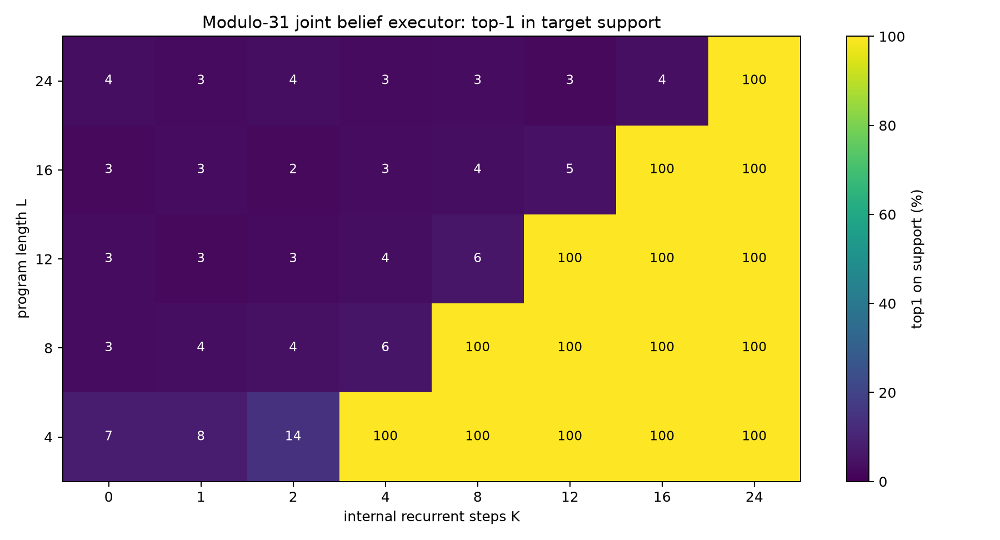
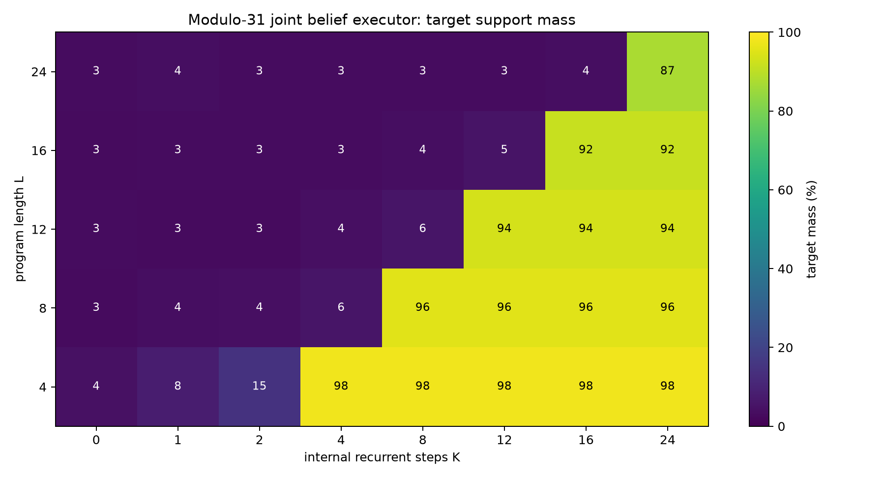
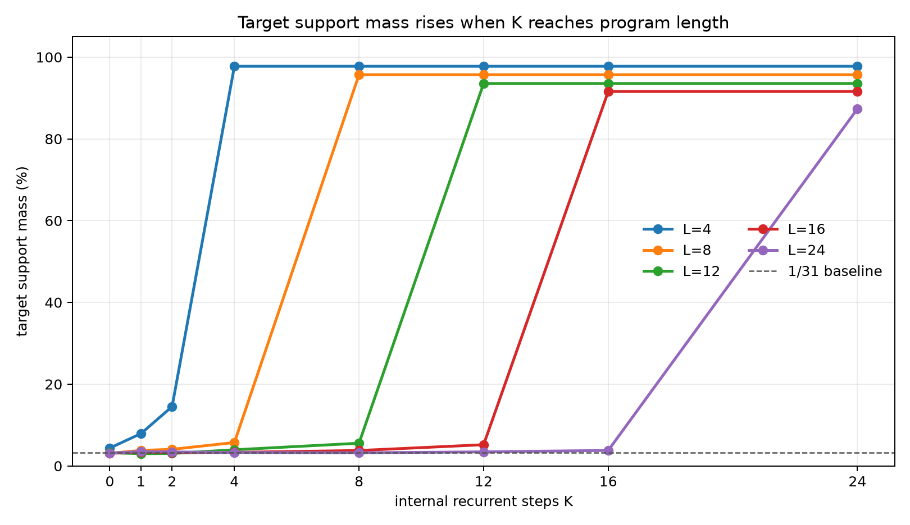
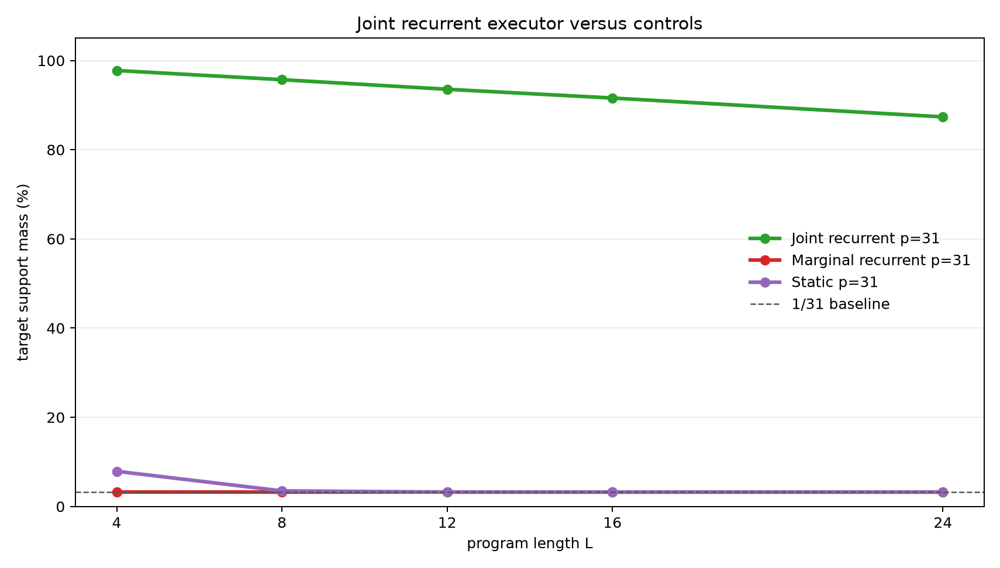

# A Joint-State Latent Executor for Correlated Register Beliefs

**A controlled experiment on recurrent hidden-state computation over uncertain two-register programs**

## Abstract

This experiment tests whether a latent recurrent runtime can execute programs over a correlated belief state. Each example starts with an unknown register pair constrained by `B=A+d (mod p)`, so the correct hidden state is not one pair but a line-shaped support over `(A,B)`. A program containing constant and cross-register operations transforms that support. The model must assign probability mass to the exact final support after `K` internal recurrent steps.

The primary joint-state executor stores a categorical distribution over all `(A,B)` pairs and applies one learned transition per hidden step. On modulo-31 programs trained only on lengths 1-8, it generalizes to held-out lengths 12, 16, and 24. Top-1-on-support accuracy is near baseline when `K<L`, then reaches 100% exactly when `K>=L`. Target-support mass at `K=L` is 97.8%, 95.7%, 93.6%, 91.6%, and 87.4% for lengths 4, 8, 12, 16, and 24. A marginal recurrent control stays at the 3.2% factorized baseline, and a static compiler control stays near baseline on longer lengths. The result supports the claim that joint latent state plus recurrent execution can solve correlated belief-state programs with clean test-time-compute scaling.

## Lay Summary

The model does not know the exact starting values of `A` and `B`. It only knows a relation:

```text
B = A + d (mod p)
```

That relation describes many possible starting pairs. The model then receives a hidden program such as:

```text
A = A + 7
B = B - A
A = A + B
...
```

The correct internal state is the whole set of possible `(A,B)` pairs after each step. The joint recurrent model learns to update that set one instruction at a time. If the program has 16 instructions, the model needs 16 internal steps. With fewer steps it stays near baseline; with enough steps it puts most probability on the exact final set.

## 1. Question

The experiment asks whether recurrent latent computation can maintain and update a correlated hidden belief state. The desired evidence has three parts:

1. Accuracy should depend on the internal step budget `K`.
2. The threshold should align with program length `L`: low when `K<L`, high when `K>=L`.
3. A model without joint state should fail because separate marginals cannot represent the correlation.

The task is deliberately controlled. The goal is not broad language reasoning; it is to test a specific mechanism under conditions where the required computation is exactly known.

## 2. Task

Programs operate over two registers modulo `p`.

Initial belief:

```text
{(A, B): B = A + d mod p}
```

For modulus 31, this support contains 31 possible pairs out of 961 total pairs.

Operations:

| Operation | Meaning |
|---|---|
| `A=A+c` | add a constant to A |
| `A=A-c` | subtract a constant from A |
| `B=B+c` | add a constant to B |
| `B=B-c` | subtract a constant from B |
| `A=A+B` | add B into A |
| `B=B+A` | add A into B |
| `A=A-B` | subtract B from A |
| `B=B-A` | subtract A from B |

Each example has:

- a random relation parameter `d`
- a random program of length `L`
- exact support targets after every prefix step
- exact final support target after the whole program

Training lengths were 1-8. Evaluation lengths were 4, 8, 12, 16, and 24. Lengths 12, 16, and 24 test recurrent length generalization.

## 3. Models

### Joint Recurrent Executor

The primary model stores a categorical distribution over all `(A,B)` pairs. Each recurrent step applies a learned transition selected by the current instruction:

- constant operations use the instruction constant as the selector
- `A` cross-register operations use the current `B` value as the selector
- `B` cross-register operations use the current `A` value as the selector

The transition table has `8 * p * p * p` learned logits. For `p=31`, this is 238,328 transition logits. The model is not handed the modular arithmetic table; it learns the transitions from dense support supervision.

### Marginal Recurrent Control

The marginal control uses the same recurrent schedule and transition parameterization, but it stores separate distributions over `A` and `B`. On the belief task, both marginals are uniform at initialization, so the relation `B=A+d` is lost.

### Static Compiler Control

The static model receives the relation parameter and program, then predicts the final support in one shot. It has no recurrent execution axis and cannot trade more internal steps for better answers.

## 4. Metrics

The target is a support set, not a single pair.

- `top1_on_support`: whether the highest-probability pair lies inside the exact final support.
- `target_mass`: total probability assigned to the exact final support.
- `target_nll`: mean negative log probability across support elements.

For modulus 31, a uniform factorized prediction assigns `1/31 = 3.2%` mass to the correct support. A perfect prediction assigns 100% mass and has target NLL `log(31) = 3.434`.

## 5. Main Result

The modulo-31 joint recurrent executor shows a clean K threshold. Top-1-on-support is 100% exactly once `K` reaches program length.



Target-support mass shows the same structure with a graded distribution-quality signal.



Line curves make the threshold visible by length.



Numerically:

| Program length | Best target mass before `K>=L` | First `K>=L` | Target mass at first `K>=L` | Top-1 at first `K>=L` |
|---:|---:|---:|---:|---:|
| 4 | 14.5% | 4 | 97.8% | 100.0% |
| 8 | 5.7% | 8 | 95.7% | 100.0% |
| 12 | 5.6% | 12 | 93.6% | 100.0% |
| 16 | 5.2% | 16 | 91.6% | 100.0% |
| 24 | 3.8% | 24 | 87.4% | 100.0% |

The held-out lengths 12, 16, and 24 are the key result. The model was trained only on lengths up to 8, but because it learned reusable transitions, it executes longer programs when given enough recurrent steps.

## 6. Controls

The scaled controls show that the result is not explained by marginal belief tracking or one-shot compilation.



At modulus 31:

| Model | L=4 | L=8 | L=12 | L=16 | L=24 |
|---|---:|---:|---:|---:|---:|
| Joint recurrent | 97.8% | 95.7% | 93.6% | 91.6% | 87.4% |
| Marginal recurrent | 3.2% | 3.2% | 3.2% | 3.2% | 3.2% |
| Static compiler | 7.9% | 3.5% | 3.2% | 3.2% | 3.2% |

The marginal control stays at the `1/31` baseline because it cannot represent the relation between `A` and `B`. The static control learns a small short-length signal but does not solve longer programs.

## 7. Interpretation

This experiment supports a narrow mechanistic claim:

> A latent recurrent runtime with joint state can execute correlated belief-state programs, and additional internal steps causally improve performance when those steps correspond to program execution.

The result is stronger than a smooth improvement curve. It has the expected executor signature:

```text
K < L: the runtime has not consumed the whole program -> near-baseline support mass
K >= L: the program has been executed -> high support mass
```

The marginal control is important because exact single-state programs do not force joint representation. Correlated belief states do: the separate marginals are uniform, while the joint support contains the useful information.

## 8. Limits

This is still a structured setting.

- The state is an explicit categorical distribution over `(A,B)`.
- The model receives dense support supervision.
- The runtime uses a direct program counter.
- The operations are modular affine updates.
- The largest completed run here uses modulus 31, not a much larger state space.

These are not flaws in the result; they define its scope. The experiment shows that the mechanism works when the representation is aligned with the task. It does not show that an unstructured hidden vector will discover the same representation unaided.

## 9. Next Iterations

The most useful next steps are:

1. Replace the explicit program counter with attention over instruction tokens and a learned halt/no-op.
2. Distill the joint categorical belief state into a dense hidden state.
3. Add observations or queries that require selecting one property of the belief state rather than supervising the full support.
4. Increase modulus and state size while tracking memory and runtime costs.
5. Test robustness under noisier supervision where the exact support is not given at every step.

## 10. Reproducibility

Primary files:

- Experiment script: `../src/joint_register_executor_experiment.py`
- Analysis script: `../src/analyze_joint_register_executor.py`
- Experiment log: `joint_register_executor_experiment_log.md`
- Results directory: `../runs/`
- Analysis directory: `../analysis/`

Key run directories:

- `../runs/main_belief_joint_mod31`
- `../runs/control_belief_marginal_mod31`
- `../runs/control_belief_static_mod31`
- `../runs/pilot_belief_joint_mod11`
- `../runs/control_belief_marginal_mod11`
- `../runs/control_belief_static_mod11`

Large checkpoint files are stored outside the experiment bundle under:

- `../../../large_artifacts/joint_register_executor/checkpoints/`

Environment:

- Python 3.12.3
- PyTorch 2.8.0+cu128
- GPU: NVIDIA RTX 6000 Ada Generation

## 11. Bottom Line

The joint-state executor learned to execute correlated belief-state programs. It generalized from training lengths 1-8 to evaluation lengths 12, 16, and 24, with a sharp threshold when internal recurrent steps reached program length. The marginal and static controls stayed near baseline on the scaled task. The core lesson is that recurrent latent execution can scale cleanly with test-time compute, but only when the hidden state can represent the variables and correlations the task actually requires.
