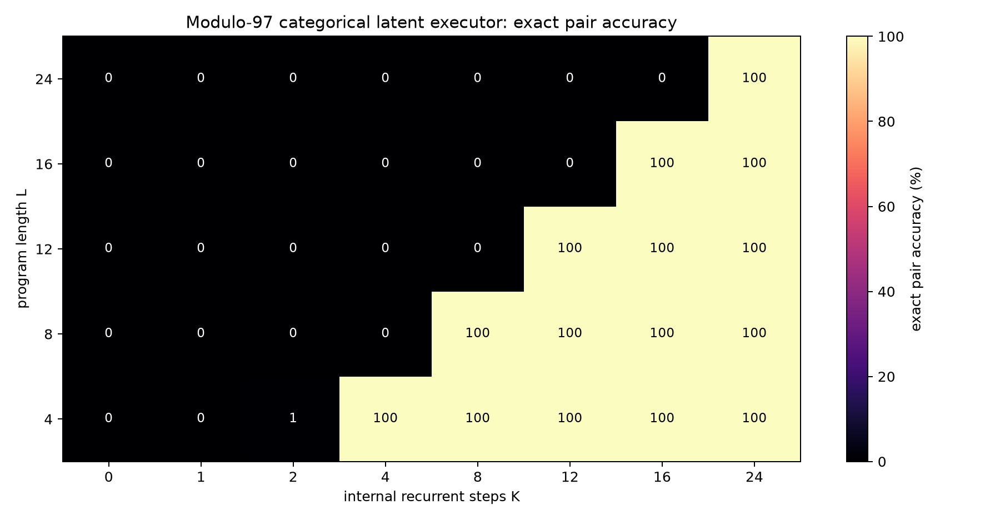
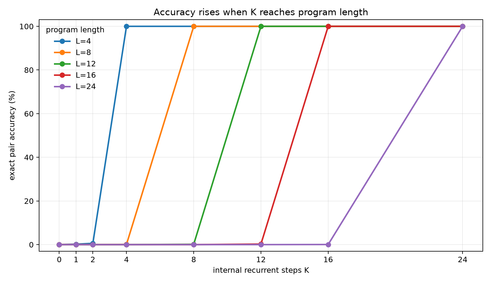
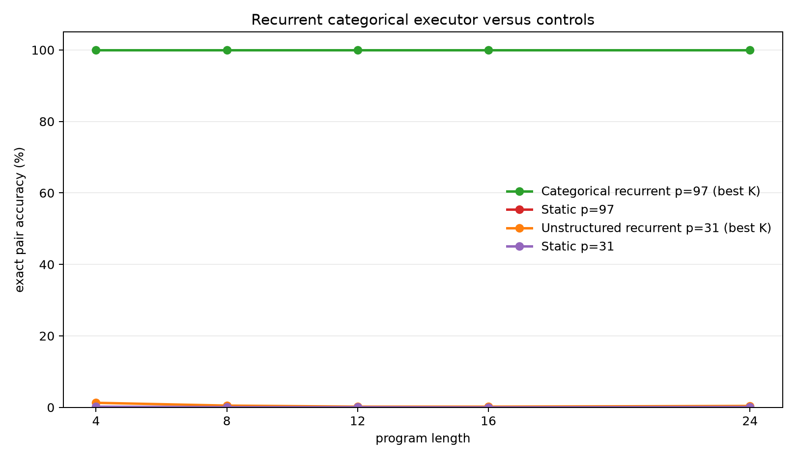

# A Latent Recurrent Executor That Scales With Internal Steps

**A controlled experiment on hidden-state program execution and test-time compute**

## Abstract

This experiment tests whether a neural runtime can use invisible recurrent computation to execute symbolic programs. The task is exact two-register modular arithmetic. Each example contains initial register values, a latent program, and trace targets after every program step. The successful model maintains a categorical latent workspace over register values and applies learned instruction-conditioned transition operators one hidden step at a time. With dense trace supervision, it learns to execute modulo-97 programs trained only on lengths 1-8 and generalizes perfectly to held-out lengths 12, 16, and 24. Exact final-pair accuracy stays near chance while `K < L`, then jumps to 100% once the internal recurrent step budget `K` reaches the program length `L`. Static and unstructured recurrent controls remain near chance. The result supports the narrow claim that latent recurrent execution can produce clean test-time-compute scaling when the state representation, supervision, and task structure are aligned.

## Lay Summary

The model receives a hidden program like:

```text
A = A + 17
B = B - 4
A = A + 22
...
```

It must update hidden register values one internal step at a time. If the program has 16 instructions, the model should need about 16 private steps. That is what happened. With too few private steps, it was wrong. Once it had enough internal steps to execute the whole program, it became perfectly correct, even for programs much longer than it saw during training.

This does not prove that an arbitrary language model will automatically benefit from the same mechanism. It proves a narrower point: latent recurrent execution can work in a controlled neural setting when the runtime has a usable state representation and receives direct pressure to learn each intermediate transition.

## 1. Question

The experiment asks whether hidden recurrent computation can behave like an internal executor rather than a decorative state update. A convincing positive result should have a specific shape:

```text
K < L: the runtime has not had enough internal steps to consume the whole program
K >= L: the runtime has enough steps to execute the program
```

For exact arithmetic, this should produce a threshold curve. Accuracy should be low before `K` reaches program length `L`, then high after `K` reaches `L`. The held-out length condition is central: if the model learns reusable transitions, it should execute programs longer than those used in training when given more internal steps at evaluation time.

## 2. Task

Programs operate on two registers, `A` and `B`, modulo `p`.

The successful runs used the constant-operation family:

| Operation | Meaning |
|---|---|
| `A=A+c` | add a constant to A |
| `A=A-c` | subtract a constant from A |
| `B=B+c` | add a constant to B |
| `B=B-c` | subtract a constant from B |

Each example has:

- random initial `A,B`
- a random program of length `L`
- exact trace targets after every prefix step
- exact final target `(A_L, B_L)`

Training lengths were 1-8. Evaluation lengths were 4, 8, 12, 16, and 24. Lengths 12, 16, and 24 therefore test recurrent length generalization.

## 3. Models

### Categorical Latent Executor

The successful model uses a structured latent workspace:

```text
state_t = distribution over A values + distribution over B values
```

At step `t`, the runtime reads latent instruction `t` and applies a learned transition matrix:

```text
P(A_{t+1}) = P(A_t) T_{op,arg}
```

or the same update for `B`, depending on the operation.

The transition matrices are learned. The model is not handed the modular-addition table. It discovers transition operators from trace supervision. The state remains internal; the model does not emit code, a DSL, or scratch text.

### Static Baseline

The static baseline embeds the whole program and initial registers, then predicts the final answer in one shot. It has no recurrent execution axis and therefore cannot trade more internal steps for better answers.

### Unstructured Recurrent Control

The unstructured recurrent control uses a generic hidden state with a dynamic low-rank operator bank and fast-weight memory. It tests whether recurrence alone is enough without the categorical register representation.

## 4. Training

The categorical executor was trained with dense trace loss:

```text
loss = average_t CE(A_t) + CE(B_t)
```

Every internal step receives a target. This makes the training signal much denser than final-answer supervision alone and directly pressures the recurrent state to represent the next program prefix.

Modulo-97 categorical run:

- modulus: 97
- train lengths: 1-8
- eval lengths: 4, 8, 12, 16, 24
- eval examples: 2,048 per length
- recurrent budgets: `K = 0,1,2,4,8,12,16,24`
- optimizer: AdamW
- training checkpoint used: step 250

## 5. Main Result

The result is a clean threshold curve: for program length `L`, accuracy is near zero until `K` reaches `L`, then jumps to 100%.



The same result as line curves:



Numerically:

| Program length | Best exact accuracy before `K >= L` | First exact accuracy at `K >= L` |
|---:|---:|---:|
| 4 | 0.6% | 100.0% |
| 8 | 0.1% | 100.0% |
| 12 | 0.1% | 100.0% |
| 16 | 0.2% | 100.0% |
| 24 | 0.0% | 100.0% |

The held-out lengths 12, 16, and 24 are the important cases. The model was trained only on lengths up to 8, but because it learned reusable recurrent transitions, it generalizes to longer programs as long as it is given enough internal steps.

## 6. Controls

The comparison below shows the categorical recurrent executor against three controls.



Control outcomes:

- Static modulo-97 baseline: 0.0-0.1% exact-pair accuracy across lengths.
- Static modulo-31 baseline: near chance.
- Unstructured recurrent modulo-31 control: failed to learn exact execution and stayed around 1-3%.

The static baseline result rules out a trivial "the program was easy to compile in one shot" explanation. The unstructured recurrent result shows that recurrence alone is not sufficient; the latent state representation and dense trace objective were decisive.

## 7. Interpretation

This experiment supports a specific mechanistic claim:

> A latent recurrent runtime can learn reusable internal state transitions such that increasing internal step budget `K` causally improves exact algorithmic performance.

The result is not just "more computation sometimes helps." It has the expected executor shape:

```text
K < L: cannot have consumed the whole latent program -> wrong
K >= L: program fully executed -> correct
```

That threshold is stronger evidence than a noisy monotonic trend because it ties the needed internal compute budget directly to the number of latent instructions.

## 8. Limits

This is not a full language-model reasoning result. The successful model is deliberately structured:

- It uses categorical latent register distributions.
- It uses a restricted constant-op program family.
- It receives dense trace supervision.
- The runtime has an explicit program counter.

Those choices are controls. They establish the mechanism under conditions where it should work. The next step is to relax them one at a time and measure which pieces are actually necessary.

## 9. Next Iterations

The next experiments should make the executor less structured while preserving the clean K-scaling signal:

1. **Add cross-register operations** by using a joint categorical state over `(A,B)` or a factored state with correlation memory.
2. **Replace direct instruction indexing with attention-based instruction selection** and a learned halting/no-op mechanism.
3. **Distill categorical execution into a dense hidden-state runtime** so the model no longer carries explicit value distributions.
4. **Embed the supervised runtime into a larger frozen model** only after the standalone executor remains stable.
5. **Use paired per-example K evaluation** in all aggregate tests.

## 10. Reproducibility

Primary files:

- Experiment script: `../src/latent_executor_experiment.py`
- Analysis script: `../src/analyze_latent_executor.py`
- Experiment log: `latent_executor_experiment_log.md`
- Results directory: `../runs/`
- Analysis directory: `../analysis/`

Key run directories:

- `../runs/pilot_categorical_mod31`
- `../runs/categorical_mod97`
- `../runs/static_mod31`
- `../runs/static_mod97`
- `../runs/pilot_executor_mod31`

Large checkpoint files are stored outside the experiment bundle under:

- `../../../large_artifacts/latent_executor/checkpoints/`

Environment:

- Python 3.12.3
- PyTorch 2.8.0+cu128
- GPU: NVIDIA RTX 6000 Ada Generation

## 11. Bottom Line

The controlled executor worked. The reason it worked is instructive: recurrent latent computation needs a state representation that can carry the relevant variables and a training signal that teaches each intermediate transition. Under those conditions, K-scaling is not a vague trend; it becomes a sharp causal threshold. The model is wrong before it has enough latent steps and perfect after it has enough latent steps, including on programs three times longer than the training horizon.

The next challenge is making the runtime less structured without losing the clean K-scaling signal.
