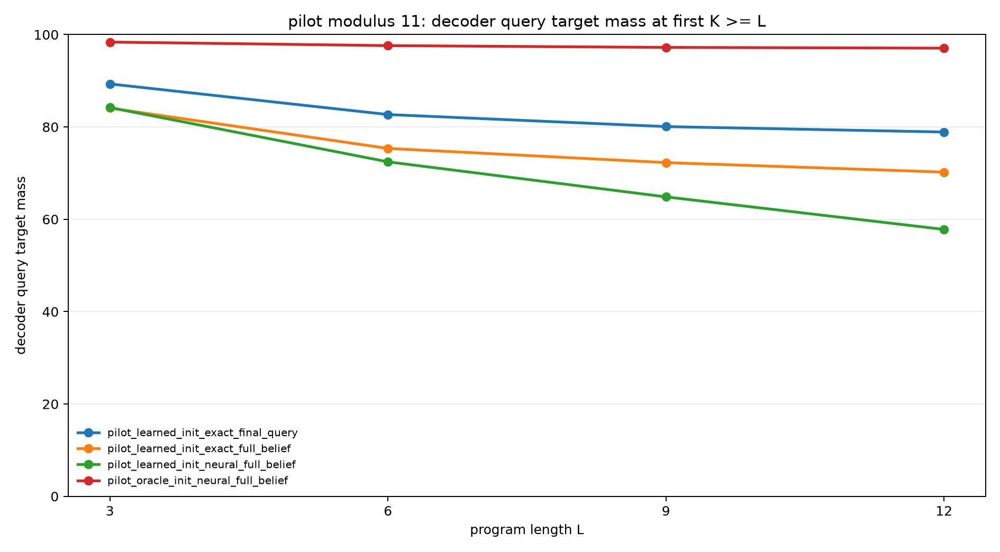
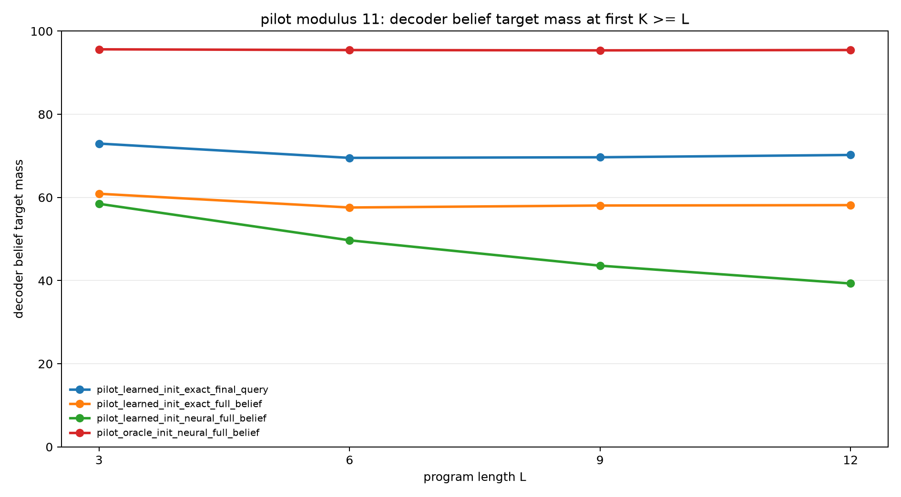
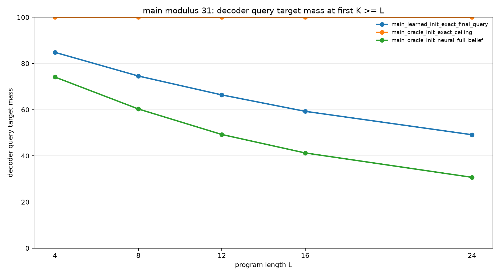
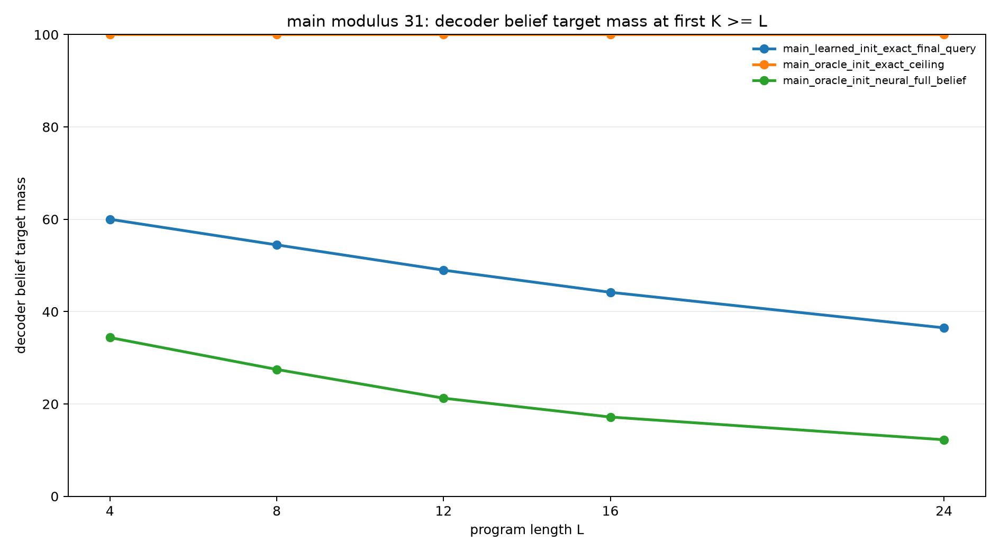
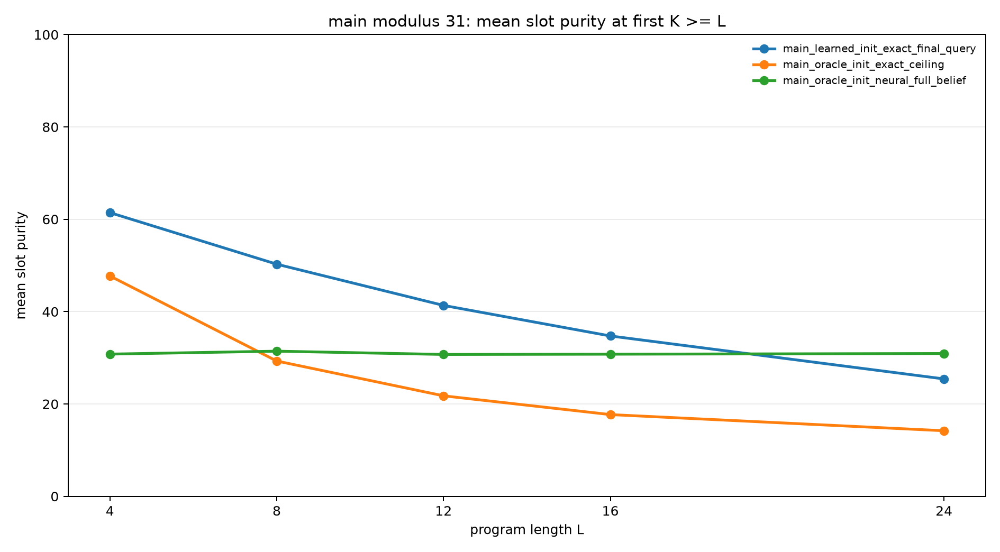

# Learning Sparse Slot Execution for Modular Belief Programs

## Abstract

This experiment tests whether a neural recurrent model can learn to use an
explicit sparse slot memory for modular belief-state execution. Each example
starts from a hidden relation over two registers, `B = A + d (mod p)`, then
applies arithmetic updates and observation filters. The model keeps `S` slots;
each slot represents a distribution over one candidate `A`, one candidate `B`,
and a slot weight. The decoded belief is the weighted mixture of slot-local
pair distributions.

The experiment separates two learnability questions: learning to initialize the
slot memory and learning to update slots recurrently. At modulus 11, a neural
transition module with oracle slot initialization learns strong recurrent
execution, reaching 97.1% query mass and 95.5% belief mass at held-out length
12. But this transition learner does not scale cleanly to modulus 31: at length
24 it reaches only 30.7% query mass and 12.3% belief mass. Learned
initialization with exact transitions scales better at modulus 31, reaching
49.1% query mass and 36.5% belief mass at length 24, but it also remains far
from the exact oracle ceiling.

## Task

Each example starts from:

```text
B = A + d (mod p), with A unknown
```

The initial belief has `p` possible `(A,B)` states. Programs contain arithmetic
updates and observation filters:

- `A=A+c`, `A=A-c`, `B=B+c`, `B=B-c`
- `A=A+B`, `B=B+A`, `A=A-B`, `B=B-A`
- `A % m = r`, `B % m = r`

Observation residues are sampled from the current support, so the target
belief is never empty. The final query asks for the distribution of `A`, `B`,
`A+B mod p`, or `A-B mod p`.

## Model

The model maintains `S` slots. Each slot has:

- logits over `A` values,
- logits over `B` values,
- a scalar slot-weight logit.

The decoded pair belief is:

```text
P(A,B) = sum_s softmax(w)_s * P_s(A) * P_s(B)
```

Two axes are varied:

| Axis | Choices | Meaning |
|---|---|---|
| Initialization | oracle, learned | Oracle slots store the initial support; learned slots are produced by an MLP from `d` and a slot id. |
| Transition | exact, neural | Exact transitions apply the known arithmetic/filter update; neural transitions use an MLP conditioned on slot state, op, and argument. |

Two supervision modes are used:

- `full_belief`: cross-entropy to the exact belief at every prefix.
- `final_query`: cross-entropy only to the final query distribution.

## Protocol

| Phase | Modulus | Main purpose | Evaluation lengths |
|---|---:|---|---|
| Smoke | 7 | Validate all staged paths. | 2, 3 |
| Pilot | 11 | Compare learnability of initialization, transition, and end-to-end composition. | 3, 6, 9, 12 |
| Main | 31 | Test scale behavior of the strongest staged conditions. | 4, 8, 12, 16, 24 |

For each length `L`, the headline rows report the first recurrent budget `K`
such that `K >= L`.

Metrics:

- `decoder_query_target_mass`: probability assigned to the exact final query
  support after projecting the decoded slot belief.
- `decoder_belief_target_mass`: probability assigned to the exact final
  `(A,B)` support.
- `mean_slot_purity`: average product of the largest `A` probability and
  largest `B` probability per slot.
- `mean_weight_entropy`: entropy of the slot-weight distribution.

## Smoke Results

All model paths compile, train, evaluate, and write checkpoints where
applicable. The exact oracle ceiling is perfect. The learned paths recover
substantial signal but remain below exact after short smoke budgets.

| Variant | Init | Transition | Supervision | L=2 query | L=2 belief | L=3 query | L=3 belief |
|---|---|---|---|---:|---:|---:|---:|
| Oracle exact ceiling | oracle | exact | full belief | 100.0% | 100.0% | 100.0% | 100.0% |
| Learned init, exact transition | learned | exact | full belief | 90.0% | 75.7% | 87.5% | 75.8% |
| Oracle init, neural transition | oracle | neural | full belief | 93.9% | 84.4% | 90.8% | 82.2% |
| Learned init, neural transition | learned | neural | full belief | 90.5% | 72.8% | 83.6% | 68.3% |
| Learned init, exact transition | learned | exact | final query | 91.2% | 77.3% | 88.0% | 76.8% |

## Pilot Results

At modulus 11, the staged transition-learning condition is strongly positive:
with oracle slot initialization, a neural transition reaches 95.5% belief mass
at held-out length 12.

| Variant | Init | Transition | Supervision | L=3 query | L=6 query | L=9 query | L=12 query | L=12 belief |
|---|---|---|---|---:|---:|---:|---:|---:|
| Learned init, exact transition | learned | exact | full belief | 84.1% | 75.3% | 72.3% | 70.2% | 58.1% |
| Oracle init, neural transition | oracle | neural | full belief | 98.4% | 97.6% | 97.2% | 97.1% | 95.5% |
| Learned init, neural transition | learned | neural | full belief | 84.2% | 72.4% | 64.9% | 57.8% | 39.3% |
| Learned init, exact transition | learned | exact | final query | 89.3% | 82.7% | 80.1% | 78.9% | 70.2% |

The end-to-end learned model is much weaker than either staged success. This
shows that the two subskills do not compose automatically under the current
parameterization and losses.





## Main Results

At modulus 31, the exact oracle path remains perfect, but the learned staged
conditions are no longer close to exact.

| Variant | Init | Transition | Supervision | L=4 query | L=8 query | L=12 query | L=16 query | L=24 query | L=24 belief |
|---|---|---|---|---:|---:|---:|---:|---:|---:|
| Oracle exact ceiling | oracle | exact | full belief | 100.0% | 100.0% | 100.0% | 100.0% | 100.0% | 100.0% |
| Oracle init, neural transition | oracle | neural | full belief | 74.1% | 60.3% | 49.2% | 41.2% | 30.7% | 12.3% |
| Learned init, exact transition | learned | exact | final query | 84.8% | 74.6% | 66.4% | 59.3% | 49.1% | 36.5% |

Strict belief mass:

| Variant | L=4 belief | L=8 belief | L=12 belief | L=16 belief | L=24 belief |
|---|---:|---:|---:|---:|---:|
| Oracle exact ceiling | 100.0% | 100.0% | 100.0% | 100.0% | 100.0% |
| Oracle init, neural transition | 34.4% | 27.5% | 21.3% | 17.2% | 12.3% |
| Learned init, exact transition | 60.0% | 54.5% | 49.0% | 44.2% | 36.5% |







## Interpretation

The experiment separates representational sufficiency from learnability. The
oracle exact ceiling proves that the slot representation can express the exact
belief state. The learned models show that this state format is not
automatically discovered at scale by generic MLP initializers and transitions.

The clearest positive result is local: at modulus 11, neural recurrent
transitions are learnable when the initial support is already placed into
slots. The learned transition generalizes from training lengths up to 6 to
held-out length 12 with 95.5% belief mass.

The main negative result is scale: the same transition parameterization fails
to learn clean modular updates at modulus 31. With oracle slots and full belief
traces, length-24 belief mass is only 12.3%.

The learned initializer is more robust at modulus 31 than the neural
transition. With exact transitions and final-query supervision, it reaches
36.5% belief mass at length 24. This is a useful approximate slot state, but
not the exact one-slot-per-support-element machine.

## Limitations

The neural transition is a generic MLP over expected slot embeddings. It has no
hard modular arithmetic inductive bias. Failure at modulus 31 should therefore
be read as a failure of this parameterization, not proof that learned slot
execution is impossible.

The slot decoder factorizes each slot as `P_s(A)P_s(B)`. This is appropriate
when slots become sharp, but it is a weak representation for diffuse slots.
The drop in slot purity at longer lengths is therefore directly relevant to the
belief-mass drop.

The main runs do not include a full-budget end-to-end modulus-31 model. The
pilot already showed that end-to-end learning is weaker than both staged
conditions, and the main staged transition itself failed to scale.

## Reproducibility

Run outputs are in:

```text
experiments/learned_sparse_slot_executor/runs/
```

Checkpoints are stored externally:

```text
large_artifacts/learned_sparse_slot_executor/checkpoints/
```

Regenerate analysis:

```bash
PYTHONDONTWRITEBYTECODE=1 python experiments/learned_sparse_slot_executor/src/analyze_learned_sparse_slot.py
```

Example main run:

```bash
PYTHONDONTWRITEBYTECODE=1 python experiments/learned_sparse_slot_executor/src/learned_sparse_slot_experiment.py \
  --variant_name main_learned_init_exact_final_query \
  --modulus 31 \
  --observe_mod 5 \
  --observe_prob 0.3 \
  --slot_capacity 31 \
  --init_mode learned \
  --transition_mode exact \
  --supervision final_query \
  --slot_dim 96 \
  --hidden_dim 192 \
  --train_min_len 1 \
  --train_max_len 8 \
  --train_steps 900 \
  --batch_size 512 \
  --eval_lengths 4,8,12,16,24 \
  --eval_k 0,1,2,4,8,12,16,24 \
  --output_dir experiments/learned_sparse_slot_executor/runs/main_learned_init_exact_final_query \
  --checkpoint_dir large_artifacts/learned_sparse_slot_executor/checkpoints/main_learned_init_exact_final_query
```
