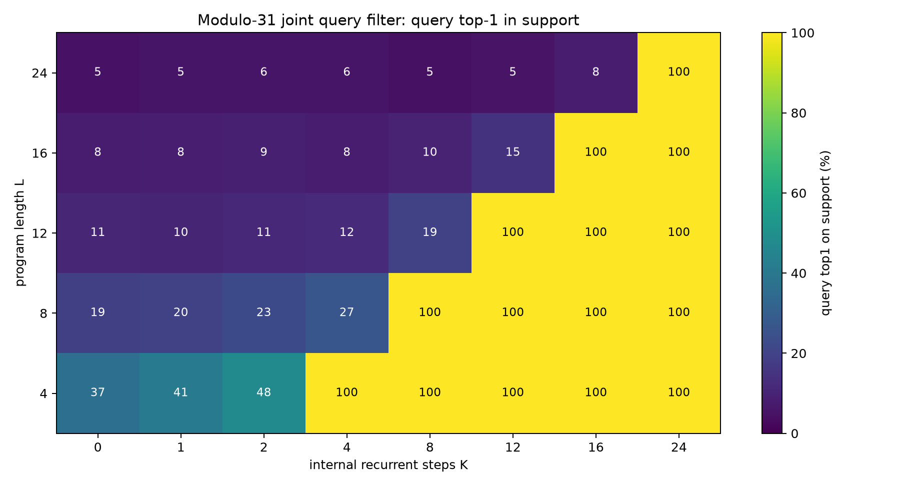
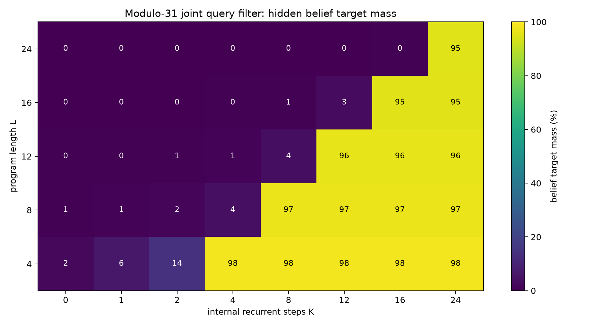
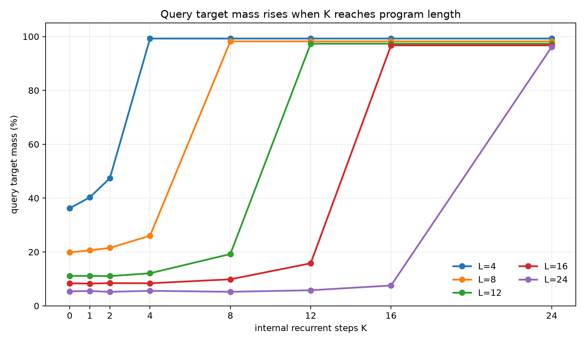
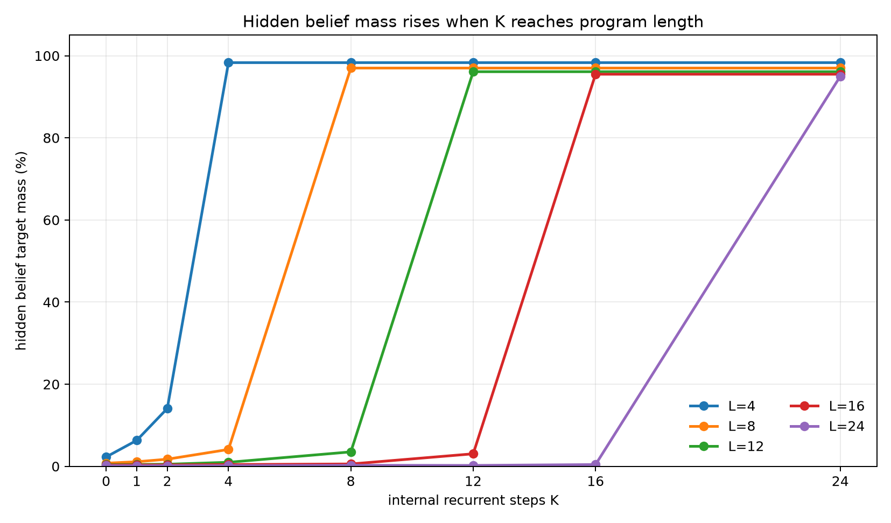
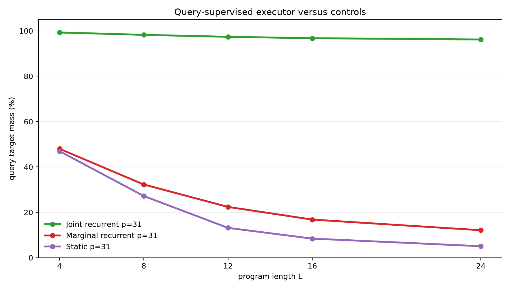
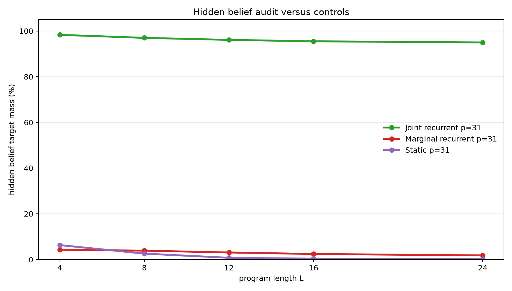

# Query-Supervised Latent Filtering for Correlated Modular Beliefs

**A controlled experiment on recurrent hidden-state execution from final-answer supervision**

## Abstract

This experiment tests whether a latent recurrent runtime can learn an internal belief-state executor when training supervision is limited to final query answers. Each example starts with an unknown pair of modular registers constrained by `B=A+d (mod p)`. A program applies arithmetic updates and observation filters. The model is trained only to answer a sampled final query: `A`, `B`, `A+B`, or `A-B`. The exact final belief distribution over `(A,B)` pairs is held out from the loss and used only as an audit.

The primary joint recurrent model stores a categorical distribution over register pairs and applies one learned update per internal step. On the scaled modulus-31 task, trained on program lengths 1-8 and evaluated on lengths 4, 8, 12, 16, and 24, it shows a sharp execution threshold. Averaged across query types, query target mass at the first `K>=L` step is 99.3%, 98.2%, 97.3%, 96.7%, and 96.2% for lengths 4, 8, 12, 16, and 24. Hidden belief target mass, despite not being directly supervised, is 98.3%, 97.0%, 96.1%, 95.5%, and 95.0%. Marginal recurrent and static one-shot controls remain far lower on held-out lengths.

## Lay Summary

The model starts with a relation, not exact values:

```text
B = A + d (mod p)
```

That relation describes many possible worlds. The program changes the registers and sometimes adds observations:

```text
A = A + 7
observe B % 5 = 3
B = B - A
query A + B
```

Training only tells the model the final answer distribution for the query. It does not tell the model the full set of possible `(A,B)` pairs. The question is whether the model learns the hidden set anyway because doing so is the reusable way to answer many queries. In the joint recurrent model, it does.

## 1. Question

The experiment asks whether final-answer supervision can induce a latent recurrent belief-state executor.

The desired evidence has four parts:

1. Query accuracy should depend on internal step budget `K`.
2. The threshold should align with program length `L`: weak when `K<L`, strong when `K>=L`.
3. Hidden belief mass should also rise, even though the full belief state is not directly supervised.
4. Controls without joint state or without recurrent execution should fail on held-out lengths.

The setting is deliberately controlled. The target is not broad natural-language reasoning; it is a mechanistic test of whether query supervision can train reusable latent execution.

## 2. Task

Programs operate over two registers modulo `p`.

Initial belief:

```text
{(A, B): B = A + d mod p}
```

For `p=31`, the full state space has 961 register pairs. The initial support contains 31 pairs.

Operations:

| Operation | Meaning |
|---|---|
| `A=A+c` | add a constant to `A` |
| `A=A-c` | subtract a constant from `A` |
| `B=B+c` | add a constant to `B` |
| `B=B-c` | subtract a constant from `B` |
| `A=A+B` | add `B` into `A` |
| `B=B+A` | add `A` into `B` |
| `A=A-B` | subtract `B` from `A` |
| `B=B-A` | subtract `A` from `B` |
| `OBS_A_BUCKET` | filter to states where `A % m = r` |
| `OBS_B_BUCKET` | filter to states where `B % m = r` |

Observation residues are sampled from the live support, so every target support is non-empty. For the scaled run, `p=31`, observation modulus is 5, and each instruction is an observation with probability 0.3.

Each example samples one final query:

| Query | Target |
|---|---|
| `A` | final distribution of `A` |
| `B` | final distribution of `B` |
| `A_PLUS_B` | final distribution of `A+B mod p` |
| `A_MINUS_B` | final distribution of `A-B mod p` |

Training used lengths 1-8. Evaluation used lengths 4, 8, 12, 16, and 24. Lengths 12, 16, and 24 test length generalization.

## 3. Models

### Joint Recurrent Query Filter

The primary model stores a categorical distribution over all `(A,B)` pairs. Each recurrent step reads the next instruction and applies the corresponding learned update. The final pair distribution is projected into the sampled query distribution, and the loss is cross-entropy on that query distribution only.

The full belief distribution is never used as a training target. It is measured afterward to see whether the model learned a coherent hidden state.

### Marginal Recurrent Control

The marginal control follows the same recurrent schedule but stores separate distributions over `A` and `B`. It can learn some marginal query signal, but it cannot exactly represent pairwise correlations.

### Static Compiler Control

The static control receives the initial relation and whole program, then predicts a final pair distribution in one pass with a small Transformer encoder. It has no recurrent execution axis.

## 4. Metrics

The primary metrics evaluate the sampled final query:

- `query_target_mass`: total probability assigned to the exact query support.
- `query_top1_on_support`: whether the most likely queried value is inside the exact query support.
- `query_target_nll`: cross-entropy against the exact query distribution.

The audit metrics evaluate the full hidden belief state:

- `belief_target_mass`: total pair probability assigned to the exact final `(A,B)` support.
- `belief_top1_on_support`: whether the most likely pair is inside the exact support.
- `belief_target_nll`: cross-entropy against the exact final pair distribution.

The hidden-belief metrics are not training objectives.

## 5. Main Result

The scaled modulus-31 joint recurrent query filter shows a clean execution threshold. Query mass is low when `K<L`, then jumps when `K` reaches program length.




The hidden belief audit shows the same threshold, even though the full belief state was not directly supervised.



The K curves show the threshold by length.





Numerically, averaged across query types:

| Program length | Best query mass when `K<L` | Best hidden belief mass when `K<L` | First `K>=L` | Query mass at first `K>=L` | Hidden belief mass at first `K>=L` | Query top-1 |
|---:|---:|---:|---:|---:|---:|---:|
| 4 | 47.4% | 14.1% | 4 | 99.3% | 98.3% | 100.0% |
| 8 | 26.0% | 4.1% | 8 | 98.2% | 97.0% | 100.0% |
| 12 | 19.2% | 3.5% | 12 | 97.3% | 96.1% | 100.0% |
| 16 | 15.8% | 3.1% | 16 | 96.7% | 95.5% | 100.0% |
| 24 | 7.6% | 0.4% | 24 | 96.2% | 95.0% | 100.0% |

The held-out lengths are the critical evidence. The model was trained only on lengths up to 8, but it executes lengths 12, 16, and 24 when given enough recurrent steps.

## 6. Query Types

All four query types work at the execution threshold. At length 24:

| Query | Query mass at `K=24` | Hidden belief mass at `K=24` |
|---|---:|---:|
| `A` | 96.5% | 94.9% |
| `A_MINUS_B` | 95.8% | 95.1% |
| `A_PLUS_B` | 95.7% | 94.9% |
| `B` | 96.6% | 94.9% |

Relational queries are important because they are harder to answer from independent marginals. The joint model solves them along with the direct `A` and `B` queries.

## 7. Controls

The scaled controls show that the result is not explained by shallow query fitting or one-shot compilation.





At modulus 31, averaged across query types:

| Model | L=4 query | L=8 query | L=12 query | L=16 query | L=24 query |
|---|---:|---:|---:|---:|---:|
| Joint recurrent | 99.3% | 98.2% | 97.3% | 96.7% | 96.2% |
| Marginal recurrent | 48.0% | 32.3% | 22.4% | 16.8% | 12.1% |
| Static compiler | 46.9% | 27.2% | 13.1% | 8.4% | 5.1% |

Hidden belief target mass separates the models even more sharply:

| Model | L=4 belief | L=8 belief | L=12 belief | L=16 belief | L=24 belief |
|---|---:|---:|---:|---:|---:|
| Joint recurrent | 98.3% | 97.0% | 96.1% | 95.5% | 95.0% |
| Marginal recurrent | 4.2% | 3.9% | 3.1% | 2.4% | 1.8% |
| Static compiler | 6.3% | 2.6% | 0.7% | 0.3% | 0.2% |

The marginal control has recurrence but lacks joint state. The static compiler sees the whole program but lacks recurrent execution. Neither recovers the executor signature.

## 8. Modulus-11 Diagnostic

A smaller modulus-11 diagnostic used the same query-supervised task with training lengths 1-6 and evaluation lengths 3, 6, 9, and 12. The joint recurrent model reached 98.5-99.7% query mass and 98.0-99.2% hidden belief mass at `K=L`. The marginal and static controls stayed far lower, especially on held-out lengths. This diagnostic confirmed the training objective before the scaled run.

## 9. Interpretation

The result supports a specific mechanism claim:

> Final query supervision can train a latent recurrent runtime to form and execute a coherent joint belief state when that state is the reusable structure needed to answer varied queries.

The strongest evidence is not just high final accuracy. It is the combination of:

1. a sharp `K=L` threshold,
2. length generalization beyond the training range,
3. high hidden-belief mass without direct belief supervision,
4. failure of marginal and static controls.

This is a stronger test than training directly on full belief states. The hidden state is useful enough that the model discovers it under a lower-bandwidth objective.

## 10. Limits

This is still a structured setting.

- The joint model stores an explicit categorical distribution over `(A,B)`.
- The runtime uses a direct program counter.
- The operation family is modular arithmetic plus bucket observations.
- The largest completed state space has 961 pairs.
- Query supervision is exact; it is not noisy natural-language feedback.

The experiment shows that query-only supervision can induce the intended latent state when the architecture can represent it. It does not show that an unstructured hidden vector would discover the same state without architectural support.

## 11. Next Iterations

Useful next tests:

1. Replace the explicit categorical state with a dense latent state and probe how much belief structure remains.
2. Replace the direct program counter with attention over instruction tokens.
3. Add a learned halt/no-op policy so the model chooses its compute budget.
4. Train on sparse scalar rewards or sampled query values instead of exact query distributions.
5. Increase modulus and state size while tracking memory and runtime scaling.

## 12. Reproducibility

Primary files:

- Experiment script: `../src/query_filter_executor_experiment.py`
- Analysis script: `../src/analyze_query_filter_executor.py`
- Experiment log: `query_filter_executor_experiment_log.md`
- Results directory: `../runs/`
- Analysis directory: `../analysis/`
- Checkpoint manifest: `../checkpoint_manifest.csv`

Key run directories:

- `../runs/main_joint_mod31`
- `../runs/control_marginal_mod31`
- `../runs/control_static_mod31`
- `../runs/pilot_joint_mod11`
- `../runs/control_marginal_mod11`
- `../runs/control_static_mod11`

Large checkpoint files are stored outside the experiment bundle under:

```text
../../../large_artifacts/query_filter_executor/checkpoints/
```

Environment:

- Python 3.12.3
- PyTorch 2.8.0+cu128
- GPU: NVIDIA RTX 6000 Ada Generation

## 13. Bottom Line

The joint recurrent query filter learned to execute arithmetic and observation-filter programs from final-query supervision alone. It generalized from training lengths 1-8 to lengths 12, 16, and 24, with a sharp improvement when `K` reached `L`. The hidden belief state became accurate even though it was not directly supervised. The marginal and static controls failed on the scaled task.
