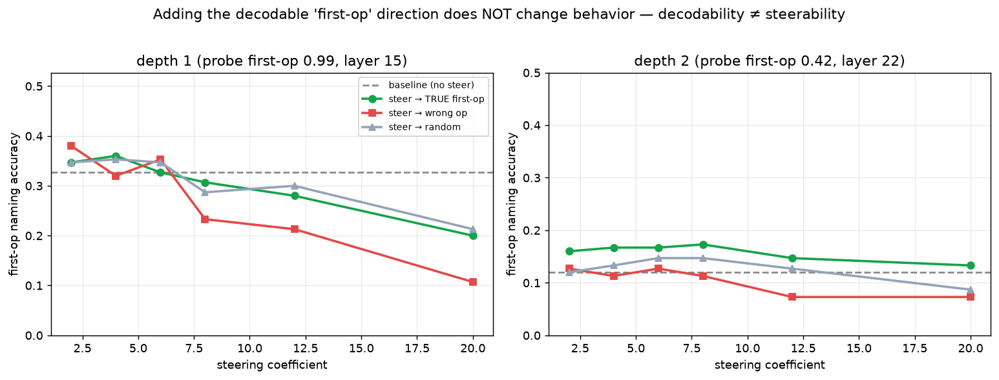

# Is the latent first-op causally usable? Activation steering says no.

## Summary

C19 found the composition's first operation is linearly DECODABLE from the residual stream far above the
model's behavioral access (depth-1 probe 0.99 vs naming 0.44), but flagged that "decodable ≠ usable for
generation." This is the decisive follow-up: add the decoded "correct first-op" direction back to the residual
stream during generation (training-free ActAdd steering) — does the model then USE it? **No. Decodability ≠
steerability.** The pre-registered usability threshold is not met at any coefficient, layer, or depth.

- **Depth 1 (the cleanest direction, probe 0.99):** steering toward the true first-op never exceeds the
  no-steer baseline (0.33); at higher coefficients all conditions (true / wrong / random) *decline together*
  as fluency degrades. No usable effect where the signal is near-perfectly present.
- **Depth 2:** a faint, predicted-direction whiff — `steer_true` (0.16–0.17) sits ~+0.05 above baseline (0.12)
  and above `steer_wrong` (0.07–0.13) across coefs 2–8 — but the gap over the `steer_random` control
  (0.12–0.15) is ~0.02–0.03, within noise at n=150, and far below the pre-registered +0.10 bar.
- **Robustness:** the null holds at earlier steering layers (8, 12) as well as the probe-best layer (22), and
  the identification arm is flat (0.03 → 0.03).

**Verdict: INERT.** The latent first-op signal is *readable* but adding it back does not make the model act on
it — at least not via the standard mean-difference method.

## Research Program Fit

Direct causal follow-up to C19 (the wall's representation). Tests whether the mission's "cleverer access"
dream — steer out latent capability without training — works. It does not, which sharpens which levers can
actually move deployable capability.

## Method

Reuse C19's cached activations to build ActAdd directions; test on FRESH held-out tasks with a forward hook.

- **Directions:** per first-op class c, `d_c = mean(acts[first_op==c, L]) − mean(acts[all, L])` at the C19
  probe-best layer L (depth-1 L15, depth-2 L22), from C19's cached activations.
- **Steering:** a forward hook on `model.model.layers[L−1]` adds `coef · d_c` to the residual at all positions,
  every generation step. Per-example vector = the task's own true/wrong/random direction.
- **Tasks:** fresh verified `list` tasks (depth 2 primary, depth 1 sanity), n=150, disjoint from C19.
- **Readout — first-op naming:** the prompt is forced to answer directly (`First:` suffix, no-think, greedy) —
  a fast, clean readout (baseline parse ≈ 1.0). Conditions × coef ∈ {2,4,6,8,12,20}.
- **Conditions:** `baseline` (no steer), `steer_true`, `steer_wrong` (a random wrong op), `steer_random`
  (Gaussian vector scaled to ‖d_true‖).
- **Secondary — identification pass@1** (no-think, greedy): baseline vs `steer_true` at the best coef.

## Results

| depth | baseline | best steer_true (coef) | steer_wrong | steer_random | max(true − baseline) |
|---|---|---|---|---|---|
| 1 | 0.33 | 0.36 (4) | 0.32–0.38 | 0.35 | **+0.03** |
| 2 | 0.12 | 0.17 (8) | 0.07–0.13 | 0.12–0.15 | **+0.05** |

Identification (depth 2, coef 8, no-think): baseline 0.027 → steer_true 0.027. Earlier layers (depth 2, coef 8):
layer 8 true 0.15 / wrong 0.13 / random 0.13; layer 12 true 0.15 / wrong 0.17 / random 0.13 — no effect.

## Pre-registered verdicts

- **P1 (causal usability, steer_true ≥ baseline + 0.10):** REFUTED — max gain +0.05 (depth 2), +0.03 (depth 1).
- **P2 (specificity):** PARTIAL/weak — depth-2 `steer_wrong` does dip below baseline (directionally correct),
  but `steer_random` ≈ baseline and the `steer_true`−`steer_random` gap is within noise; no clean specific effect.
- **P3 (depth-1 sanity, ≥ +0.15):** REFUTED — steering the cleanest (0.99-decodable) direction moves naming by
  ≤ +0.03 and only degrades at higher strength.
- **P4 (identification lift):** REFUTED — 0.027 → 0.027.

All predictions refuted ⇒ **INERT**, with at most a marginal, non-significant directional whiff at depth 2.

## Interpretation

- **Decodability ≠ steerability.** A linear probe reads the first op off the residual stream (C19), but adding
  that same direction back does not route it into behavior. The representation-expression gap C19 found is not
  bridged by simple linear intervention — the "unexpressed" information is not trivially *writable* into the
  output pathway.
- **Strengthens the arc's throughline from a new angle.** Test-time interventions keep failing to move the
  wall: sampling+selection is free but adds no coverage (C17); activation steering can't elicit the latent
  signal (C20). The only things that move deployable capability remain **weight edits (banking, C18)** and
  **externalization (tools, C12)** — installing the capability, not reading it out.
- **Refines the C19 "latent" reading honestly.** C19's latent signal is real but *inert* under this
  intervention: present-and-readable ≠ present-and-usable. The mission's "steer it out for free" hope does not
  pan out with the standard method.

## Honesty notes / limits

- **This is a negative for ONE steering method** (mean-difference / ActAdd, single layer, all positions). More
  sophisticated steering — optimized/causal directions, multi-layer, activation *patching* rather than
  addition, or larger interventions with fluency repair — is not ruled out. The claim is that the *simplest,
  most-cited* method fails cleanly, including on the near-perfectly-decodable depth-1 direction.
- `steer_true` is an ORACLE (uses the known answer) — an upper bound on steering usefulness. Even the oracle
  fails, so deployable self-steering (toward the probe's prediction) is not worth pursuing here.
- The identification arm is underpowered (no-think baseline floored at ~0.03); naming is the primary readout.

## Next Experiments

- **Activation patching** (replace rather than add the class-c subspace) or **optimized steering vectors**
  (gradient-tuned to change the output, not the probe) — does a stronger intervention move it? A single
  negative for ActAdd doesn't fully close the door.
- **Probe the C18 banked model:** the complementary test — does banking *raise the first-op probe* (install
  the representation)? If yes, banking works by adding what steering can't inject.

## Artifact Manifest

See `reports/artifact_manifest.yaml`. Key: `scripts/steer.py`, `scripts/analyze.py`, `runs/steer_results.json`,
`analysis/steering.png`, `reports/prereg.md`. Steering directions are built from C19's cached activations
(`scratchpad/probe_artifacts/acts.npy`, external) + `qwen35_4b_latent_composition_probe/data/labels.json`.
