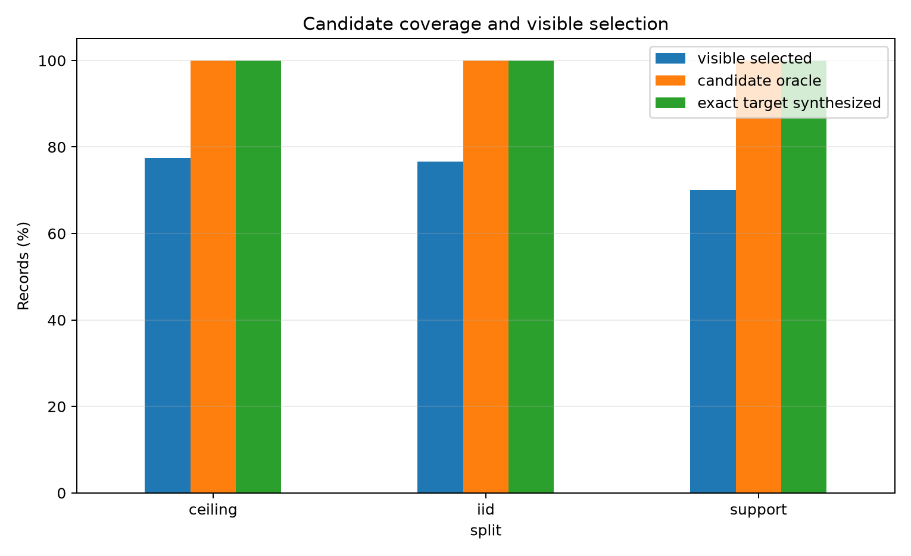
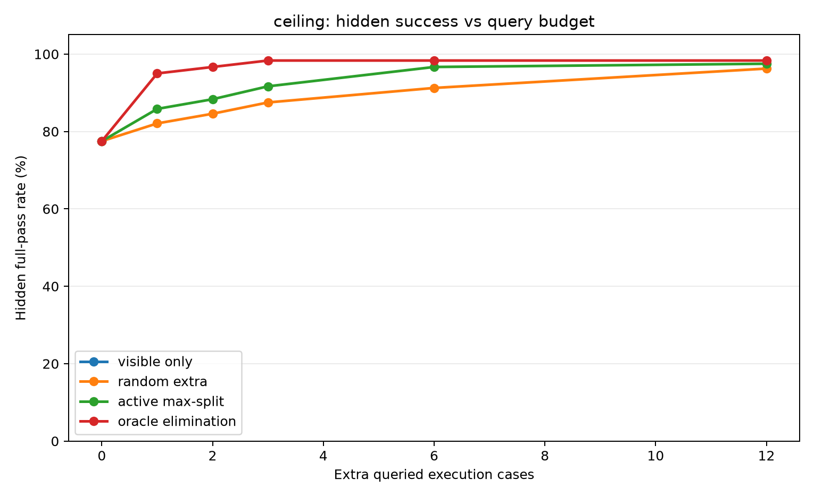
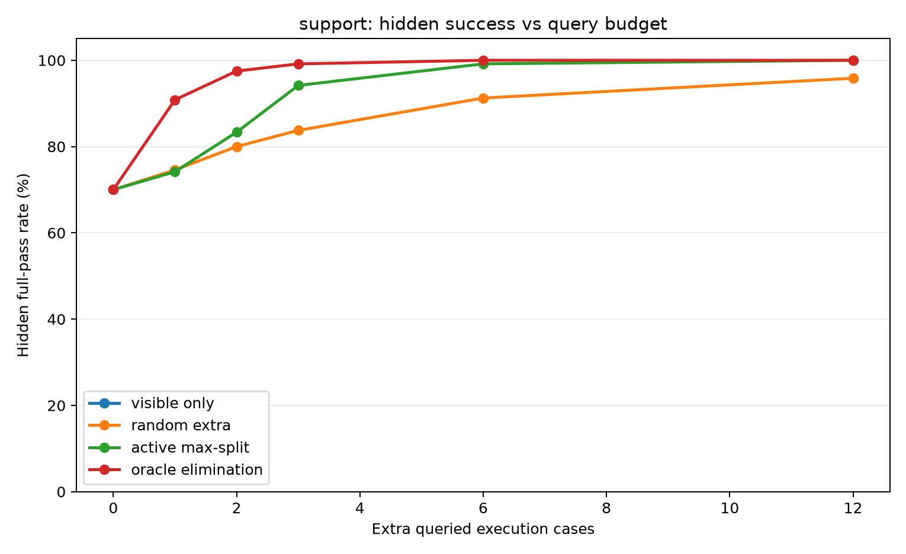
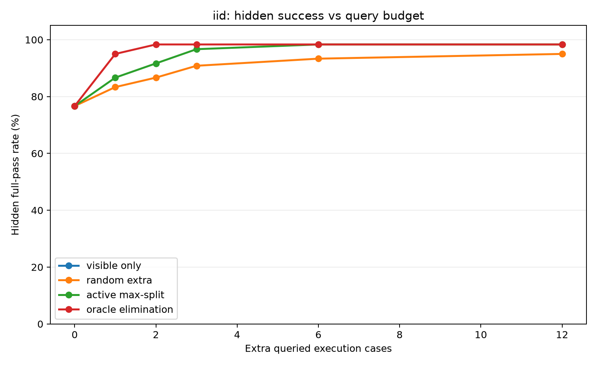
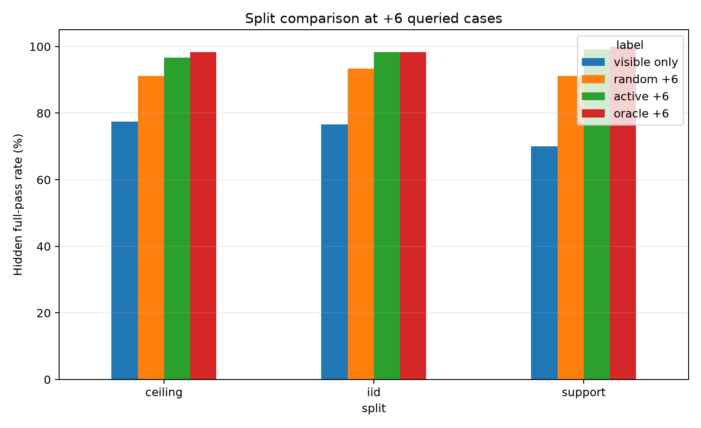
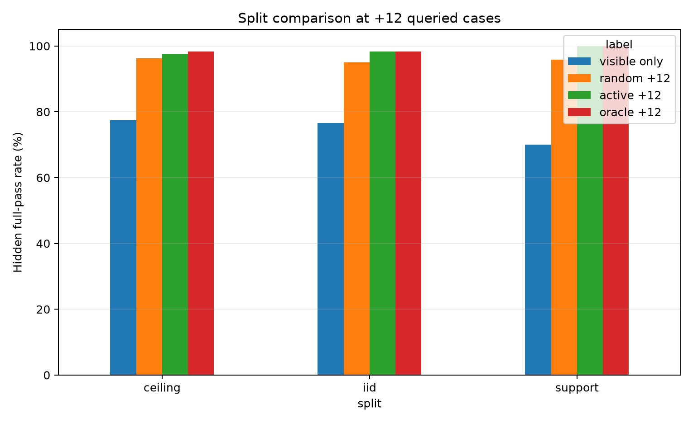
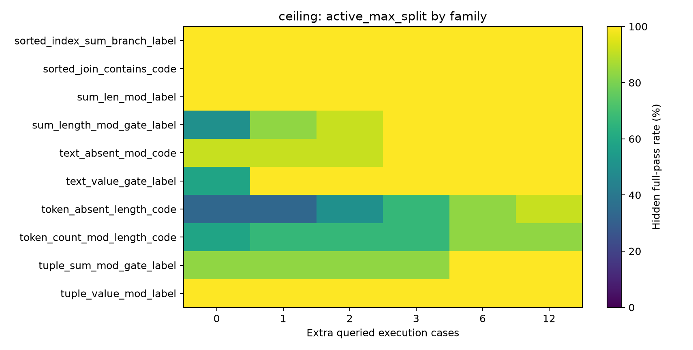

# Qwen3.5-4B Active Counterexample Trace Selection Report

## Summary

This standalone experiment tests whether a Qwen3.5-4B typed-sketch generator benefits from actively requested execution traces after candidate synthesis. The verifier first completes model-generated typed sketches into executable programs. Selection policies then choose whether to commit from the original visible trace or query additional cases from a held-out per-record pool.

Best active ceiling result: `0.975` hidden full-pass rate at `+12` queried cases.

## Key Findings

- Candidate coverage was not the bottleneck in this run: the exact target program was synthesized on every evaluated record across ceiling, support, and IID splits.
- Visible-only selection left substantial hidden failures despite passing all observed cases: `77.5%` ceiling, `70.0%` support, and `76.7%` IID hidden full-pass.
- Active max-split counterexample selection closed most of that gap: ceiling reached `96.7%` at `+6` and `97.5%` at `+12`; support reached `99.2%` at `+6` and `100%` at `+12`; IID reached `98.3%` at `+6`.
- Active max-split consistently beat random extra cases at the same query budget, especially at low and medium budgets.
- The remaining ceiling gap is a policy-selection gap, not a synthesis-coverage gap: candidate oracle was `100%`, while oracle-elimination under the same capped query pool reached `98.3%`.

## Method

Each record provided six visible execution cases, eighteen hidden evaluation cases, and a deterministic active-query pool. Qwen3.5-4B generated typed sketches; the local verifier completed each sketch into executable DSL candidates; selection policies then chose programs after `0`, `1`, `2`, `3`, `6`, or `12` additional queried execution cases.

Policy definitions:

- `visible_prior`: commit using only the original visible cases.
- `random_extra`: query random additional cases, averaged over two repeats.
- `active_max_split`: greedily query the case that maximizes output-bucket entropy among currently viable candidates.
- `oracle_elimination`: upper-bound policy that greedily chooses the case that eliminates the most currently viable wrong candidates using the case's true expected output.

## Candidate Coverage

| split   |   records |   visible_selected_hidden_all_pct |   candidate_oracle_hidden_all_pct |   target_program_synthesized_pct |   avg_synthesized_programs |   avg_visible_consistent_candidates |
|:--------|----------:|----------------------------------:|----------------------------------:|---------------------------------:|---------------------------:|------------------------------------:|
| ceiling |       120 |                            77.5   |                               100 |                              100 |                    3235.56 |                             643.6   |
| iid     |        60 |                            76.667 |                               100 |                              100 |                    1108.07 |                              59.883 |
| support |       120 |                            70     |                               100 |                              100 |                    3320.9  |                             251.325 |

## Policy Results

| split   | policy             |   budget |   rows |   hidden_all_pct |   observed_all_pct |   avg_hidden_passes |   avg_queries_used |
|:--------|:-------------------|---------:|-------:|-----------------:|-------------------:|--------------------:|-------------------:|
| ceiling | active_max_split   |        0 |    120 |           77.5   |                100 |              17.2   |                  0 |
| ceiling | active_max_split   |        1 |    120 |           85.833 |                100 |              17.483 |                  1 |
| ceiling | active_max_split   |        2 |    120 |           88.333 |                100 |              17.625 |                  2 |
| ceiling | active_max_split   |        3 |    120 |           91.667 |                100 |              17.733 |                  3 |
| ceiling | active_max_split   |        6 |    120 |           96.667 |                100 |              17.908 |                  6 |
| ceiling | active_max_split   |       12 |    120 |           97.5   |                100 |              17.942 |                 12 |
| ceiling | oracle_elimination |        0 |    120 |           77.5   |                100 |              17.2   |                  0 |
| ceiling | oracle_elimination |        1 |    120 |           95     |                100 |              17.9   |                  1 |
| ceiling | oracle_elimination |        2 |    120 |           96.667 |                100 |              17.958 |                  2 |
| ceiling | oracle_elimination |        3 |    120 |           98.333 |                100 |              17.975 |                  3 |
| ceiling | oracle_elimination |        6 |    120 |           98.333 |                100 |              17.975 |                  6 |
| ceiling | oracle_elimination |       12 |    120 |           98.333 |                100 |              17.975 |                 12 |
| ceiling | random_extra       |        0 |    240 |           77.5   |                100 |              17.2   |                  0 |
| ceiling | random_extra       |        1 |    240 |           82.083 |                100 |              17.442 |                  1 |
| ceiling | random_extra       |        2 |    240 |           84.583 |                100 |              17.579 |                  2 |
| ceiling | random_extra       |        3 |    240 |           87.5   |                100 |              17.717 |                  3 |
| ceiling | random_extra       |        6 |    240 |           91.25  |                100 |              17.808 |                  6 |
| ceiling | random_extra       |       12 |    240 |           96.25  |                100 |              17.933 |                 12 |
| ceiling | visible_prior      |        0 |    120 |           77.5   |                100 |              17.2   |                  0 |
| iid     | active_max_split   |        0 |     60 |           76.667 |                100 |              17.1   |                  0 |
| iid     | active_max_split   |        1 |     60 |           86.667 |                100 |              17.483 |                  1 |
| iid     | active_max_split   |        2 |     60 |           91.667 |                100 |              17.783 |                  2 |
| iid     | active_max_split   |        3 |     60 |           96.667 |                100 |              17.917 |                  3 |
| iid     | active_max_split   |        6 |     60 |           98.333 |                100 |              17.983 |                  6 |
| iid     | active_max_split   |       12 |     60 |           98.333 |                100 |              17.983 |                 12 |
| iid     | oracle_elimination |        0 |     60 |           76.667 |                100 |              17.1   |                  0 |
| iid     | oracle_elimination |        1 |     60 |           95     |                100 |              17.75  |                  1 |
| iid     | oracle_elimination |        2 |     60 |           98.333 |                100 |              17.983 |                  2 |
| iid     | oracle_elimination |        3 |     60 |           98.333 |                100 |              17.983 |                  3 |
| iid     | oracle_elimination |        6 |     60 |           98.333 |                100 |              17.983 |                  6 |
| iid     | oracle_elimination |       12 |     60 |           98.333 |                100 |              17.983 |                 12 |
| iid     | random_extra       |        0 |    120 |           76.667 |                100 |              17.1   |                  0 |
| iid     | random_extra       |        1 |    120 |           83.333 |                100 |              17.508 |                  1 |
| iid     | random_extra       |        2 |    120 |           86.667 |                100 |              17.642 |                  2 |
| iid     | random_extra       |        3 |    120 |           90.833 |                100 |              17.792 |                  3 |
| iid     | random_extra       |        6 |    120 |           93.333 |                100 |              17.883 |                  6 |
| iid     | random_extra       |       12 |    120 |           95     |                100 |              17.925 |                 12 |
| iid     | visible_prior      |        0 |     60 |           76.667 |                100 |              17.1   |                  0 |
| support | active_max_split   |        0 |    120 |           70     |                100 |              16.708 |                  0 |
| support | active_max_split   |        1 |    120 |           74.167 |                100 |              16.892 |                  1 |
| support | active_max_split   |        2 |    120 |           83.333 |                100 |              17.317 |                  2 |
| support | active_max_split   |        3 |    120 |           94.167 |                100 |              17.783 |                  3 |
| support | active_max_split   |        6 |    120 |           99.167 |                100 |              17.958 |                  6 |
| support | active_max_split   |       12 |    120 |          100     |                100 |              18     |                 12 |
| support | oracle_elimination |        0 |    120 |           70     |                100 |              16.708 |                  0 |
| support | oracle_elimination |        1 |    120 |           90.833 |                100 |              17.667 |                  1 |
| support | oracle_elimination |        2 |    120 |           97.5   |                100 |              17.925 |                  2 |
| support | oracle_elimination |        3 |    120 |           99.167 |                100 |              17.967 |                  3 |
| support | oracle_elimination |        6 |    120 |          100     |                100 |              18     |                  6 |
| support | oracle_elimination |       12 |    120 |          100     |                100 |              18     |                 12 |
| support | random_extra       |        0 |    240 |           70     |                100 |              16.708 |                  0 |
| support | random_extra       |        1 |    240 |           74.583 |                100 |              16.95  |                  1 |
| support | random_extra       |        2 |    240 |           80     |                100 |              17.179 |                  2 |
| support | random_extra       |        3 |    240 |           83.75  |                100 |              17.35  |                  3 |
| support | random_extra       |        6 |    240 |           91.25  |                100 |              17.696 |                  6 |
| support | random_extra       |       12 |    240 |           95.833 |                100 |              17.896 |                 12 |
| support | visible_prior      |        0 |    120 |           70     |                100 |              16.708 |                  0 |

## Interpretation

The primary question is whether extra traces close the gap between visible-trace selection and the candidate oracle. A large active improvement with a remaining oracle gap means the policy is useful but still leaves selection work. A small active improvement with a large oracle gap means the split heuristic is not finding the right discriminators. A small oracle gap means candidate synthesis is the current limiting factor.

## Reproducibility

- Dataset manifest: `data/dataset_manifest.json`
- Config: `configs/experiment.json`
- Eval JSON files: `reports/eval/active_iid.json`, `reports/eval/active_support.json`, `reports/eval/active_ceiling.json`
- Policy summary CSV: `reports/policy_summary.csv`
- Candidate summary CSV: `reports/candidate_summary.csv`
- Large artifacts: `/workspace/large_artifacts/qwen35_4b_active_counterexample_trace_selection`
