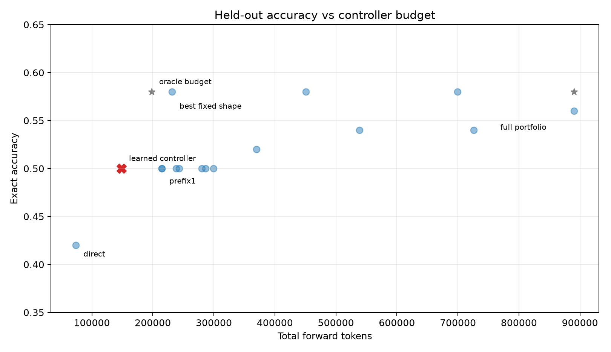
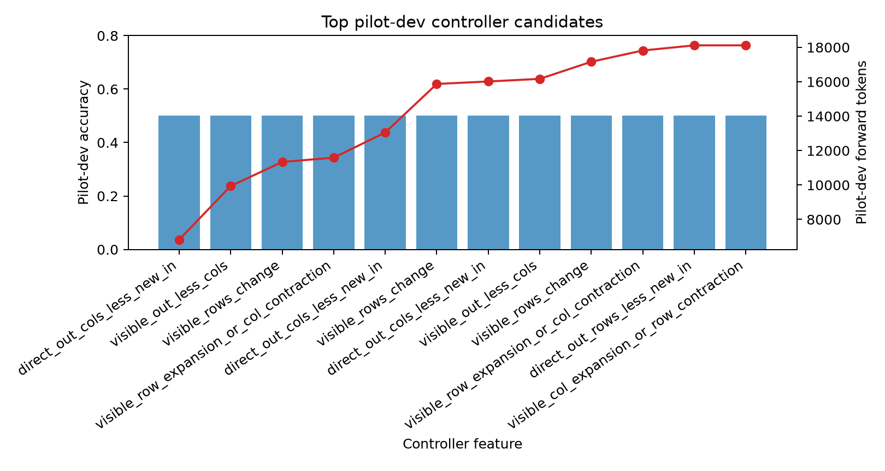
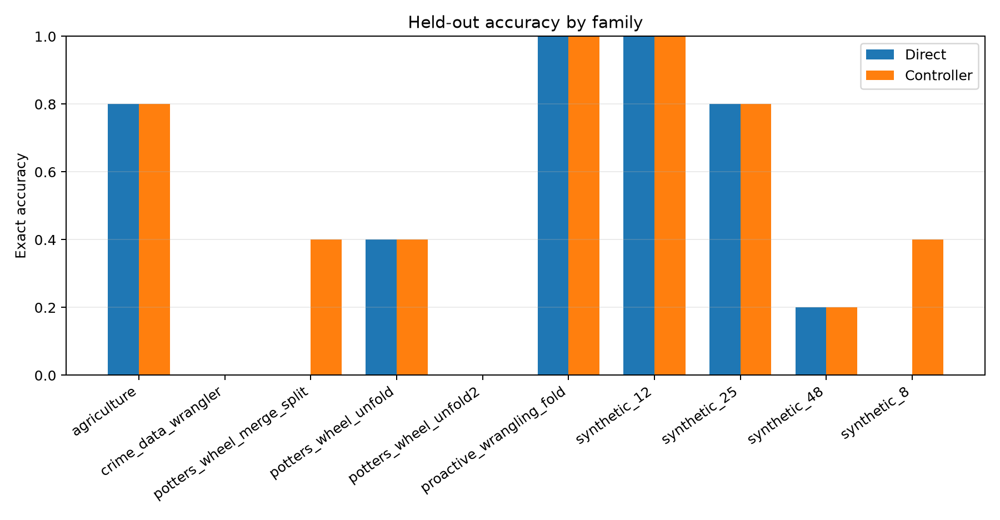
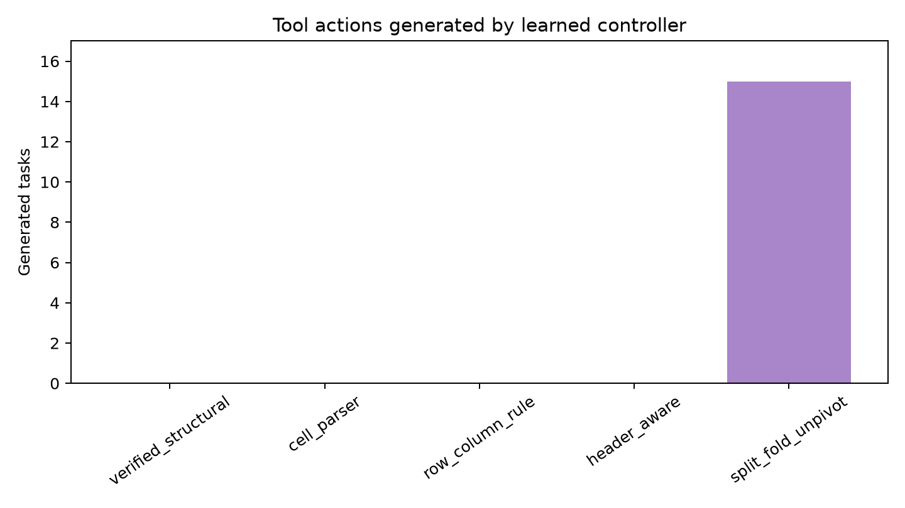

# Adaptive Tool Controller

## Summary

This experiment trains a small offline controller to choose between direct answering and external executable-program tool actions. The controller is selected on pilot train/dev records and frozen before held-out test scoring.

Selected controller:

- Feature: `direct_out_cols_less_new_in`
- If true: `single_split_fold_unpivot`
- If false: `direct_only`
- Candidates passing train gate: `4468`

## Held-Out Test Result

| Policy | Exact | Accuracy | Tokens | Avg tokens/task | Program commits | Recoveries | Losses | Commit precision |
|---|---:|---:|---:|---:|---:|---:|---:|---:|
| `direct_only` | 21/50 | 42.0% | 73,911 | 1478 | 0 | 0 | 0 | n/a |
| `learned_controller` | 25/50 | 50.0% | 148,451 | 2969 | 4 | 4 | 0 | 100.0% |
| `fixed_visible_out_less_cols_full_else_direct` | 29/50 | 58.0% | 231,365 | 4627 | 8 | 8 | 0 | 100.0% |
| `prefix5_first_visible` | 28/50 | 56.0% | 890,030 | 17801 | 23 | 8 | 1 | 78.3% |
| `oracle_budget_full_only_when_helpful` | 29/50 | 58.0% | 197,951 | 3959 | 8 | 8 | 0 | 100.0% |
| `oracle_best_available_full_budget` | 29/50 | 58.0% | 890,030 | 17801 | 8 | 8 | 0 | 100.0% |

The learned controller improves over direct answering and becomes a low-cost Pareto point. It does not reach the strongest fixed shape rule included as a diagnostic; the learned policy buys the first four recoveries cheaply, while the fixed shape rule buys the remaining four recoveries with additional tool budget.

## Pilot Selection

| Rank | Feature | True action | False action | Train exact | Dev exact | Dev tokens | Dev losses |
|---:|---|---|---|---:|---:|---:|---:|
| 1 | `direct_out_cols_less_new_in` | `single_split_fold_unpivot` | `direct_only` | 9/30 | 5/10 | 6,821 | 0 |
| 2 | `visible_out_less_cols` | `single_split_fold_unpivot` | `direct_only` | 9/30 | 5/10 | 9,939 | 0 |
| 3 | `visible_rows_change` | `direct_only` | `single_row_column_rule` | 9/30 | 5/10 | 11,339 | 0 |
| 4 | `visible_row_expansion_or_col_contraction` | `single_split_fold_unpivot` | `direct_only` | 9/30 | 5/10 | 11,588 | 0 |
| 5 | `direct_out_cols_less_new_in` | `canary_split_fold_unpivot_disagree_escalate` | `direct_only` | 9/30 | 5/10 | 13,050 | 0 |
| 6 | `visible_rows_change` | `direct_only` | `canary_split_fold_unpivot_disagree_escalate` | 9/30 | 5/10 | 15,872 | 0 |
| 7 | `direct_out_cols_less_new_in` | `canary_row_column_rule_disagree_escalate` | `direct_only` | 9/30 | 5/10 | 16,016 | 0 |
| 8 | `visible_out_less_cols` | `canary_split_fold_unpivot_disagree_escalate` | `direct_only` | 9/30 | 5/10 | 16,168 | 0 |
| 9 | `visible_rows_change` | `direct_only` | `canary_row_column_rule_disagree_escalate` | 9/30 | 5/10 | 17,162 | 0 |
| 10 | `visible_row_expansion_or_col_contraction` | `canary_split_fold_unpivot_disagree_escalate` | `direct_only` | 9/30 | 5/10 | 17,817 | 0 |
| 11 | `direct_out_rows_less_new_in` | `direct_only` | `canary_split_fold_unpivot_disagree_escalate` | 9/30 | 5/10 | 18,114 | 0 |
| 12 | `visible_col_expansion_or_row_contraction` | `direct_only` | `canary_split_fold_unpivot_disagree_escalate` | 9/30 | 5/10 | 18,114 | 0 |

## Family Breakdown

| Family | n | Direct | Controller | Recoveries | Losses | Program commits | Tokens |
|---|---:|---:|---:|---:|---:|---:|---:|
| `agriculture` | 5 | 4/5 | 4/5 | 0 | 0 | 0 | 5,453 |
| `crime_data_wrangler` | 5 | 0/5 | 0/5 | 0 | 0 | 5 | 66,089 |
| `potters_wheel_merge_split` | 5 | 0/5 | 2/5 | 2 | 0 | 4 | 5,696 |
| `potters_wheel_unfold` | 5 | 2/5 | 2/5 | 0 | 0 | 1 | 3,987 |
| `potters_wheel_unfold2` | 5 | 0/5 | 0/5 | 0 | 0 | 0 | 1,409 |
| `proactive_wrangling_fold` | 5 | 5/5 | 5/5 | 0 | 0 | 0 | 1,708 |
| `synthetic_12` | 5 | 5/5 | 5/5 | 0 | 0 | 0 | 11,102 |
| `synthetic_25` | 5 | 4/5 | 4/5 | 0 | 0 | 0 | 9,942 |
| `synthetic_48` | 5 | 1/5 | 1/5 | 0 | 0 | 0 | 2,242 |
| `synthetic_8` | 5 | 0/5 | 2/5 | 2 | 0 | 5 | 40,823 |

## Pareto Frontier

- `direct_only`: 21/50 (42.0%), 73,911 tokens
- `learned_controller`: 25/50 (50.0%), 148,451 tokens
- `fixed_visible_out_less_cols_full_else_direct`: 29/50 (58.0%), 231,365 tokens

## Figures

## Interpretation

The controller confirms that external program tools are valuable only on a narrow structural subset. A one-feature policy selected from pilot data recovers a useful low-cost slice without paying full portfolio cost on every task. The stronger fixed shape diagnostic shows that the remaining recoveries require broader portfolio calls, not just a cheaper single-tool action.

This is an orchestration result, not a generation-capability result. The controller changes how budget is allocated over already-generated tool candidates; it does not create new candidates outside the recorded pool.

## Limitations

- Offline evaluation over a fixed candidate pool; no fresh model generations are produced in this package.
- The pilot split is small, so feature selection is unstable. The fixed shape-rule diagnostic should be validated across more held-out family splits.
- The depth-1 controller is intentionally simple. A richer sequential controller should be trained only after this signal replicates under regenerated candidates.
