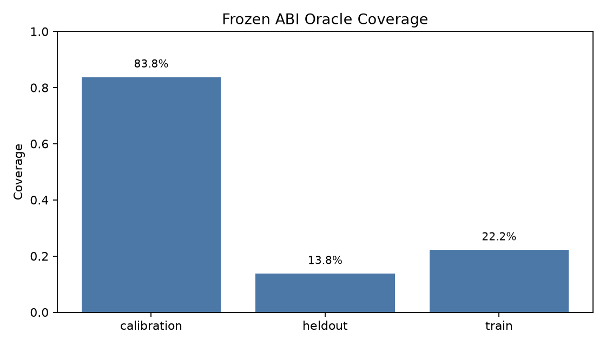
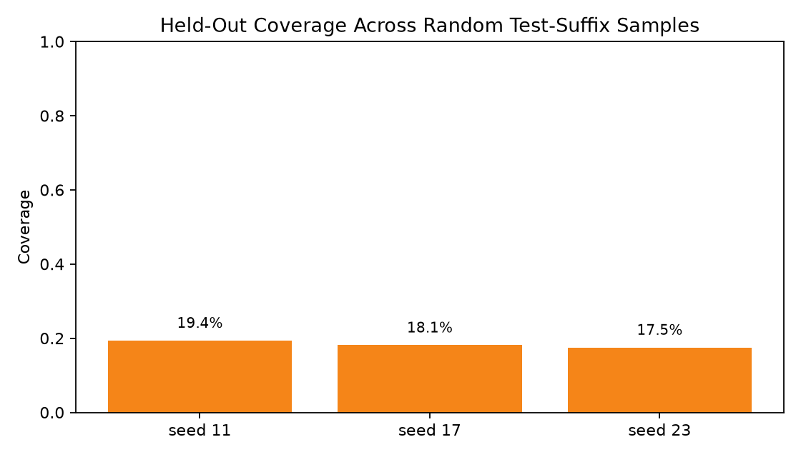
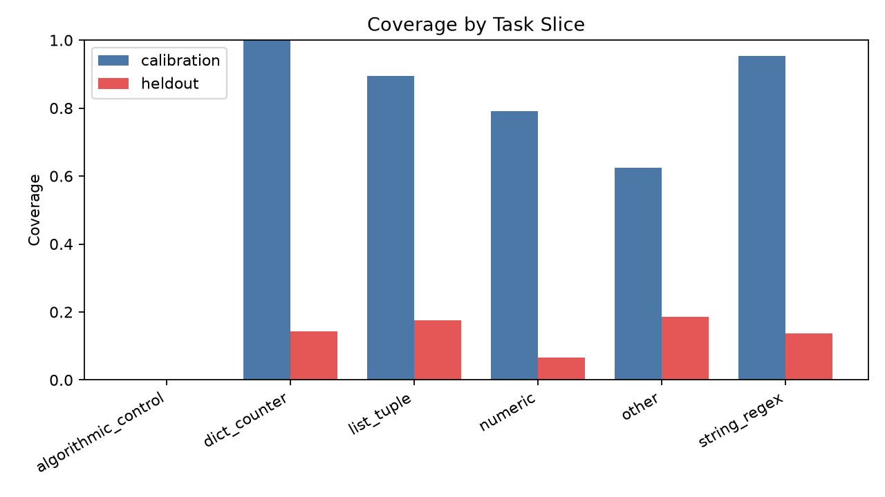
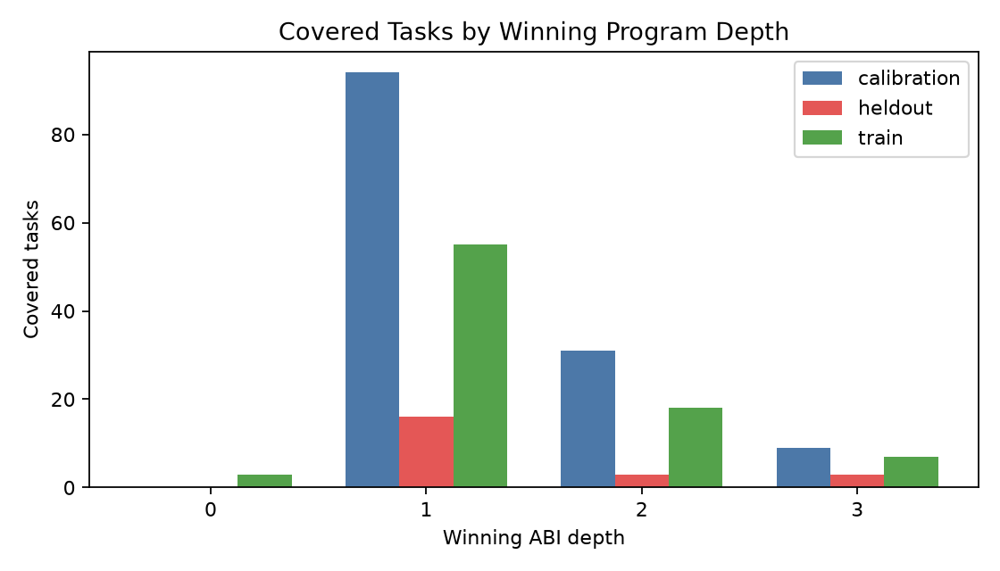

# Frozen Code ABI Held-Out Primitive Pilot

## Purpose

This standalone experiment tests whether a frozen code-primitive ABI remains reusable on held-out MBPP tasks before training a Qwen3.5-4B compiler to emit ABI programs.

The package uses a fixed ABI implementation and does not add kernels after seeing the held-out tasks. The first gate is oracle coverage: if the ABI cannot express held-out tasks, compiler training would not test reusable compilation.

## Gate 1 Result

Gate 1 failed. Frozen-ABI oracle coverage dropped from 134/160 (83.8%) on the calibration slice to 22/160 (13.8%) on the held-out slice, a drop of 70.0%.

The train split also has low coverage: 83/374 (22.2%), leaving only 66 compiler-training targets after the deterministic validation split. That is not enough to make a QLoRA compiler result meaningful.

| split | n | oracle-covered | oracle coverage | first-visible correct | visible-any tasks | task false-pass rate | candidate hidden-wrong rate |
|---|---:|---:|---:|---:|---:|---:|---:|
| calibration | 160 | 134 | 83.8% | 95 | 147 | 8.8% | 79.2% |
| heldout | 160 | 22 | 13.8% | 8 | 73 | 69.9% | 94.7% |
| train | 374 | 83 | 22.2% | 45 | 195 | 57.4% | 88.0% |

## Split-Sweep Check

To check whether the fixed held-out slice was unlucky, the experiment sampled three random 160-task subsets from the test suffix excluded from the calibration slice. Coverage remained low: mean 18.3%, range 17.5%-19.4%.

| seed | n | oracle-covered | oracle coverage | first-visible correct | task false-pass rate |
|---:|---:|---:|---:|---:|---:|
| 11 | 160 | 31 | 19.4% | 15 | 55.1% |
| 17 | 160 | 29 | 18.1% | 15 | 61.3% |
| 23 | 160 | 28 | 17.5% | 13 | 61.6% |

## Slice Diagnostics

| slice | calibration coverage | heldout coverage |
|---|---:|---:|
| algorithmic_control | 0/0 (0.0%) | 0/1 (0.0%) |
| dict_counter | 9/9 (100.0%) | 1/7 (14.3%) |
| list_tuple | 51/57 (89.5%) | 9/51 (17.6%) |
| numeric | 38/48 (79.2%) | 3/45 (6.7%) |
| other | 15/24 (62.5%) | 5/27 (18.5%) |
| string_regex | 21/22 (95.5%) | 4/29 (13.8%) |

## Depth Diagnostics

Covered held-out tasks are mostly depth-1 programs: {'1': 16, '2': 3, '3': 3}. There are too few held-out depth-2/3 targets to support a composition-training claim.

## Decision

The compiler-training arm was intentionally not run. The precondition for interpreting it did not hold: the frozen ABI was not broadly reusable on held-out tasks. Training Qwen to emit this ABI would mostly measure a small, contaminated target set rather than reusable code compilation.

The next productive step is library curation under a strict protocol: define primitives from a source independent of the evaluation tasks, freeze them, then repeat this held-out coverage gate. Adding kernels after inspecting held-out misses would invalidate the purpose of the gate.

## Files

- `src/abi_oracle.py`: frozen ABI oracle implementation.
- `scripts/build_targets.py`: calibration, held-out, and train target builder.
- `scripts/gate1_split_sweep.py`: random held-out split sweep.
- `reports/gate1_summary.json`: primary Gate 1 results.
- `reports/gate1_split_sweep.json`: multi-split confirmation.
- `reports/figures/`: generated charts.
