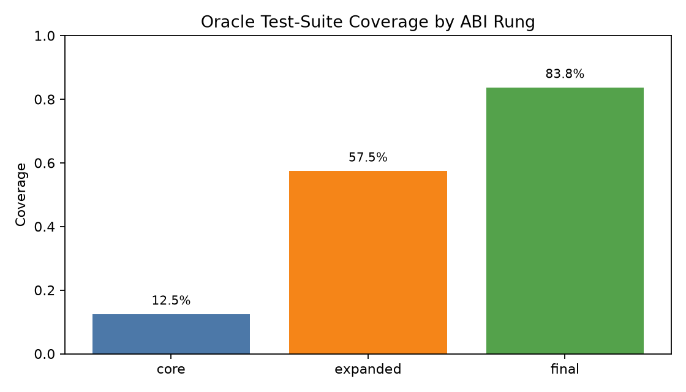
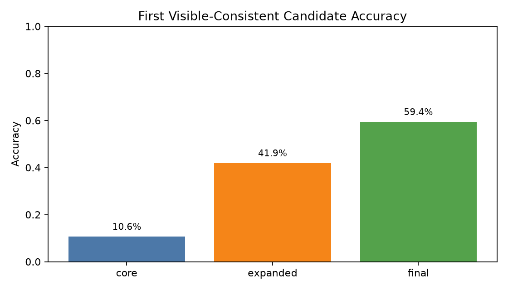
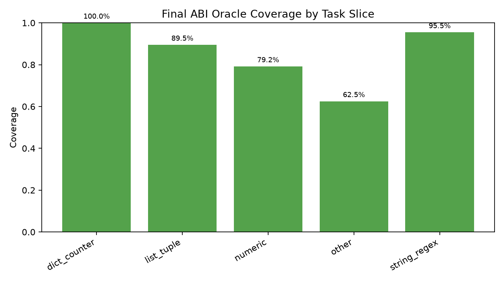
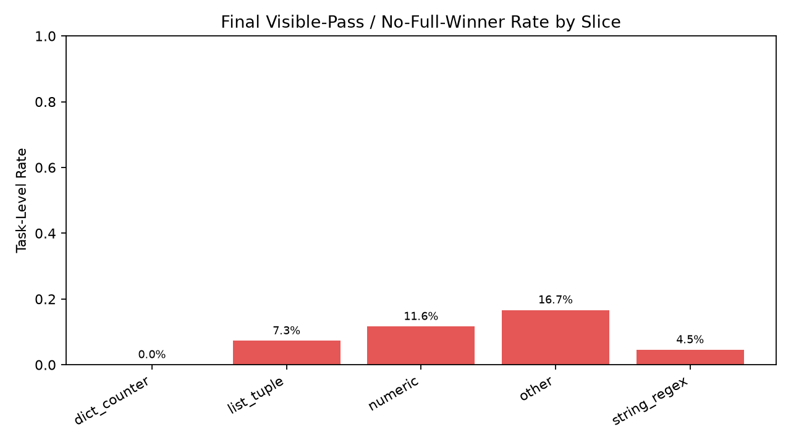
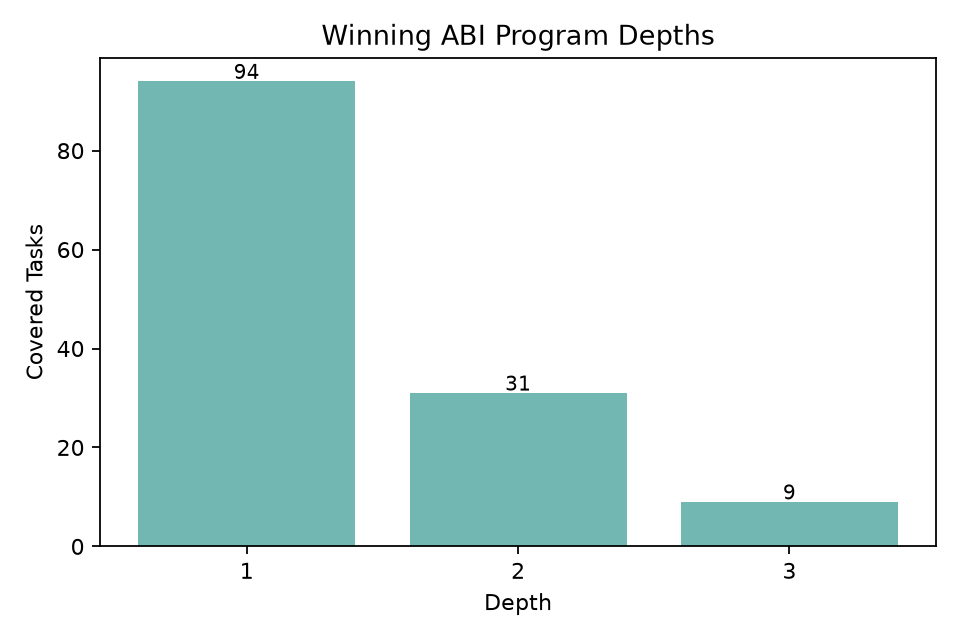

# Code ABI Oracle Coverage Ladder

## Purpose

This standalone no-training experiment asks whether a finite verified code-primitive ABI can express a meaningful slice of MBPP-style Python tasks before spending any compute on a compiler model.

The run uses the first 160 records from the MBPP test split. Each task gets one visible test for visible-consistency accounting, while oracle coverage is measured against every available test in the task record. The experiment does not train Qwen, does not save checkpoints, and does not use reference source code as a template.

## ABI Rungs

- `core`: small generic string/list/dict/numeric kernels.
- `expanded`: broad reusable kernels for row-sum sorting, counters, simple geometry, bit operations, list transforms, and regex/string transforms.
- `final`: expanded plus reusable algorithmic utility kernels such as sequence recurrences, tuple/list conversions, range sums, run-length encoding, divisor/bit counts, and small dynamic reducers.

## Headline Results

| rung | oracle coverage | first visible candidate correct | visible-any tasks | task-level false-visible-pass | candidate-level hidden-wrong among visible | mean candidates/task |
|---|---:|---:|---:|---:|---:|---:|
| core | 20/160 (12.5%) | 17/160 (10.6%) | 48 | 28 (58.3%) | 110 (81.5%) | 66.9 |
| expanded | 92/160 (57.5%) | 67/160 (41.9%) | 118 | 26 (22.0%) | 425 (78.0%) | 164.2 |
| final | 134/160 (83.8%) | 95/160 (59.4%) | 147 | 13 (8.8%) | 628 (79.2%) | 224.0 |

## Final Rung by Slice

| slice | oracle coverage | first visible candidate correct | task-level false-visible-pass | mean candidates/task |
|---|---:|---:|---:|---:|
| dict_counter | 9/9 (100.0%) | 6/9 (66.7%) | 0 (0.0%) | 188.8 |
| list_tuple | 51/57 (89.5%) | 44/57 (77.2%) | 4 (7.3%) | 234.9 |
| numeric | 38/48 (79.2%) | 24/48 (50.0%) | 5 (11.6%) | 201.8 |
| other | 15/24 (62.5%) | 6/24 (25.0%) | 3 (16.7%) | 313.5 |
| string_regex | 21/22 (95.5%) | 15/22 (68.2%) | 1 (4.5%) | 161.1 |

## Winning Program Depths

Covered task count by winning ABI depth: 1: 94, 2: 31, 3: 9.

## Gate Read

The oracle coverage gate clears for the intended decomposable-code direction: the final reusable ABI covers 134/160 tasks (83.75%) under the available test suites, with coverage above 79% in every automatically classified slice except `other`.

The result does not make the ABI a deployable solver by itself. First-visible selection is only 95/160 (59.4%), and candidate-level hidden-wrong pressure among visible-consistent candidates remains high at 628 wrong visible-consistent candidates out of 793 total visible-consistent candidates. This means compiler training should use constrained decoding plus verification and should not rely on one public test or first visible-consistent selection.

The strongest caution is that this is test-suite oracle coverage, not a proof of semantic equivalence. Some candidates can satisfy all available tests while being semantically too broad, too narrow, or coincidentally correct. The package keeps these candidates visible in `data/abi_coverage_records_final.jsonl` so those cases can be audited.

## Remaining Uncovered Tasks

Uncovered task IDs after the final rung:

20, 25, 31, 36, 47, 55, 56, 60, 77, 111, 122, 123, 124, 125, 129, 134, 136, 137, 147, 148, 150, 153, 158, 159, 160, 164

The residual is a mix of specialized number theory, bespoke formulas, tasks with ambiguous or thin test suites, and algorithmic problems outside the current ABI. The next step should not be to keep adding one-off kernels indefinitely. The useful next gate is a compiler-training pilot on this frozen final ABI, paired with stronger generated counterexample tests for covered tasks and a held-out slice that excludes primitives added after inspection.

## Files

- `configs/experiment.json`: run configuration.
- `scripts/run_coverage_ladder.py`: ABI oracle evaluator.
- `scripts/make_report.py`: report and figure generator.
- `data/abi_coverage_records_initial.jsonl`: core rung records.
- `data/abi_coverage_records_expanded.jsonl`: expanded rung records.
- `data/abi_coverage_records_final.jsonl`: final rung records.
- `reports/coverage_summary_initial.json`: core summary.
- `reports/coverage_summary_expanded.json`: expanded summary.
- `reports/coverage_summary_final.json`: final summary.
- `reports/figures/`: generated charts.
