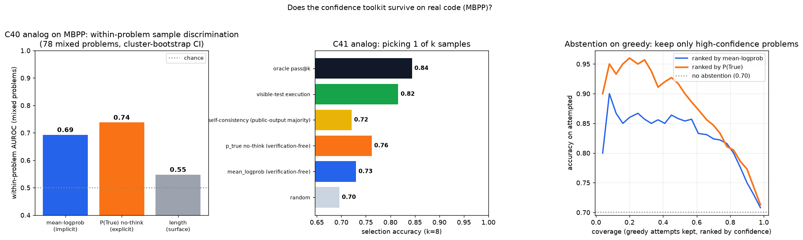
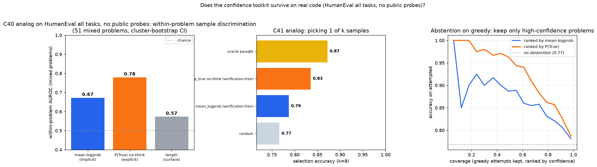

# Qwen3.5-4B: Does the Confidence Toolkit Survive on Real Code?

## Research Program

- Program: `benchmark_generalization`
- Program question: do the toy-substrate confidence laws (C40 implicit metacognition, C41 confidence-guided compute) transfer to real program synthesis, where the "answer" is a multi-hundred-token program rather than a single digit?
- Prior anchors: C40 (`qwen35_4b_implicit_metacognition` — answer-token P(answer) predicts correctness AUROC 0.95), C41 (`qwen35_4b_confidence_guided_compute` — confidence-select beats self-consistency; max-confidence predicts solvability AUROC 0.83), C10/C17 (P(True) judge, execution-consensus selection), C42 (step-resolved confidence).

## Question

C41's verdict-free selection win was demonstrated on a TOY substrate where confidence = one digit's P(answer). Real code has no single answer token. Which program-level confidence — sequence mean-logprob (implicit), single-token P(True) judge readout (explicit-framed logit), execution-cluster/public-output majority (self-consistency) — carries the calibrated signal on MBPP and HumanEval, and does verification-free selection still beat sample-more baselines?

## Hypothesis

The calibrated uncertainty C40 found in the logits is a property of the model, not the task, so SOME logit readout should discriminate correct from incorrect programs better than surface features (length). Expected: mean-logprob inherits the C40 role. (Falsified in part: the hierarchy inverts — see Results.)

## Setup

- Model: Qwen3.5-4B, no-think mode for generation and judging (code-mode; dict-format prompts).
- Dataset/task source: MBPP sanitized test split (offline HF cache), 244 usable records with 1 visible test and hidden asserts held out; HumanEval all 164 tasks with no public probes for a pure verifier-free replication; HumanEval 68-task public-probe subset with one parseable doctest example for the visible-execution/self-consistency diagnostic.
- Train/eval split: no training anywhere — pure elicitation. Greedy + k=8 temperature samples (T=0.7, top_p=0.8, top_k=20) per problem = 2,196 candidates.
- Baseline: random-pick expectation, public-output majority when public probes exist, visible-test execution when public probes exist, oracle pass@k.
- Controls: code-length surface baseline (both signs) for the AUROC claims; within-problem AUROC on mixed problems only (pooled AUROC is inflated by problem difficulty); paired bootstrap over problems for every selection delta.
- Primary metric: (1) within-problem AUROC of each confidence signal vs the length baseline; (2) selection accuracy at k=8; (3) abstention curve on greedy.
- Oracle-only metrics: `full_pass` (hidden-assert execution) is ground truth for scoring; never visible to any selection method except `visible-test execution` (which sees only the public test) and `oracle pass@k`.
- Hidden-label boundary: mean-logprob and P(True) read ONLY the model's own logits; behavior signatures execute candidates on probe inputs without correctness labels.

## Run

Smoke:

```bash
python scripts/run.py --smoke
```

Full (~35 min generation + logprob + judge on an RTX 4090):

```bash
python scripts/run.py            # eval_code_conf.py --n 260 --k 8, then analyze.py
```

HumanEval verifier-free replication:

```bash
python scripts/run.py --dataset humaneval --visible-tests 0 --n 164 --k 8 \
  --out-name humaneval_code_conf_novis \
  --title "HumanEval all tasks, no public probes" \
  --judge-batch-size 1
```

HumanEval public-probe diagnostic:

```bash
python scripts/run.py --dataset humaneval --visible-tests 1 --n 164 --k 8
```

Or the stages directly: `python scripts/eval_code_conf.py ...` then `python scripts/analyze.py ...`.

## Results

The toolkit TRANSFERS — but the hierarchy INVERTS: the single-token P(True) readout, not sequence mean-logprob, is the program-level confidence.

- **C40 analog (within-problem, 78/244 mixed problems):** mean-logprob AUROC 0.693 (CI 0.631–0.751), P(True)-no-think 0.738, length baseline 0.548. Paired diff vs length: +0.242 (CI 0.145–0.338) and +0.287 (CI 0.183–0.386) — the signal is confidence, not verbosity.
- **C41 analog (selection at k=8):** random 0.696 | mean-logprob 0.730 | **P(True) 0.762** | self-consistency (public-output majority) 0.721 | visible-test execution 0.816 | oracle pass@k 0.844. Paired bootstrap: P(True) beats self-consistency +0.041 (CI 0.004–0.078, p=0.014) and beats mean-logprob +0.033 (p=0.034); mean-logprob does NOT significantly beat self-consistency (p=0.37).
- **Abstention (deployable):** greedy problem-level AUROC — P(True) 0.837 (≈ the toy's 0.83), mean-logprob 0.760, length 0.688. Keeping the top third of greedy attempts by P(True) yields ~0.94–0.96 accuracy vs 0.701 unfiltered.
- Honest hierarchy: when even ONE visible test exists, executing it (0.816) crushes every verification-free signal and nearly closes the oracle gap. Verification-free confidence recovers ~45% of the selection headroom (P(True): +0.066 of the 0.148 random→oracle gap) with zero execution. Duplicate rate 0.775 on public outputs — most samples agree on the visible test, which is why majority vote adds little (+0.025, echoing C41's flat self-consistency).



### HumanEval Replication

Two HumanEval reads separate the deployable verifier-free question from the public-probe diagnostic:

- **All 164 HumanEval tasks, no public probes:** verifier-free only. P(True) is the clear winner: random 0.766 | mean-logprob 0.787 | **P(True) 0.835** | oracle pass@k 0.872. P(True) beats mean-logprob by +0.049 (p=0.011) and random by +0.069 (p<0.001). Within-problem AUROC on 51 mixed problems: mean-logprob 0.672, **P(True) 0.779**, length baseline 0.573; P(True) vs length +0.351 (CI 0.229-0.475). Greedy solvability AUROC: P(True) 0.862 vs mean-logprob 0.734.
- **68-task HumanEval public-probe subset:** apples-to-apples with public-output majority and visible execution, but ceiling-limited. Random is already 0.904 and oracle is 0.971; P(True) reaches 0.941, visible-test execution 0.941, mean-logprob 0.926, public-output majority 0.926. P(True) beats random (+0.037, p=0.020) but does not significantly beat public-output majority or mean-logprob on this easy subset.



## Interpretation

C40's law survives contact with real code in refined form: what carries calibrated signal is a CONCENTRATED SINGLE-TOKEN logit readout — P(answer) on the toy, P(A=correct) under a judge prompt on code. Averaging logprob over a few hundred program tokens DILUTES the signal (MBPP 0.69 vs 0.74 within-problem; HumanEval all-task 0.67 vs 0.78). "Read logits, not self-report" still holds — P(True) here is a logit read of a judgment token, not a sampled verbalization — but the C40 toy hierarchy (implicit >> explicit) does not transfer as stated: the explicit-FRAMED single-token readout wins on long-form outputs. C41's deployable recipe updates to: sample k, judge each with self-P(True) (one no-think forward pass per candidate, batchable but memory-sensitive on long prompts), argmax; abstain on low max-P(True); if visible tests exist, execute them first.

## Knowledgebase Update

- Program evidence updated: `benchmark_generalization` (C40/C41 generalization test, now MBPP + HumanEval).
- Program backlog updated: thinking-judge P(True), select+abstain+route matched-compute policy, step-resolved P(True) repair (C42 bridge), and the next training-slot compositional-grammar induction spec.
- Claim ledger updated: C46.

## Artifacts

- `src/` — generation/judging library (gen_lib), MBPP execution utilities (coverage_utils, code_env)
- `scripts/` — `eval_code_conf.py` (run), `analyze.py` (verdict + figure), `run.py` (orchestrator)
- `configs/`
- `runs/` — `code_conf.json`, `humaneval_code_conf_novis.json`, public-probe HumanEval diagnostic, verdicts, logs
- `analysis/` — `code_confidence.png`, `humaneval_code_conf_novis.png`, public-probe diagnostic figure
- `reports/` — `report.md`
- `reports/artifact_manifest.yaml`
