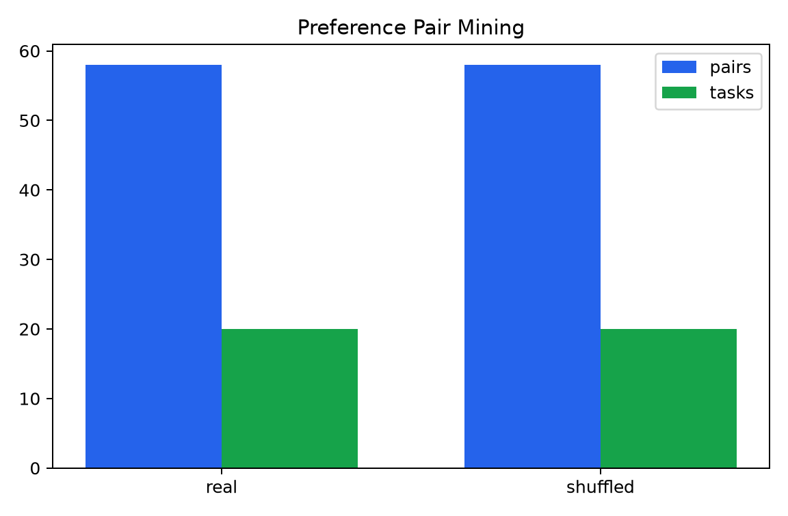
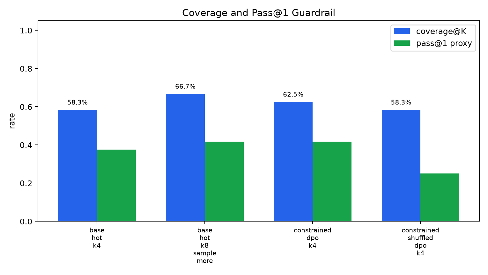
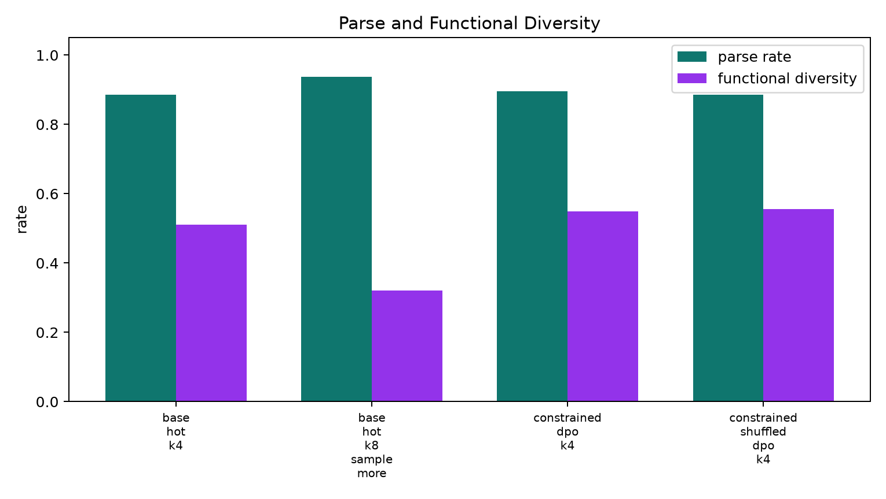
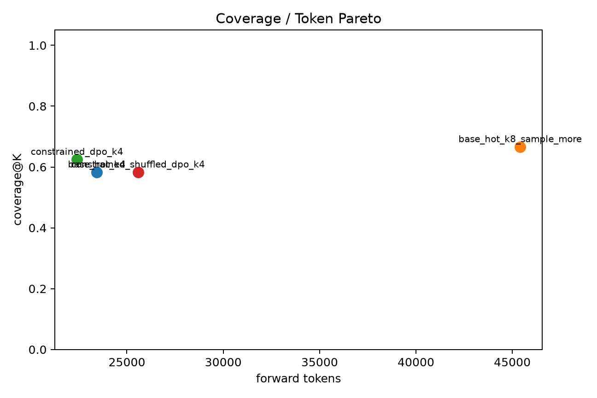
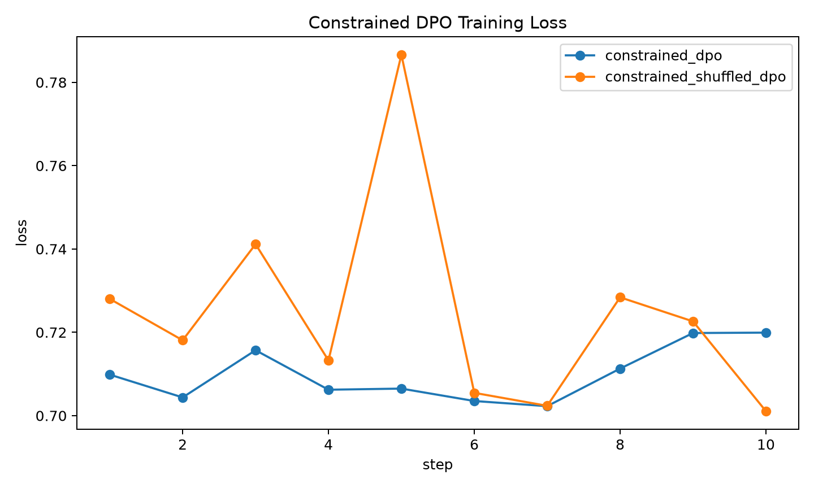

# qwen35_4b_constrained_coverage_dpo

## Question

Can a weak hard-negative DPO coverage signal be made useful by explicitly constraining it with a reference anchor, positive NLL anchor, and short early-stopped training, so coverage improves without sacrificing pass@1 or parseability?

The meaningful comparison is not only base K4. The gate is whether constrained DPO is on a better coverage/pass@1/token Pareto point than simply sampling more from the base model.

## Pair Mining

| pair set | pairs | tasks with pairs | visible-wrong pair rate | source records |
|---|---:|---:|---:|---:|
| real | 58 | 20 | 13.8% | 36 |
| shuffled | 58 | 20 | 13.8% | 36 |

## Held-Out Results

| arm | K | coverage@K | pass@1 proxy | parse / task | visible coverage | functional diversity | forward tokens |
|---|---:|---:|---:|---:|---:|---:|---:|
| base_hot_k4 | 4 | 58.3% | 37.5% | 3.54 | 58.3% | 51.0% | 23434 |
| base_hot_k8_sample_more | 8 | 66.7% | 41.7% | 7.50 | 66.7% | 32.1% | 45406 |
| constrained_dpo_k4 | 4 | 62.5% | 41.7% | 3.58 | 62.5% | 54.9% | 22411 |
| constrained_shuffled_dpo_k4 | 4 | 58.3% | 25.0% | 3.54 | 58.3% | 55.6% | 25575 |

## Task-Level Overlap

| arm | covered tasks | pass@1 tasks |
|---|---:|---:|
| base_hot_k4 | [12, 13, 14, 17, 18, 19, 21, 22, 23, 27, 28, 29, 30, 32] | [13, 17, 18, 19, 22, 27, 28, 29, 32] |
| base_hot_k8_sample_more | [11, 12, 13, 14, 17, 18, 19, 22, 23, 27, 28, 29, 30, 32, 33, 34] | [11, 12, 14, 17, 18, 19, 27, 28, 29, 30] |
| constrained_dpo_k4 | [11, 12, 13, 14, 17, 18, 19, 22, 23, 25, 27, 28, 29, 30, 32] | [12, 14, 17, 18, 19, 22, 23, 27, 28, 32] |
| constrained_shuffled_dpo_k4 | [11, 12, 13, 14, 17, 18, 19, 22, 23, 27, 28, 29, 30, 32] | [12, 17, 18, 19, 27, 32] |

## Training

The constrained trainer used a DPO margin term plus a positive-sample NLL anchor and a reference-logprob drift penalty. Both the real and shuffled adapters were limited to ten optimizer steps.

## Gate Readout

Constrained DPO vs base K4: coverage delta 4.2%, pass@1 delta 4.2%, parse-rate delta 1.0%.
Constrained DPO vs shuffled constrained control: coverage delta 4.2%.
Constrained DPO vs sample-more K8: coverage delta -4.2% at 22411 vs 45406 forward tokens.
Task overlap: base K4 union constrained K4 covers 16 tasks; base K8 union constrained K4 covers 17 tasks.
Gate readout: no scale-up yet. The constrained adapter preserves pass@1 and beats shuffled, but it does not reach the K8 sample-more coverage reference.

## Interpretation

This is a small pilot on 24 MBPP-test tasks, so one recovered task is not enough to claim a robust method. Still, the control structure is informative. The real constrained adapter improves over base K4 and over the shuffled constrained adapter while preserving pass@1 and parseability. That means the constrained preference signal did not collapse into the usual parse/pass@1 failure mode, and it is not explained by label shuffling.

It does not beat the K8 sample-more coverage reference. So this exact scalar constrained-DPO sampler should not be scaled as the next main bet. The useful new clue is complementarity: constrained K4 recovers a task that K8 base sampling missed, while K8 base recovers tasks constrained K4 missed. The next direction is therefore a sampler portfolio or learned scheduler over multiple generation policies, with the same coverage/pass@1/token Pareto gate, rather than simply pushing one LoRA harder.
