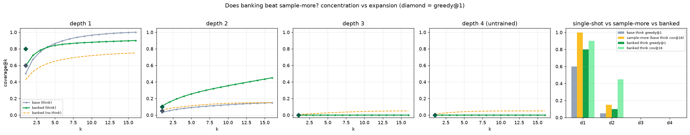

# Does banking shift the proposal distribution? Concentration vs. expansion

## Summary

C17 proved the fixed 4B's generation wall is COVERAGE, not selection: sample+filter recovers what single-shot
misses but *is* sample-more, and the only lever that can beat sample-more is shifting the PROPOSAL
distribution. This experiment tests whether banking the model's OWN execution-verified solutions (QLoRA-SFT,
no teacher) does that — and decomposes the mechanism: does banking **CONCENTRATE** existing coverage into the
greedy sample, or **EXPAND** the coverage ceiling (propose programs the base never sampled — cross the wall)?

**Answer: BOTH, depth-dependent — and the expansion is real and generalizes to held-out tasks.**

- **Depth 1 — CONCENTRATION.** Banking pulls coverage into the single-shot: think greedy@1 **0.60 → 0.80**
  (+0.20) while the coverage ceiling stays flat (1.00 → 0.90). Cheap no-think greedy@1 also lifts 0.20 → 0.45.
- **Depth 2 — EXPANSION.** The banked coverage ceiling rises **0.15 → 0.45 (3×)** on HELD-OUT tasks: the
  banked model proposes correct depth-2 compositions the base never sampled (even with thinking + 16 tries).
  Diversity did *not* rise (unique programs 11.5 → 10.85) — banking concentrated the proposal distribution
  onto the *correct* region of depth-2 program space, exactly the "shift the proposal distribution" lever C17
  named. This partially pushes back the coverage wall.
- **Depth 3–4 — no move.** Too few (depth-3: 7 pairs) or no (depth-4: untrained) training examples; the wall
  holds (base and banked coverage both 0).

Banking does **not** beat think-mode sample-more at k=1 (banked greedy 0.80 < base sample-more 1.00 at depth 1;
0.10 < 0.15 at depth 2). But **banking + sample-more > base + sample-more** (banked cov@16 = 0.45 vs base 0.15
at depth 2): if you will sample anyway, sample the banked model. Banking expands what sample-more can reach.

## Research Program Fit

The correctly-aimed follow-through to C17 (wall is proposal-coverage) and the C11/C12 banking thread. Decomposes
banking's mechanism (concentration vs expansion) — which C11/C12 measured only as a pass@k lift.

## Method

Substrate `list`. Fresh verified-depth, collapse-rejected tasks, **disjoint TRAIN / EVAL splits**.

- **Harvest (TRAIN):** depths [1,2,3], 90 tasks. Sample K=40 identification completions/task (think, budget
  512, no op-menu — the canonical C17 prompt). Keep execution-verified (hidden-correct) programs, cap 12/task.
  → **80 verified `{prompt, code}` SFT pairs** (the model's OWN code, no teacher) from 33/90 solved tasks; by
  depth {1: 49, 2: 24, 3: 7}. (57/90 tasks yielded nothing — C17's coverage wall.)
- **Bank:** QLoRA-SFT (r32/alpha64, bnb 4-bit, 3 epochs), single-shot prompt→code, thinking off.
- **Eval (HELD-OUT, disjoint):** depths [1,2,3,4], 20/depth. Four arms in one grading harness: {base, banked}
  × {no-think, think}, greedy@1 + coverage@16. The sample-more baseline is **base-think coverage@16**.

## Results

| d | base-think greedy@1 | sample-more (base-think cov@16) | banked-nt greedy@1 | banked-think greedy@1 | banked-think cov@16 | verdict |
|---|---|---|---|---|---|---|
| 1 | 0.60 | 1.00 | 0.45 | **0.80** | 0.90 | concentration |
| 2 | 0.05 | 0.15 | 0.05 | 0.10 | **0.45** | **EXPANSION (3×)** |
| 3 | 0.00 | 0.00 | 0.00 | 0.00 | 0.00 | no-move |
| 4 (untrained) | 0.00 | 0.00 | 0.00 | 0.00 | 0.00 | no-move |

Diversity (unique programs / 16): depth-1 base-think 9.45 → banked 7.95; depth-2 11.5 → 10.85; depth-3
13.0 → 13.45 — no collapse (consistent with C11).

## Pre-registered verdicts

- **P1 (banking lifts greedy):** SUPPORTED at depth 1 (think greedy +0.20); WEAK at depth 2 (+0.05, below the
  predicted +0.15) — the depth-2 gain landed in the coverage tail, not the greedy mode.
- **P2 (banked greedy beats sample-more at depth 2):** REFUTED (0.10 < 0.15). Single-shot does not beat
  sample-more at k=1 in any depth.
- **P3 (concentration NOT expansion):** REFUTED in the optimistic direction — there IS expansion (depth-2
  ceiling 0.15 → 0.45), alongside concentration at depth 1. Banking does both.
- **P4 (no lift at untrained depth 4):** HELD — depth 4 (and depth 3, only 7 pairs) do not move.

## Interpretation

- **The coverage wall is not immovable by self-training.** Banking the fixed 4B's OWN verified solutions
  EXPANDS the coverage ceiling for HELD-OUT tasks at a depth with enough training signal (depth-2, 24 pairs →
  3×). This is genuine cross-task generalization, not memorization, and it is C17's predicted lever (shift the
  proposal distribution) actually working — the proposal mass moves onto correct compositions (diversity even
  drops), tripling the depth-2 hit rate.
- **Two mechanisms, cleanly separated by depth:** where the base already covers well (depth 1), banking
  CONCENTRATES coverage into the deployable single-shot (greedy 0.60 → 0.80); where the base barely covers
  (depth 2), banking EXPANDS the ceiling (0.15 → 0.45). C11/C12's "banking lifts pass@k" is both of these.
- **Bounded, honest win:** banking does not beat think-mode sample-more at k=1, and it cannot expand a depth
  it has no verified examples for (depths 3–4 stay at 0 — plain sampling never harvested them). The recipe
  that follows: to push the wall deeper you need verified examples at that depth, which plain sampling cannot
  provide (coverage ≈ 0) — so seed the training set with **tool-augmented harvest** (C12 decompose-search).
  This is the concrete path from C18 back to C12.
- **Deployment recipe:** bank verified self-solutions, then sample-more on the banked model — the coverage
  ceiling itself rises where you have training signal (depth-2 3×), and single-shot improves at easy depths.

## Next Experiments

- **Tool-seeded banking:** harvest depth-3 solutions via C12 decompose-search (where sampling gets ~0), bank
  them, and test whether the depth-3 coverage ceiling expands on held-out tasks (the wall-crossing test).
- **Concentrate the depth-2 expansion into greedy:** iterate banking (expert iteration) — does a second round
  pull the expanded depth-2 coverage into greedy@1?
- **Dose–response:** vary the number of depth-2 training pairs (4/12/24/48) to map expansion vs. example count.

## Artifact Manifest

See `reports/artifact_manifest.yaml`. Key: `scripts/harvest.py`, `scripts/train_lora.py`, `scripts/eval_ladder.py`,
`scripts/analyze.py`, `scripts/common.py`, `data/train.jsonl`, `runs/eval_{base,banked,base_think,banked_think}.json`,
`runs/verdict.json`, `analysis/banking_coverage.png`. The trained adapter (`runs/banked_adapter`) is omitted from git.
