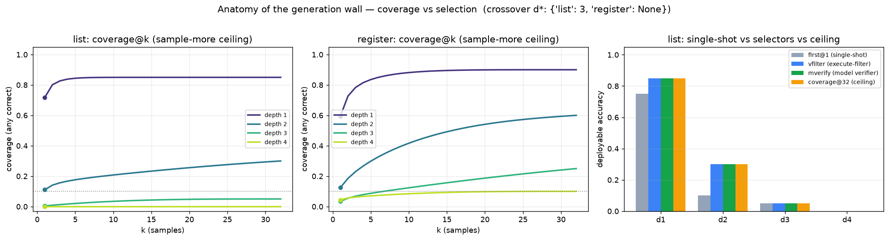

# Anatomy of the generation wall: coverage vs. selection

## Summary

C13/C16 localized the fixed 4B's compositional wall to **generation** (proposing a novel composition), not
execution. "Generation" hides two distinct failures: the correct program is **never proposed** (COVERAGE)
vs. **proposed-but-not-selected** (SELECTION). This experiment decomposes them, because the answer decides
whether *cleverer access* (a better selector) can beat *sample more* (raw compute) — and where.

**Answer: the wall is COVERAGE. Selection is essentially free.** On fresh verified-depth list + register
tasks (depths 1–4, K=32 samples/task, 8 visible + 8 hidden examples):

- **Selection recovers the whole coverage ceiling in every cell** (max(coverage − vfilter) = 0.00).
  Whenever the correct program is sampled at all, an 8-example execution-filter — *and the model's own
  C10-style verifier, and even a random pick among visible-consistent candidates* — deploys it. 90% of
  visible-passers also pass the hidden set, so passing 8 visible examples ≈ being correct.
- **Single-shot massively undersells accessible capability**, and sample+filter recovers it: first@1 →
  coverage@32 is 0.10→0.30 (list d2, 3×), 0.45→0.90 (register d1), 0.15→0.60 (register d2, 4×),
  0.05→0.25 (register d3, 5×). But this *is* sample-more; the free selection just makes coverage deployable.
- **The coverage wall's depth is set by hypothesis-space size.** list coverage collapses at depth 3
  (crossover d\* = 3: coverage 0.05); register stays sample-accessible through depth 4 (0.90/0.60/0.25/0.10)
  because its smaller 12-op menu means the right program is drawn far more often. This mechanistically
  explains C16's register identification floor as **coverage-driven** (sampling probability ∝ 1/hypothesis
  space), not a special deep capability.
- **The one residual selection problem is overfit traps**, which no example-based selector catches:
  13/74 tasks-with-visible-passers have a program that passes all 8 visible yet fails hidden; execute-filter
  and the model-verifier both deploy it wrongly (false positive), concentrated at deep register (d3 3/8,
  d4 3/5). This is a *calibration/abstention* gap, not a *recovery* gap.

## Research Program Fit

Directly tests the structured-execution program's central mechanism (C13/C16 generation wall) and the
selection-bottleneck thread (C10, "selection is plumbing not capability"). Decides which lever — better
selection vs. shifted proposal — can move deployable capability, unifying C10–C16.

## Method

Fresh verified-depth, collapse-rejected tasks from the crossfamily harness (`list`, `register`), depths 1–4,
n=20/depth/family, seed 707 (held out). 8 visible + 8 hidden examples/task. For each task draw K=32
bare-identification samples (I/O→`transform`, thinking on, budget 512, repo-standard sampling
T=0.6/top_p=0.95 — the same distribution "sample more" uses; no op-menu, matching the canonical C16 numbers).
Execute each sample vs visible and hidden. Metrics (none see hidden labels):

- **first@1** — first sample (deployable single-shot).
- **coverage@k** — unbiased pass@k: any of k samples is hidden-correct (the sample-more ceiling).
- **vfilter** — keep visible-passers, pick the majority behavior signature on hidden *inputs* (labels
  unused), grade hidden.
- **mverify** — rank visible-passers by the built-in C10 thinking-verifier P(correct), pick top-1.
- **rndVP** — expected accuracy of a random visible-passer (null for "is selection hard?").

## Results

| fam | d | first@1 | vfilter | mverify | rndVP | cov@2 | cov@8 | cov@32 | regime |
|---|---|---|---|---|---|---|---|---|---|
| list | 1 | 0.75 | 0.85 | 0.85 | 0.85 | 0.80 | 0.85 | 0.85 | easy |
| list | 2 | 0.10 | 0.30 | 0.30 | 0.30 | 0.14 | 0.20 | 0.30 | sampling-gap |
| list | 3 | 0.05 | 0.05 | 0.05 | 0.05 | 0.01 | 0.03 | 0.05 | **coverage-wall** |
| list | 4 | 0.00 | 0.00 | 0.00 | 0.00 | 0.00 | 0.00 | 0.00 | **coverage-wall** |
| register | 1 | 0.45 | 0.90 | 0.90 | 0.87 | 0.73 | 0.87 | 0.90 | sampling-gap |
| register | 2 | 0.15 | 0.60 | 0.60 | 0.60 | 0.19 | 0.38 | 0.60 | sampling-gap |
| register | 3 | 0.05 | 0.25 | 0.25 | 0.25 | 0.05 | 0.11 | 0.25 | sampling-gap |
| register | 4 | 0.05 | 0.10 | 0.10 | 0.10 | 0.06 | 0.08 | 0.10 | easy |

vfilter = mverify = cov@32 in every row; visible-pass ⟹ hidden-pass rate = 0.902 across 244 visible-passing
candidates.

## Controls / honesty

- Verified-depth tasks (nominal = real depth) so coverage isn't inflated by shallow-equivalents.
- coverage@k via the unbiased 1−C(n−c,k)/C(n,k) estimator.
- **The apparent "perfect verifier" is not a strong-verifier result.** mverify = rndVP everywhere: the model
  verifier does not beat a random pick among visible-passers — because there is no hard selection to make
  (8 examples pin the rule). Do not read this as "the verifier is a great selector"; read it as "selection
  is trivial here." A harder selection regime (fewer visible examples) is needed to stress the verifier.
- **Selection-freeness is conditional on example count.** With 8 visible examples an overfit-but-consistent
  program is rare (10% of visible-passers); with fewer examples the overfit-trap rate — and thus the real
  selection problem — would grow. Untested here.

## Pre-registered verdicts (multiple own-predictions refuted)

- **P1 (coverage rises above single-shot):** SUPPORTED where coverage is nonzero (register 2–5×; list d2 3×).
  The "coverage@32 > 0.10 at list depth 3" clause is REFUTED (list d3 coverage = 0.05) — list depth 3 is
  already coverage-bound.
- **P2 (crossover d\*):** list d\* = 3 (predicted 4). The coverage wall arrives one depth earlier than
  guessed; register has no d\* through depth 4.
- **P3 (a selection gap exists):** REFUTED. max(coverage − vfilter) = 0.00 — there is no selection gap;
  selection recovers coverage exactly.
- **P4 (verifier elicits selection):** REFUTED as stated — mverify does not exceed rndVP, because selection
  is free (not because the verifier is weak).

## Interpretation

- **You cannot beat "sample more" by better selection on this substrate — selection is already free.** The
  wall is PROPOSAL/coverage. Sharpens C13/C16: the generation wall = the correct composition is *never
  proposed* at depth ≥ 3 (list) / ≥ 5 (register); it is not a selection failure.
- **Confirms C10 ("selection is plumbing not capability") in the strong form:** with enough examples,
  execution-consistency (and the model's own verifier) pins the correct program; the deployment gap is
  entirely coverage.
- **The lever that beats sample-more must shift the PROPOSAL distribution:** tool-enumeration that restructures
  proposal (C12 decompose-and-compose) or banking verified solutions into the weights (C11/C12) so the right
  program is proposed at k=1. This unifies the arc: C11/C12 attack the real bottleneck; better test-time
  selection cannot.
- **C16's register floor is coverage-driven** (smaller op-space → higher sampling probability), not a special
  simulability effect — a partial refinement of the C16 floor sub-law: hypothesis-space size drives the
  floor via coverage; the "simulability" term is not needed because selection never had to simulate hard.
- **Deployable recipe (shallow depth):** sample K + execute-filter recovers 2–5× over single-shot
  (self-consistency), free of hidden labels. **Deep depth:** only proposal-shifting helps. The one caution
  is overfit traps (false-positive deploys at deep register) — an abstention problem no example-filter solves.

## Next Experiments

- **Stress the verifier:** shrink visible examples (8→3→1) until overfit traps dominate; measure where the
  C10 verifier beats execution-filter and random — isolating a genuine hard-selection regime.
- **Attack coverage directly:** does banking (C11/C12) or tool-enumeration move the k=1 proposal to where
  sample+filter is today (list d2 0.10→0.30)? That is the "beat sample-more" test, now correctly aimed at
  proposal not selection.
- **Abstention:** can any signal (verifier entropy, cluster agreement) flag the overfit-trap tasks to
  abstain rather than false-deploy?

## Artifact Manifest

See `reports/artifact_manifest.yaml`. Key: `scripts/run_anatomy.py`, `scripts/analyze.py`, `src/families.py`,
`runs/anatomy.json`, `runs/verdict.json`, `analysis/wall_anatomy.png`, `data/tasks_{list,register}.jsonl`.
