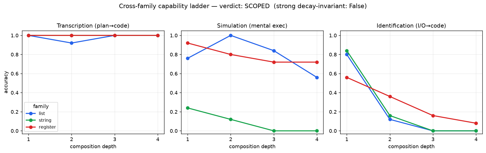

# Cross-Family Laws: which parts of C13–C15 are about the model, and which about lists?

## Summary

Six claims (C11–C15) about the fixed Qwen3.5-4B rested on ONE substrate: integer-list pipelines. This
experiment ran the core capability ladder on two genuinely different fresh, execution-verified families —
**string** (char edits) and **register** (a 3-register integer machine) — alongside the list anchor, to ask
whether the ladder constants are **model-level laws** or **list artifacts**. Pre-registered in `prereg.md`.

**Verdict: SCOPED — and the scoping is the finding.** Two rungs are substrate-invariant **laws**;
one is substrate-dependent.

- **LAW — transcription/compiler:** plan-given execution ≈ **1.00 at every depth in every family**. The
  three curves collapse to one flat line. The fixed 4B is a *universal reliable compiler*.
- **LAW — generation wall:** bare identification of novel compositions **collapses toward chance with depth
  in every family** (transcription−identification gap ≥ 0.84 at depth ≥ 3). "The model executes what it
  cannot invent" is model-level; the rule *tools identify, the model compiles* is substrate-general.
- **SUBSTRATE-DEPENDENT — simulation:** C15's simulation-decay "constant" was list-specific. Mental
  simulation fidelity is set by the **cost of tracking the state representation**: register (compact 3-int
  state) is robust (0.92→0.72, ~flat); list decays (1.00→0.56); string is floored (0.24→0.00).

## Research Program Fit

Directly stress-tests the structured-execution program's central result (C13 compiler/generation split)
and the context-composition triptych (C15) for cross-substrate generality — the highest-leverage open
question after the C9–C15 arc, since all six claims shared one family.

## Method

All three families share the identical depth-graded, execution-verified, **collapse-rejected** structure as
lists (behavioral min-depth BFS ⇒ nominal depth = real depth), and run through one harness
(`scripts/run_family.py`). Each family defines primitives as Python snippets over a single state variable,
so reference code composes trivially and identification grades the same way (execute the model's `transform`
against hidden I/O).

- **list** — variable-length int lists, 16 primitives (anchor).
- **string** — lowercase strings, 13 char-edit primitives (reverse, sort_chars, dedup, shift_k caesar, …).
- **register** — 3-register int machine, 12 primitives (a+=b, rotate, neg_a, mod_a, …); fixed 3-tuple state.

100 verified tasks per family (25 each at depth 1–4). Three rungs, thinking on, budget 512:

- **Transcription** — plan given as the exact op sequence + step definitions → write the function (pass@1 greedy).
- **Simulation** — apply the pipeline to one input *in your head*; emit the state after each step; graded on
  the final state (greedy). Family-aware parser (see Controls).
- **Bare identification** — infer `transform` from I/O examples only (pass@4 sampled).

## Results

| rung | family | d1 | d2 | d3 | d4 |
|---|---|---|---|---|---|
| **transcription** | list | 1.00 | 0.92 | 1.00 | 1.00 |
| | string | 1.00 | 1.00 | 1.00 | 1.00 |
| | register | 1.00 | 1.00 | 1.00 | 1.00 |
| **simulation** | list | 0.76 | 1.00 | 0.84 | 0.56 |
| | string | 0.24 | 0.12 | 0.00 | 0.00 |
| | register | 0.92 | 0.80 | 0.72 | 0.72 |
| **identification** | list | 0.80 | 0.12 | 0.00 | 0.00 |
| | string | 0.84 | 0.16 | 0.00 | 0.00 |
| | register | 0.56 | 0.36 | 0.16 | 0.08 |

Normalized simulation (each family ÷ its own peak): list 0.76/1.00/0.84/0.56; string 1.00/0.50/0.00/0.00;
register 1.00/0.87/0.78/0.78. Cross-family spread up to **0.84** ⇒ no invariant decay constant.

## Controls

- **Collapse rejection** applied identically to all families (behavioral min-depth BFS, probe on 6 inputs,
  precompiled ops), so any residual shallow-equivalent bias is family-shared and does not confound the
  cross-family comparison. Oracle: reference code passes visible+hidden for 100% of accepted tasks.
- **Parser artifact caught pre-run.** A first smoke reported string simulation 0.00 at every depth — a false
  "law." The model had written `Step 1: nfmic` (correct, unquoted) but the list-oriented regex required
  quotes. Fixed to a family-aware, per-`Step i:` parser (unit-tested on the exact failing case + register
  brackets + prose-embedded values) before any scored run. Without this catch the report would have claimed
  a spurious cross-family simulation collapse.
- **Same harness, same budget, same thinking setting** across families; identification graded by execution,
  not string match.

## Oracle Versus Deployable Evidence

Transcription and identification are **deployable** (executed code, hidden-set graded). Simulation is a
**mental-capability microbenchmark** (no code, final-state exact match) — it measures whether the model can
track state internally, which is what a test-time generate-and-test loop relies on. The register foothold
(nonzero deep identification) is deployable and reproduces the C11/C12 pattern that self-search gains
traction only where the model can verify its own guesses.

## Interpretation

- **C13 promoted, not scoped.** Its two operative claims — plan-given execution is nearly free, and the
  compositional deficit is inverse-inference (generation) not execution — now hold across three unrelated
  substrates ⇒ **model-level laws**. "Spend tools on hypothesis search, never on execution" is general.
- **C15 narrowed.** Its simulation-decay curve is list-specific. Sharper deployment corollary: externalize
  simulation to a tool **when the state representation is expensive to track** (strings: even single steps;
  lists: past depth ~3), but for **compact integer state the model simulates reliably to depth 4+** — a tool
  call there is wasted. *Representation choice is itself a capability lever.*
- **New sub-law:** the generation wall's *floor* ≈ f(hypothesis-space size, simulability). Register is the
  only family both small-enough-to-search (12 ops) *and* simulable (sim ~0.72), and the only one with a
  nonzero deep-identification floor (0.16/0.08). List has high simulation but a large space ⇒ zero; string
  has a small-ish space but zero simulation ⇒ zero. Both factors are jointly necessary. This predicts where
  a test-time self-search can gain traction, tying together C11 (coverage-bounded banking) and C12
  (decompose-search edge).

## Next Experiments

- Add a **4th, non-Python-expressible** substrate (e.g. a named-graph walk the model must describe, not
  code) to test whether the transcription law survives when the plan cannot be a code snippet.
- Directly test the floor sub-law: hold simulability fixed, vary op-menu size on the register family, and
  measure the deep-identification floor vs. |ops|.
- Representation-swap: re-encode string tasks as integer-tuple state (char→ordinal lists) and test whether
  simulation fidelity jumps to register-like levels — would confirm representation, not task, drives sim.

## Artifact Manifest

See `reports/artifact_manifest.yaml`. Key artifacts: `scripts/run_family.py`, `scripts/analyze.py`,
`src/families.py`, `runs/ladder_{list,string,register}.json`, `runs/verdict.json`,
`analysis/crossfamily_ladder.png`, `data/tasks_{list,string,register}.jsonl`.
