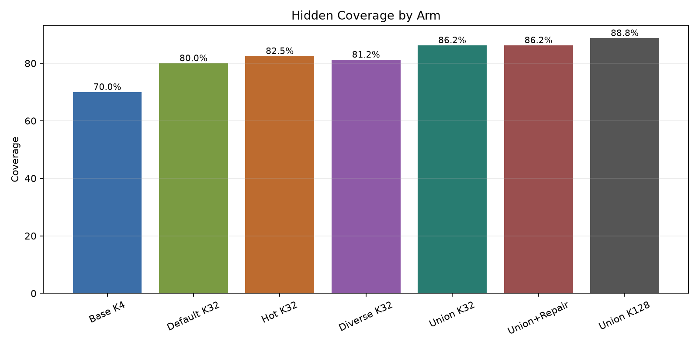
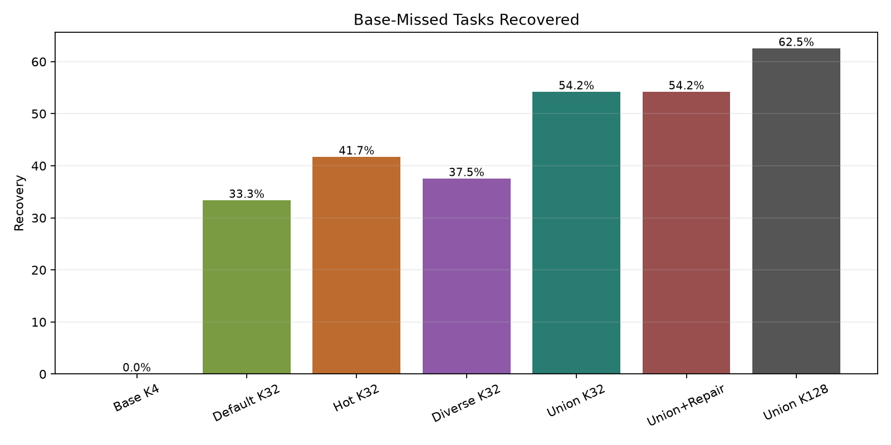
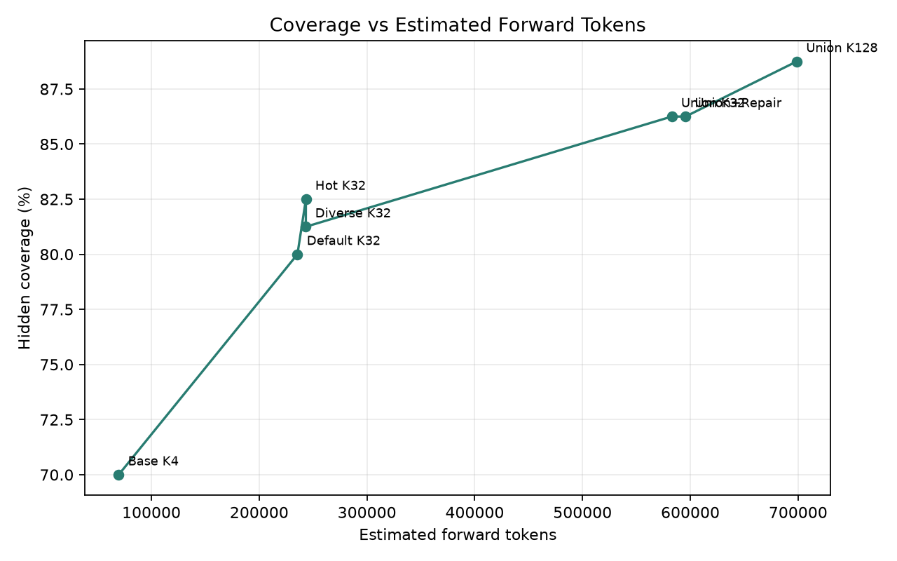
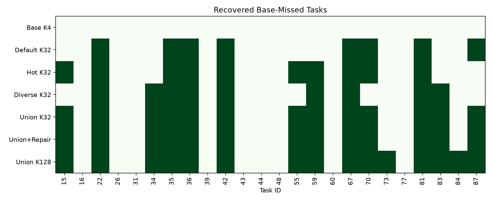
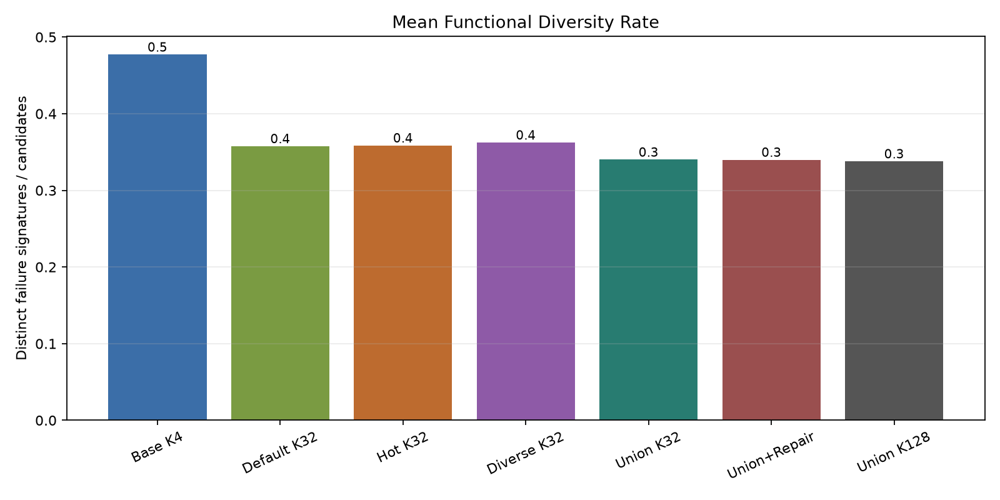

# Qwen3.5-4B Diversity-Keyed Coverage Gate

Date: 2026-06-25

## Question

This experiment tests whether held-out MBPP tasks missed by a small direct sample pool are diversity-limited or capability-limited. The practical question is whether a small posttraining objective should try to reshape the model into a better ensemble sampler, or whether inference-time diverse sampling already captures the available headroom.

## Setup

- Model: Qwen3.5-4B, used as the generator.
- Dataset: 80 MBPP held-out tasks.
- Public evidence in the prompt: one visible assert per task.
- Evaluation: all remaining MBPP asserts and challenge asserts.
- Base pool: 4 direct samples per task.
- Ladder arms: for tasks missed by the base pool, add 28 samples under default, hot, or tuned-diverse decoding.
- High-budget extension: after merging all K~32 arms, add 40 hot samples only to tasks still uncovered.
- Frozen repair check: after the K~32 union, repair up to two visible-failing candidates on each remaining miss.

Coverage means at least one candidate in the pool passes all hidden evaluation tests. Base-miss recovery is measured only over the 24 tasks where the K=4 pool had no hidden-correct candidate.

## Results

| Arm | Hidden coverage | Base-miss recovery | Total forward tokens | Mean candidates | Mean functional diversity |
|---|---:|---:|---:|---:|---:|
| Base K4 | 70.0% | 0 / 24 (0.0%) | 69,645 | 3.45 | 0.477 |
| Default K32 | 80.0% | 8 / 24 (33.3%) | 235,491 | 10.28 | 0.358 |
| Hot K32 | 82.5% | 10 / 24 (41.7%) | 243,343 | 11.39 | 0.359 |
| Diverse K32 | 81.2% | 9 / 24 (37.5%) | 243,268 | 11.04 | 0.362 |
| Union K32 | 86.2% | 13 / 24 (54.2%) | 582,812 | 24.09 | 0.340 |
| Union+Repair | 86.2% | 13 / 24 (54.2%) | 595,586 | 24.26 | 0.340 |
| Union K128 | 88.8% | 15 / 24 (62.5%) | 698,783 | 29.31 | 0.338 |

## Main Findings

The K=4 base pool covered 56 / 80 tasks (70.0%), leaving 24 base misses.

More inference-time sampling recovered a large fraction of those misses. The best single K~32 policy was hot decoding, recovering 10 / 24 base misses and raising coverage to 82.5%. Default and tuned-diverse decoding were slightly lower individually, but they recovered different tasks.

The union result is the core signal. Merging default, hot, and tuned-diverse K~32 pools recovered 13 / 24 base misses (54.2%) and raised coverage to 86.2%. This is stronger evidence for diversity-limited misses than any single arm, because the policies are complementary rather than redundant.

The high-budget extension recovered two more tasks, ending at 15 / 24 recovered base misses (62.5%) and 88.8% total coverage. The newly recovered tasks were 73 and 84. The final remaining base misses were: 16, 26, 31, 39, 43, 44, 48, 60, 77.

Frozen repair did not help on the residual slice. It recovered 0 additional tasks after the K~32 union, and its two visible-passing repairs were both hidden-wrong. This run therefore points to diverse direct sampling, not visible-test repair, as the useful inference-time lever for this setup.

## Interpretation

The central result is positive for the diversity hypothesis: many failures of the small K=4 pool are not hard capability absences. They are reachable by changing the sampling distribution and spending more sample budget. At the same time, the strongest no-training baseline is already substantial, so a diversity-keyed adapter should not be considered successful unless it beats hot/diverse sampling and the union strategy at matched forward-token budget.

This package did not train an adapter. That is intentional: the diagnostic first established the no-training ceiling and the tuned sampling baselines that any adapter must beat. Training directly against stylistic clusters would be risky unless it improves functional coverage, because surface diversity alone is not the target.

## Decision

Do not run blind verified self-training or visible-test repair training from this result. If a follow-up trains strategy keys or diversity tokens, its primary bar should be:

- Recover more than 10 / 24 base misses at the same budget as the best single K~32 arm.
- Approach or beat the union K~32 recovery of 13 / 24 while using fewer total forward tokens than the full union.
- Preserve or improve functional diversity, measured by distinct failure signatures.
- Avoid lowering base pass@1 or increasing visible-pass/hidden-fail repairs.

The most defensible next training experiment is therefore not ordinary SFT on successful samples. It is a budget-matched diversity-control objective whose output is judged by hidden-test coverage and functional failure-set diversity, with hot sampling and the K~32 union as mandatory baselines.
