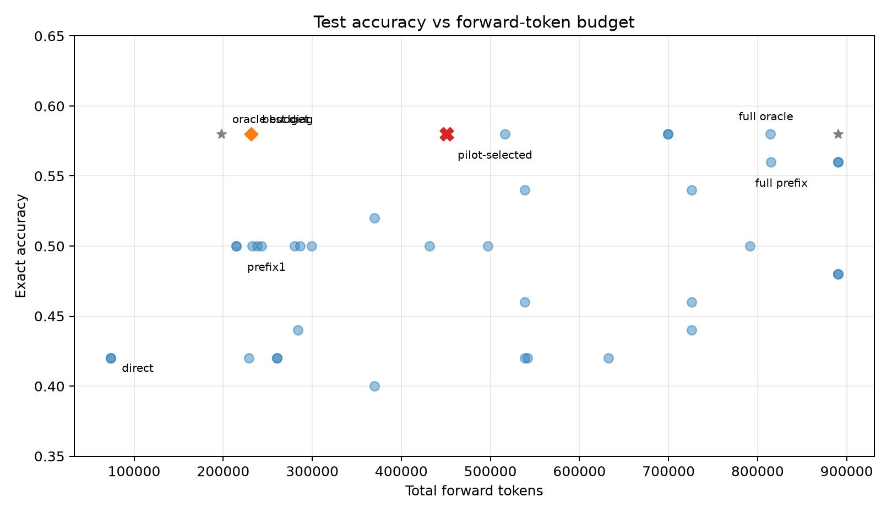
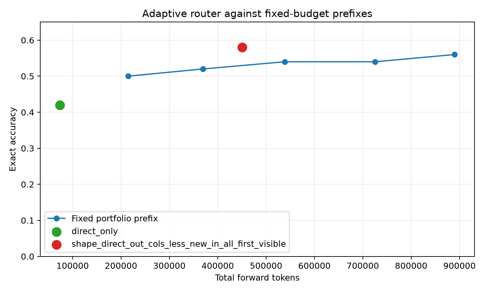
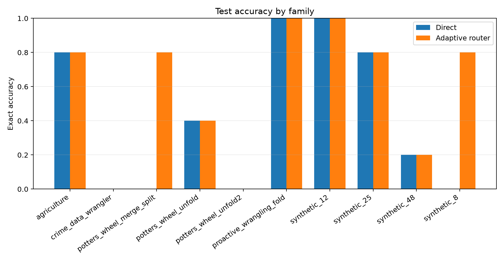
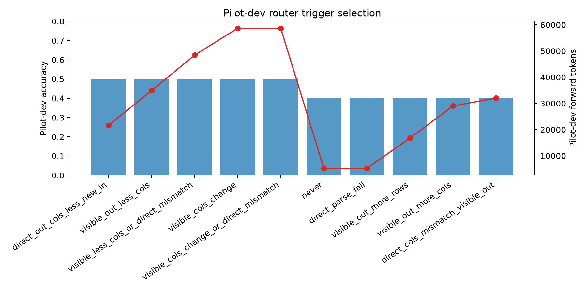

# Adaptive Program-Budget Router

## Summary

This experiment evaluates whether a cheap deployable router can decide when to spend the executable-program portfolio budget for Foofah-style table transformations. The router is selected only on pilot data and then frozen for test.

Pilot-selected router: `direct_out_cols_less_new_in`. It runs when the direct JSON output has fewer columns than the new input table; otherwise it returns the direct JSON output.

## Headline Test Result

| Policy | Exact | Accuracy | Tokens | Avg tokens/task | Program commits | Recoveries | Losses | Commit precision |
|---|---:|---:|---:|---:|---:|---:|---:|---:|
| `direct_only` | 21/50 | 42.0% | 73,911 | 1478 | 0 | 0 | 0 | n/a |
| `shape_direct_out_cols_less_new_in_all_first_visible` | 29/50 | 58.0% | 450,853 | 9017 | 8 | 8 | 0 | 100.0% |
| `shape_visible_out_less_cols_all_first_visible` | 29/50 | 58.0% | 231,365 | 4627 | 8 | 8 | 0 | 100.0% |
| `prefix5_first_visible` | 28/50 | 56.0% | 890,030 | 17801 | 23 | 8 | 1 | 78.3% |
| `oracle_budget_run_all_only_on_helpful_tasks` | 29/50 | 58.0% | 197,951 | 3959 | 8 | 8 | 0 | 100.0% |
| `oracle_best_available_full_budget` | 29/50 | 58.0% | 890,030 | 17801 | 8 | 8 | 0 | 100.0% |

The pilot-selected adaptive router matches the hidden oracle union accuracy on this test set while using fewer tokens than the full fixed portfolio. It recovers eight direct misses with no direct-correct losses.

The best observed deployable diagnostic is `shape_visible_out_less_cols_all_first_visible` at 29/50 (58.0%) with 231,365 tokens. Treat this as a test-set diagnostic, not the preselected primary router.

## Pilot Selection

Variant order selected on pilot train: `verified_structural, cell_parser, row_column_rule, header_aware, split_fold_unpivot`.
Shape trigger selected on pilot dev: `direct_out_cols_less_new_in`.

| Trigger | Pilot train exact | Pilot dev exact | Pilot dev tokens | Pilot dev losses |
|---|---:|---:|---:|---:|
| `direct_out_cols_less_new_in` | 8/30 | 5/10 | 21,632 | 0 |
| `visible_out_less_cols` | 9/30 | 5/10 | 34,887 | 0 |
| `visible_less_cols_or_direct_mismatch` | 9/30 | 5/10 | 48,440 | 0 |
| `visible_cols_change` | 11/30 | 5/10 | 58,685 | 0 |
| `visible_cols_change_or_direct_mismatch` | 11/30 | 5/10 | 58,685 | 0 |
| `never` | 9/30 | 4/10 | 5,235 | 0 |
| `direct_parse_fail` | 9/30 | 4/10 | 5,235 | 0 |
| `visible_out_more_rows` | 9/30 | 4/10 | 16,737 | 0 |

## Test Family Breakdown

| Family | n | Direct | Adaptive | Recoveries | Losses | Program commits | Tokens |
|---|---:|---:|---:|---:|---:|---:|---:|
| `agriculture` | 5 | 4/5 | 4/5 | 0 | 0 | 0 | 5,453 |
| `crime_data_wrangler` | 5 | 0/5 | 0/5 | 0 | 0 | 0 | 233,360 |
| `potters_wheel_merge_split` | 5 | 0/5 | 4/5 | 4 | 0 | 4 | 21,126 |
| `potters_wheel_unfold` | 5 | 2/5 | 2/5 | 0 | 0 | 0 | 12,913 |
| `potters_wheel_unfold2` | 5 | 0/5 | 0/5 | 0 | 0 | 0 | 1,409 |
| `proactive_wrangling_fold` | 5 | 5/5 | 5/5 | 0 | 0 | 0 | 1,708 |
| `synthetic_12` | 5 | 5/5 | 5/5 | 0 | 0 | 0 | 11,102 |
| `synthetic_25` | 5 | 4/5 | 4/5 | 0 | 0 | 0 | 9,942 |
| `synthetic_48` | 5 | 1/5 | 1/5 | 0 | 0 | 0 | 2,242 |
| `synthetic_8` | 5 | 0/5 | 4/5 | 4 | 0 | 4 | 151,598 |

## Pareto Readout

Deployable policies on the accuracy/token Pareto frontier:

- `shape_visible_out_less_cols_all_first_visible`: 29/50 (58.0%), 231,365 tokens
- `prefix1_first_visible`: 25/50 (50.0%), 214,562 tokens
- `direct_only`: 21/50 (42.0%), 73,911 tokens

## Figures

## Interpretation

The experiment finds a simple, deployable budget rule rather than a learned judge. Public and direct-output table-shape signals identify the cases where the executable-program portfolio is worth its cost. On the test set, the pilot-selected rule triggers on 15 tasks, commits a program on eight of them, and captures every direct-miss recovery available to the fixed portfolio without taking the fixed portfolio's one direct-correct loss.

The result is an efficiency win, not a claim that the candidate pool contains more hidden-correct outputs than the full portfolio. The nondeployable oracle diagnostics show the available ceiling in this recorded pool. The adaptive router reaches that ceiling because the useful program cases are concentrated in a public structural signature.

## Limitations

- The policy is selected from a small pilot split and evaluated on 50 test tasks; the trigger should be re-run across additional family splits.
- This is an offline router over a recorded candidate pool. It charges only the candidates each policy would generate, but it does not regenerate model outputs.
- The router relies on visible table-shape structure; it may not transfer to transformations where useful program candidates are not aligned with column contraction.
