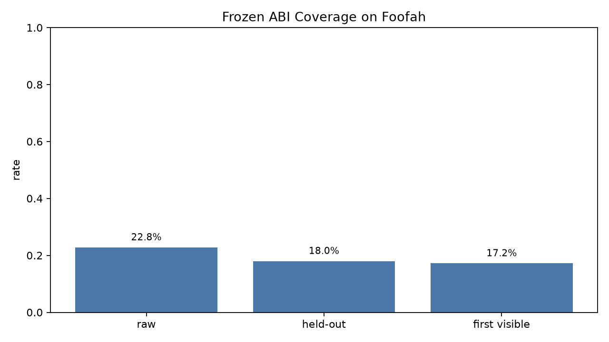
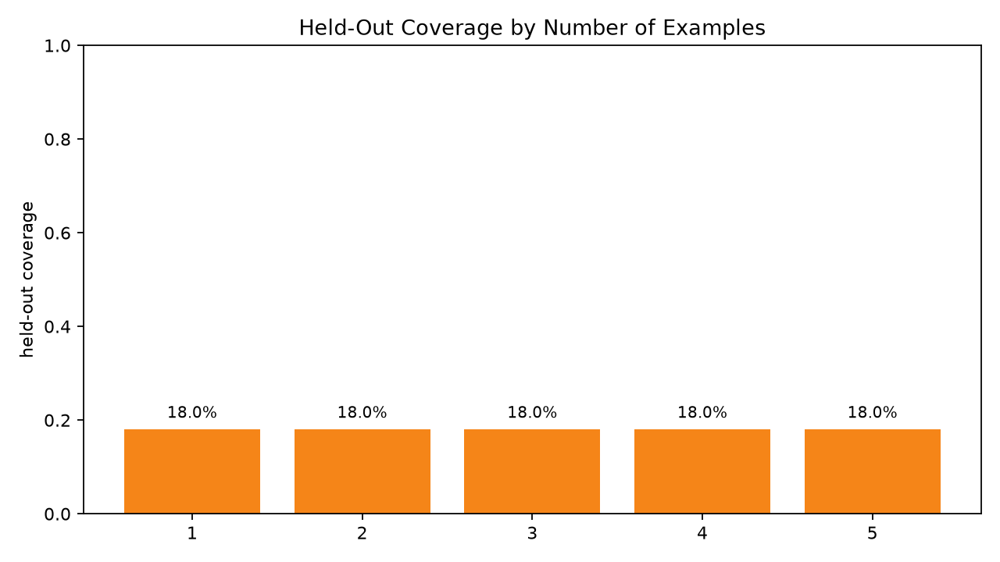
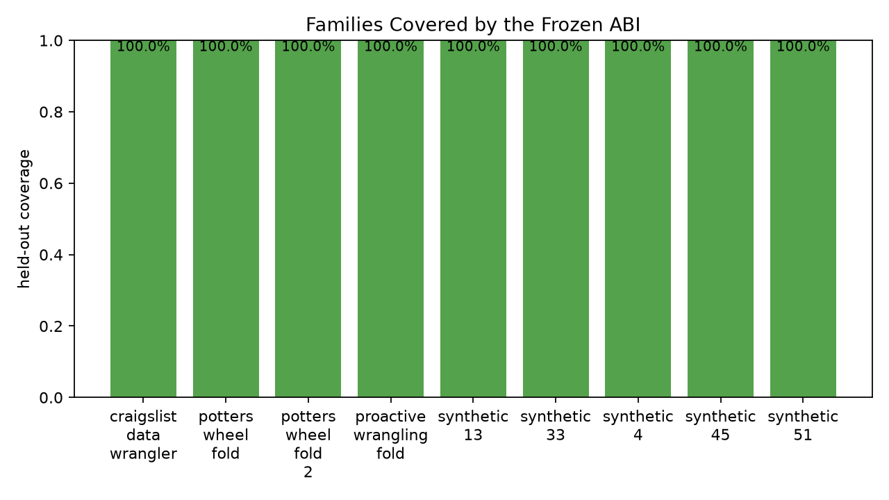

# External Foofah Transformation ABI Gate

## Summary

This standalone gate evaluated a frozen compact table-transformation ABI on the Foofah benchmark format. Each case provides an example pair (`InputTable` -> `OutputTable`) and a separate held-out check (`TestingTable` -> `TestAnswer`).

Main result: the frozen ABI covered **45/250 held-out cases (18.0%)**. Raw example coverage was **57/250 (22.8%)**. First-visible selection solved **43/250 (17.2%)**, nearly all held-out-covered cases, so selection is not the bottleneck.

The gate therefore fails at ABI expressivity on this external benchmark. Model training or constrained scoring would be hard to interpret because the correct program is absent for 82% of cases.

## Source

- Repository: `https://github.com/markjin1990/foofah_benchmarks`
- Local clone: `/workspace/large_artifacts/external_sources/foofah_benchmarks`
- Commit used: `87c0f407e0881622acb02fb20893ca2506713a9a`
- Files evaluated: 250

## Charts

## Results

| Metric | Value |
| --- | ---: |
| Raw example coverage | 57/250 (22.8%) |
| Held-out coverage | 45/250 (18.0%) |
| First-visible held-out accuracy | 43/250 (17.2%) |
| Mean candidate count | 5.6 |
| Winner depth counts | `{'2': 45}` |
| Winner family counts | `{'compose': 45}` |

## Coverage by Example Count

| Num examples | n | Raw coverage | Held-out coverage | First-visible accuracy |
| ---: | ---: | ---: | ---: | ---: |
| 1 | 50 | 20/50 (40.0%) | 9/50 (18.0%) | 8/50 (16.0%) |
| 2 | 50 | 10/50 (20.0%) | 9/50 (18.0%) | 8/50 (16.0%) |
| 3 | 50 | 9/50 (18.0%) | 9/50 (18.0%) | 9/50 (18.0%) |
| 4 | 50 | 9/50 (18.0%) | 9/50 (18.0%) | 9/50 (18.0%) |
| 5 | 50 | 9/50 (18.0%) | 9/50 (18.0%) | 9/50 (18.0%) |

Held-out coverage stays essentially flat as examples increase from 1 to 5, which points to missing primitives rather than ambiguity from too few examples.

## Covered Families

| Family | Held-out covered | Held-out coverage | Mean candidates |
| --- | --- | --- | --- |
| craigslist_data_wrangler | 5/5 | 100.0% | 9.2 |
| potters_wheel_fold | 5/5 | 100.0% | 10.6 |
| potters_wheel_fold_2 | 5/5 | 100.0% | 9.6 |
| proactive_wrangling_fold | 5/5 | 100.0% | 20.8 |
| synthetic_13 | 5/5 | 100.0% | 8.0 |
| synthetic_33 | 5/5 | 100.0% | 49.6 |
| synthetic_4 | 5/5 | 100.0% | 11.4 |
| synthetic_45 | 5/5 | 100.0% | 9.4 |
| synthetic_51 | 5/5 | 100.0% | 9.4 |

Families with zero held-out coverage: 41/50.

## Raw-Only False Coverage Examples

These cases had a candidate that fit the example pair but failed the held-out table. They are the external benchmark analogue of a counterexample filter removing coincidence fits.

| File | Family | Samples | Candidate count | First program |
| --- | --- | --- | --- | --- |
| exp0_15_1.txt | synthetic_15 | 1 | 12 | {"steps": [{"cols": [0, 5], "op": "project_0_5"}, {"cols": [0, 1], "op": "project_0_1"}]} |
| exp0_15_2.txt | synthetic_15 | 2 | 33 | {"steps": [{"header": true, "id_cols": 1, "op": "unpivot_h_skip_id1_s2", "skip_empty": true, "start": 2}, {"cols": [0, 1, 2], "op": "project_first_3"}]} |
| exp0_24_1.txt | synthetic_24 | 1 | 9 | {"steps": [{"op": "transpose"}, {"delim": "-", "op": "split_-"}]} |
| exp0_26_1.txt | synthetic_26 | 1 | 11 | {"steps": [{"op": "transpose"}, {"delim": " ", "op": "split_ "}]} |
| exp0_27_1.txt | synthetic_27 | 1 | 240 | {"steps": [{"cols": [0, 1], "op": "project_0_1"}, {"cols": [0, 1], "op": "project_0_1"}]} |
| exp0_28_1.txt | synthetic_28 | 1 | 9 | {"steps": [{"op": "transpose"}, {"delim": ",", "op": "split_,"}]} |
| exp0_34_1.txt | synthetic_34 | 1 | 90 | {"steps": [{"delim": ",", "op": "split_,"}, {"delim": ",", "op": "split_,"}]} |
| exp0_40_1.txt | synthetic_40 | 1 | 132 | {"steps": [{"cols": [0, 1, 2, 3], "op": "project_first_4"}, {"cols": [0, 1, 2, 3], "op": "project_first_4"}]} |

## Interpretation

This is a negative but useful breadth test. A compact frozen ABI handles a narrow slice of fold/unpivot and regex-extraction cases, but it does not cover most external Foofah transformations. Because first-visible selection nearly matches oracle held-out coverage, model-side selection is not the next bottleneck here.

The next useful experiment is not compiler training on this ABI. It is strict library expansion under a source-independent protocol: add generic table primitives from documentation or a training-only split, freeze them, then rerun this exact held-out gate. Adding task-specific primitives after inspecting the failed files would invalidate the gate.
