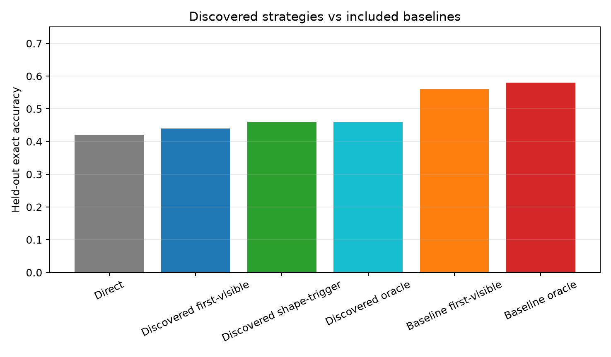
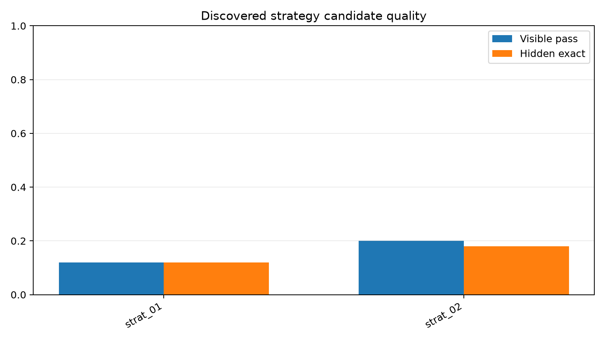
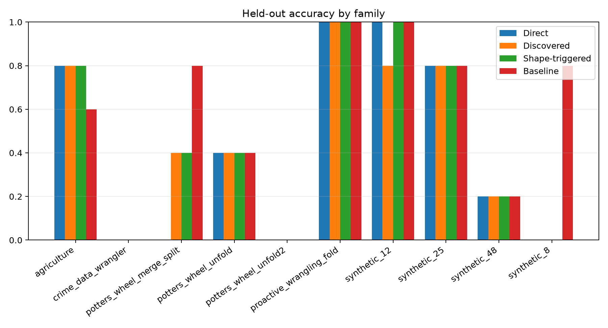

# Live Strategy Discovery

## Summary

This experiment uses Qwen3.5-4B to propose reusable program-generation strategy prompts from calibration examples, freezes those strategies, and evaluates fresh executable-program generations on held-out Foofah-style table transformations.

## Discovered Strategy Cards

### `strat_01`

Name: pivot_long_to_wide

Identify the first column as the identifier and subsequent columns as value columns. Iterate through each value column, extracting rows where the identifier matches, and construct new rows where the identifier is paired with the column header and its corresponding value, effectively transposing the data structure.

### `strat_02`

Name: flatten_row_groups

Detect when multiple rows share identical values in the first column and the remaining columns contain data that should be aggregated horizontally. Group these rows by the first column's value, then concatenate the non-identifier columns from each group into a single row, reducing the row count while expanding the column count.

## Held-Out Result

| Policy | Exact | Accuracy | Tokens | Recoveries | Losses | Commit precision |
|---|---:|---:|---:|---:|---:|---:|
| Direct JSON | 21/50 | 42.0% | included | 0 | 0 | n/a |
| Discovered first-visible | 22/50 | 44.0% | 435,131 | 2 | 1 | 69.2% |
| Discovered shape-triggered | 23/50 | 46.0% | 435,131 | 2 | 0 | 100.0% |
| Discovered oracle union | 23/50 | 46.0% | 435,131 | n/a | n/a | n/a |
| Included baseline first-visible | 28/50 | 56.0% | included | n/a | n/a | n/a |
| Included baseline oracle union | 29/50 | 58.0% | included | n/a | n/a | n/a |

New visible-correct tasks over the included baseline oracle: `0`.

## Strategy Quality

| Strategy | Visible pass | Hidden exact | Tokens |
|---|---:|---:|---:|
| `strat_01` | 6/50 | 6/50 | 172,558 |
| `strat_02` | 10/50 | 9/50 | 188,662 |

## Family Breakdown

| Family | n | Direct | Discovered | Shape-triggered | Baseline first-visible | Discovered oracle |
|---|---:|---:|---:|---:|---:|---:|
| `agriculture` | 5 | 4/5 | 4/5 | 4/5 | 3/5 | 4/5 |
| `crime_data_wrangler` | 5 | 0/5 | 0/5 | 0/5 | 0/5 | 0/5 |
| `potters_wheel_merge_split` | 5 | 0/5 | 2/5 | 2/5 | 4/5 | 2/5 |
| `potters_wheel_unfold` | 5 | 2/5 | 2/5 | 2/5 | 2/5 | 2/5 |
| `potters_wheel_unfold2` | 5 | 0/5 | 0/5 | 0/5 | 0/5 | 0/5 |
| `proactive_wrangling_fold` | 5 | 5/5 | 5/5 | 5/5 | 5/5 | 5/5 |
| `synthetic_12` | 5 | 5/5 | 4/5 | 5/5 | 5/5 | 5/5 |
| `synthetic_25` | 5 | 4/5 | 4/5 | 4/5 | 4/5 | 4/5 |
| `synthetic_48` | 5 | 1/5 | 1/5 | 1/5 | 1/5 | 1/5 |
| `synthetic_8` | 5 | 0/5 | 0/5 | 0/5 | 4/5 | 0/5 |

## Figures

## Interpretation

The decisive question is whether discovered strategies add held-out recoveries that are not already available to the included baseline pool. The first-visible row measures deployable commitment if any discovered program passes the public example; the shape-triggered row avoids committing discovered programs outside a simple public column-contraction trigger; the oracle row measures coverage if selection were perfect.

## Limitations

- Evaluation used `max_discovered=2`, `max_repairs=1`, and `limit_test=all`.
- Direct and included baseline metrics are read from local records packaged with this experiment; discovered strategy programs are freshly generated in this run.
- This is still a small held-out benchmark and should be repeated across additional family splits before any strategy card is treated as robust.
