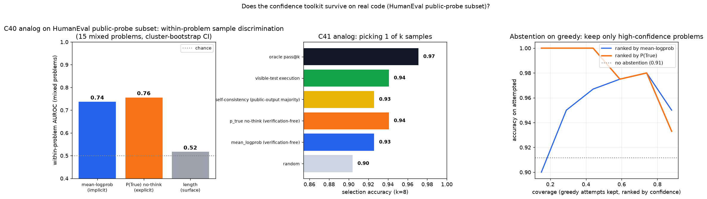

# Qwen3.5-4B: Does Code Confidence Replicate on HumanEval?

Standalone HumanEval replication of the C46 code-confidence result: test whether
the P(True) judgment-token readout beats verifier-free sample-more baselines on
HumanEval.

## Research Program

- Programs: `benchmark_generalization`, `evidence_conditioned_selection`
- Program question: does the real-code confidence result from C46 survive a
  second program-synthesis substrate when public probes are removed?
- Prior anchors: C40 (`qwen35_4b_implicit_metacognition`) found calibrated
  single-answer-token confidence on a toy substrate; C41
  (`qwen35_4b_confidence_guided_compute`) used that confidence to beat
  self-consistency; C46 (`qwen35_4b_code_confidence`) transferred the idea to
  MBPP and found that program-level confidence is P(True), not sequence
  mean-logprob.

## Question

On HumanEval, with no public tests available to execute or cluster on, can a
single-token P(True) self-judge readout pick better samples than random
selection and sequence mean-logprob?

## Hypothesis

If C46's refined law is real, calibrated uncertainty should live in a
concentrated judgment-token logit readout. P(True) should beat sequence
mean-logprob, because averaging logprob over hundreds of code tokens dilutes the
correctness signal.

## Setup

- Model: `Qwen/Qwen3.5-4B`, no-think generation and no-think judging.
- Dataset/task source: all 164 HumanEval tasks, using hidden tests only for
  scoring. The main run uses `--visible-tests 0`, so no method can execute or
  cluster on public probes.
- Train/eval split: no training. Each problem gets one greedy candidate plus 8
  sampled candidates.
- Baselines: random-pick expectation and sequence mean-logprob; oracle pass@8
  brackets remaining headroom.
- Controls: code-length surface baseline, within-problem AUROC on mixed
  problems only, paired bootstrap over tasks for selection deltas.
- Primary metrics: selection accuracy at k=8, within-problem AUROC of confidence
  vs correctness, and greedy solvability AUROC.
- Oracle-only metrics: `full_pass` and pass@8 use hidden tests for scoring only.
- Hidden-label boundary: P(True) and mean-logprob read only model logits; no
  selector sees hidden-test results.

## Run

Smoke:

```bash
python scripts/run.py --smoke
```

Full HumanEval no-public-probe replication:

```bash
python scripts/run.py
```

Public-probe diagnostic, limited to the 68 HumanEval tasks with one parseable
doctest example:

```bash
python scripts/run.py --visible-tests 1 --out-name humaneval_code_conf --title "HumanEval public-probe subset" --judge-batch-size 1
```

## Results

Main all-task no-probe run:

- Selection at k=8: random 0.766, mean-logprob 0.787, P(True) 0.835, oracle
  pass@8 0.872.
- P(True) beats mean-logprob by +0.049 (paired bootstrap CI 0.012 to 0.091,
  p=0.011) and random by +0.069 (p<0.001).
- Within-problem AUROC on 51 mixed problems: length 0.573, mean-logprob 0.672,
  P(True) 0.779. P(True) beats the length baseline by +0.351 (CI 0.229 to
  0.475).
- Greedy solvability AUROC: P(True) 0.862 vs mean-logprob 0.734 and length
  0.612.


The public-probe diagnostic is ceiling-limited but useful for comparison with
MBPP's visible-test setting:

- 68 tasks with one parseable doctest public example.
- Selection: random 0.904, mean-logprob 0.926, public-output majority 0.926,
  P(True) 0.941, visible-test execution 0.941, oracle 0.971.
- P(True) beats random (+0.037, p=0.020) but does not significantly beat
  public-output majority or mean-logprob on this easy subset.



## Interpretation

This independently supports the C46 law on a second code benchmark:
verification-free confidence should be read from a concentrated P(True)
judgment-token logit, not from sequence-averaged completion likelihood. The
result is not just verbosity: the P(True) within-problem AUROC is far above the
length baseline. It also sharpens the deployment boundary: when public tests
exist, executing them remains the stronger method; when no verifier is available,
P(True) is the selector and abstention signal.

## Knowledgebase Update

- Program evidence updated: `benchmark_generalization` and
  `evidence_conditioned_selection`.
- Claim ledger updated: C46 now cites this standalone HumanEval replication
  alongside the MBPP experiment.
- Shared synthesis updated: C46 is a two-experiment result, not a single
  extended experiment.

## Artifacts

- `src/` and `scripts/` contain the standalone HumanEval-capable harness copied
  into this experiment.
- `configs/default.yaml` records the HumanEval no-probe setup.
- `runs/humaneval_code_conf_novis*.json` are the full no-public-probe run.
- `runs/humaneval_code_conf*.json` are the public-probe diagnostic subset.
- `analysis/` contains the no-probe and public-probe figures.
- `reports/report.md`, `reports/design_review.md`, and
  `reports/artifact_manifest.yaml` document the result and reproduction path.
