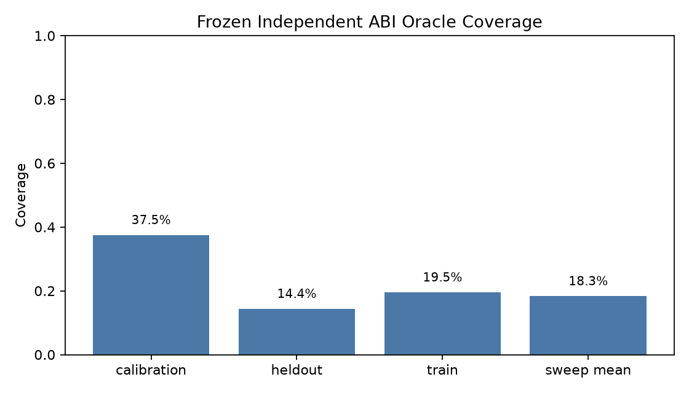
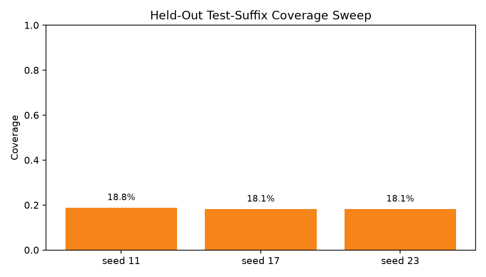
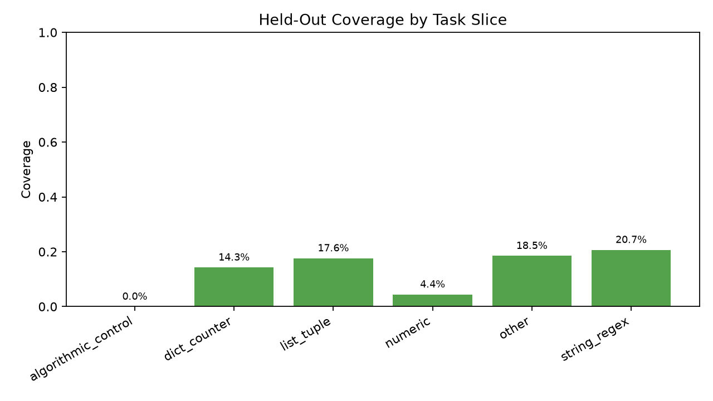
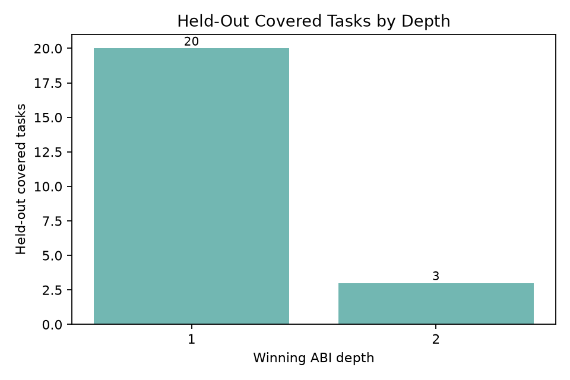
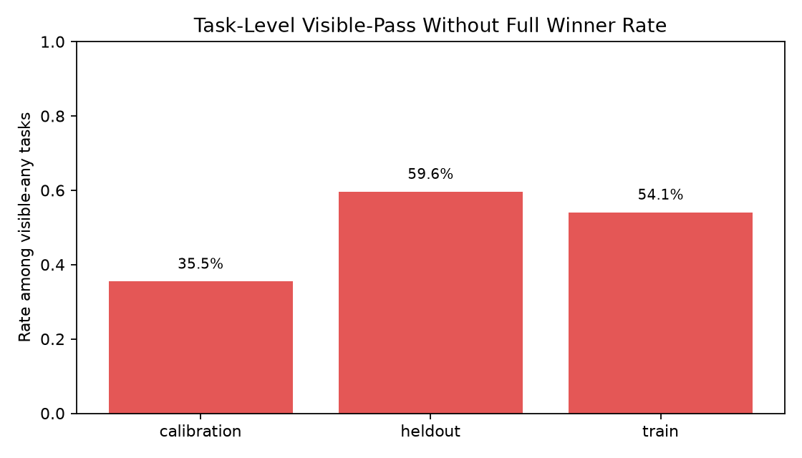

# Independent Code ABI Coverage Gate

## Purpose

This standalone no-training experiment tests whether an independently specified Python/stdlib-style ABI covers held-out MBPP tasks at a useful rate. The ABI was frozen before evaluation. No kernels were added after looking at held-out misses.

## Frozen ABI

The inventory contains generic Python operations: argument routing, list/tuple transforms, dictionary/counter utilities, regex/string transforms, predicates and label adapters, bounded arithmetic/combinatorics/bit utilities, and small generic compositions. At max arity 4 the inventory enumerates 903 candidates: {'dict_counter': 14, 'generic': 8, 'list_tuple': 189, 'numeric': 296, 'predicate': 32, 'predicate_label': 264, 'string_regex': 100}.

This is an oracle coverage gate, not a learned compiler and not a deployable solver. Coverage means at least one ABI candidate passes all available tests for a task.

## Headline Result

Held-out coverage is low. The frozen independent ABI covers 23/160 held-out tasks (14.4%). The three-seed held-out sweep averages 18.3%, range 18.1%-18.8%.

Calibration coverage is higher at 37.5%, but the held-out slice and random sweep are the primary readout.

| split | n | oracle-covered | oracle coverage | first-visible correct | visible-any tasks | task false-pass rate | candidate hidden-wrong rate | mean candidates |
|---|---:|---:|---:|---:|---:|---:|---:|---:|
| calibration | 160 | 60 | 37.5% | 35 | 93 | 35.5% | 82.6% | 219.8 |
| heldout | 160 | 23 | 14.4% | 7 | 57 | 59.6% | 91.9% | 247.1 |
| train | 374 | 73 | 19.5% | 36 | 159 | 54.1% | 84.3% | 241.6 |

## Held-Out Sweep

| seed | n | oracle-covered | oracle coverage | first-visible correct | task false-pass rate |
|---:|---:|---:|---:|---:|---:|
| 11 | 160 | 30 | 18.8% | 10 | 44.4% |
| 17 | 160 | 29 | 18.1% | 13 | 47.3% |
| 23 | 160 | 29 | 18.1% | 9 | 50.8% |

## Slice Diagnostics

| slice | n | oracle-covered | oracle coverage | first-visible correct | task false-pass rate |
|---|---:|---:|---:|---:|---:|
| algorithmic_control | 1 | 0 | 0.0% | 0 | 100.0% |
| dict_counter | 7 | 1 | 14.3% | 1 | 50.0% |
| list_tuple | 51 | 9 | 17.6% | 3 | 50.0% |
| numeric | 45 | 2 | 4.4% | 0 | 88.2% |
| other | 27 | 5 | 18.5% | 1 | 50.0% |
| string_regex | 29 | 6 | 20.7% | 2 | 33.3% |

## Depth Diagnostics

Held-out covered tasks by winning depth: {'1': 20, '2': 3}. Most covered tasks are depth-1 single-primitive hits; held-out composition coverage is very small.

## False-Pass Pressure

Visible-test filtering is not reliable. On held-out tasks, 57 tasks have at least one visible-consistent candidate, but the task-level visible-pass/no-full-winner rate is 59.6%, and the candidate-level hidden-wrong rate among visible-consistent candidates is 91.9%.

## Covered Held-Out Examples

| task | slice | depth | winning program | task |
|---:|---|---:|---|---|
| 175 | string_regex | 1 | `{"arg": 0, "op": "all_distinct_arg0"}` | Write a function to verify validity of a string of parentheses. |
| 190 | numeric | 1 | `{"args": [2, 0], "op": "floordiv_2_0"}` | Write a python function to count the number of integral co-ordinates that lie inside a squ |
| 191 | other | 1 | `{"arg": 0, "op": "all_distinct_arg0"}` | Write a function to check whether the given month name contains 30 days or not. |
| 192 | string_regex | 1 | `{"arg": 0, "op": "has_duplicate_arg0"}` | Write a python function to check whether a string has atleast one letter and one number. |
| 201 | list_tuple | 1 | `{"arg": 0, "op": "has_duplicate_arg0"}` | Write a python function to check whether the elements in a list are same or not. |
| 203 | other | 1 | `{"args": [1, 0], "op": "floordiv_1_0"}` | Write a python function to find the hamming distance between given two integers. |
| 204 | string_regex | 1 | `{"args": [0, 1], "op": "count_0_1"}` | Write a python function to count the occurrence of a given character in a string. |
| 211 | other | 1 | `{"arg": 0, "op": "bit_count_arg0"}` | Write a python function to count numbers whose oth and nth bits are set. |
| 216 | list_tuple | 2 | `{"args": [0, 1], "op": "contains_subsequence_0_1"}` | Write a function to check if a nested list is a subset of another nested list. |
| 223 | list_tuple | 1 | `{"arg": 1, "op": "is_odd_arg1"}` | Write a function to check for majority element in the given sorted array. |

Some covered tasks are likely test-suite coincidences rather than semantic equivalence. That makes the low held-out coverage an optimistic upper bound, not a pessimistic one.

## Decision

This gate does not support a code-ABI compiler-training run. A frozen independent ABI covers only about 14-18% of held-out MBPP tasks, mostly as depth-1 single-primitive matches. Training a compiler on this ABI would have too little held-out expressivity to test broad reusable code compilation.

The useful next step is not to add task-specific kernels. A better test would use a real independently curated task domain whose tasks are known to be deterministic transformations, then repeat this same held-out coverage gate.

## Files

- `scripts/run_independent_abi_gate.py`: frozen ABI evaluator and gate runner.
- `reports/coverage_gate_summary.json`: all summary metrics.
- `data/calibration_records.jsonl`, `data/heldout_records.jsonl`, `data/train_records.jsonl`: per-task records.
- `data/sweep_records.jsonl`: per-task sweep records.
- `reports/figures/`: generated charts.
