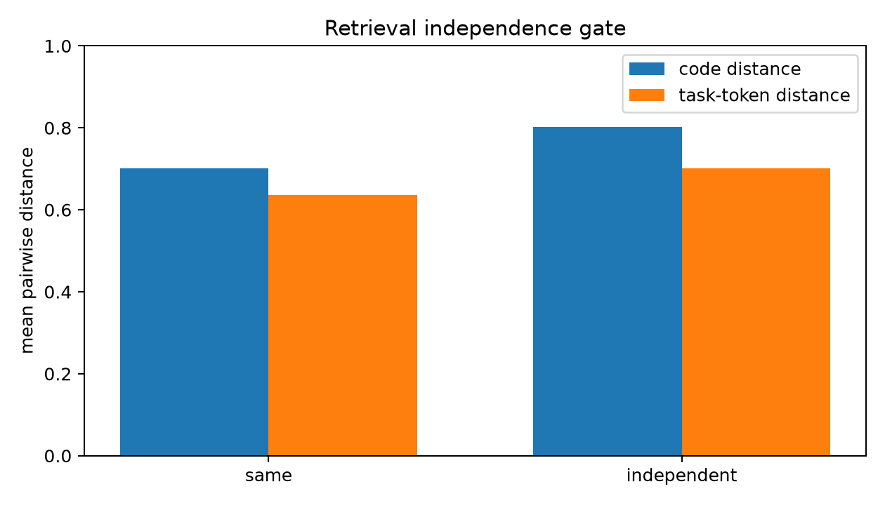
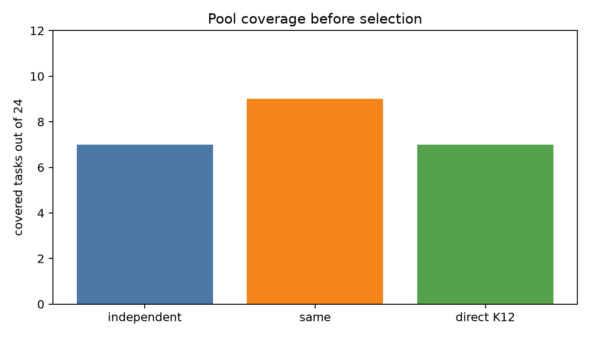
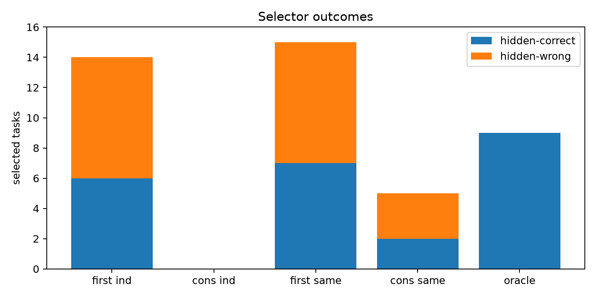
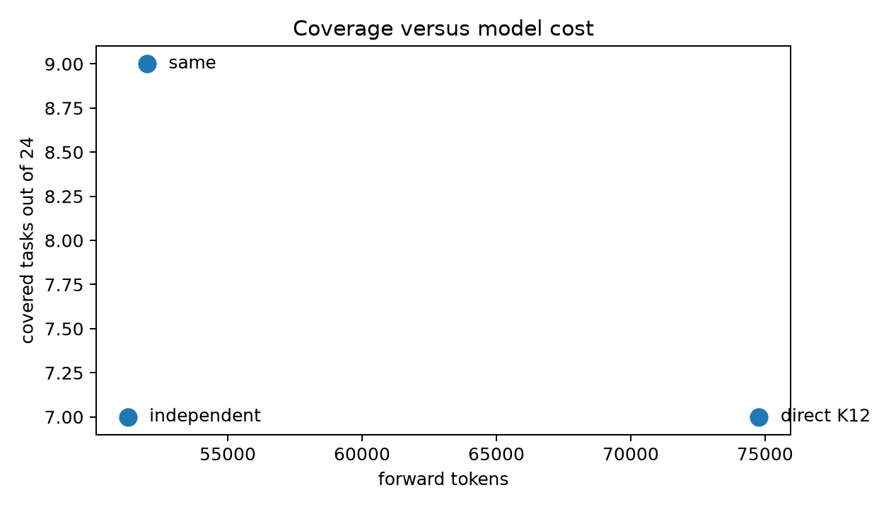

# qwen35_4b_independent_retrieval_consensus

Date: 2026-06-26

## Decision

Independent-retrieval consensus does **not** pass the deployable gate in this run. The retrieval planner did create more independent sources, but the generated independent adaptations did not converge on disagreement probes. With the mechanism-faithful rule that requires at least one generated disagreement probe, independent consensus committed on **0/24** tasks. First-visible on the same independent pool selected **6/24** hidden-correct tasks, with 8 hidden-wrong visible-pass selections.

The stronger pool was the non-independent same-neighborhood control: it had **9/24** oracle coverage versus **7/24** for independent retrieval and **7/24** for direct K12 sampling. But same-neighborhood consensus still failed selection: min-2 consensus selected **2/24** hidden-correct and 3 hidden-wrong tasks.

## Question

Can independently retrieved verified algorithms supply the missing behavioral evidence for selecting correct retrieval-adapt candidates without hidden-test labels?

## Setup

- Residual tasks: 24 MBPP heldout tasks missed by the base direct K=4 pool.
- Library: 364 verified algorithms.
- Retrieval arms: top-6 same-neighborhood semantic retrieval and top-6 MMR-diversified independent retrieval.
- Generation: one Qwen3.5-4B adaptation per retrieved algorithm, T=0.2, top-p 0.95.
- Consensus: generate up to 64 input probes from public test perturbations, choose up to 8 calls that split visible-passing candidates, and commit only when at least 2 or 3 distinct retrieved sources agree on the same output signature.
- Baseline: direct K12 sample-more on the same 24 residual tasks.

## Independence Gate

| retrieval set | code distance | task-token distance | mean retrieval score |
|---|---:|---:|---:|
| same-neighborhood | 0.701 | 0.635 | 0.237 |
| independent MMR | 0.803 | 0.700 | 0.226 |

The build gate passed: independent retrieval increased source-code and task-token distance while retaining similar semantic score.

## Pool Coverage

| pool | coverage | visible-pass hidden-wrong rate | candidates/task | forward tokens |
|---|---:|---:|---:|---:|
| independent retrieval-adapt top-6 | 29.2% | 76.2% | 5.62 | 51,282 |
| same-neighborhood retrieval-adapt top-6 | 37.5% | 64.1% | 5.38 | 52,001 |
| direct sample-more K12 | 29.2% | not selector pool | 11.50 | 74,780 |

Independence did not improve coverage. It lowered coverage relative to the same-neighborhood control and matched direct K12.

## Consensus Selection

| selector | commits | hidden-correct commits | hidden-wrong commits | false-pass rate |
|---|---:|---:|---:|---:|
| first visible independent | 14 | 6 | 8 | 57.1% |
| independent consensus min-2 | 0 | 0 | 0 | 0.0% |
| independent consensus min-3 | 0 | 0 | 0 | 0.0% |
| first visible same-neighborhood | 15 | 7 | 8 | 53.3% |
| same-neighborhood consensus min-2 | 5 | 2 | 3 | 60.0% |
| same-neighborhood consensus min-3 | 2 | 0 | 2 | 100.0% |
| oracle independent | 7 | 7 | 0 | 0.0% |
| oracle same-neighborhood | 9 | 9 | 0 | 0.0% |
| oracle union | 9 | 9 | 0 | 0.0% |

Strict independent consensus had no deployable commits because no covered task had cross-source agreement on actual disagreement probes. Same-neighborhood consensus committed sometimes, but its false-pass rate remained high.

## Probe Diagnostics

| pool | tasks with generated disagreement probes | mean selected probes/task |
|---|---:|---:|
| independent | 7/24 | 1.25 |
| same-neighborhood | 8/24 | 1.54 |

Covered independent tasks were [15, 35, 36, 42, 44, 67, 87]. Covered same-neighborhood tasks were [15, 35, 36, 42, 44, 67, 73, 77, 87].

The key failure mode is not just a conservative threshold. Independent adaptations often produced no source-agreement cluster after target-independent disagreement probes. When agreement existed in same-neighborhood candidates, it was often agreement on the wrong behavior.

## Cost

- Independent retrieval-adapt: 51,282 forward tokens.
- Same-neighborhood retrieval-adapt: 52,001 forward tokens.
- Direct K12 sample-more: 74,780 forward tokens.

The strongest coverage/cost point here is same-neighborhood retrieval-adapt, not independent consensus. It still does not solve deployable selection.

## Interpretation

The hypothesis was plausible: independent derivations agreeing should provide evidence unavailable to any single-candidate judge. The implementation successfully increased retrieval independence, but that independence did not translate into useful agreement. Instead, it mostly reduced relevance and coverage. The non-independent control remained more coverage-effective, and consensus over it did not suppress false-pass enough to beat first-visible.

This is a negative for independent-retrieval consensus as implemented here. The result narrows the next direction: the missing evidence probably needs either stronger, task-targeted counterexample generation with a real oracle, or a larger/higher-quality verified library where multiple genuinely relevant independent algorithms exist for the same residual task. Merely diversifying among the current 364 MBPP-derived algorithms did not produce independent correct convergence.

## Artifacts

- Data: `data/`
- Run logs: `run_logs/`
- Summaries and figures: `reports/`
- Experiment log: `logs/experiment_log.md`
- Large artifact manifest: `large_artifacts_manifest.md`
