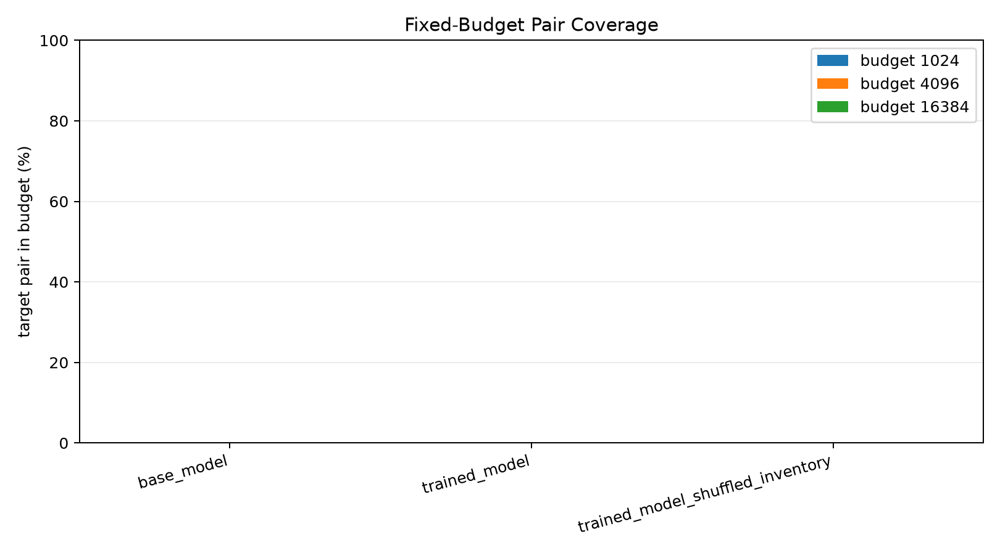
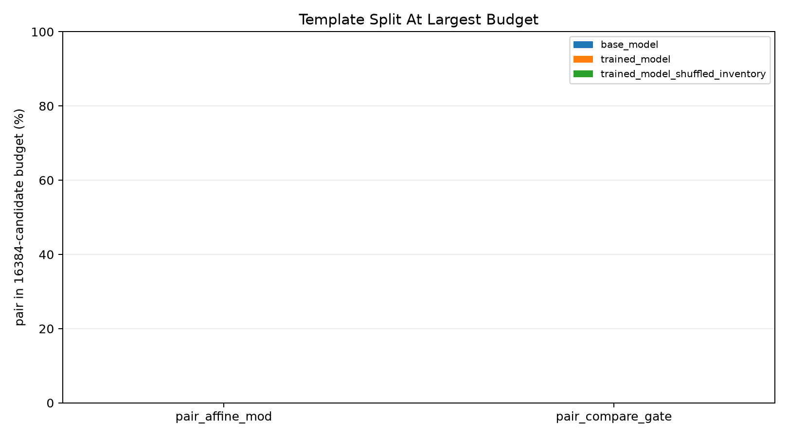
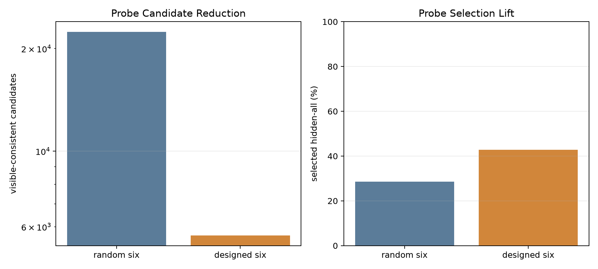
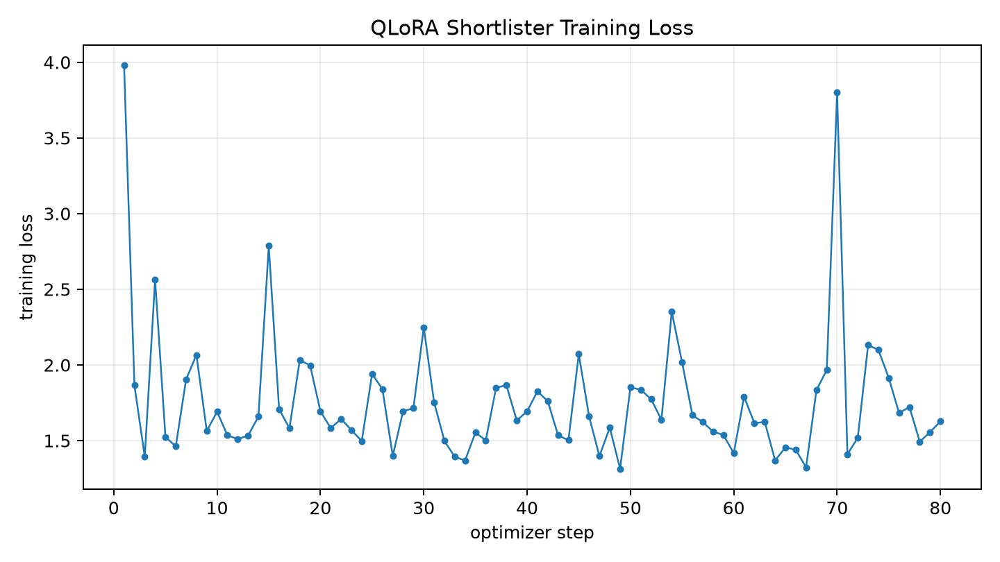

# Qwen3.5-4B Inventory Shortlister Training Report

## Summary

This standalone experiment trains a QLoRA adapter on Qwen3.5-4B to shortlist operators for two-hole 512-operator programs. The model predicts LEFT and RIGHT aliases independently; candidate budgets are formed as top-32 x top-32, top-64 x top-64, and top-128 x top-128.

Training completed and produced a LoRA adapter outside the experiment directory. Final logged loss was `1.6272`.

The constrained decoder used beam width `32`, so the exact fixed-budget measurement is `1024` candidate pairs. Larger budget columns are lower bounds from the same beams, not full top-64/top-128 evaluations.

The trained model's exact `1024`-candidate pair coverage is `0.0%`. The shuffled-inventory control is `0.0%`, testing whether gains depend on the alias-description mapping.

## Fixed-Budget Pair Coverage

| control | records | top1 % | 1024 exact % | 4096 lower-bound % | 16384 lower-bound % |
| --- | --- | --- | --- | --- | --- |
| base_model | 16 | 0.0 | 0.0 | 0.0 | 0.0 |
| trained_model | 16 | 0.0 | 0.0 | 0.0 | 0.0 |
| trained_model_shuffled_inventory | 16 | 0.0 | 0.0 | 0.0 | 0.0 |

## Template Split

| control | template | records | 1024 % | 16384 % |
| --- | --- | --- | --- | --- |
| base_model | pair_affine_mod | 9 | 0.0 | 0.0 |
| base_model | pair_compare_gate | 7 | 0.0 | 0.0 |
| trained_model | pair_affine_mod | 9 | 0.0 | 0.0 |
| trained_model | pair_compare_gate | 7 | 0.0 | 0.0 |
| trained_model_shuffled_inventory | pair_affine_mod | 9 | 0.0 | 0.0 |
| trained_model_shuffled_inventory | pair_compare_gate | 7 | 0.0 | 0.0 |

## Observation Design Diagnostic

For low-information comparison records, a max-split six-query design was compared against the random six visible cases. This diagnostic uses the executable task generator to measure how much better observations can reduce ambiguity before selection.

- Random six visible cases left `22396.286` candidates on average.
- Designed six cases left `5656.286` candidates on average.
- Random selected-hidden-all was `28.6%`.
- Designed selected-hidden-all was `42.9%`.

## Training Loss

## Decision

This run directly tests whether Qwen3.5-4B can turn inventory-conditioned examples into a useful two-hole shortlist. At this pilot scale, it does not: trained, base, and shuffled controls all miss the exact 1024-candidate budget on the evaluated subset. The next lever should be structured semantic search or a different supervision/evaluation interface, not simply larger blind beam search.

The observation diagnostic is more promising: designed probes reduce the low-information ambiguity substantially, though not enough to solve selection by themselves.

## Artifacts

- Dataset manifest: `data/dataset_manifest.json`
- Train slots: `data/train_slots.jsonl`
- Eval records: `data/eval_records.jsonl`
- Results: `reports/shortlister_results.json`
- Training losses: `reports/training_losses.json`
- Large artifacts: `/workspace/large_artifacts/qwen35_4b_inventory_shortlister_training`
