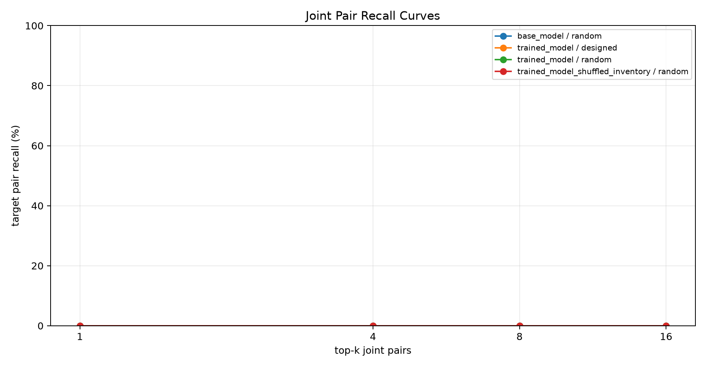
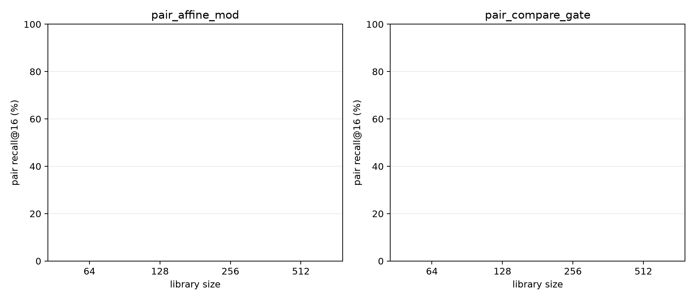
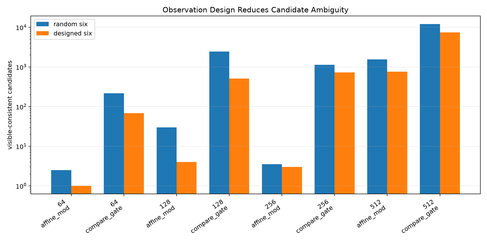
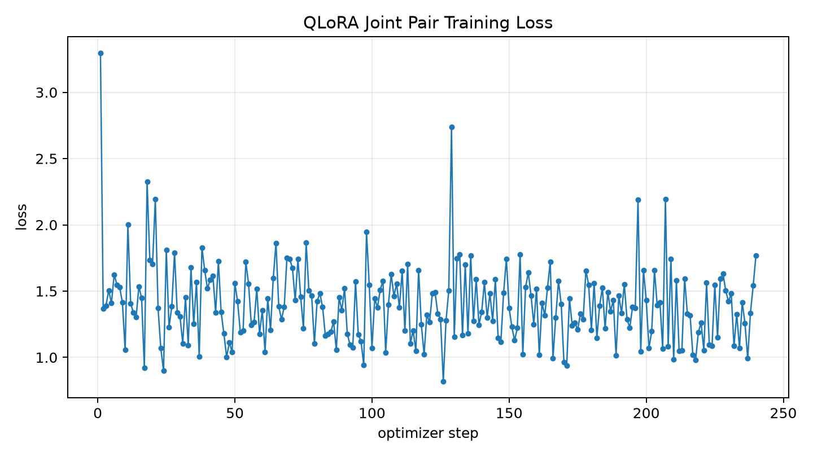

# Qwen3.5-4B Joint Shortlister Ladder Report

## Summary

This standalone experiment tests whether Qwen3.5-4B can emit a joint two-operator shortlist when operator aliases are record-local and must be read from an inventory. The task ladder crosses library sizes `64, 128, 256, 512` with a higher-information numeric template and a lower-information comparison template. The adapter predicts the pair as `LLL,RRR`; evaluation reports exact recall@k over joint pairs, plus marginal LEFT and RIGHT recall.

Training produced a LoRA adapter outside this package under `/workspace/large_artifacts/qwen35_4b_joint_shortlister_ladder/models/joint_pair_lora`. The logged loss moved from `3.2945` to `1.7692` over `240` optimizer steps.

The main pilot result is trained random-observation pair recall@16 of `0.0%`, trained designed-observation pair recall@16 of `0.0%`, base random pair recall@16 of `0.0%`, and shuffled-inventory random pair recall@16 of `0.0%`. A beam-32 run hit CUDA OOM in the trained 512-operator condition; exact model recall is therefore reported through beam `16`.

## Joint Pair Recall

| condition | records | pair@1 % | pair@8 % | pair@16 % | left@16 % | right@16 % |
| --- | --- | --- | --- | --- | --- | --- |
| base_model / random | 16 | 0.0 | 0.0 | 0.0 | 0.0 | 6.2 |
| trained_model / designed | 16 | 0.0 | 0.0 | 0.0 | 12.5 | 18.8 |
| trained_model / random | 16 | 0.0 | 0.0 | 0.0 | 12.5 | 18.8 |
| trained_model_shuffled_inventory / random | 16 | 0.0 | 0.0 | 0.0 | 12.5 | 12.5 |

## Difficulty Ladder

| observation | library | template | records | pair@16 % | left@16 % | right@16 % |
| --- | --- | --- | --- | --- | --- | --- |
| designed | 64 | pair_affine_mod | 2 | 0.0 | 50.0 | 0.0 |
| designed | 64 | pair_compare_gate | 2 | 0.0 | 50.0 | 0.0 |
| designed | 128 | pair_affine_mod | 2 | 0.0 | 0.0 | 50.0 |
| designed | 128 | pair_compare_gate | 2 | 0.0 | 0.0 | 50.0 |
| designed | 256 | pair_affine_mod | 2 | 0.0 | 0.0 | 0.0 |
| designed | 256 | pair_compare_gate | 2 | 0.0 | 0.0 | 0.0 |
| designed | 512 | pair_affine_mod | 2 | 0.0 | 0.0 | 50.0 |
| designed | 512 | pair_compare_gate | 2 | 0.0 | 0.0 | 0.0 |
| random | 64 | pair_affine_mod | 2 | 0.0 | 50.0 | 0.0 |
| random | 64 | pair_compare_gate | 2 | 0.0 | 50.0 | 0.0 |
| random | 128 | pair_affine_mod | 2 | 0.0 | 0.0 | 50.0 |
| random | 128 | pair_compare_gate | 2 | 0.0 | 0.0 | 50.0 |
| random | 256 | pair_affine_mod | 2 | 0.0 | 0.0 | 0.0 |
| random | 256 | pair_compare_gate | 2 | 0.0 | 0.0 | 0.0 |
| random | 512 | pair_affine_mod | 2 | 0.0 | 0.0 | 50.0 |
| random | 512 | pair_compare_gate | 2 | 0.0 | 0.0 | 0.0 |

## Observation Design

The max-split probe diagnostic measures whether six designed cases carry more identifying information than six random visible cases before any model shortlist is applied. Across the diagnostic subset, random six-case observations leave `2177.406` visible-consistent candidates on average; designed six-case observations leave `1191.25`.

| library | template | records | random survivors | designed survivors | random select % | designed select % |
| --- | --- | --- | --- | --- | --- | --- |
| 64 | pair_affine_mod | 4 | 2.5 | 1.0 | 75.0 | 100.0 |
| 64 | pair_compare_gate | 4 | 216.5 | 68.2 | 0.0 | 0.0 |
| 128 | pair_affine_mod | 4 | 29.8 | 4.0 | 75.0 | 100.0 |
| 128 | pair_compare_gate | 4 | 2458.8 | 511.8 | 25.0 | 50.0 |
| 256 | pair_affine_mod | 4 | 3.5 | 3.0 | 100.0 | 100.0 |
| 256 | pair_compare_gate | 4 | 1131.5 | 729.8 | 25.0 | 0.0 |
| 512 | pair_affine_mod | 4 | 1558.0 | 756.2 | 100.0 | 100.0 |
| 512 | pair_compare_gate | 4 | 12018.8 | 7456.0 | 0.0 | 0.0 |

## Training Loss

## Interpretation

This experiment is designed to avoid a floored binary result: it reports marginal recalls, joint recall curves, shuffled-inventory controls, and a library-by-template ladder. A useful model-side effect should show up as trained recall separating from both base and shuffled controls, with the gap changing smoothly across the ladder.

That separation did not appear. Pair recall stayed at zero in every model condition. The adapter moved marginal recall above base, but shuffled inventory retained nearly the same marginal signal, so this is not evidence that the model is reading the alias-description binding. Designed observations reduced exhaustive ambiguity, but did not change model pair recall.

The result points away from simply training the same prompt longer as the next step. The more useful next test is a lower-entropy action interface: score or classify candidate pairs produced by executable filtering, or train a reranker over a compact candidate set, while keeping the designed-observation machinery because it continues to reduce ambiguity in the executable substrate.

## Artifacts

- Dataset manifest: `data/dataset_manifest.json`
- Train pairs: `data/train_pairs.jsonl`
- Eval records: `data/eval_records.jsonl`
- Results: `reports/joint_shortlister_results.json`
- Training losses: `reports/training_losses.json`
- Large adapter: `/workspace/large_artifacts/qwen35_4b_joint_shortlister_ladder/models/joint_pair_lora`
