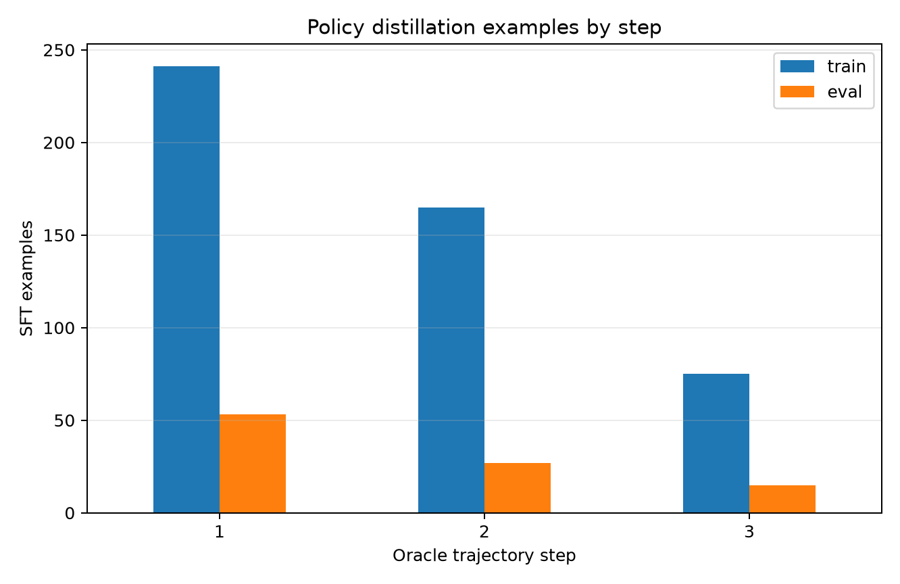
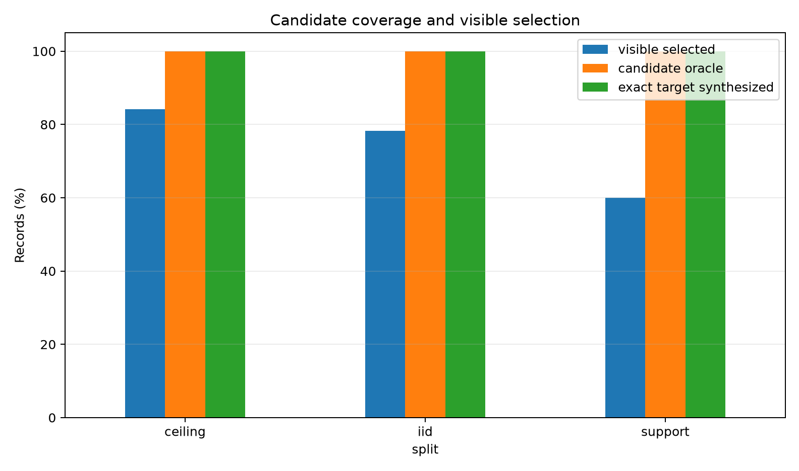
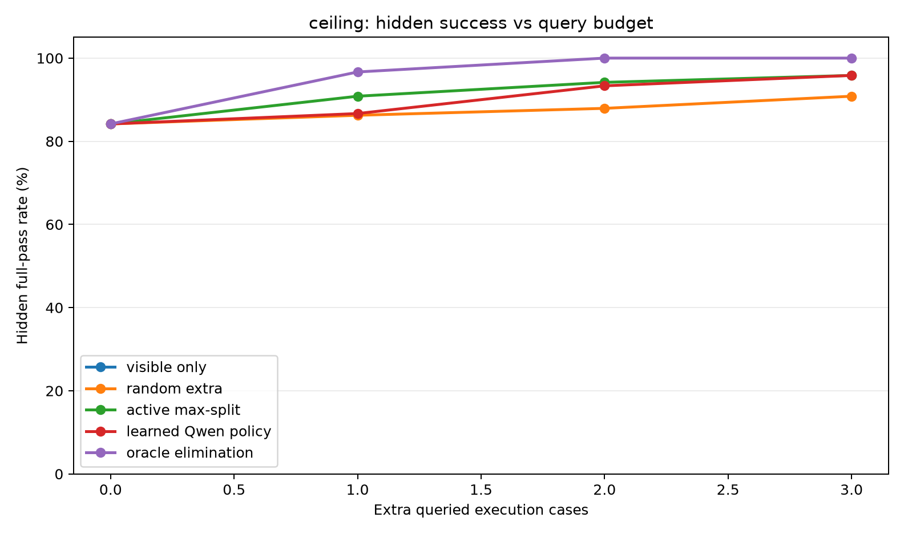
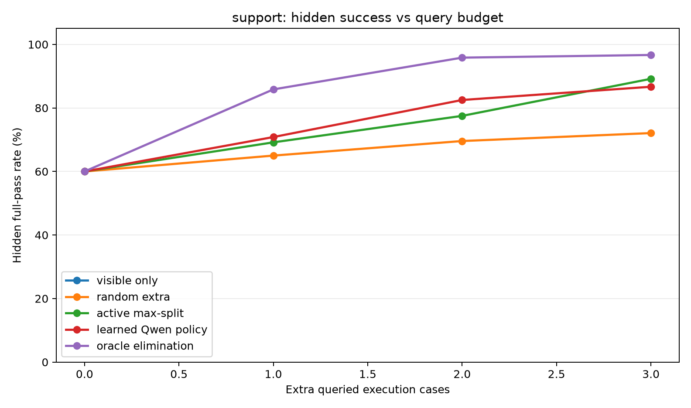
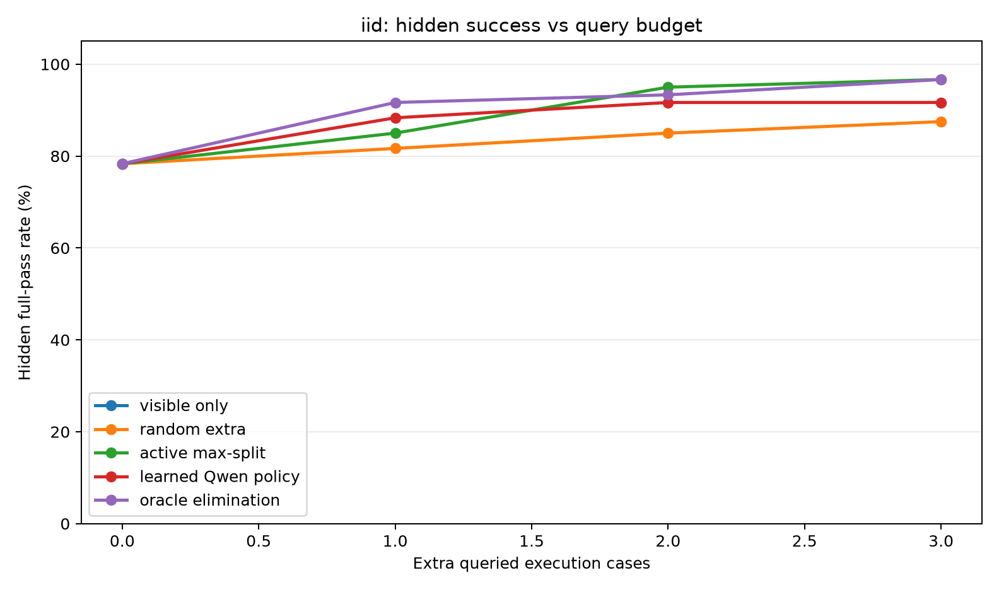
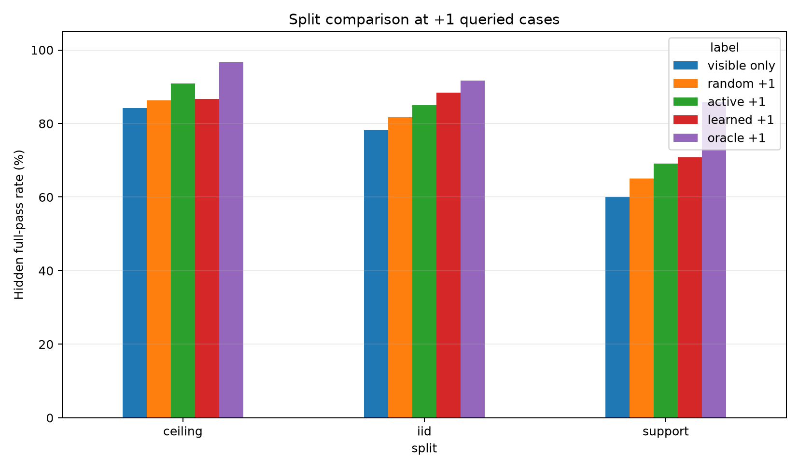
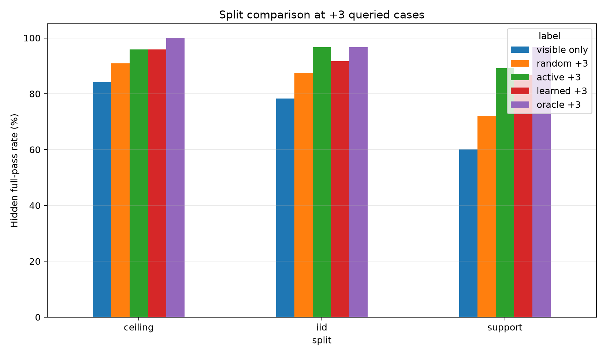
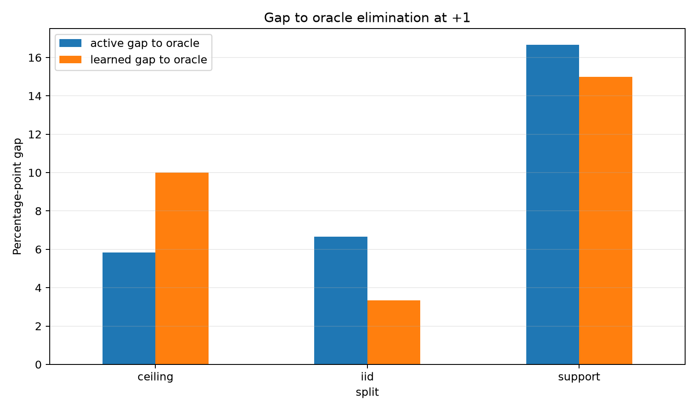
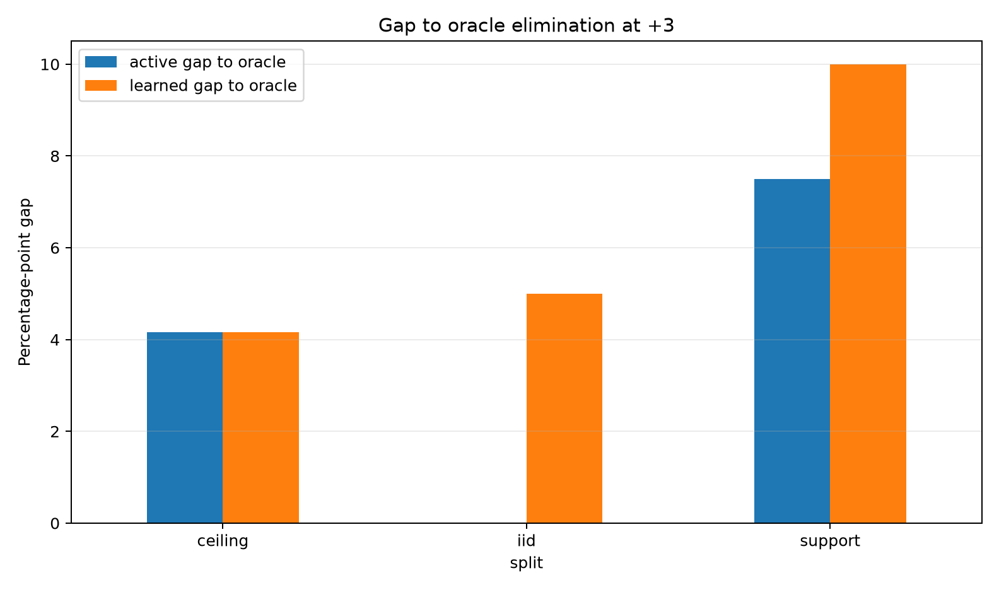
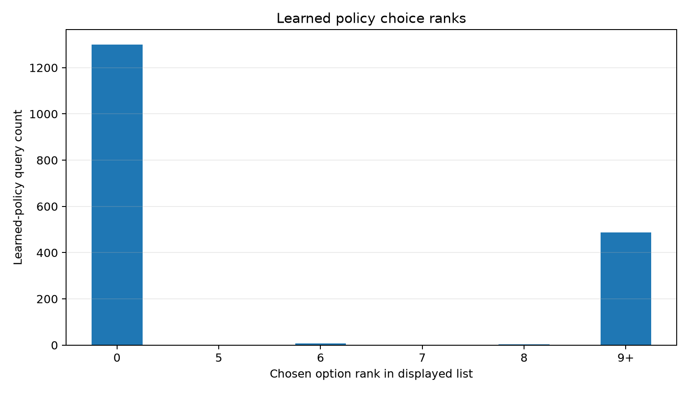

# Qwen3.5-4B Learned Active Trace Policy Report

## Summary

This standalone experiment tests whether a Qwen3.5-4B LoRA can learn a low-budget active trace policy for selecting query inputs after typed-sketch candidate synthesis. The learned controller is trained by oracle-action distillation: each training state displays visible examples and candidate-output buckets for possible query inputs, while the target answer is the displayed query option that eliminates the most wrong candidates.

The query prompt does not reveal the held-out expected output for candidate query inputs. The policy must infer which output bucket is likely correct from the visible examples and candidate-output structure.

## Key Findings

- Candidate coverage was perfect on all splits: candidate oracle and exact target synthesis both reached `100%`. Remaining failures are policy/control failures, not synthesis failures.
- The learned Qwen policy was mechanically reliable: parse rate was `1.0` on ceiling, support, and IID, with no fallback actions.
- The learned policy improved the single-query regime on support and IID:
  - support +1: learned `85/120` vs active max-split `83/120`;
  - IID +1: learned `53/60` vs active max-split `51/60`.
- The learned policy did not improve the primary ceiling +1 regime: learned `104/120` vs active max-split `109/120`, with oracle elimination at `116/120`.
- At larger low budgets, the learned policy was mixed:
  - ceiling +3 matched active max-split at `115/120`;
  - support +2 beat active max-split, `99/120` vs `93/120`;
  - support +3 and IID +2/+3 fell behind active max-split.
- The learned policy chose nontrivial option ranks, but its chosen actions eliminated far fewer candidates than the oracle action on average. This points to a real learned first-query signal, but weak multi-step state-update robustness.

Bottom line: this run validates the learned-controller formulation and finds a real but incomplete gain. The current supervised policy is not yet the best controller for the primary split; the next iteration should focus on compounding, on-policy state distribution, and value-aware training rather than more sketch synthesis.

## Training Notes

- Sketch LoRA: trained for 2 epochs on static bridge sketch targets; final eval loss `0.000829`.
- Policy LoRA: trained on `481` oracle-distilled query states; checkpoint 40 eval loss was `0.399913`, checkpoint 80 worsened to `0.405868`, so checkpoint 40 was selected for evaluation.
- Policy training examples only covered query steps 1-3, so the full evaluation uses budgets `0,1,2,3`.

## Policy Distillation Data

Train examples: `481`. Eval examples: `95`.

## Candidate Coverage

| split   |   records |   visible_selected_hidden_all_pct |   candidate_oracle_hidden_all_pct |   target_program_synthesized_pct |   avg_synthesized_programs |   avg_visible_consistent_candidates |
|:--------|----------:|----------------------------------:|----------------------------------:|---------------------------------:|---------------------------:|------------------------------------:|
| ceiling |       120 |                            84.167 |                               100 |                              100 |                    3114.73 |                             388.342 |
| iid     |        60 |                            78.333 |                               100 |                              100 |                    1104.25 |                              58.783 |
| support |       120 |                            60     |                               100 |                              100 |                    3311.1  |                             353.492 |

## Policy Results

| split   | policy              |   budget |   rows |   hidden_all_pct |   observed_all_pct |   avg_hidden_passes |   avg_queries_used |
|:--------|:--------------------|---------:|-------:|-----------------:|-------------------:|--------------------:|-------------------:|
| ceiling | active_max_split    |        0 |    120 |           84.167 |                100 |              17.583 |                  0 |
| ceiling | active_max_split    |        1 |    120 |           90.833 |                100 |              17.8   |                  1 |
| ceiling | active_max_split    |        2 |    120 |           94.167 |                100 |              17.875 |                  2 |
| ceiling | active_max_split    |        3 |    120 |           95.833 |                100 |              17.892 |                  3 |
| ceiling | learned_qwen_policy |        0 |    120 |           84.167 |                100 |              17.583 |                  0 |
| ceiling | learned_qwen_policy |        1 |    120 |           86.667 |                100 |              17.683 |                  1 |
| ceiling | learned_qwen_policy |        2 |    120 |           93.333 |                100 |              17.875 |                  2 |
| ceiling | learned_qwen_policy |        3 |    120 |           95.833 |                100 |              17.933 |                  3 |
| ceiling | oracle_elimination  |        0 |    120 |           84.167 |                100 |              17.583 |                  0 |
| ceiling | oracle_elimination  |        1 |    120 |           96.667 |                100 |              17.942 |                  1 |
| ceiling | oracle_elimination  |        2 |    120 |          100     |                100 |              18     |                  2 |
| ceiling | oracle_elimination  |        3 |    120 |          100     |                100 |              18     |                  3 |
| ceiling | random_extra        |        0 |    240 |           84.167 |                100 |              17.583 |                  0 |
| ceiling | random_extra        |        1 |    240 |           86.25  |                100 |              17.683 |                  1 |
| ceiling | random_extra        |        2 |    240 |           87.917 |                100 |              17.746 |                  2 |
| ceiling | random_extra        |        3 |    240 |           90.833 |                100 |              17.837 |                  3 |
| ceiling | visible_prior       |        0 |    120 |           84.167 |                100 |              17.583 |                  0 |
| iid     | active_max_split    |        0 |     60 |           78.333 |                100 |              17     |                  0 |
| iid     | active_max_split    |        1 |     60 |           85     |                100 |              17.533 |                  1 |
| iid     | active_max_split    |        2 |     60 |           95     |                100 |              17.917 |                  2 |
| iid     | active_max_split    |        3 |     60 |           96.667 |                100 |              17.967 |                  3 |
| iid     | learned_qwen_policy |        0 |     60 |           78.333 |                100 |              17     |                  0 |
| iid     | learned_qwen_policy |        1 |     60 |           88.333 |                100 |              17.7   |                  1 |
| iid     | learned_qwen_policy |        2 |     60 |           91.667 |                100 |              17.817 |                  2 |
| iid     | learned_qwen_policy |        3 |     60 |           91.667 |                100 |              17.817 |                  3 |
| iid     | oracle_elimination  |        0 |     60 |           78.333 |                100 |              17     |                  0 |
| iid     | oracle_elimination  |        1 |     60 |           91.667 |                100 |              17.85  |                  1 |
| iid     | oracle_elimination  |        2 |     60 |           93.333 |                100 |              17.883 |                  2 |
| iid     | oracle_elimination  |        3 |     60 |           96.667 |                100 |              17.967 |                  3 |
| iid     | random_extra        |        0 |    120 |           78.333 |                100 |              17     |                  0 |
| iid     | random_extra        |        1 |    120 |           81.667 |                100 |              17.342 |                  1 |
| iid     | random_extra        |        2 |    120 |           85     |                100 |              17.525 |                  2 |
| iid     | random_extra        |        3 |    120 |           87.5   |                100 |              17.6   |                  3 |
| iid     | visible_prior       |        0 |     60 |           78.333 |                100 |              17     |                  0 |
| support | active_max_split    |        0 |    120 |           60     |                100 |              16.458 |                  0 |
| support | active_max_split    |        1 |    120 |           69.167 |                100 |              16.95  |                  1 |
| support | active_max_split    |        2 |    120 |           77.5   |                100 |              17.358 |                  2 |
| support | active_max_split    |        3 |    120 |           89.167 |                100 |              17.725 |                  3 |
| support | learned_qwen_policy |        0 |    120 |           60     |                100 |              16.458 |                  0 |
| support | learned_qwen_policy |        1 |    120 |           70.833 |                100 |              16.942 |                  1 |
| support | learned_qwen_policy |        2 |    120 |           82.5   |                100 |              17.442 |                  2 |
| support | learned_qwen_policy |        3 |    120 |           86.667 |                100 |              17.633 |                  3 |
| support | oracle_elimination  |        0 |    120 |           60     |                100 |              16.458 |                  0 |
| support | oracle_elimination  |        1 |    120 |           85.833 |                100 |              17.633 |                  1 |
| support | oracle_elimination  |        2 |    120 |           95.833 |                100 |              17.95  |                  2 |
| support | oracle_elimination  |        3 |    120 |           96.667 |                100 |              17.967 |                  3 |
| support | random_extra        |        0 |    240 |           60     |                100 |              16.458 |                  0 |
| support | random_extra        |        1 |    240 |           65     |                100 |              16.8   |                  1 |
| support | random_extra        |        2 |    240 |           69.583 |                100 |              17.008 |                  2 |
| support | random_extra        |        3 |    240 |           72.083 |                100 |              17.125 |                  3 |
| support | visible_prior       |        0 |    120 |           60     |                100 |              16.458 |                  0 |

## Learned Policy Diagnostics

| split   |   learned_queries |   parse_ok_rate |   fallback_rate |   avg_chosen_rank |   avg_chosen_actual_eliminated |   avg_oracle_actual_eliminated |
|:--------|------------------:|----------------:|----------------:|------------------:|-------------------------------:|-------------------------------:|
| ceiling |               720 |               1 |               0 |             4.233 |                          8.372 |                         19.915 |
| iid     |               360 |               1 |               0 |             3.792 |                          5.708 |                         12.033 |
| support |               720 |               1 |               0 |             5.343 |                         11.429 |                         25.608 |

## Interpretation

The central test is whether learned query selection closes the low-budget gap between the hand-coded max-split heuristic and oracle elimination. A useful learned controller should improve especially at budgets `+1` to `+3`, where one or two high-value traces matter more than broad random coverage.

## Reproducibility

- Config: `configs/experiment.json`
- Dataset manifest: `data/dataset_manifest.json`
- Policy dataset manifest: `data/policy/policy_dataset_manifest.json`
- Eval JSON files: `reports/eval/learned_iid.json`, `reports/eval/learned_support.json`, `reports/eval/learned_ceiling.json`
- Policy summary CSV: `reports/policy_summary.csv`
- Candidate summary CSV: `reports/candidate_summary.csv`
- Large artifacts: `/workspace/large_artifacts/qwen35_4b_learned_active_trace_policy`
