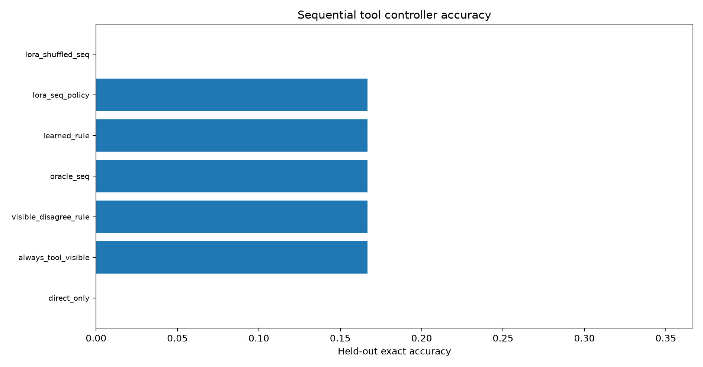
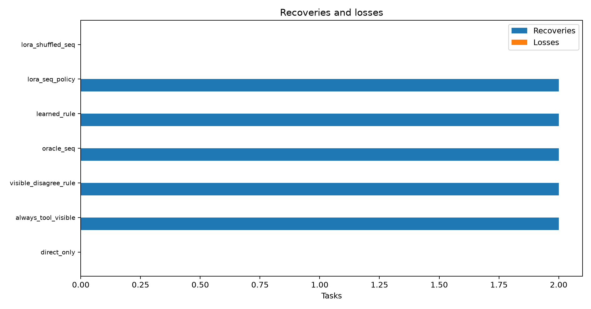
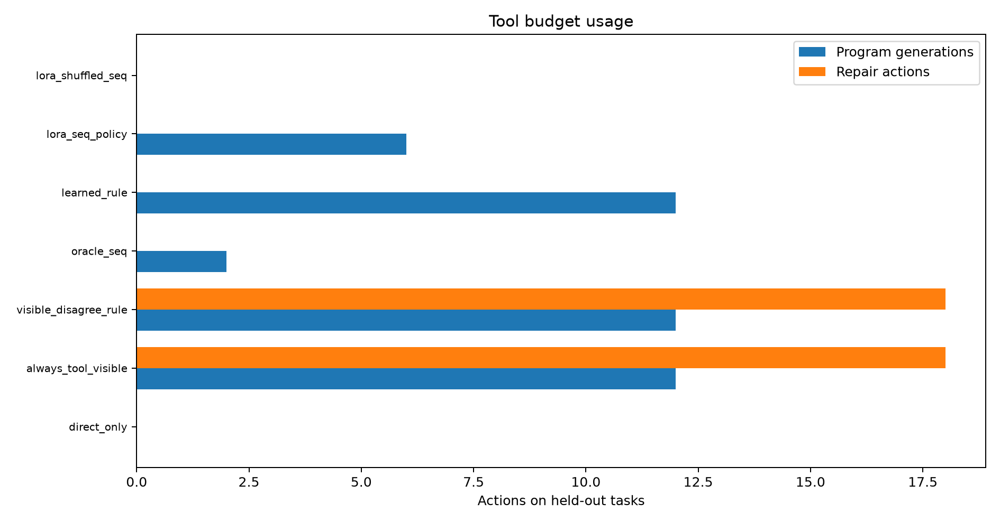

# Live Tool-State DAgger-Style Controller

## Summary

This standalone experiment generates fresh tool-environment traces and trains/evaluates a sequential controller over visible tool state.

The controller chooses among `DIRECT`, `WRITE`, `FIX`, and `PROGRAM`. It is evaluated by simulating those actions on the freshly generated traces.

## Split And Trace Counts

- dev: 12 records, direct 3, program 5, oracle union 7, families: potters_wheel_merge_split, proactive_wrangling_fold, synthetic_22, synthetic_51
- test: 12 records, direct 0, program 2, oracle union 2, families: potters_wheel_divide, reshape_table_structure_data_wrangler, synthetic_13, synthetic_45
- train: 36 records, direct 6, program 5, oracle union 10, families: agriculture, craigslist_data_wrangler, crime_data_wrangler, potters_wheel_fold, potters_wheel_fold_2, potters_wheel_split_fold, potters_wheel_unfold, potters_wheel_unfold2, proactive_wrangling_complex, synthetic_11, synthetic_5, synthetic_8

## Held-Out Test Result

| Policy | Exact | Accuracy | Program gens | Repairs | Program commits | Recoveries | Losses | Program precision |
|---|---:|---:|---:|---:|---:|---:|---:|---:|
| `direct_only` | 0/12 | 0.0% | 0 | 0 | 0 | 0 | 0 | n/a |
| `always_tool_visible` | 2/12 | 16.7% | 12 | 18 | 3 | 2 | 0 | 66.7% |
| `visible_disagree_rule` | 2/12 | 16.7% | 12 | 18 | 2 | 2 | 0 | 100.0% |
| `learned_rule` | 2/12 | 16.7% | 12 | 0 | 2 | 2 | 0 | 100.0% |
| `lora_seq_policy` | 2/12 | 16.7% | 6 | 0 | 2 | 2 | 0 | 100.0% |
| `lora_shuffled_seq` | 0/12 | 0.0% | 0 | 0 | 0 | 0 | 0 | n/a |
| `oracle_seq` | 2/12 | 16.7% | 2 | 0 | 2 | 2 | 0 | 100.0% |

## Gate Verdict

The best deployable rule reached 2/12 with 2 recoveries and 0 losses.
The sequential LoRA policy reached 2/12 with 2 recoveries and 0 losses.
The shuffled-label control reached 0/12, providing the label-noise control for the LoRA arm.

## Learned Rule

```json
{
  "dev": {
    "accuracy": 0.5833333333333334,
    "direct_correct_losses": 0,
    "direct_miss_recoveries": 4,
    "exact": 7,
    "n": 12,
    "policy": "rule",
    "program_commits": 4,
    "program_correct": 4,
    "program_generations": 12,
    "program_precision": 1.0,
    "repair_actions": 0,
    "split": "dev"
  },
  "false": "WRITE",
  "feature": "program_disagrees_direct",
  "true": "PROGRAM"
}
```

## Figures







## Limitations

- This is a balanced pilot split, not a full benchmark run.
- The policy is evaluated on fresh precomputed traces; `WRITE` and `FIX` reveal the corresponding fresh generated tool outputs from those traces.
- Hidden labels are used only for oracle labels and evaluation, not in policy state.
