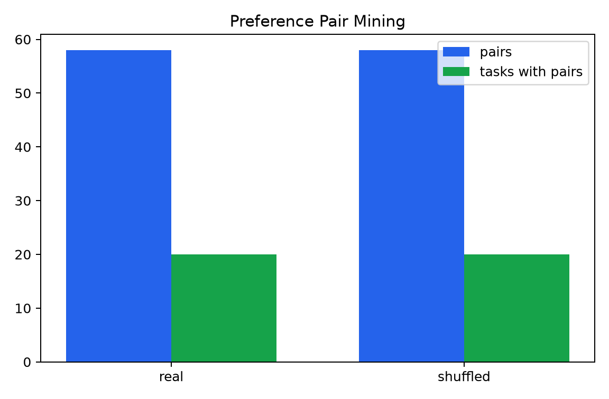
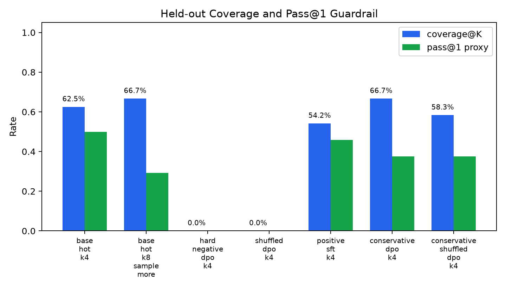
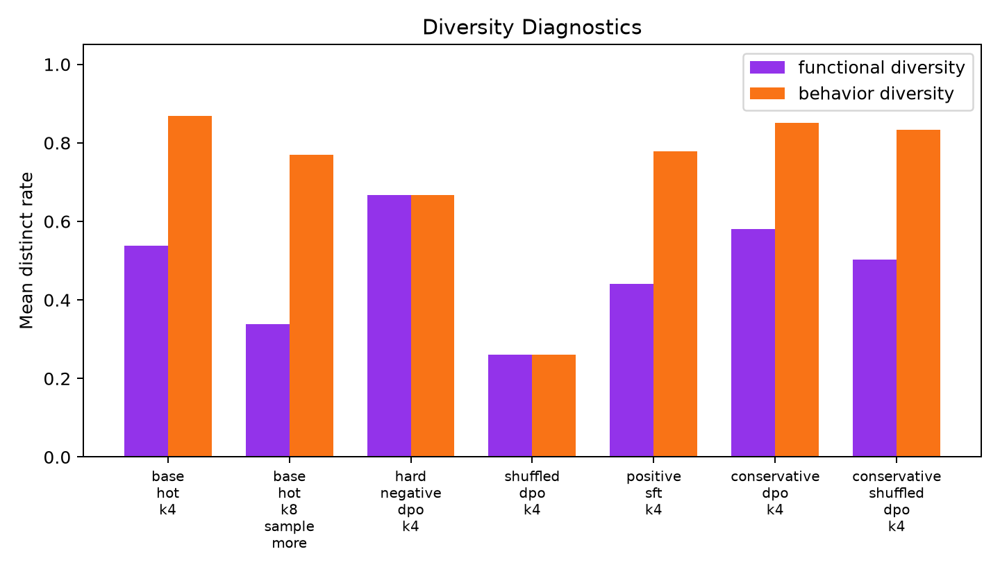
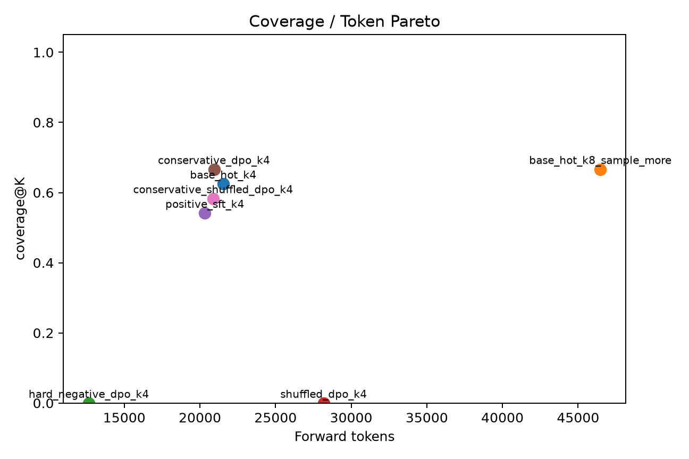
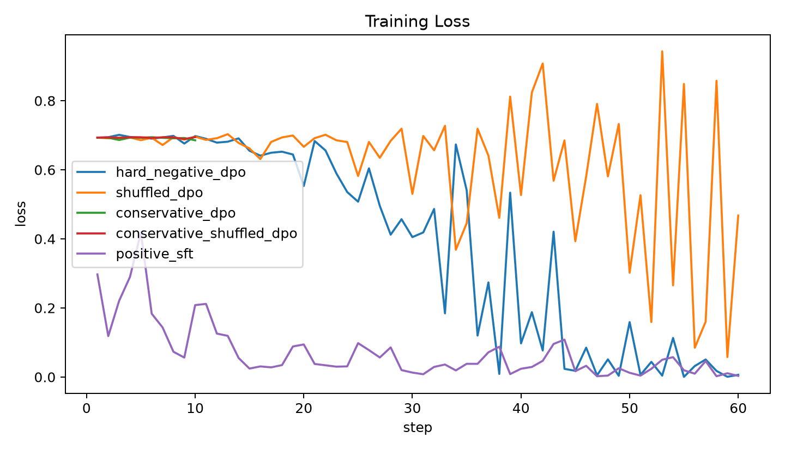

# qwen35_4b_offline_hard_negative_coverage_dpo

## Question

Can a small offline preference update, trained to prefer hidden-correct code over hard hidden-wrong candidates from the same task, improve held-out coverage from a fixed Qwen3.5-4B generator without collapsing useful sampling diversity?

## Pair Mining

| pair set | pairs | tasks with pairs | visible-wrong pair rate |
|---|---:|---:|---:|
| real | 58 | 20 | 13.8% |
| shuffled | 58 | 20 | 13.8% |

## Held-Out Results

| arm | K | coverage@K | pass@1 proxy | parse / task | visible coverage | functional diversity | forward tokens |
|---|---:|---:|---:|---:|---:|---:|---:|
| base_hot_k4 | 4 | 62.5% | 50.0% | 3.71 | 62.5% | 53.8% | 21542 |
| base_hot_k8_sample_more | 8 | 66.7% | 29.2% | 7.58 | 66.7% | 33.9% | 46467 |
| hard_negative_dpo_k4 | 4 | 0.0% | 0.0% | 0.00 | 0.0% | 66.7% | 12660 |
| shuffled_dpo_k4 | 4 | 0.0% | 0.0% | 0.00 | 0.0% | 26.0% | 28182 |
| positive_sft_k4 | 4 | 54.2% | 45.8% | 3.54 | 54.2% | 44.1% | 20327 |
| conservative_dpo_k4 | 4 | 66.7% | 37.5% | 3.83 | 66.7% | 58.0% | 20933 |
| conservative_shuffled_dpo_k4 | 4 | 58.3% | 37.5% | 3.83 | 58.3% | 50.3% | 20877 |

## Training

## Gate Readout

Aggressive 60-step DPO failed the parse guardrail: coverage 0.0%, parse successes/task 0.00.
Conservative 10-step DPO coverage 66.7% vs tuned-hot K=4 62.5%, delta 4.2%.
Guardrails for conservative DPO: pass@1 delta -12.5%, functional-diversity delta 4.2%, parse successes/task 3.83.
Sample-more K=8 reference: 66.7%.
Matched conservative shuffled-pair control coverage: 58.3%.
Positive-only SFT coverage: 54.2%.
Gate readout: fail for the pilot; this configuration should not be scaled without changing the mechanism.

## Interpretation

This pilot is intentionally a gate, not a final benchmark. The important result is mixed:

- Aggressive DPO is unsafe in this setup: the 60-step adapter learned the preference set but destroyed parseability on held-out generation.
- Conservative DPO has a real coverage-efficiency signal: K=4 matches the K=8 sample-more coverage at less than half the forward-token budget, and beats the matched conservative shuffled control.
- The formal gate still fails because conservative DPO regresses pass@1 proxy by 12.5 points versus tuned-hot K=4. That means the current objective improves set coverage by moving probability mass around, but it does not preserve first-sample quality.

The next version, if any, should be explicitly regularized for pass@1 and parseability rather than scaling this objective as-is.
