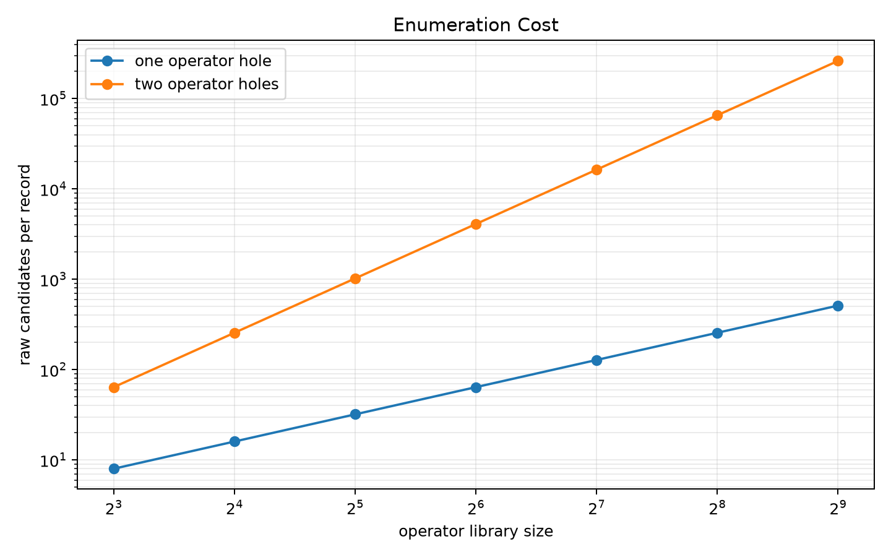
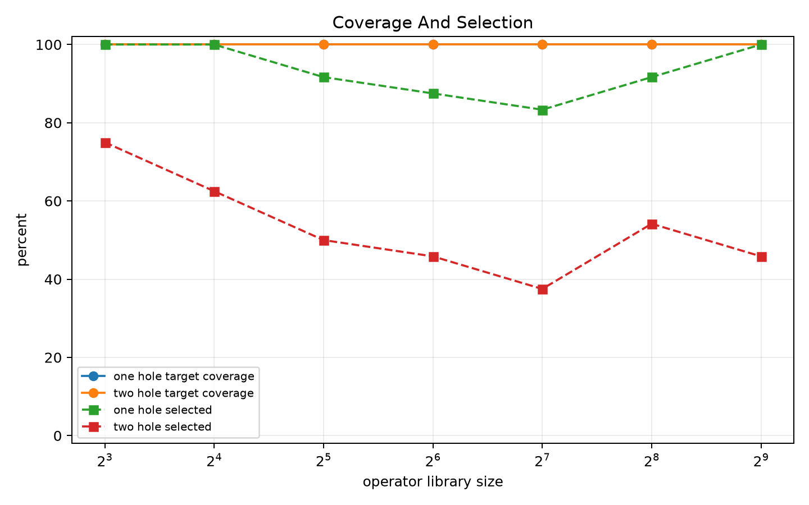
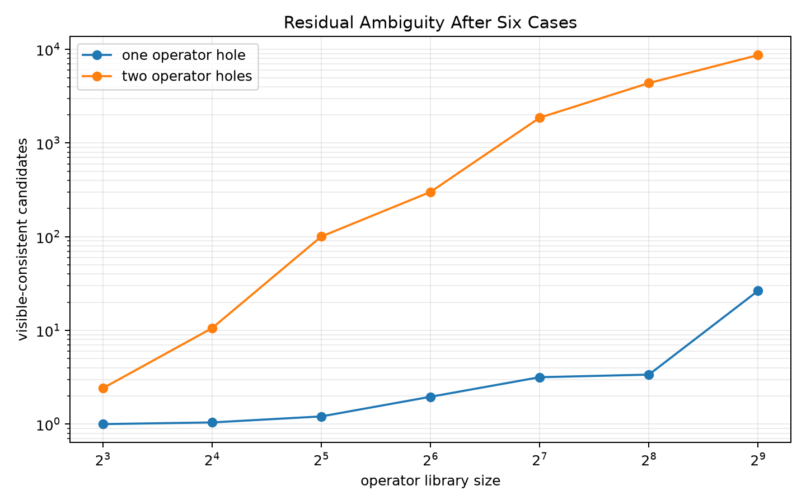
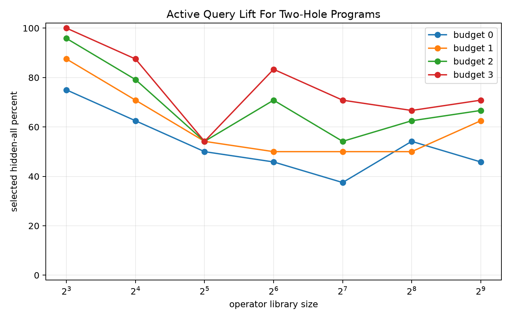
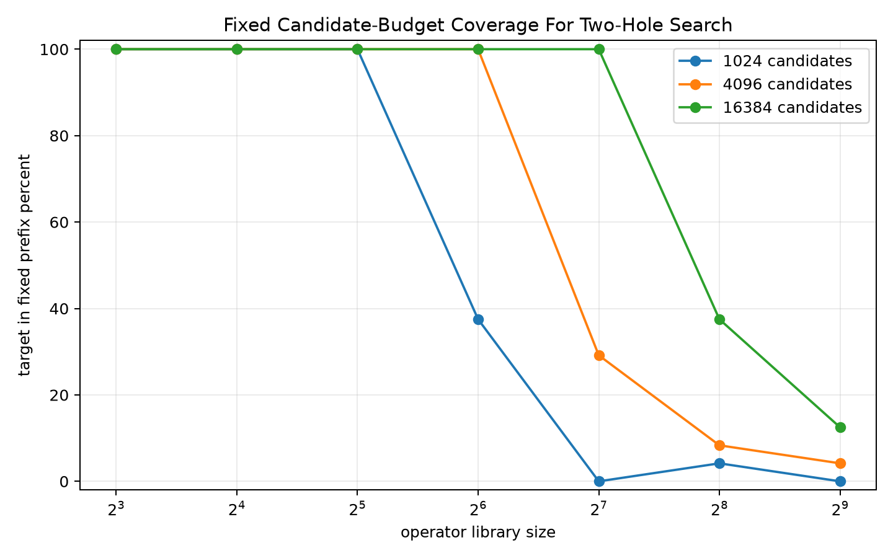

# Qwen3.5-4B Operator Inventory Scaling Stress Report

## Summary

This standalone no-training experiment scales a same-signature `list[int] -> int` operator inventory from 8 to 512 operators. It measures one-hole templates, where exhaustive search scales as `N`, and two-hole templates, where exhaustive search scales as `N^2`.

At 512 operators, one-hole exhaustive search enumerates `512` candidates per record, while two-hole exhaustive search enumerates `262144` candidates per record. Target coverage remains `100.0%` for two-hole programs because the target is still in the library and visible cases retain it, but zero-query selection drops to `45.8%` as visible-consistent ambiguity grows.

The practical bottleneck is now compute budget and residual ambiguity, not target reachability. For two-hole programs at 512 operators, fixed prefix coverage is 1024: 0.0%, 4096: 4.2%, 16384: 12.5%; a deployable top-k shortlister must preserve target coverage while avoiding full `N^2` enumeration.

## Key Scaling Rows

| library | holes | records | raw candidates | target visible % | oracle % | selected % | visible candidates | target rank p90 |
| --- | --- | --- | --- | --- | --- | --- | --- | --- |
| 8 | 1 | 24 | 8 | 100.00 | 100.00 | 100.00 | 1.00 | 7.00 |
| 8 | 2 | 24 | 64 | 100.00 | 100.00 | 75.00 | 2.42 | 43.10 |
| 64 | 1 | 24 | 64 | 100.00 | 100.00 | 87.50 | 1.96 | 59.10 |
| 64 | 2 | 24 | 4096 | 100.00 | 100.00 | 45.80 | 300.79 | 3027.10 |
| 512 | 1 | 24 | 512 | 100.00 | 100.00 | 100.00 | 26.54 | 459.80 |
| 512 | 2 | 24 | 262144 | 100.00 | 100.00 | 45.80 | 8695.79 | 226195.10 |

## Template Breakdown

The hard case is the low-information comparison template. At 512 operators, `pair_compare_gate` leaves far more visible-consistent candidates than `pair_affine_mod`, and zero-query selection falls accordingly.

| library | template | selected % | visible candidates | target rank p90 |
| --- | --- | --- | --- | --- |
| 128 | pair_affine_mod | 75.00 | 2.83 | 13415.40 |
| 128 | pair_compare_gate | 0.00 | 3729.92 | 10655.40 |
| 512 | pair_affine_mod | 66.70 | 357.50 | 229748.60 |
| 512 | pair_compare_gate | 25.00 | 17034.08 | 220053.90 |

## Active Query Diagnostic

For two-hole programs, active querying reduces ambiguity but does not remove the search-cost issue. It helps after the full candidate set has already been generated and filtered. The oracle-elimination curve is a ceiling on query choice quality; max-split is the deployable heuristic.

| library | policy | budget | selected % | candidate count |
| --- | --- | --- | --- | --- |
| 64 | active_max_split | 0 | 45.80 | 300.79 |
| 64 | active_max_split | 1 | 50.00 | 138.29 |
| 64 | active_max_split | 2 | 70.80 | 71.71 |
| 64 | active_max_split | 3 | 83.30 | 37.54 |
| 64 | oracle_elimination | 0 | 45.80 | 300.79 |
| 64 | oracle_elimination | 1 | 70.80 | 20.83 |
| 64 | oracle_elimination | 2 | 87.50 | 9.42 |
| 64 | oracle_elimination | 3 | 95.80 | 6.33 |
| 512 | active_max_split | 0 | 45.80 | 8695.79 |
| 512 | active_max_split | 1 | 62.50 | 4199.46 |
| 512 | active_max_split | 2 | 66.70 | 1990.25 |
| 512 | active_max_split | 3 | 70.80 | 1110.21 |
| 512 | oracle_elimination | 0 | 45.80 | 8695.79 |
| 512 | oracle_elimination | 1 | 66.70 | 1451.33 |
| 512 | oracle_elimination | 2 | 83.30 | 573.33 |
| 512 | oracle_elimination | 3 | 83.30 | 403.04 |

## Fixed Candidate-Budget Diagnostic

The fixed-prefix diagnostic is deliberately simple: it asks whether a small canonical candidate budget would contain the target before semantic shortlisting. The answer becomes no as two-hole search grows, which quantifies the budget a learned shortlister has to beat.

## Decision

The target remains reachable under exhaustive inventory search through 512 operators, including two-operator compositions. The reason to train an inventory-conditioned Qwen3.5-4B sketcher is now sharply defined: top-k shortlisting for large two-hole libraries. The training target should be coverage at fixed candidate budgets, especially `1024`, `4096`, and `16384`, with active querying retained as a post-shortlist disambiguator.

## Artifacts

- Dataset: `data/operator_scaling_eval.jsonl`
- Dataset manifest: `data/dataset_manifest.json`
- Full result JSON: `reports/operator_scaling_results.json`
- CSVs: `reports/library_depth_summary.csv`, `reports/library_template_summary.csv`, `reports/target_bucket_summary.csv`, `reports/prefix_summary.csv`, `reports/active_summary.csv`
- Large artifacts: `/workspace/large_artifacts/qwen35_4b_operator_inventory_scaling_stress`
