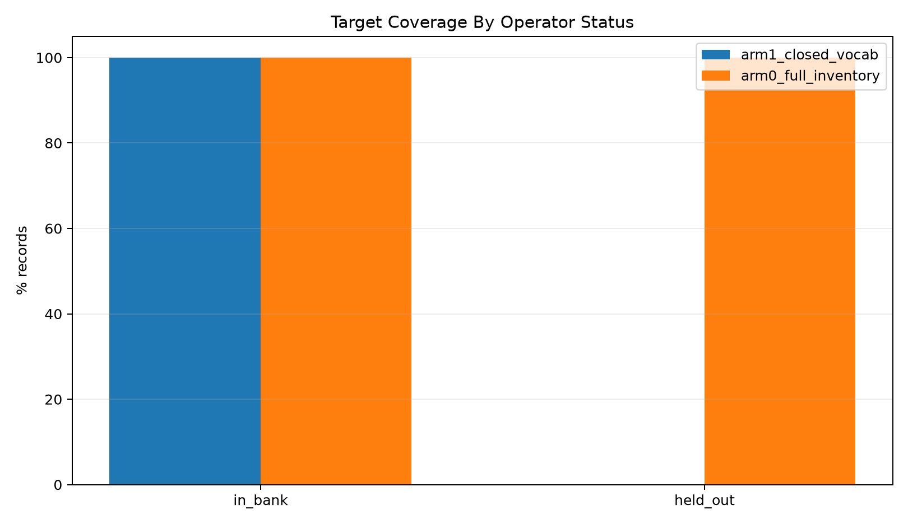
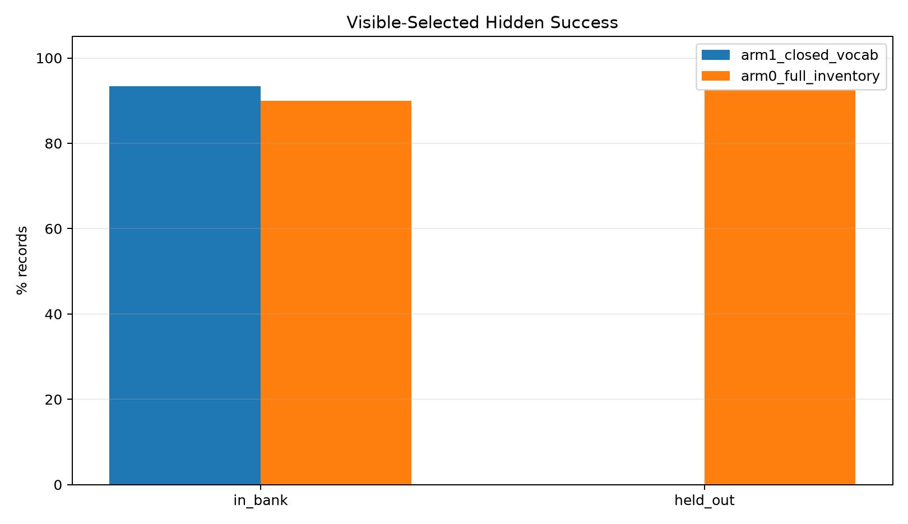
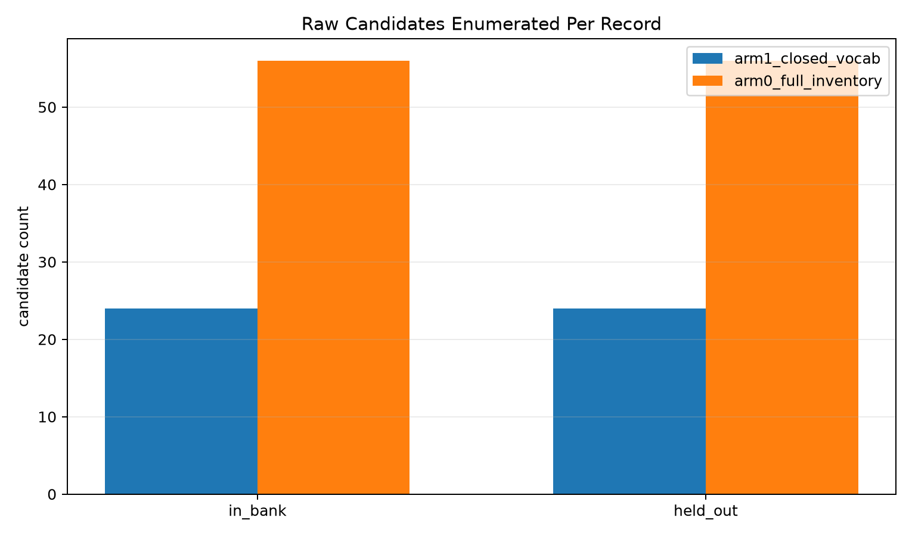
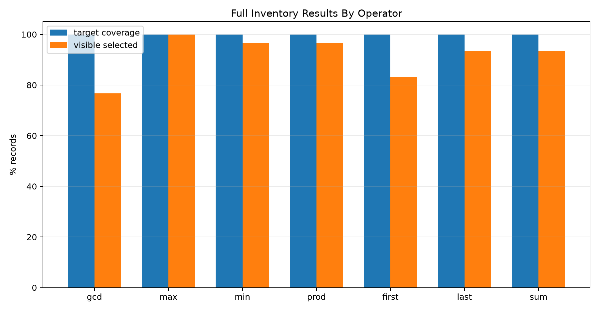
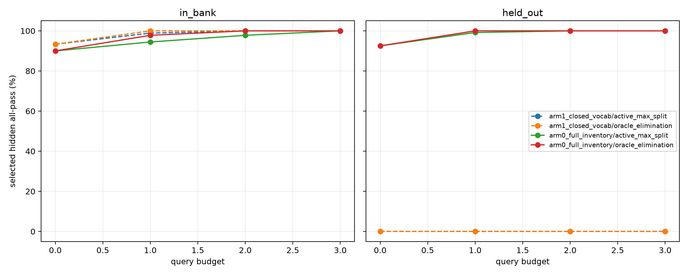

# Qwen3.5-4B Operator Inventory Search Pilot Report

## Summary

This standalone no-training pilot tests the search-side ceiling for type-colliding operator identification. Every aggregate candidate has signature `list[int] -> int`; the task is to recover the correct operator from execution cases, not from type.

Two arms are compared:

- `arm1_closed_vocab`: closed operator set `sum`, `first`, `last`.
- `arm0_full_inventory`: full operator inventory `sum`, `first`, `last`, `max`, `min`, `prod`, `gcd`.

## Key Findings

- Closed vocabulary held-out target coverage was `0.0%`; full inventory held-out target coverage was `100.0%`.
- Full inventory recovered the held-out target in visible-consistent candidates for `100.0%` of records.
- Full inventory visible selection solved `92.5%` of held-out records at budget 0, versus `0.0%` for closed vocabulary.
- Active max-split on full inventory held-out records improved from `92.5%` at budget 0 to `100.0%` at budget 2.
- Oracle-elimination querying reached `100.0%` on full inventory held-out records by budget 1.
- Search cost stayed small in this pilot: full inventory enumerated `56.0` raw candidates per held-out record.

Interpretation: the search/bank side can recover the held-out type-colliding operators in this substrate. The missing piece is not program-level search coverage; it is a deployable way for the model to name or shortlist inventory operators as the library scales.

## Status Summary

| arm | operator_status | records | target_raw_pct | target_visible_pct | oracle_hidden_all_pct | selected_hidden_all_pct | avg_raw_candidate_count | avg_visible_consistent_operator_count |
| --- | --- | ---: | ---: | ---: | ---: | ---: | ---: | ---: |
| arm0_full_inventory | held_out | 120 | 100.0 | 100.0 | 100.0 | 92.5 | 56.0 | 1.20 |
| arm0_full_inventory | in_bank | 90 | 100.0 | 100.0 | 100.0 | 90.0 | 56.0 | 1.32 |
| arm1_closed_vocab | held_out | 120 | 0.0 | 0.0 | 0.0 | 0.0 | 24.0 | 0.09 |
| arm1_closed_vocab | in_bank | 90 | 100.0 | 100.0 | 100.0 | 93.3 | 24.0 | 1.11 |

## Operator Breakdown

Full inventory by operator:

| operator | status | records | target_raw_pct | selected_hidden_all_pct | avg_visible_consistent_operator_count |
| --- | --- | ---: | ---: | ---: | ---: |
| gcd | held_out | 30 | 100.0 | 76.7 | 1.37 |
| max | held_out | 30 | 100.0 | 100.0 | 1.10 |
| min | held_out | 30 | 100.0 | 96.7 | 1.30 |
| prod | held_out | 30 | 100.0 | 96.7 | 1.03 |
| first | in_bank | 30 | 100.0 | 83.3 | 1.50 |
| last | in_bank | 30 | 100.0 | 93.3 | 1.27 |
| sum | in_bank | 30 | 100.0 | 93.3 | 1.20 |

## Active Query Diagnostic

| arm | status | policy | budget | records | selected_hidden_all_pct | avg_operator_candidate_count |
| --- | --- | --- | ---: | ---: | ---: | ---: |
| arm0_full_inventory | held_out | active_max_split | 0 | 120 | 92.5 | 1.20 |
| arm0_full_inventory | held_out | active_max_split | 1 | 120 | 99.2 | 1.02 |
| arm0_full_inventory | held_out | active_max_split | 2 | 120 | 100.0 | 1.00 |
| arm0_full_inventory | held_out | active_max_split | 3 | 120 | 100.0 | 1.00 |
| arm0_full_inventory | held_out | oracle_elimination | 0 | 120 | 92.5 | 1.20 |
| arm0_full_inventory | held_out | oracle_elimination | 1 | 120 | 100.0 | 1.00 |
| arm0_full_inventory | held_out | oracle_elimination | 2 | 120 | 100.0 | 1.00 |
| arm0_full_inventory | held_out | oracle_elimination | 3 | 120 | 100.0 | 1.00 |
| arm0_full_inventory | in_bank | active_max_split | 0 | 90 | 90.0 | 1.32 |
| arm0_full_inventory | in_bank | active_max_split | 1 | 90 | 94.4 | 1.11 |
| arm0_full_inventory | in_bank | active_max_split | 2 | 90 | 97.8 | 1.02 |
| arm0_full_inventory | in_bank | active_max_split | 3 | 90 | 100.0 | 1.00 |
| arm0_full_inventory | in_bank | oracle_elimination | 0 | 90 | 90.0 | 1.32 |
| arm0_full_inventory | in_bank | oracle_elimination | 1 | 90 | 97.8 | 1.02 |
| arm0_full_inventory | in_bank | oracle_elimination | 2 | 90 | 100.0 | 1.00 |
| arm0_full_inventory | in_bank | oracle_elimination | 3 | 90 | 100.0 | 1.00 |
| arm1_closed_vocab | held_out | active_max_split | 0 | 120 | 0.0 | 0.09 |
| arm1_closed_vocab | held_out | active_max_split | 1 | 120 | 0.0 | 0.05 |
| arm1_closed_vocab | held_out | active_max_split | 2 | 120 | 0.0 | 0.03 |
| arm1_closed_vocab | held_out | active_max_split | 3 | 120 | 0.0 | 0.02 |
| arm1_closed_vocab | held_out | oracle_elimination | 0 | 120 | 0.0 | 0.09 |
| arm1_closed_vocab | held_out | oracle_elimination | 1 | 120 | 0.0 | 0.00 |
| arm1_closed_vocab | held_out | oracle_elimination | 2 | 120 | 0.0 | 0.00 |
| arm1_closed_vocab | held_out | oracle_elimination | 3 | 120 | 0.0 | 0.00 |
| arm1_closed_vocab | in_bank | active_max_split | 0 | 90 | 93.3 | 1.11 |
| arm1_closed_vocab | in_bank | active_max_split | 1 | 90 | 98.9 | 1.02 |
| arm1_closed_vocab | in_bank | active_max_split | 2 | 90 | 100.0 | 1.00 |
| arm1_closed_vocab | in_bank | active_max_split | 3 | 90 | 100.0 | 1.00 |
| arm1_closed_vocab | in_bank | oracle_elimination | 0 | 90 | 93.3 | 1.11 |
| arm1_closed_vocab | in_bank | oracle_elimination | 1 | 90 | 100.0 | 1.00 |
| arm1_closed_vocab | in_bank | oracle_elimination | 2 | 90 | 100.0 | 1.00 |
| arm1_closed_vocab | in_bank | oracle_elimination | 3 | 90 | 100.0 | 1.00 |

## Decision

Arm 0 already reaches the coverage ceiling on held-out operators at small search cost. That means the immediate fix lives on the bank/search side for this substrate: grow the operator inventory and apply operator-level active disambiguation. A trained inventory-conditioned sketcher is still useful, but its job should be top-k operator shortlisting for larger libraries, not recovering coverage that search cannot find.

## Artifacts

- Dataset: `data/operator_inventory_eval.jsonl`
- Dataset manifest: `data/dataset_manifest.json`
- Full result JSON: `reports/operator_search_results.json`
- CSVs: `reports/status_summary.csv`, `reports/operator_summary.csv`, `reports/template_summary.csv`, `reports/active_summary.csv`
- Large artifacts: `/workspace/large_artifacts/qwen35_4b_operator_inventory_search_pilot`
