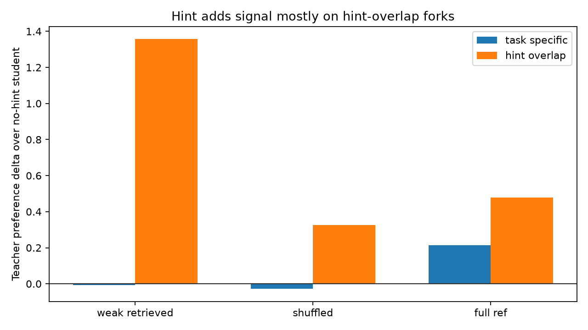
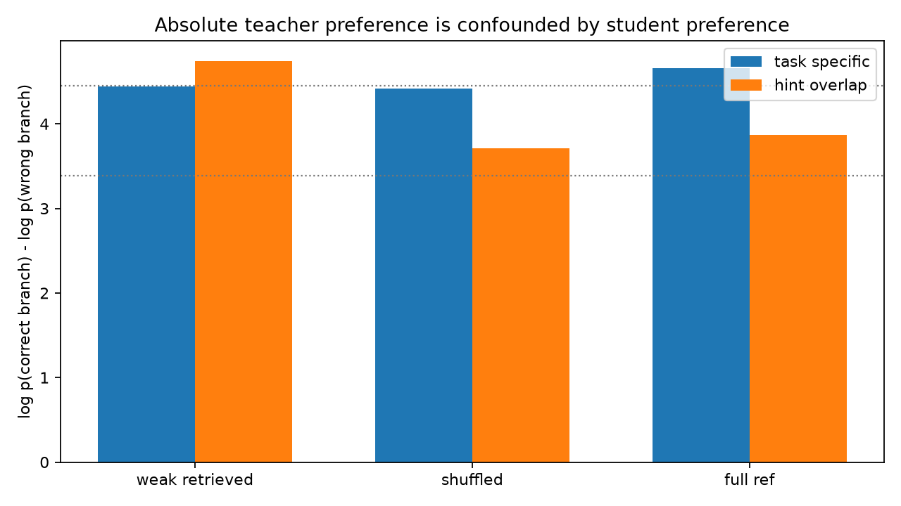
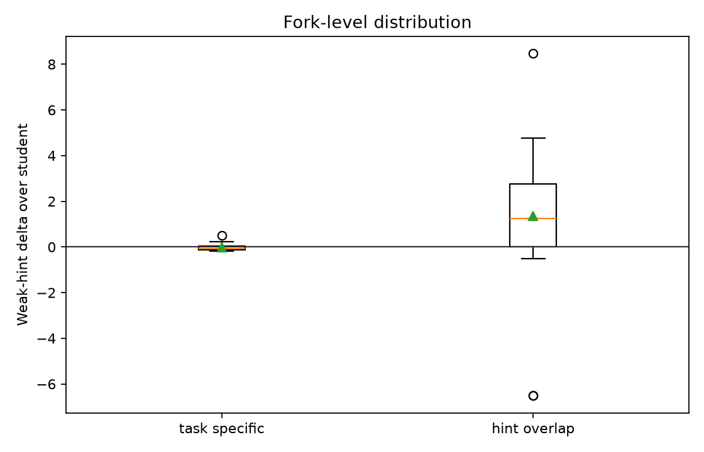
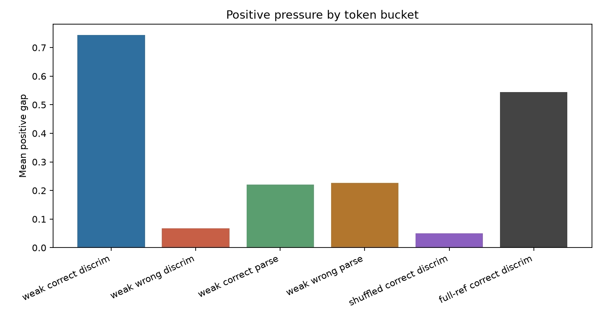

# qwen35_4b_opsd_pressure_locality_audit

## Motivation

This no-training audit tests whether positive-only on-policy self-distillation has the right token-localized signal before any adapter training is attempted. The target case is hidden-correct code versus visible-pass hidden-wrong near-misses for the same task.

The primary gate is same-prefix counterfactual branch preference: at executable code forks, does a weak hinted teacher prefer the hidden-correct branch over the hidden-wrong branch, and does that hint add preference beyond the no-hint student and shuffled-hint control?

## Data

- Matched correct/wrong pairs: 14
- Tasks represented: [35, 44, 87]
- Executable code forks scored: 50
- Task-specific forks: 14
- Hint-overlap forks: 36
- Estimated scoring cost: 136060 forward tokens across 512 scored sequences.

## Gate Result

**Gate: FAIL**

weak retrieved hint does not add task-specific correct-branch preference beyond student and shuffled control.

| statistic | value |
|---|---:|
| weak task-specific absolute preference | 4.441 |
| weak task-specific delta over student | -0.008 |
| weak task-specific fraction prefers correct | 1.000 |
| shuffled task-specific absolute preference | 4.421 |
| shuffled task-specific delta over student | -0.028 |
| full-reference task-specific absolute preference | 4.662 |
| full-reference task-specific delta over student | 0.213 |

The important distinction is absolute preference versus incremental signal. The no-hint student already prefers the correct task-specific branches by 4.449 nats/token on average. The weak retrieved hint scores those branches at 4.441, which is a slight decrease (-0.008) rather than an added signal.

## Fork Summary

| context / stratum | n | mean preference | mean student preference | delta over student | frac delta positive |
|---|---:|---:|---:|---:|---:|
| weak / task-specific | 14 | 4.441 | 4.449 | -0.008 | 0.357 |
| weak / hint-overlap | 36 | 4.745 | 3.388 | 1.357 | 0.667 |
| shuffled / task-specific | 14 | 4.421 | 4.449 | -0.028 | 0.429 |
| full-reference / task-specific | 14 | 4.662 | 4.449 | 0.213 | 0.786 |

The weak hint does add large signal on hint-overlap forks: 1.357. That is exactly the retrieval-surface effect the audit was designed to catch. The effect does not transfer to task-specific forks.

## Token Pressure Buckets

| bucket | mean positive gap | positive rate | n |
|---|---:|---:|---:|
| weak correct discriminating | 0.745 | 0.749 | 491 |
| weak wrong discriminating | 0.068 | 0.376 | 596 |
| weak correct parse/format | 0.220 | 0.883 | 111 |
| weak wrong parse/format | 0.226 | 0.670 | 112 |
| shuffled correct discriminating | 0.050 | 0.470 | 491 |
| full-reference correct discriminating | 0.544 | 0.656 | 491 |

The rollout-level bucket view is more optimistic than the fork gate: weak hints give positive pressure to correct discriminating tokens overall. But the fork gate shows the crucial caveat: at task-specific same-prefix branches, the weak hint does not improve the student's preference. This means the broad token pressure is likely dominated by trajectory or retrieval-surface effects, not the local correctness bit needed for training.

## Example Forks

Worst weak-hint task-specific deltas:

| task | correct branch | wrong branch | weak delta over student | weak preference | student preference |
|---:|---|---|---:|---:|---:|
| 44 | `r'^\w+'` | `'ab{3}?'` | -0.180 | 5.753 | 5.933 |
| 44 | `r'^\w+'` | `'\Bz\B'` | -0.171 | 4.240 | 4.411 |
| 87 | `)` | `: if key in merged: merged[` | -0.145 | 3.491 | 3.636 |

Best weak-hint task-specific deltas:

| task | correct branch | wrong branch | weak delta over student | weak preference | student preference |
|---:|---|---|---:|---:|---:|
| 35 | `n +` | `x): count = 0 i =` | 0.142 | 2.606 | 2.465 |
| 87 | `,` | `) merged.update(` | 0.225 | 5.618 | 5.394 |
| 87 | `,` | `merged.update(` | 0.491 | 7.891 | 7.400 |

## Interpretation

This audit kills the immediate positive-only OPSD training run under the weak retrieved-hint setup.

The hinted teacher is not useless: it strongly moves probability on hint-overlap forks and broad correct-rollout discriminating tokens. But it does not add incremental task-specific branch knowledge beyond what the base student already assigns. That is the near-fatal failure mode for OPSD here: dense credit exists, but it is not localized at the hidden-correct bits that distinguish correct code from visible-pass hidden-wrong near-misses.

Full-reference hints do add task-specific signal, but that is a leakage ceiling. It does not justify deployable OPSD because the hint contains the answer and resembles gold/reference distillation rather than weak privileged guidance.

## Decision

Do not proceed to Stage-2 OPSD training on this weak-hint formulation.

The next experiment should either:

1. create stronger deployable evidence before distillation, such as independent retrieval-consensus or mined counterexample observations, then rerun this locality audit; or
2. change the teacher hint so it contains task-specific discriminating evidence without leaking the reference solution.

Until the static locality gate passes, training would likely amplify retrieved surface form and shared structure rather than teach the missing correctness bits.

## Artifacts

- `data/matched_pairs.jsonl`
- `data/fork_pressure_scores.jsonl`
- `data/token_pressure_scores.jsonl`
- `reports/pair_summary.json`
- `reports/pressure_summary.json`
- `reports/report_summary.json`
- `reports/figures/`
