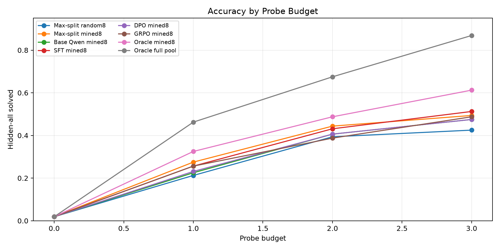
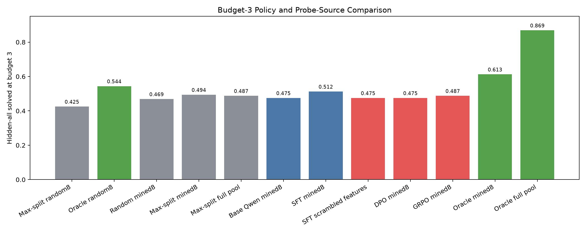
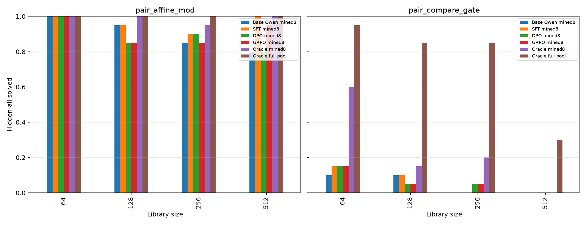
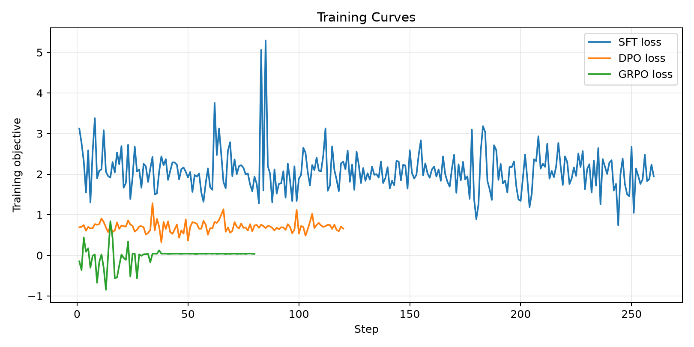
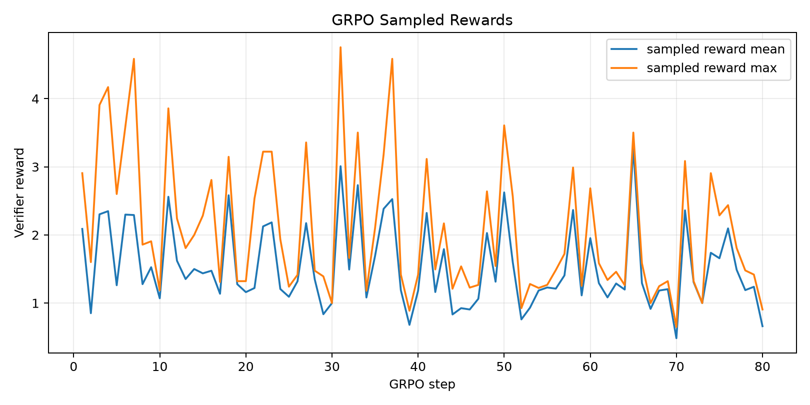

# Qwen3.5-4B Oracle Probe Synthesis MDP

## Question

Can Qwen3.5-4B exploit a richer, deployable probe-generation layer inside a deterministic verifier MDP?

The model still does not name operators. It sees visible executions, the current surviving candidate count, and eight proposed probe inputs. The difference from a fixed small action set is that those eight probes are mined from a 96-case bank by target-independent candidate-bucket statistics. Training labels and rewards then use the verifier oracle to identify which displayed probe actually shrinks the target-retaining candidate set.

## Design

- Base model: Qwen3.5-4B with 4-bit QLoRA adapters.
- Train records: 300; eval records: 160.
- Informative train states: 619; informative eval states: 334.
- Probe bank: 96 candidate inputs per task; displayed action set: 8 mined probes.
- Eval ladder: library sizes 64, 128, 256, 512; templates `pair_affine_mod` and `pair_compare_gate`.
- Probe budget: 0-3 verifier queries.
- Arms: random8 and mined8 controls, full-pool upper bounds, base Qwen, SFT, feature-scrambled SFT, DPO, and GRPO.

## Main Result

| policy                 | hidden-all @3   | exact pair @3   |   survivors @3 |
|:-----------------------|:----------------|:----------------|---------------:|
| Max-split random8      | 42.5%           | 28.1%           |         1441.4 |
| Oracle random8         | 54.4%           | 40.6%           |         1199.6 |
| Random mined8          | 46.9%           | 32.5%           |         1033.8 |
| Max-split mined8       | 49.4%           | 35.6%           |         1004.9 |
| Max-split full pool    | 48.8%           | 35.0%           |         1005   |
| Base Qwen mined8       | 47.5%           | 33.8%           |          999.5 |
| SFT mined8             | 51.2%           | 37.5%           |          996.7 |
| SFT scrambled features | 47.5%           | 31.9%           |         1029.7 |
| DPO mined8             | 47.5%           | 35.6%           |         1060.4 |
| GRPO mined8            | 48.8%           | 34.4%           |         1449.4 |
| Oracle mined8          | 61.3%           | 48.1%           |          657.7 |
| Oracle full pool       | 86.9%           | 71.9%           |          267.1 |

The action-source result is the largest signal. Moving from random-eight to mined-eight improves max-split from 42.5% to 49.4%, and the same-budget oracle from 54.4% to 61.3%. Scanning the full 96-probe bank with target-aware oracle selection reaches 86.9%, so the earlier low-information ceiling was partly an action-space ceiling, not just an intrinsic task ceiling.

The best learned policy is the SFT warm start: base Qwen 47.5% -> SFT 51.2%. SFT beats target-independent mined max-split and falls when features are scrambled (47.5%), so the learned gain depends on the candidate-bucket summaries. DPO and GRPO did not improve on SFT in this run: DPO reached 47.5% and GRPO reached 48.8%.

## Regime Split

- `pair_affine_mod`: base 90.0%, SFT 96.2%, DPO 88.8%, GRPO 91.2%, mined oracle 98.8%, full-pool oracle 100.0%.
- `pair_compare_gate`: base 5.0%, SFT 6.2%, DPO 6.2%, GRPO 6.2%, mined oracle 23.8%, full-pool oracle 73.8%.

The full-pool oracle changes the low-information story: `pair_compare_gate` rises to 73.8% under target-aware full-pool probing. That means the verifier environment contains useful discriminating probes, but the current deployable mining heuristic and Qwen action policy do not reliably surface or select them.

## Interpretation

This experiment supports a sharper line-2 thesis: the next leverage is not more operator naming, and not naive RL over the same eight choices. It is probe generation. Exhaustive search can expose high-value observations, and Qwen can learn a modest but real selection improvement over base and max-split once those observations are displayed. However, the full-pool oracle is far ahead of the learned policies, so the main remaining gap is proposing the right high-information probes under deployable constraints.

The negative DPO/GRPO result is useful. Preference or on-policy optimization over the same mined-eight actions was not enough; SFT was the robust learned component. The next step should make the action generator itself trainable or differentiably rankable, rather than only training a selector over the top eight target-independent probes.

## Figures

- 
- 
- 
- 
- 

## Artifacts

Large LoRA adapters are outside the experiment directory under `/workspace/large_artifacts/qwen35_4b_oracle_probe_synthesis_mdp`. The experiment directory contains standalone source, generated datasets, run logs, metrics, plots, and this report.
