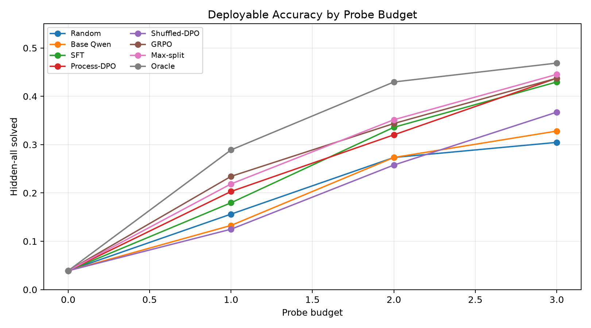
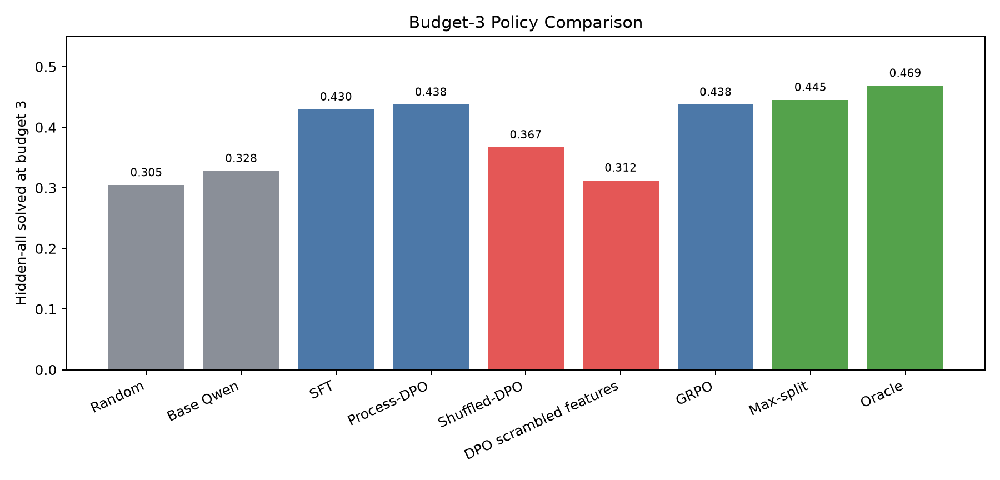
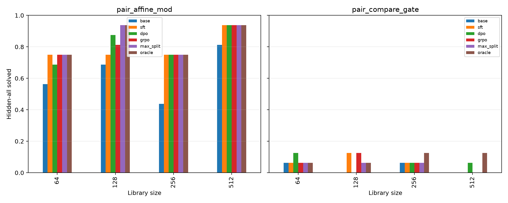
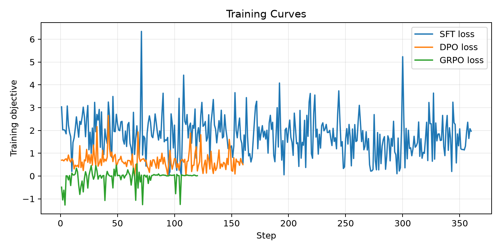
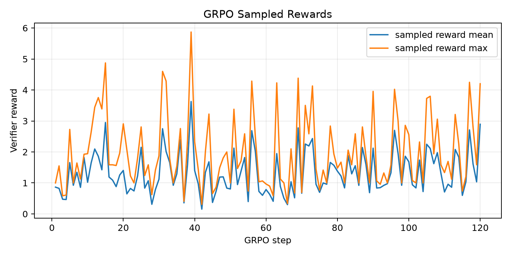

# Qwen3.5-4B Oracle Process GRPO Report

## Question

Can Qwen3.5-4B learn to make useful decisions inside a deterministic verifier MDP when the training oracle can score process actions exactly?

The model is not asked to name operators directly. It receives a compact process state containing visible executions, candidate-set size, and eight concrete probe choices with candidate-output bucket summaries. The action is one letter, A-H. The verifier then executes that probe, filters candidates, and repeats for up to three probes. Evaluation is deployable: learned policies do not see hidden labels or the target pair.

## Design

- Base model: Qwen3.5-4B, 4-bit QLoRA adapters.
- Train records: 480; eval records: 128.
- Informative train states: 1138; informative eval states: 299.
- Eval ladder: library sizes 64, 128, 256, 512; two output regimes, `pair_affine_mod` and `pair_compare_gate`.
- Probe budget: 0-3 verifier queries.
- Optimizers: oracle-action SFT, process-DPO, shuffled-reward DPO control, and GRPO.

## Main Result

At budget 3, Qwen posttraining substantially improved the process controller over the base policy:

| policy                 | hidden-all @3   | exact pair @3   |   survivors @3 |
|:-----------------------|:----------------|:----------------|---------------:|
| Random                 | 30.5%           | 17.2%           |         1949.6 |
| Base Qwen              | 32.8%           | 18.8%           |         1678   |
| SFT                    | 43.0%           | 26.6%           |         1428.4 |
| Process-DPO            | 43.8%           | 28.1%           |         1576.1 |
| Shuffled-DPO           | 36.7%           | 22.7%           |         1694   |
| DPO scrambled features | 31.2%           | 18.0%           |         1726.9 |
| GRPO                   | 43.8%           | 28.1%           |         1536.2 |
| Max-split              | 44.5%           | 28.9%           |         1693.2 |
| Oracle                 | 46.9%           | 31.2%           |         1138.7 |

SFT recovered most of the available same-budget oracle headroom: base 32.8% -> SFT 43.0%. Process-DPO added a small further gain to 43.8%, which is 77.8% of the base-to-oracle headroom. GRPO matched DPO at 43.8% but did not clearly exceed it in the short run.

The shuffled-reward and scrambled-feature controls are important. Shuffled-DPO fell to 36.7%, and feature-scrambled DPO fell to 31.2%. That means the verifier-aligned rewards and displayed candidate-bucket summaries both mattered.

## Regime Split

The learned policy helped mainly where the observations carry enough information:

- `pair_affine_mod`: base 62.5%, SFT 79.7%, DPO 81.2%, GRPO 81.2%, oracle 84.4%.
- `pair_compare_gate`: base 3.1%, SFT 6.2%, DPO 6.2%, GRPO 6.2%, oracle 9.4%.

The low-information comparison regime remains bounded by identifiability. Even the same-budget oracle reaches only 9.4% there, because many candidate programs remain hidden-equivalent after three probes.

## Interpretation

This supports the process-control version of the neurosymbolic hypothesis: let exhaustive search and execution make answers reachable, then train Qwen to orchestrate verifier actions. The cleanest signal is not GRPO alone; it is the full stack:

- SFT learns the action interface and makes a large jump over base.
- Process-DPO uses the perfect per-step verifier oracle and gives a smaller additional improvement.
- GRPO is viable but did not beat DPO in this short run.
- Shuffled reward and scrambled feature controls collapse, so the improvement is not just formatting or letter bias.

The hard ceiling is also clear. The controller cannot solve states where three observations do not identify a hidden-correct candidate. That pushes the next step toward joint optimization of policy and observation design, with either larger query budgets or richer probe-generation actions.

## Figures

- 
- 
- 
- 
- 

## Artifacts

Large LoRA adapters are outside the experiment directory under `/workspace/large_artifacts/qwen35_4b_oracle_process_grpo`. This directory contains the standalone source, generated datasets, run logs, metrics, figures, and report.
