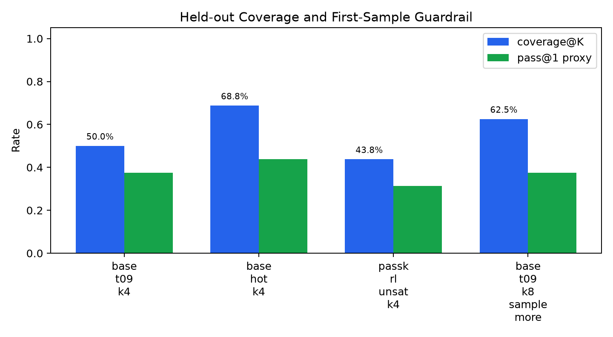
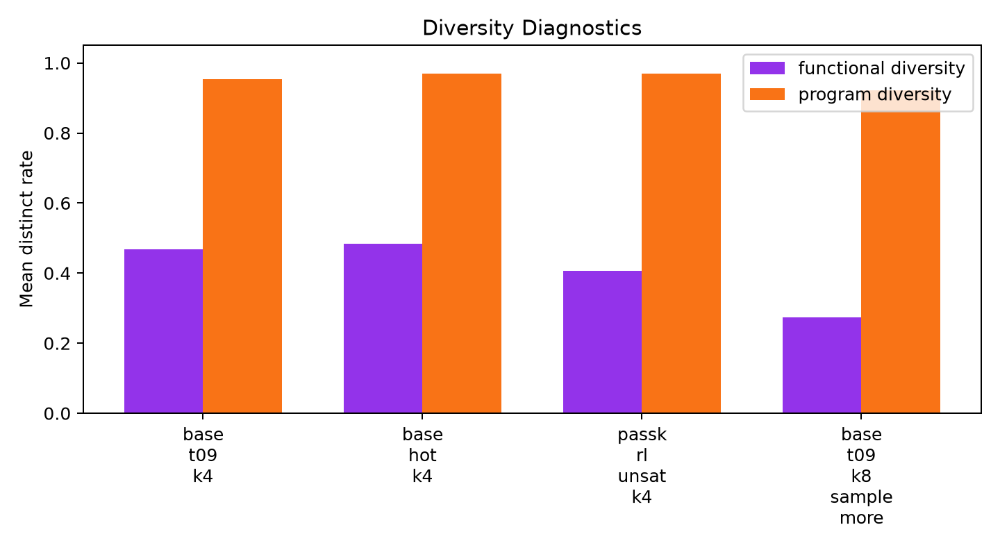
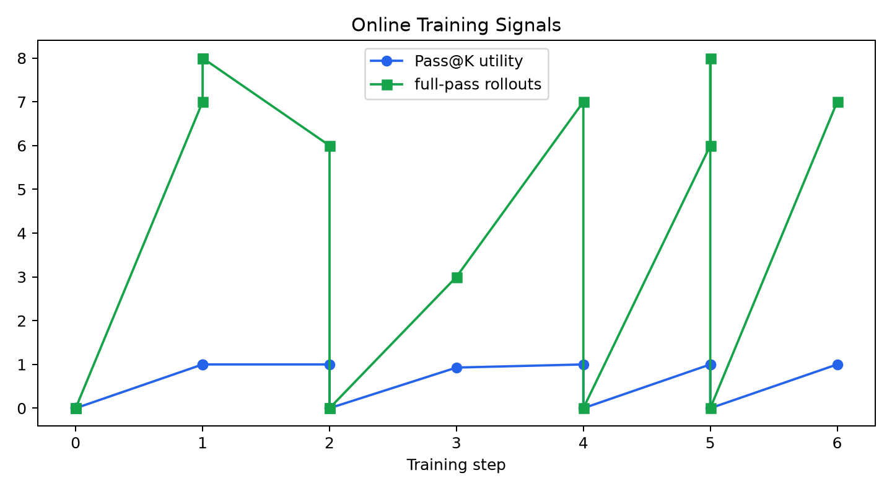

# qwen35_4b_passk_coverage_rl

## Question

Can a small online QLoRA update aimed at set-level coverage make cheap K-sample generation cover more held-out MBPP tasks than tuned inference-only sampling?

## Results

| arm | split | K | coverage@K | pass@1 proxy | visible coverage | functional diversity | forward tokens |
|---|---|---:|---:|---:|---:|---:|---:|
| base_t09_k4 | test | 4 | 50.0% | 37.5% | 75.0% | 46.9% | 14193 |
| base_hot_k4 | test | 4 | 68.8% | 43.8% | 75.0% | 48.4% | 14959 |
| passk_rl_unsat_k4 | test | 4 | 43.8% | 31.2% | 68.8% | 40.6% | 13650 |
| base_t09_k8_sample_more | test | 8 | 62.5% | 37.5% | 87.5% | 27.3% | 28487 |

## Readout

Best observed held-out coverage arm: base_hot_k4.

- Adapter vs tuned-hot K=4: 43.8% vs 68.8%, delta -25.0%.
- Adapter vs same-temperature base K=4: 43.8% vs 50.0%, delta -6.2%.
- Sample-more reference K=8: 62.5% at 28487 forward tokens.
- Adapter guardrails: pass@1 proxy 31.2%, functional diversity 40.6%.

## Training Diagnostics

Training attempted 16 rollout groups and took 6 updates. It skipped 7 zero-positive groups and 3 saturated-positive groups. Among update groups, positive rollouts ranged from 3 to 7; mean Pass@K utility was 0.988.

## Interpretation

The decisive pilot comparison is the Pass@K adapter versus tuned-hot base sampling at matched K. A positive result requires the adapter to improve coverage without collapsing first-sample quality or functional diversity. In this pilot, the adapter did not pass that gate if tuned-hot K=4 is available and higher. The useful finding is diagnostic: online Pass@K reward can be obtained, but sparse or saturated rollout groups dominate, and the small adapter did not convert that reward into held-out coverage.

## Gate Decision

The pilot gate failed, so the experiment stops here rather than scaling a larger training run. Scaling this exact online RL variant would spend compute on a configuration that is already dominated by inference-only hot sampling at matched K in the pilot.
