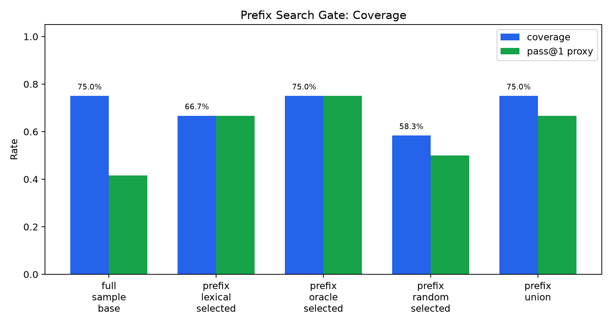
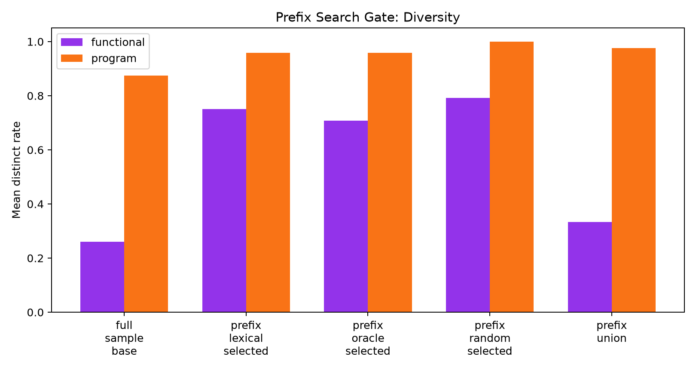
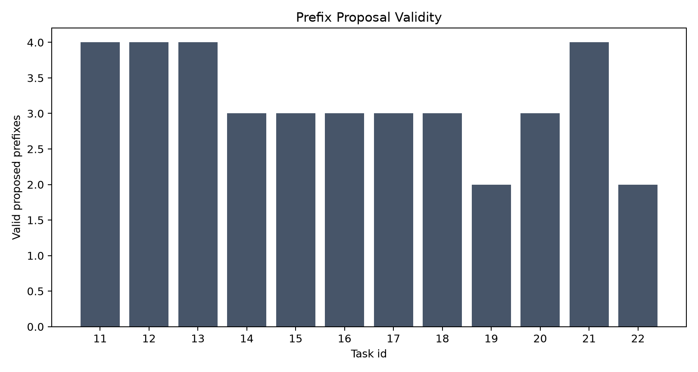

# qwen35_4b_prefix_value_guided_search

## Question

Can hidden-test-valued code prefixes expose a search state that is better than ordinary full-code sampling at matched completion budget?

## Setup

- Dataset split: `test`.
- Task count: 12.
- Full-code samples per task: 8.
- Prefix proposals per task: 4.
- Completions per prefix: 2.
- Matched completion budget: True.
- Mean valid prefixes per task: 3.17.

## Results

| arm | coverage | pass@1 proxy | visible coverage | functional diversity | program diversity | forward tokens |
|---|---:|---:|---:|---:|---:|---:|
| full_sample_base | 75.0% | 41.7% | 91.7% | 26.0% | 87.5% | 20906 |
| prefix_lexical_selected | 66.7% | 66.7% | 75.0% | 75.0% | 95.8% | 5592 |
| prefix_oracle_selected | 75.0% | 75.0% | 91.7% | 70.8% | 95.8% | 5541 |
| prefix_random_selected | 58.3% | 50.0% | 66.7% | 79.2% | 100.0% | 5614 |
| prefix_union | 75.0% | 66.7% | 91.7% | 33.3% | 97.6% | 18387 |

## Gate Decision

Oracle-prefix gate: **failed**. Full sampling coverage was 75.0%; prefix union coverage was 75.0%; oracle-selected prefix coverage was 75.0%; lexical-selected prefix coverage was 66.7%. Do not train a prefix value model from this result.

## Interpretation

This is an oracle-ceiling experiment. A positive result would mean the prefix state space contains selectable states whose completions solve tasks more efficiently than ordinary full-code sampling.

There is an efficiency hint: the oracle-selected prefix arm matches full-sampling coverage with only one selected prefix's completion set per task. But that is not enough to justify training here, because discovering that prefix still required the full prefix-completion sweep, and the prefix union did not improve coverage over ordinary full-code sampling at matched completion count. The strict gate therefore fails: this proposed prefix action space is not yet a useful enough MDP state representation for a learned value model.
