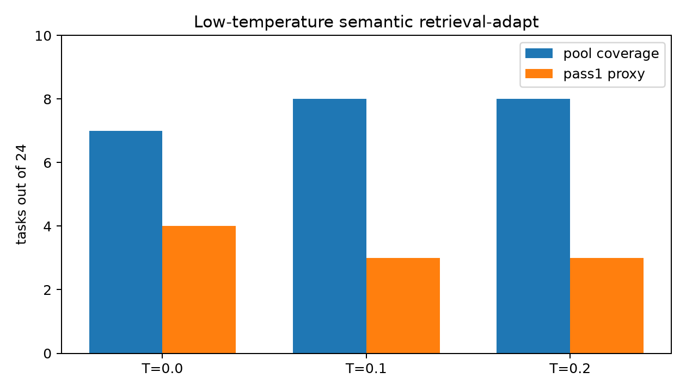
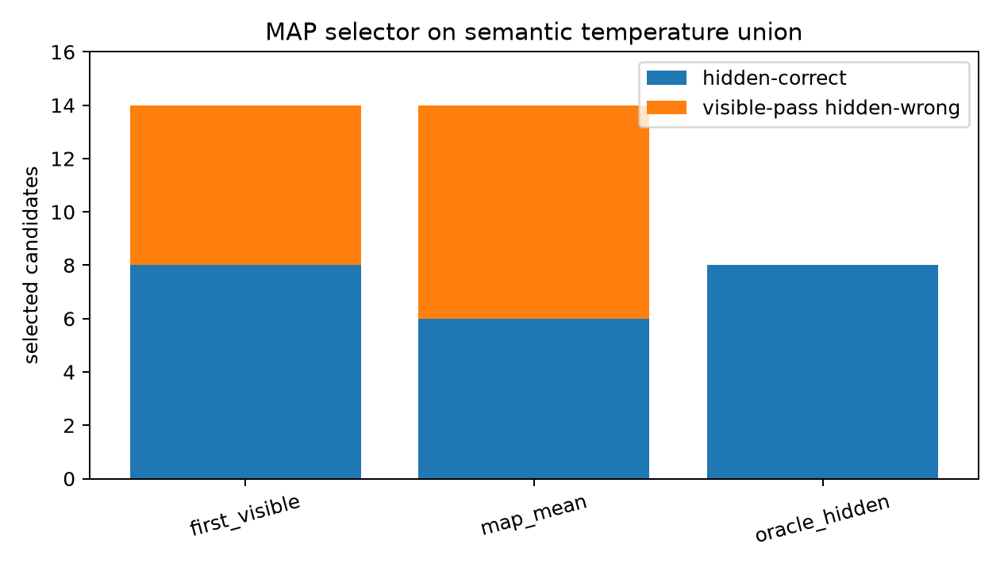
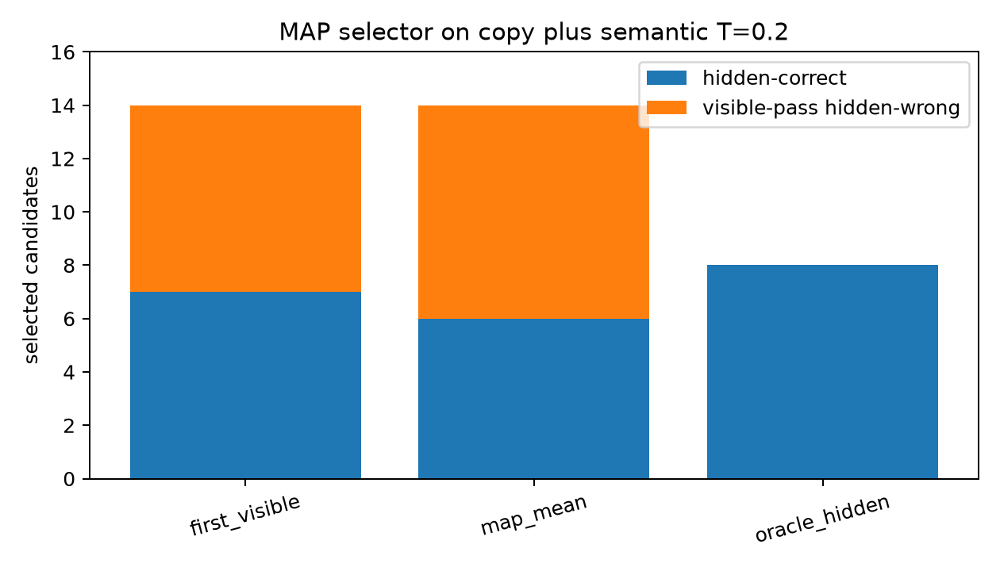
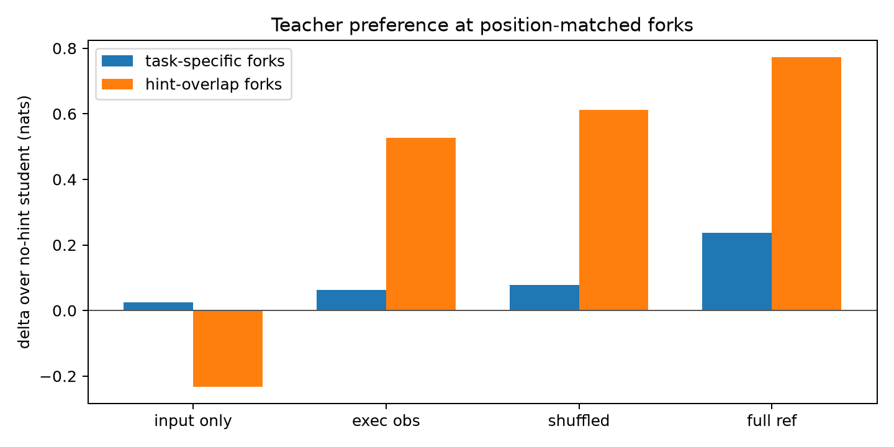

# qwen35_4b_reliability_exec_opsd_audit

Date: 2026-06-26

## Decision

Do **not** train the execution-grounded OPSD variant from this audit. The position-matched fork gate failed: execution evidence with the correct output added +0.063 nats over the no-hint student on task-specific forks, while shuffled execution evidence added +0.079 nats. The full-reference leakage ceiling added +0.237 nats, so the audit is capable of seeing signal when the answer is leaked.

The reliability probes also failed to produce a deployable selector: raw MAP likelihood selected fewer hidden-correct candidates than first-visible in both candidate pools, and increased hidden-wrong visible-pass selections.

## Question

This no-training experiment tested two cheap hypotheses before any OPSD run:

1. If the base model already weakly prefers correct fork tokens, can lower-temperature decoding or raw model likelihood turn that into reliable retrieval-adapt selection?
2. If retrieval hints are only surface-level, can an execution-grounded teacher with counterexample input and correct output localize positive pressure onto task-specific discriminating tokens?

## Inputs

- Residual retrieval-adapt slice: 24 MBPP held-out tasks.
- Model: Qwen3.5-4B used as generator/scorer.
- Generated new semantic retrieval-adapt pools at T=0.0 and T=0.1, top-3 retrieved algorithms per task.
- Used existing semantic T=0.2, random, shuffled, and copy/rename pools as controls and pair sources.
- No model training was performed.

## Low-Temperature Probe

| arm | coverage | pass1 proxy | visible coverage | visible-pass hidden-wrong candidates | functional diversity | forward tokens |
|---|---:|---:|---:|---:|---:|---:|
| T=0.0 | 7/24 (29.2%) | 4/24 (16.7%) | 7/24 (29.2%) | 13/23 | 62.5% | 25,057 |
| T=0.1 | 8/24 (33.3%) | 3/24 (12.5%) | 8/24 (33.3%) | 11/20 | 63.9% | 24,961 |
| T=0.2 | 8/24 (33.3%) | 3/24 (12.5%) | 8/24 (33.3%) | 14/24 | 61.1% | 24,352 |

Lower temperature did not dominate the existing semantic T=0.2 pool. Greedy decoding produced slightly better pass1 proxy but lower pool coverage than T=0.1/T=0.2. T=0.1 matched the best 8/24 coverage but lower pass1 proxy.

## MAP Likelihood Selector

MAP scoring used raw average token log-probability of each candidate code under the task prompt, then selected among visible-passing candidates.

Semantic temperature union:

| selector | hidden-correct commits | hidden-wrong commits | commit rate | false-pass rate |
|---|---:|---:|---:|---:|
| first_visible | 8 | 6 | 58.3% | 42.9% |
| map_mean | 6 | 8 | 58.3% | 57.1% |
| oracle_hidden | 8 | 0 | 33.3% | 0.0% |

Copy plus semantic T=0.2:

| selector | hidden-correct commits | hidden-wrong commits | commit rate | false-pass rate |
|---|---:|---:|---:|---:|
| first_visible | 7 | 7 | 58.3% | 50.0% |
| map_mean | 6 | 8 | 58.3% | 57.1% |
| oracle_hidden | 8 | 0 | 33.3% | 0.0% |

Result: MAP likelihood is not a reliable selector for this near-miss pool. It selected 6/24 hidden-correct candidates in both views, below first-visible's 8/24 and 7/24, and increased visible-pass hidden-wrong selections.

## Execution-Grounded OPSD Audit

Matched-pair builder found 59 correct-vs-hidden-wrong adaptation pairs across tasks [35, 44, 87]. It produced 216 position-matched fork rows: 54 task-specific and 162 hint-overlap.

Gate:

- Passed: `False`
- Reason: execution observation does not add task-specific correct-branch preference beyond student and shuffled control
- Task-specific forks: 54

| context | task-specific preference | delta over student | fraction prefers correct |
|---|---:|---:|---:|
| failing input only | 4.599 | 0.026 | 98.1% |
| failing input + correct output | 4.636 | 0.063 | 98.1% |
| shuffled execution observation | 4.652 | 0.079 | 98.1% |
| full-reference leakage ceiling | 4.811 | 0.237 | 98.1% |

Interpretation: the execution observation moves the model in the right direction a little, but not beyond shuffled execution evidence. The full-reference ceiling moves substantially more, confirming that the audit can detect a teacher that truly contains task-specific information.

## Readout

The task-specific fork result repeats the important reliability pattern from the prior audit: the no-hint student already strongly prefers the correct branch at almost every task-specific fork (98.1% under execution-observation rows, same fork set), but the margin is not converted into reliable whole-program assembly. The missing ingredient is not a weak retrieval or execution hint that tells the teacher where the task-specific token is; these hints do not beat shuffled controls at the exact fork.

## Next Best Direction

The evidence points away from another token-credit training run and back toward adding independent behavioral evidence before selection. The most promising next experiment is independent-retrieval consensus: retrieve and adapt from several semantically distinct source algorithms, execute them on generated disagreement inputs, and commit only when independently sourced adaptations converge on outputs. That directly attacks the current selection wall with new evidence rather than another learned judge over thin public tests.

## Artifacts

- Records: `data/`
- Run logs: `run_logs/`
- Summaries and figures: `reports/`
- Experiment log: `logs/experiment_log.md`
- Large-artifact policy: large model/checkpoint/cache files are outside this directory; see `large_artifacts_manifest.md`.
