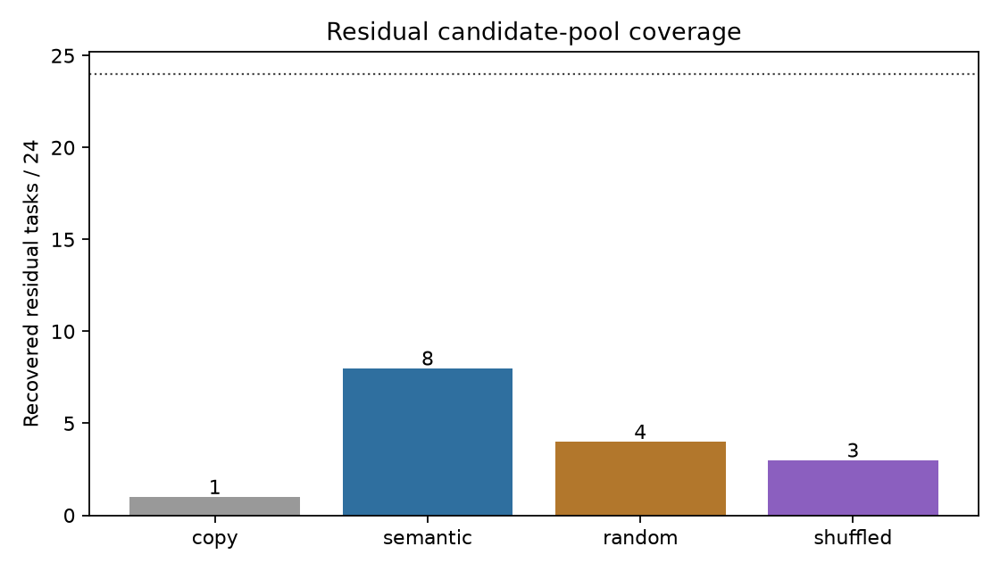
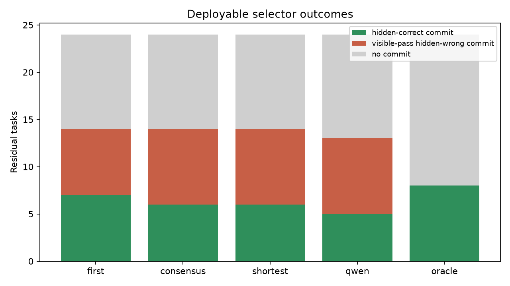
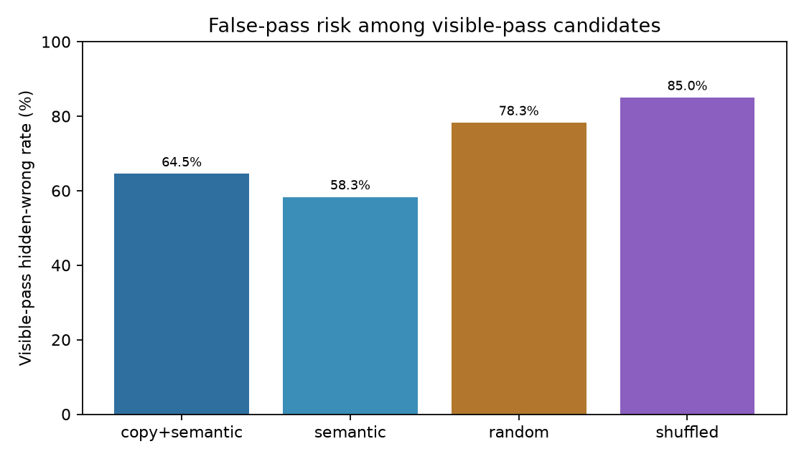
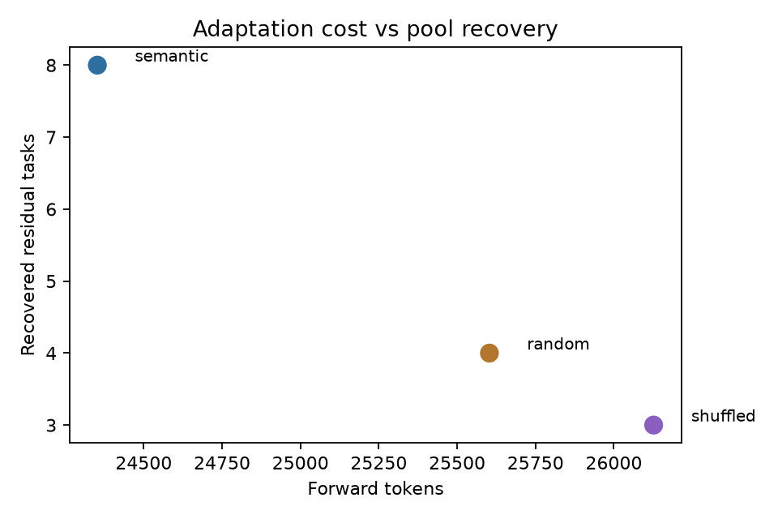

# qwen35_4b_retrieval_adapt_verify_scale

## Motivation

Direct Qwen3.5-4B sampling covers many MBPP held-out tasks, but leaves a residual set with no hidden-correct candidate in the sample pool. This experiment tests an external-memory route around that gap: retrieve verified train-library algorithms, ask Qwen to adapt them to each residual task, then measure both hidden-test pool coverage and deployable selection.

Hidden tests are used only for evaluation and oracle ceilings. Public tests, candidate code, and target-independent agreement probes are the only deployable evidence used by selectors.

## Setup

- Base pool: 80 MBPP held-out tasks, K=4 direct samples per task.
- Base coverage: 56/80 (70.0%).
- Residual tasks: 24 direct-sampling misses.
- Verified algorithm library: 364 MBPP train references.
- Retrieval: TF-IDF top-3 semantic retrieval, plus random and shuffled-query controls.
- Adaptation: one Qwen3.5-4B completion per retrieved algorithm.
- Selector pool: copy/rename top-3 plus semantic adaptations.

## Candidate-Pool Coverage

| arm | residual recovered | rate | recovered tasks | forward tokens |
|---|---:|---:|---|---:|
| copy/rename top-3 | 1/24 | 4.2% | [67] | 0 |
| semantic adapt top-3 | 8/24 | 33.3% | [15, 35, 36, 42, 44, 67, 73, 87] | 24352 |
| random adapt top-3 | 4/24 | 16.7% | [36, 42, 67, 84] | 25603 |
| shuffled-query adapt top-3 | 3/24 | 12.5% | [36, 42, 73] | 26127 |

Semantic retrieval is the strongest pool-coverage arm: 8/24 residual recoveries versus 4/24 random and 3/24 shuffled. The semantic-only recoveries beyond copy/random/shuffled are [15, 35, 44, 87]. If those hidden-correct candidates were selectable perfectly, all-task coverage would rise from 56/80 to 64/80 (80.0%).

## Selection and False Passes

The caveat is still visible-pass hidden-wrong noise. In the main copy+semantic pool, 20/31 visible-pass candidates fail hidden tests (64.5%).

| selector | correct residual commits | wrong visible-pass commits | no commit | selected recovery |
|---|---:|---:|---:|---:|
| first visible | 7 | 7 | 10 | 29.2% |
| consensus visible | 6 | 8 | 10 | 25.0% |
| shortest visible | 6 | 8 | 10 | 25.0% |
| frozen-Qwen rerank | 5 | 8 | 11 | 20.8% |
| hidden oracle | 8 | 0 | 16 | 33.3% |

The simplest deployable selector, first-visible, captures 7/8 oracle recoveries but also commits 7 hidden-wrong visible passers. Target-independent agreement probes do not help here, and the frozen-Qwen reranker is worse than first-visible.

## Interpretation

This is a positive coverage result and a negative selector result.

The positive part is that semantic retrieval plus Qwen adaptation works on this 24-task residual scale: it recovers a third of the direct-sampling residual, doubles random-retrieval coverage, beats shuffled-query retrieval, and adds four control-clean residual tasks. This supports the external algorithmic-memory direction: some misses are not beyond adaptation; they are missing the right algorithmic hint.

The negative part is deployable selection. Public tests are too thin: most visible-pass candidates in the main pool are hidden-wrong, and neither agreement probes nor a frozen-Qwen reranker reduce that risk. The main bottleneck after retrieval is not generating a candidate; it is obtaining enough trustworthy evidence to commit it.

## Next Direction

The next high-value run should keep semantic retrieval+adaptation, but replace weak public-test selection with stronger deployable evidence:

1. generate or mine counterexample tests with output agreement, not expected answers;
2. require candidates to survive multiple independently retrieved/adapted implementations by consensus;
3. use a verifier only after the evidence set is enlarged, because code-only reranking did not separate correct from hidden-wrong candidates here.

## Artifacts

- `data/base_direct_k4_records.jsonl`
- `data/retrieval_plan.jsonl`
- `data/retrieval_adapt_semantic_top3_records.jsonl`
- `data/retrieval_adapt_random_top3_records.jsonl`
- `data/retrieval_adapt_shuffled_top3_records.jsonl`
- `data/selector_copy_semantic_records.jsonl`
- `data/qwen_rerank_copy_semantic_records.jsonl`
- `reports/report_summary.json`
