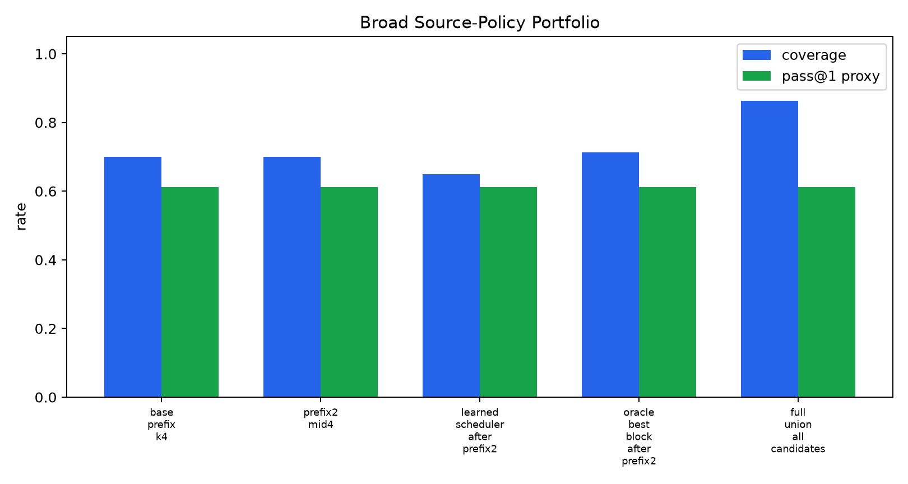
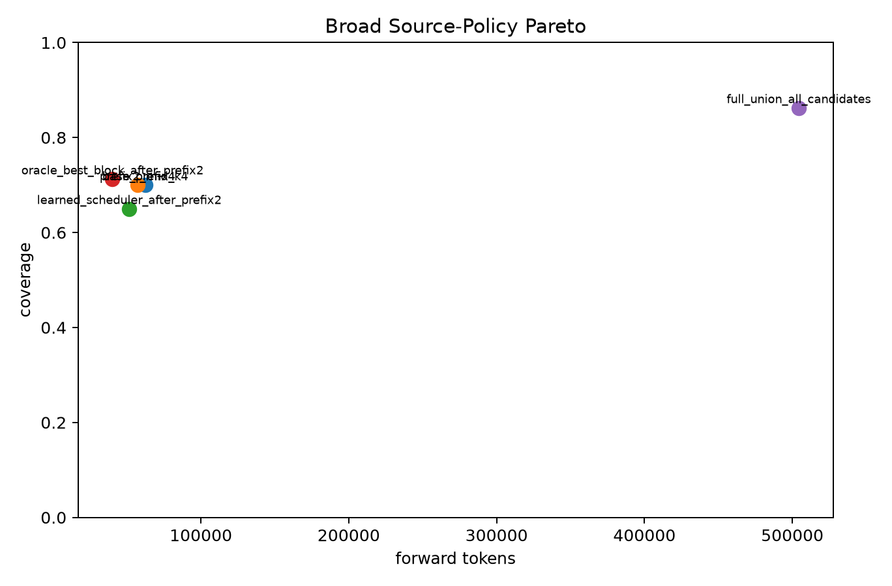
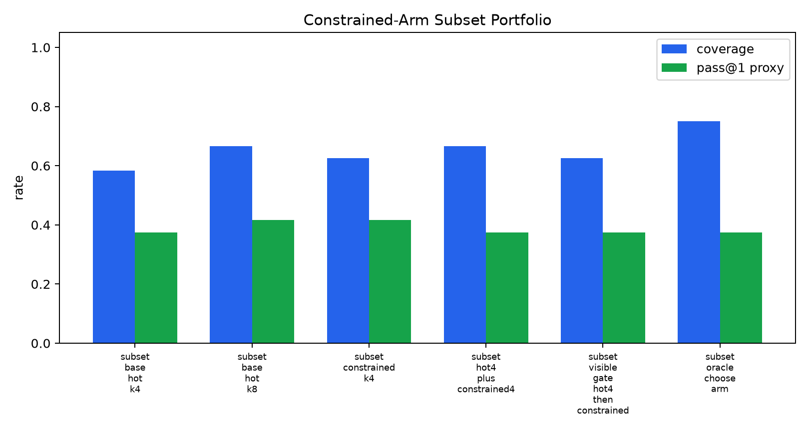
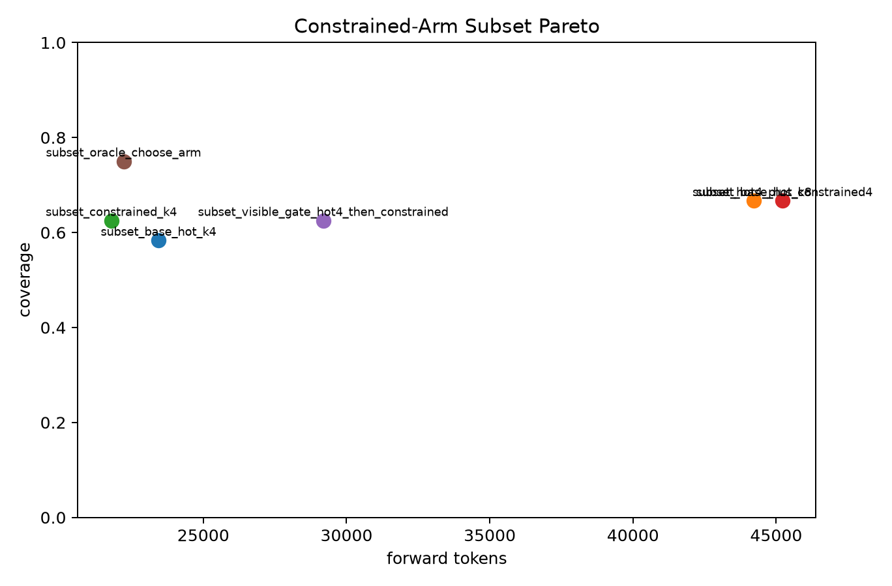
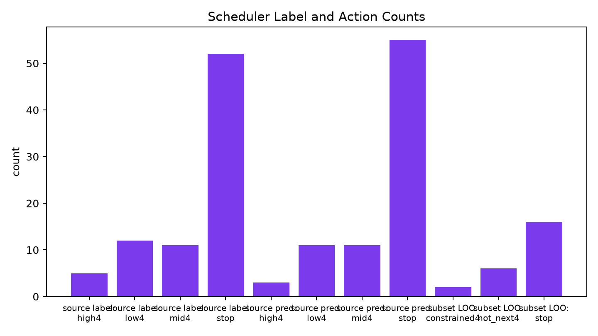

# qwen35_4b_sampler_portfolio_scheduler

## Question

Can a portfolio of generation policies, selected by static schedules or a small deployable scheduler, improve the coverage/pass@1/forward-token Pareto frontier over simply sampling more from one policy?

This package evaluates two views:

- a broad 80-task source-policy pool with low/mid/high/diverse candidate blocks;
- a 24-task constrained-arm subset comparing base-hot sampling with a constrained preference policy.

Oracle rows are reported only as headroom. Deployable rows use fixed schedules, visible-test gates, or schedulers trained without hidden eval labels.

## Broad Source-Policy Results

| arm | n | coverage | pass@1 | candidates/task | parse/task | functional diversity | forward tokens |
|---|---:|---:|---:|---:|---:|---:|---:|
| base_prefix_k4 | 80 | 70.0% | 61.3% | 3.45 | 3.36 | 47.7% | 62270 |
| prefix2_mid4 | 80 | 70.0% | 61.3% | 3.15 | 3.08 | 50.9% | 57013 |
| learned_scheduler_after_prefix2 | 80 | 65.0% | 61.3% | 2.80 | 2.73 | 53.5% | 51517 |
| oracle_best_block_after_prefix2 | 80 | 71.2% | 61.3% | 2.30 | 2.27 | 58.4% | 40154 |
| full_union_all_candidates | 80 | 86.2% | 61.3% | 24.09 | 22.23 | 34.0% | 504344 |

## Constrained-Arm Subset Results

| arm | n | coverage | pass@1 | candidates/task | parse/task | functional diversity | forward tokens |
|---|---:|---:|---:|---:|---:|---:|---:|
| subset_base_hot_k4 | 24 | 58.3% | 37.5% | 4.00 | 3.54 | 51.0% | 23434 |
| subset_base_hot_k8 | 24 | 66.7% | 41.7% | 7.71 | 7.50 | 32.1% | 44219 |
| subset_constrained_k4 | 24 | 62.5% | 41.7% | 3.83 | 3.58 | 54.9% | 21785 |
| subset_hot4_plus_constrained4 | 24 | 66.7% | 37.5% | 7.83 | 7.12 | 34.1% | 45219 |
| subset_visible_gate_hot4_then_constrained | 24 | 62.5% | 37.5% | 4.83 | 4.29 | 47.4% | 29184 |
| subset_oracle_choose_arm | 24 | 75.0% | 37.5% | 4.17 | 3.96 | 53.8% | 22223 |

## Scheduler Diagnostics

Source scheduler train labels: `{'high4': 5, 'low4': 12, 'mid4': 11, 'stop': 52}`

Source scheduler eval actions: `{'high4': 3, 'low4': 11, 'mid4': 11, 'stop': 55}`

Constrained leave-one-task-out labels: `{'constrained4': 1, 'hot_next4': 7, 'stop': 16}`

Constrained leave-one-task-out summary: `{'action_counts': {'constrained4': 2, 'hot_next4': 6, 'stop': 16}, 'candidate_count_mean': 5.333333333333333, 'coverage': 0.625, 'covered_tasks': [11, 12, 13, 14, 17, 18, 19, 22, 23, 27, 28, 29, 30, 32, 33], 'distinct_functional_rate_mean': 0.4479166666666667, 'forward_tokens': 30495, 'parse_success_mean': 5.125, 'pass1_proxy': 0.4166666666666667, 'records': 24, 'visible_coverage': 0.8333333333333334}`

## Gate Readout

Broad source-policy run: base prefix K4 reached 70.0%; learned scheduling reached 65.0%; oracle after the same prefix reached 71.2%.
The full source-policy union reached 86.2%, but at 504344 forward tokens.
Constrained-arm subset: base hot K8 reached 66.7%; hot4+constrained4 tied it at 66.7%; oracle arm choice reached 75.0% at 22223 forward tokens.
Leave-one-task-out constrained scheduler reached 62.5% with action counts {'constrained4': 2, 'hot_next4': 6, 'stop': 16}.
Gate readout: no deployable scheduler in this pilot beat the single-policy sample-more reference. The positive signal is oracle headroom for choosing among policy arms, not an already solved scheduler.

## Interpretation

The portfolio idea is not dead, but the naive scheduler is not enough. The broad pool shows that large unions contain much more coverage, while small static or learned schedules do not extract it. The constrained subset is sharper: the oracle arm chooser reaches 75.0% at roughly the same token cost as K4, while ordinary hot K8 reaches 66.7% at about double the tokens. That means the next valuable target is a better policy-value estimator, not more blind sampling and not a one-arm LoRA scale-up.

The concrete next direction is to collect a larger multi-policy training set where every task has matched candidates from each policy arm, then train a policy-value model to predict which arm is likely to add new hidden coverage from prompt plus cheap prefix evidence. This pilot says there is arm-choice headroom, but it is sparse and not exposed cleanly enough to the simple visible-feature schedulers used here.
