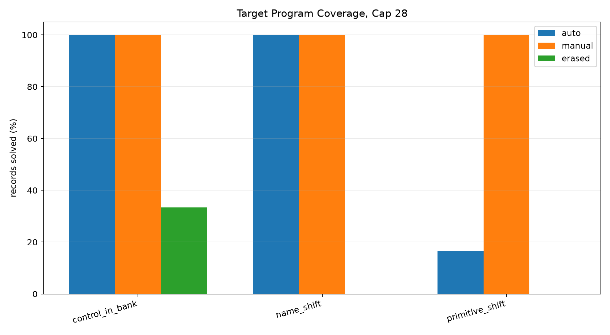
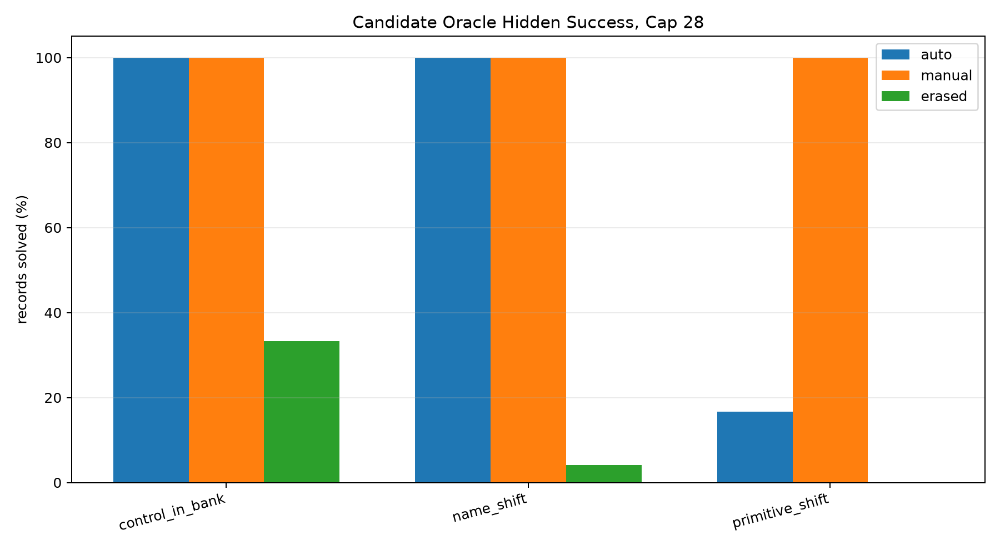
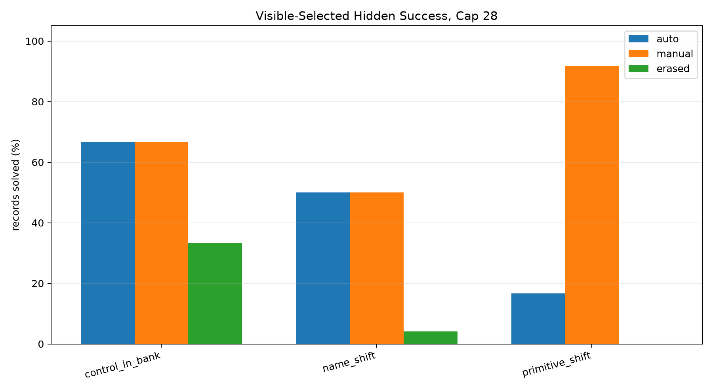
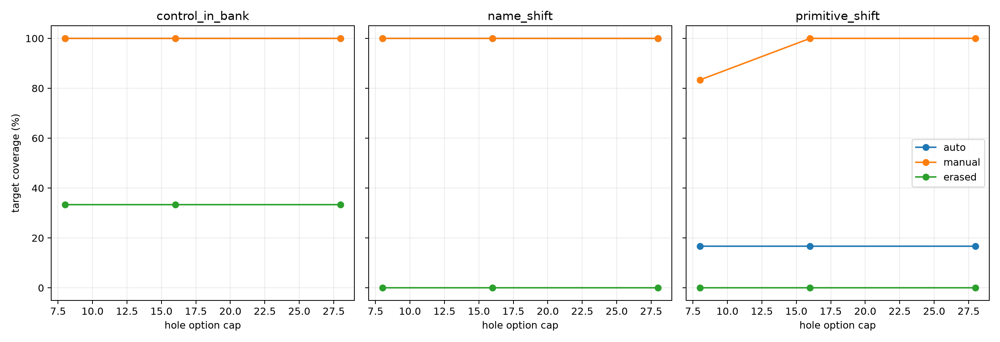
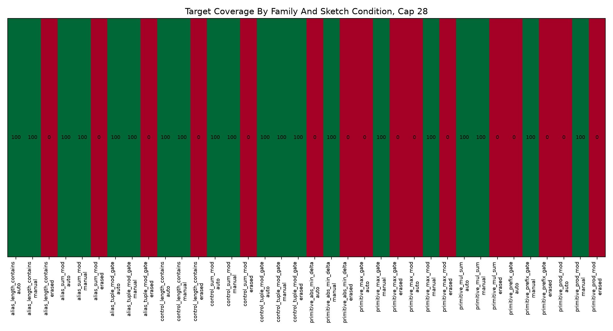
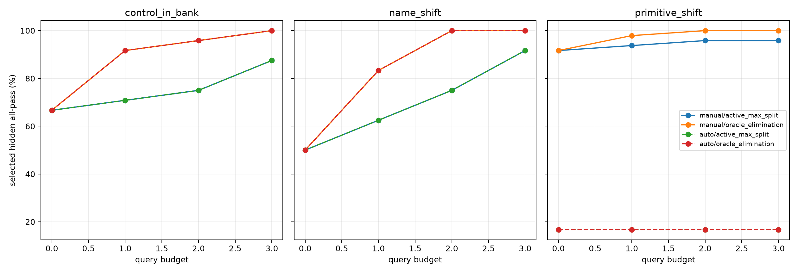

# Qwen3.5-4B Sketch Coverage Shift Probe Report

## Summary

This standalone experiment tests whether typed-sketch verified completion keeps the correct executable program in its bounded candidate set when the task substrate shifts. No new adapter is trained. The executor can score shifted primitives, while the completion bank is held fixed for the falsification pass.

Each record is evaluated under three sketch conditions:

- `auto`: generated by the typed target-sketch function.
- `manual`: hand-typed sketch with the intended operator shape and typed holes.
- `erased`: low-information sketch that preserves only output format or branch labels.

## Key Findings

- Control target coverage at cap 28 with `auto` sketches was `100.0%`.
- Primitive-shift target coverage at cap 28 was `16.7%` for `auto`, `100.0%` for `manual`, and `0.0%` for `erased`.
- Name-shift target coverage at cap 28 was `100.0%` for `manual`, but only `0.0%` for `erased`.
- The decisive failure mode is operator support in the sketch: if the sketch explicitly names and types the shifted operator, completion often works; if the operator must be discovered by the bank, coverage collapses.
- Active querying helps only after coverage exists. It cannot recover a target program that was never synthesized.

## Coverage Tables

Primary cap-28 shift summary:

| shift_type | sketch_mode | records | target_coverage_pct | oracle_hidden_all_pct | selected_hidden_all_pct | avg_program_count |
| --- | ---: | ---: | ---: | ---: | ---: | ---: |
| control_in_bank | auto | 24 | 100.0 | 100.0 | 66.7 | 493.2 |
| control_in_bank | erased | 24 | 33.3 | 33.3 | 33.3 | 28.0 |
| control_in_bank | manual | 24 | 100.0 | 100.0 | 66.7 | 493.2 |
| name_shift | auto | 24 | 100.0 | 100.0 | 50.0 | 501.3 |
| name_shift | erased | 24 | 0.0 | 4.2 | 4.2 | 28.0 |
| name_shift | manual | 24 | 100.0 | 100.0 | 50.0 | 501.3 |
| primitive_shift | auto | 48 | 16.7 | 16.7 | 16.7 | 698.7 |
| primitive_shift | erased | 48 | 0.0 | 0.0 | 0.0 | 28.0 |
| primitive_shift | manual | 48 | 100.0 | 100.0 | 91.7 | 117.2 |

## Active Query Diagnostic

Active selection is reported at hole option cap 28. These rows test disambiguation among synthesized candidates; they are not a substitute for coverage.

| shift_type | sketch_mode | policy | budget | records | selected_hidden_all_pct |
| --- | --- | --- | ---: | ---: | ---: |
| control_in_bank | auto | active_max_split | 0 | 24 | 66.7 |
| control_in_bank | auto | active_max_split | 1 | 24 | 70.8 |
| control_in_bank | auto | active_max_split | 2 | 24 | 75.0 |
| control_in_bank | auto | active_max_split | 3 | 24 | 87.5 |
| control_in_bank | auto | oracle_elimination | 0 | 24 | 66.7 |
| control_in_bank | auto | oracle_elimination | 1 | 24 | 91.7 |
| control_in_bank | auto | oracle_elimination | 2 | 24 | 95.8 |
| control_in_bank | auto | oracle_elimination | 3 | 24 | 100.0 |
| control_in_bank | manual | active_max_split | 0 | 24 | 66.7 |
| control_in_bank | manual | active_max_split | 1 | 24 | 70.8 |
| control_in_bank | manual | active_max_split | 2 | 24 | 75.0 |
| control_in_bank | manual | active_max_split | 3 | 24 | 87.5 |
| control_in_bank | manual | oracle_elimination | 0 | 24 | 66.7 |
| control_in_bank | manual | oracle_elimination | 1 | 24 | 91.7 |
| control_in_bank | manual | oracle_elimination | 2 | 24 | 95.8 |
| control_in_bank | manual | oracle_elimination | 3 | 24 | 100.0 |
| name_shift | auto | active_max_split | 0 | 24 | 50.0 |
| name_shift | auto | active_max_split | 1 | 24 | 62.5 |
| name_shift | auto | active_max_split | 2 | 24 | 75.0 |
| name_shift | auto | active_max_split | 3 | 24 | 91.7 |
| name_shift | auto | oracle_elimination | 0 | 24 | 50.0 |
| name_shift | auto | oracle_elimination | 1 | 24 | 83.3 |
| name_shift | auto | oracle_elimination | 2 | 24 | 100.0 |
| name_shift | auto | oracle_elimination | 3 | 24 | 100.0 |
| name_shift | manual | active_max_split | 0 | 24 | 50.0 |
| name_shift | manual | active_max_split | 1 | 24 | 62.5 |
| name_shift | manual | active_max_split | 2 | 24 | 75.0 |
| name_shift | manual | active_max_split | 3 | 24 | 91.7 |
| name_shift | manual | oracle_elimination | 0 | 24 | 50.0 |
| name_shift | manual | oracle_elimination | 1 | 24 | 83.3 |
| name_shift | manual | oracle_elimination | 2 | 24 | 100.0 |
| name_shift | manual | oracle_elimination | 3 | 24 | 100.0 |
| primitive_shift | auto | active_max_split | 0 | 48 | 16.7 |
| primitive_shift | auto | active_max_split | 1 | 48 | 16.7 |
| primitive_shift | auto | active_max_split | 2 | 48 | 16.7 |
| primitive_shift | auto | active_max_split | 3 | 48 | 16.7 |
| primitive_shift | auto | oracle_elimination | 0 | 48 | 16.7 |
| primitive_shift | auto | oracle_elimination | 1 | 48 | 16.7 |
| primitive_shift | auto | oracle_elimination | 2 | 48 | 16.7 |
| primitive_shift | auto | oracle_elimination | 3 | 48 | 16.7 |
| primitive_shift | manual | active_max_split | 0 | 48 | 91.7 |
| primitive_shift | manual | active_max_split | 1 | 48 | 93.8 |
| primitive_shift | manual | active_max_split | 2 | 48 | 95.8 |
| primitive_shift | manual | active_max_split | 3 | 48 | 95.8 |
| primitive_shift | manual | oracle_elimination | 0 | 48 | 91.7 |
| primitive_shift | manual | oracle_elimination | 1 | 48 | 97.9 |
| primitive_shift | manual | oracle_elimination | 2 | 48 | 100.0 |
| primitive_shift | manual | oracle_elimination | 3 | 48 | 100.0 |

## Artifacts

- Dataset: `data/shifted_coverage_eval.jsonl`
- Dataset manifest: `data/dataset_manifest.json`
- Full result JSON: `reports/coverage_probe.json`
- Coverage CSVs: `reports/coverage_by_shift.csv`, `reports/coverage_by_family.csv`
- Active CSV: `reports/active_by_shift.csv`
- Large artifacts: `/workspace/large_artifacts/qwen35_4b_sketch_coverage_shift_probe`

## Conclusion

The coverage assumption does not survive all task shifts. The strongest result is conditional: typed completion can still work on shifted primitives when the sketch names the shifted operator and uses correctly typed holes. The weak result is equally important: erased sketches and automatically mistyped sketches often lose the target completely. The next scaling step should therefore widen and train sketch/operator coverage before investing in a stronger selector.
