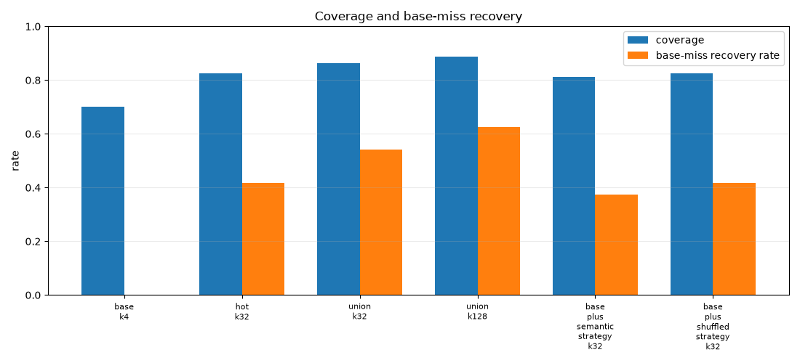
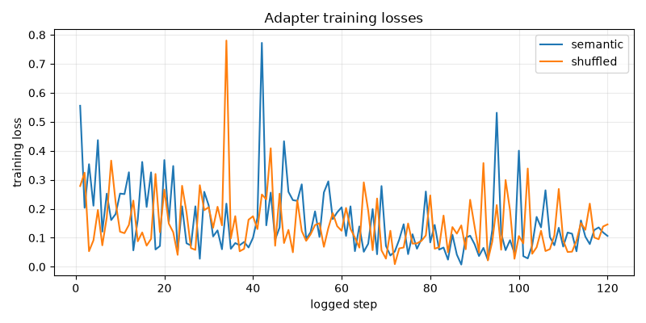

# qwen35_4b_strategy_token_diversity_lora

## Question

Can a small QLoRA adapter with explicit strategy tokens make extra samples on base-missed MBPP tasks behave like a more complementary ensemble, recovering misses at roughly the cost of one hot K32 arm instead of a three-policy union?

## Result

- The semantic strategy-token adapter did not beat the hot K32 inference baseline, so the training objective did not buy the desired sampling-efficiency win.
- The shuffled-key control matched or beat the semantic adapter on base-miss recovery, so any recovery is not attributable to meaningful strategy-key semantics.

## Arms

| arm | records | coverage | base-miss recovered | base-miss recovery | mean candidates | functional diversity | forward tokens |
|---|---:|---:|---:|---:|---:|---:|---:|
| base_k4 | 80 | 70.0% | 0/24 | 0.0% | 3.45 | 47.7% | 69,645 |
| default_k32 | 80 | 80.0% | 8/24 | 33.3% | 10.28 | 35.8% | 235,491 |
| hot_k32 | 80 | 82.5% | 10/24 | 41.7% | 11.39 | 35.9% | 243,343 |
| diverse_k32 | 80 | 81.2% | 9/24 | 37.5% | 11.04 | 36.2% | 243,268 |
| union_k32 | 80 | 86.2% | 13/24 | 54.2% | 24.09 | 34.0% | 582,812 |
| union_k128 | 80 | 88.8% | 15/24 | 62.5% | 29.31 | 33.8% | 698,783 |
| base_plus_semantic_strategy_k32 | 80 | 81.2% | 9/24 | 37.5% | 11.51 | 35.4% | 274,406 |
| base_plus_shuffled_strategy_k32 | 80 | 82.5% | 10/24 | 41.7% | 11.68 | 35.9% | 283,391 |
| semantic_strategy_k32_base_missed | 24 | 37.5% | 9/24 | 37.5% | 27.33 | 11.8% | 204,761 |
| shuffled_strategy_k32_base_missed | 24 | 41.7% | 10/24 | 41.7% | 27.71 | 13.8% | 213,746 |
| semantic_strategy_k32 | 80 | 81.2% | 11/24 | 45.8% | 23.10 | 13.8% | 627,176 |

## Recovered Task IDs

- `base_k4`: none
- `default_k32`: 22, 35, 36, 42, 67, 70, 81, 87
- `hot_k32`: 15, 22, 35, 36, 42, 55, 59, 67, 70, 81
- `diverse_k32`: 22, 34, 35, 36, 42, 59, 67, 81, 83
- `union_k32`: 15, 22, 34, 35, 36, 42, 55, 59, 67, 70, 81, 83, 87
- `union_k128`: 15, 22, 34, 35, 36, 42, 55, 59, 67, 70, 73, 81, 83, 84, 87
- `semantic_strategy_k32`: 22, 31, 35, 36, 42, 48, 67, 73, 81, 84, 87
- `shuffled_strategy_k32_base_missed`: 22, 31, 35, 36, 42, 67, 73, 81, 84, 87
- `semantic_strategy_k32_base_missed`: 22, 31, 35, 36, 42, 67, 81, 84, 87
- `base_plus_semantic_strategy_k32`: 22, 31, 35, 36, 42, 67, 81, 84, 87
- `base_plus_shuffled_strategy_k32`: 22, 31, 35, 36, 42, 67, 73, 81, 84, 87

## Recovery Overlap

| arm A | arm B | recovered overlap | A only | B only |
|---|---|---:|---:|---:|
| default_k32 | hot_k32 | 7 | 1 | 3 |
| default_k32 | diverse_k32 | 6 | 2 | 3 |
| default_k32 | union_k32 | 8 | 0 | 5 |
| default_k32 | union_k128 | 8 | 0 | 7 |
| default_k32 | semantic_strategy_k32 | 7 | 1 | 4 |
| default_k32 | shuffled_strategy_k32_base_missed | 7 | 1 | 3 |
| default_k32 | semantic_strategy_k32_base_missed | 7 | 1 | 2 |
| default_k32 | base_plus_semantic_strategy_k32 | 7 | 1 | 2 |
| default_k32 | base_plus_shuffled_strategy_k32 | 7 | 1 | 3 |
| hot_k32 | diverse_k32 | 7 | 3 | 2 |
| hot_k32 | union_k32 | 10 | 0 | 3 |
| hot_k32 | union_k128 | 10 | 0 | 5 |
| hot_k32 | semantic_strategy_k32 | 6 | 4 | 5 |
| hot_k32 | shuffled_strategy_k32_base_missed | 6 | 4 | 4 |
| hot_k32 | semantic_strategy_k32_base_missed | 6 | 4 | 3 |
| hot_k32 | base_plus_semantic_strategy_k32 | 6 | 4 | 3 |
| hot_k32 | base_plus_shuffled_strategy_k32 | 6 | 4 | 4 |
| diverse_k32 | union_k32 | 9 | 0 | 4 |
| diverse_k32 | union_k128 | 9 | 0 | 6 |
| diverse_k32 | semantic_strategy_k32 | 6 | 3 | 5 |
| diverse_k32 | shuffled_strategy_k32_base_missed | 6 | 3 | 4 |
| diverse_k32 | semantic_strategy_k32_base_missed | 6 | 3 | 3 |
| diverse_k32 | base_plus_semantic_strategy_k32 | 6 | 3 | 3 |
| diverse_k32 | base_plus_shuffled_strategy_k32 | 6 | 3 | 4 |
| union_k32 | union_k128 | 13 | 0 | 2 |
| union_k32 | semantic_strategy_k32 | 7 | 6 | 4 |
| union_k32 | shuffled_strategy_k32_base_missed | 7 | 6 | 3 |
| union_k32 | semantic_strategy_k32_base_missed | 7 | 6 | 2 |
| union_k32 | base_plus_semantic_strategy_k32 | 7 | 6 | 2 |
| union_k32 | base_plus_shuffled_strategy_k32 | 7 | 6 | 3 |
| union_k128 | semantic_strategy_k32 | 9 | 6 | 2 |
| union_k128 | shuffled_strategy_k32_base_missed | 9 | 6 | 1 |
| union_k128 | semantic_strategy_k32_base_missed | 8 | 7 | 1 |
| union_k128 | base_plus_semantic_strategy_k32 | 8 | 7 | 1 |
| union_k128 | base_plus_shuffled_strategy_k32 | 9 | 6 | 1 |
| semantic_strategy_k32 | shuffled_strategy_k32_base_missed | 10 | 1 | 0 |
| semantic_strategy_k32 | semantic_strategy_k32_base_missed | 9 | 2 | 0 |
| semantic_strategy_k32 | base_plus_semantic_strategy_k32 | 9 | 2 | 0 |
| semantic_strategy_k32 | base_plus_shuffled_strategy_k32 | 10 | 1 | 0 |
| shuffled_strategy_k32_base_missed | semantic_strategy_k32_base_missed | 9 | 1 | 0 |
| shuffled_strategy_k32_base_missed | base_plus_semantic_strategy_k32 | 9 | 1 | 0 |
| shuffled_strategy_k32_base_missed | base_plus_shuffled_strategy_k32 | 10 | 0 | 0 |
| semantic_strategy_k32_base_missed | base_plus_semantic_strategy_k32 | 9 | 0 | 0 |
| semantic_strategy_k32_base_missed | base_plus_shuffled_strategy_k32 | 9 | 0 | 1 |
| base_plus_semantic_strategy_k32 | base_plus_shuffled_strategy_k32 | 9 | 0 | 1 |

## Training Data

- Semantic SFT rows: 244 from 60 tasks; final logged loss 0.10642203688621521.
- Shuffled SFT rows: 244 from 60 tasks; final logged loss 0.14613600075244904.
- Semantic row counts by assigned strategy: COMPREHENSION=28, DIRECT=34, LOOP=45, MATH=19, RECURSION=73, SET_DICT=8, SORTING=8, STRING_REGEX=29
- Shuffled row counts by assigned strategy: COMPREHENSION=36, DIRECT=28, LOOP=23, MATH=31, RECURSION=32, SET_DICT=21, SORTING=43, STRING_REGEX=30

## Design Notes

- The adapters were trained only on verified hidden-correct samples from MBPP train tasks.
- The semantic adapter maps each correct sample to a structural strategy token; the shuffled control keeps the same target programs but breaks the mapping between token and program mode.
- The primary comparison is base-miss recovery at K32-equivalent sampling cost: base + semantic strategy K32 on misses vs hot K32 vs the more expensive K32 union.
- Forward-token totals are cumulative for full 80-task arms; base-missed-only diagnostic rows show the extra strategy-token sampling cost on the 24 missed tasks.
- The all-80 semantic strategy pass is reported as a diagnostic only; it is not the fair budget comparison because it also spends strategy-token samples on tasks the base K4 pool already solved.
- Large adapter artifacts are stored outside this experiment package under `/workspace/large_artifacts/qwen35_4b_strategy_token_diversity_lora`.

## Files

- Config: `configs/experiment.json`
- Log: `logs/experiment_log.md`
- Records and manifests: `data/`
- Scripts: `scripts/`
- Figures: `reports/figures/`
