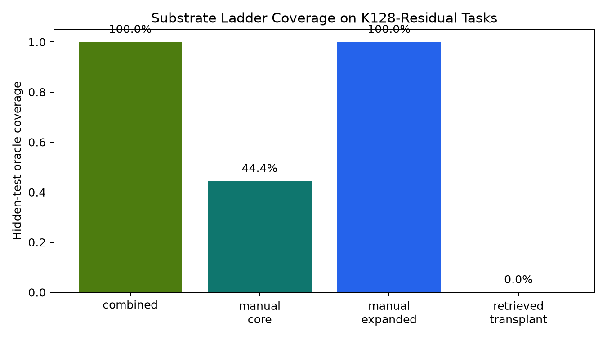
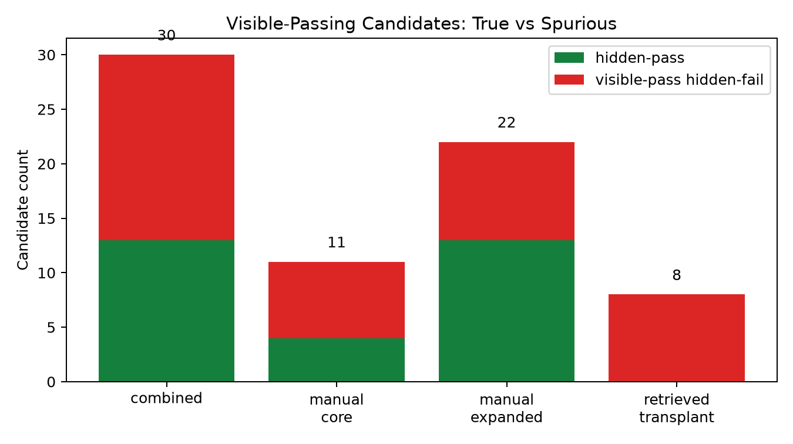
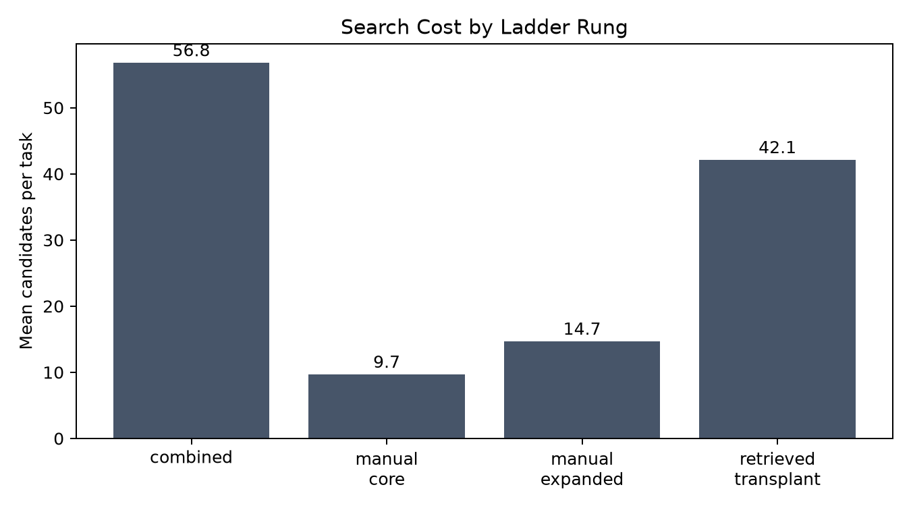
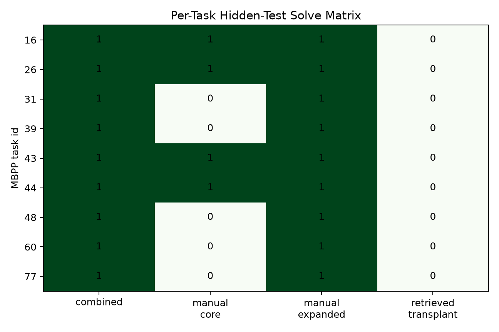

# qwen35_4b_substrate_coverage_ladder

## Question

Can an executable kernel/template substrate express MBPP held-out tasks that remained unsolved by a large direct-sampling candidate pool? This is an oracle-ceiling experiment: no model is trained, and hidden tests are used only to measure whether the substrate contains a correct graph/program and how often public-test filtering would produce spurious targets.

## Dataset

- Residual tasks: 9 MBPP held-out tasks.
- Residual task ids: `[16, 26, 31, 39, 43, 44, 48, 60, 77]`.
- Train reference library used for retrieval/transplant controls: 374 train-split entries.
- Primary metric: hidden-test oracle coverage on the residual set.

## Results

| rung | hidden coverage | solved | candidates/task | visible-pass | hidden-pass | visible-pass hidden-fail | false-pass rate |
|---|---:|---:|---:|---:|---:|---:|---:|
| combined | 100.0% | 9 | 56.8 | 30 | 13 | 17 | 56.7% |
| manual_core | 44.4% | 4 | 9.7 | 11 | 4 | 7 | 63.6% |
| manual_expanded | 100.0% | 9 | 14.7 | 22 | 13 | 9 | 40.9% |
| retrieved_transplant | 0.0% | 0 | 42.1 | 8 | 0 | 8 | 100.0% |

## Per-Task Solve Matrix

| task_id | combined | manual_core | manual_expanded | retrieved_transplant | winning templates |
|---:|---:|---:|---:|---:|---|
| 16 | yes | yes | yes | no | lowercase_underscore_full, lowercase_underscore_one_or_more_groups |
| 26 | yes | yes | yes | no | tuple_list_all_k, tuple_list_all_k_set |
| 31 | yes | no | yes | no | topk_frequency_minheap_pop_order |
| 39 | yes | no | yes | no | rearrange_no_adjacent_heap |
| 43 | yes | yes | yes | no | lowercase_underscore_full, lowercase_underscore_one_or_more_groups |
| 44 | yes | yes | yes | no | word_at_start, word_at_start_alpha |
| 48 | yes | no | yes | no | odd_bit_mask_positions_0_2_4 |
| 60 | yes | no | yes | no | longest_subseq_adjacent_diff_le_1 |
| 77 | yes | no | yes | no | alternating_digit_sums_divisible_by_11 |

## Interpretation

The combined substrate solved 9/9 residual tasks (100.0% hidden-test oracle coverage), but this is only a weak expressivity ceiling. The coverage came from the `manual_expanded` rung (9/9), whose winning templates are task-specific kernels such as top-k frequency, odd-bit masking, no-adjacent string rearrangement, and longest subsequence with adjacent difference. This should not be read as evidence that a reusable substrate generalizes to new residual tasks.

The stricter reusable-substrate readout failed. The `retrieved_transplant` rung, which retrieves train-split reference solutions and adapts their function signature, solved 0/9 residual tasks. It produced 8 public-test-passing candidates and all 8 were hidden-wrong. That is evidence against the specific reuse hypothesis tested here.

The public-test trap is also visible. The combined arm produced 30 public-test-passing candidates, but 17 of those failed hidden tests, for a false-pass rate of 56.7% among public-pass candidates. This is the load-bearing warning for any follow-up configurator: visible tests alone are not a trustworthy source of perfect latent programs.

## Gate Readout

- Weak Gate 1, any readable substrate expression: cleared.
- Strict Gate 1, reusable substrate expression: failed.
- Gate 2, target trust: requires filtering beyond public tests.

## Next Step Implied By This Run

Do not train a graph configurator from this result. The meaningful reusable-substrate precondition did not clear, and training on these residual tasks would risk learning a lookup over task-specific hand-authored templates. A follow-up should first test transfer: author substrate templates on one residual slice, then measure hidden-test coverage on a disjoint slice for which no task-specific templates were authored. If that transfer coverage looks like the retrieved-transplant rung, the substrate is not a reusable frontier-expansion mechanism.

If any configurator is later tested, it should not train on arbitrary public-pass substrate candidates. It should either train only from hidden-verified train tasks or include a verifier strong enough to reject the public-pass hidden-fail cases.
