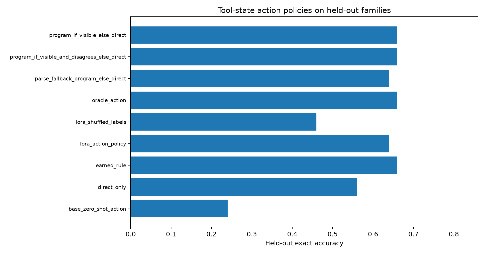
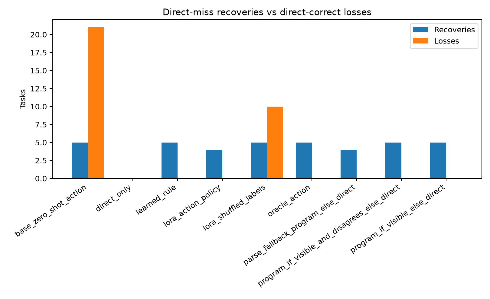
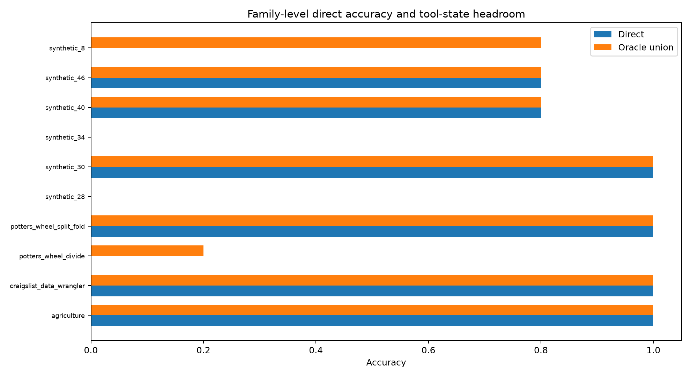

# Tool-State Action Policy

## Summary

This standalone experiment tests whether a small action policy can use executable-tool observations to choose between a direct table answer and a repaired program output.

The policy is not asked to produce a table or a program. It sees a compact tool state and chooses `DIRECT` or `PROGRAM`.

## Split

- Train: 150 records across 30 families
- Dev: 50 records across 10 families
- Test: 50 records across 10 families

## Held-Out Test Result

| Policy | Exact | Accuracy | Program commits | Recoveries | Losses | Program precision |
|---|---:|---:|---:|---:|---:|---:|
| `direct_only` | 28/50 | 56.0% | 0 | 0 | 0 | n/a |
| `program_if_visible_else_direct` | 33/50 | 66.0% | 14 | 5 | 0 | 85.7% |
| `program_if_visible_and_disagrees_else_direct` | 33/50 | 66.0% | 5 | 5 | 0 | 100.0% |
| `parse_fallback_program_else_direct` | 32/50 | 64.0% | 4 | 4 | 0 | 100.0% |
| `learned_rule` | 33/50 | 66.0% | 5 | 5 | 0 | 100.0% |
| `base_zero_shot_action` | 12/50 | 24.0% | 50 | 5 | 21 | 24.0% |
| `lora_action_policy` | 32/50 | 64.0% | 4 | 4 | 0 | 100.0% |
| `lora_shuffled_labels` | 23/50 | 46.0% | 27 | 5 | 10 | 44.4% |
| `oracle_action` | 33/50 | 66.0% | 5 | 5 | 0 | 100.0% |

## Gate Verdict

The environment state contains a deployable selection signal. The selected rule reaches the oracle action ceiling on held-out test: 33/50, with 5 direct-miss recoveries and 0 losses. The rule is simple: choose `PROGRAM` only when the program passes the public example and disagrees with the direct output on the new input.

The LoRA action-policy arm is a partial positive. It improves over direct-only (32/50 vs 28/50), beats the shuffled-label control (32/50 vs 23/50), and has 0 losses, but it does not match the simple rule/oracle ceiling (33/50). The posttraining signal is real but not the best controller in this small split.

## Learned Rule

The non-neural rule search selected:

```json
{
  "dev": {
    "accuracy": 0.66,
    "action_counts": {
      "DIRECT": 43,
      "PROGRAM": 7
    },
    "direct_correct_losses": 0,
    "direct_miss_recoveries": 5,
    "exact": 33,
    "n": 50,
    "policy": "rule",
    "program_commits": 7,
    "program_correct": 5,
    "program_precision": 0.7142857142857143,
    "split": "dev"
  },
  "false_action": "DIRECT",
  "feature": "direct_program_disagree_visible_pass",
  "train": {
    "accuracy": 0.6,
    "action_counts": {
      "DIRECT": 136,
      "PROGRAM": 14
    },
    "direct_correct_losses": 0,
    "direct_miss_recoveries": 8,
    "exact": 90,
    "n": 150,
    "policy": "rule",
    "program_commits": 14,
    "program_correct": 8,
    "program_precision": 0.5714285714285714,
    "split": "train"
  },
  "true_action": "PROGRAM"
}
```

## LoRA Training

- Real-label LoRA train examples: 122
- Real-label LoRA tokenized examples: 122
- Real-label final loss: 6.317748193396255e-05
- Shuffled-label LoRA train examples: 122
- Shuffled-label final loss: 0.12911884486675262

## Figures







## Interpretation

The decisive comparison is whether the learned action policy converts program-only headroom into held-out recoveries without committing hidden-wrong visible-pass programs on direct-correct tasks.

The oracle row is an upper bound that uses hidden labels to pick `PROGRAM` exactly when the program is correct and the direct answer is not. Deployable policies do not see that label.

The main positive result is not that LoRA is necessary; it is that a small deployable tool-state observation collapses the selection problem on this held-out split. Posttraining learned most of that signal, but the rule exposes the cleaner mechanism.

## Limitations

- The environment traces are precomputed; this package trains and evaluates the commit policy over those observed states.
- The policy observes the final repair-loop state, so policies that use tool observations pay the full repair-loop generation cost even when they choose `DIRECT`.
- The family-disjoint split is deterministic but still small. Repeat across multiple split seeds before treating the learned policy as stable.
